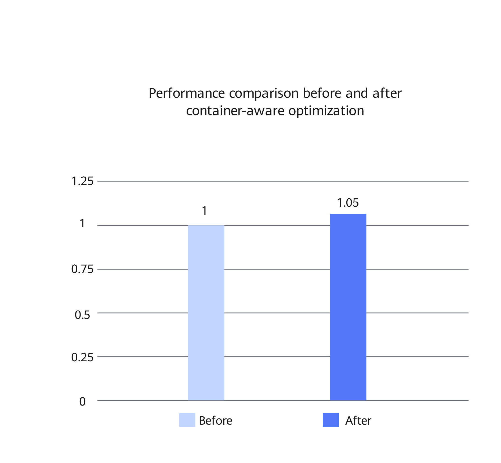

# MySQL Container-Aware Optimization Feature Guide

<!-- md-trans-meta sourceCommit=a91d586ee1df326de1c60f476331c708ca42990d translatedAt=2026-09-16T07:00:45.835Z pushedAt=2026-09-16T08:33:09.575Z -->

## Feature Description<a name="EN-US_TOPIC_0000002604100002"></a>

### Introduction<a name="EN-US_TOPIC_0000002604100003"></a>

In containers or in resource-constrained scenarios (excluding containers), the CPU resources and memory available to a MySQL instance may not match the total resources of the host machine. If InnoDB-related logic still bases its statistics and judgments on the host machine's resources, the CPU usage may be underestimated, which in turn affects the waiting strategy of redo log background threads in high-CPU-usage scenarios. This feature addresses this by introducing awareness of available resources for instances and optimizing the waiting logic of log background threads. As a result, resource statistics better reflect the actual running environment of instances, thereby reducing unnecessary spin overhead.

This document uses Percona-Server-8.0.43-34 as an example to describe how to deploy and verify this feature.

### Principles<a name="EN-US_TOPIC_0000002604100004"></a>

This feature optimizes the waiting logic of redo log background threads in high-CPU-usage scenarios and adds the capability to obtain the CPU resources and memory available to instances. This reduces unnecessary busy spin overhead and improves the accuracy of resource determination in constrained runtime environments.

In the waiting logic of the InnoDB redo log background threads, `log_should_wait_for_events_without_spinning()` decides whether to continue spin waiting based on the CPU usage and write request frequency. In the original implementation, if the user-space CPU usage of an instance is high whereas the statistics are still calculated based on the total number of host CPUs, `srv_cpu_usage.utime_pct` may be underestimated. This prevents the log background threads from exiting the spinning in a timely manner under high CPU load, leading to additional CPU consumption.

To solve this problem, this feature adds the `srv_cpu_usage.utime_pct >= srv_log_spin_cpu_pct_hwm` check in `log_should_wait_for_events_without_spinning()`. When the user-space CPU usage of an instance reaches or exceeds the high water mark, the log background threads directly bypass spin waiting and switch to event waiting, thereby reducing the additional busy spin of the log background threads under high CPU load.

To make this check equally effective in containers or in cgroup-based resource-constrained scenarios (excluding containers), this feature adds two unified entry points, `my_physical_memory()` and `my_num_vcpus()`, in `components/library_mysys`. Specifically, `my_physical_memory()` preferentially reads `/sys/fs/cgroup/memory.max` of cgroup v2 and `/sys/fs/cgroup/memory/memory.limit_in_bytes` of cgroup v1 on Unix-like systems; `my_num_vcpus()` preferentially reads `/sys/fs/cgroup/cpu.max` of cgroup v2 and `/sys/fs/cgroup/cpu/cpu.cfs_quota_us` and `/sys/fs/cgroup/cpu/cpu.cfs_period_us` of cgroup v1. If no resource limit is detected, the original resource statistics capabilities such as process affinity, the number of online system CPUs, or the number of physical memory pages are used.

The new CPU count result is used for the calculation of `srv_cpu_usage.utime_pct`, and is also reused by modules such as the SQL layer, resource groups, InnoDB CPU usage statistics, tablespace scan thread count, and rollback segment initialization thread count, avoiding inconsistent determinations caused by each module reading host resources independently.

## Environment Requirements<a name="ZH-CN_TOPIC_0000002604100005"></a>

This document provides guidance based on specific environments. Before performing operations, ensure that your hardware and software meet the requirements.

**Table 1** Hardware requirement<a id="container_aware_hardware_requirements"></a>

|Item|Specification|
|--|--|
|CPU|Kunpeng 920 processor, new Kunpeng 920 processor model, or Kunpeng 950 processor|

**Table 2** OS and software requirements<a id="os-and-software-requirements"></a>

|Item|Name|Version|How to Obtain|
|--|--|:-:|--|
|OS|openEuler|22.03 LTS SP4|[Link](https://repo.huaweicloud.com/openeuler/openEuler-22.03-LTS-SP4/ISO/aarch64/openEuler-22.03-LTS-SP4-everything-aarch64-dvd.iso)|
|Percona|Percona-Server|8.0.43-34|See [BoostDB-Percona Installation Guide](./boostdb-percona-install.md).|

## Feature Installation and Enablement<a name="ZH-CN_TOPIC_0000002604100006"></a>

The optimized BoostDB-Percona version has integrated this optimization feature by default. Therefore, you do not need to obtain the patch separately and recompile and install the code.

The following uses Percona-Server 8.0.43-34 as an example to describe how to install and use this optimization feature. The procedure is as follows:

1. Install the optimized BoostDB-Percona version as instructed in [BoostDB-Percona Installation Guide](./boostdb-percona-install.md).
2. Start the database. For details, see [Running MySQL](https://www.hikunpeng.com/document/detail/en/kunpengdbs/ecosystemEnable/MySQL/kunpengmysql8017_03_0013.html) in the *MySQL Porting Guide*.
3. (Optional) Perform the sysbench test to compare the performance before and after the optimization feature is enabled. For details about the test procedure, see [Sysbench 0.5 & 1.0 Test Guide](https://www.hikunpeng.com/document/detail/en/kunpengdbs/testguide/tstg/kunpengsysbench_02_0001.html). The container-aware optimization feature can improve the sysbench write-only performance by 5% in a container with 8 vCPUs and 16 GB memory. [Figure 1](#performance-compare-container-aware) shows the performance comparison before and after the optimization.

**Figure 1** Performance comparison in sysbench write scenarios<a name="fig937192253919"></a><a id="performance-compare-container-aware"></a><br>



## Security Check and Hardening<a name="EN-US_TOPIC_0000002602100008"></a>

Address space layout randomization (ASLR) is a security technology against buffer overflow. It randomizes the layout of linear areas such as heap, stack, and shared library mapping to make it difficult for attackers to predict target addresses and directly locate code, thereby preventing overflow attacks.

```bash
echo 2 >/proc/sys/kernel/randomize_va_space
```


