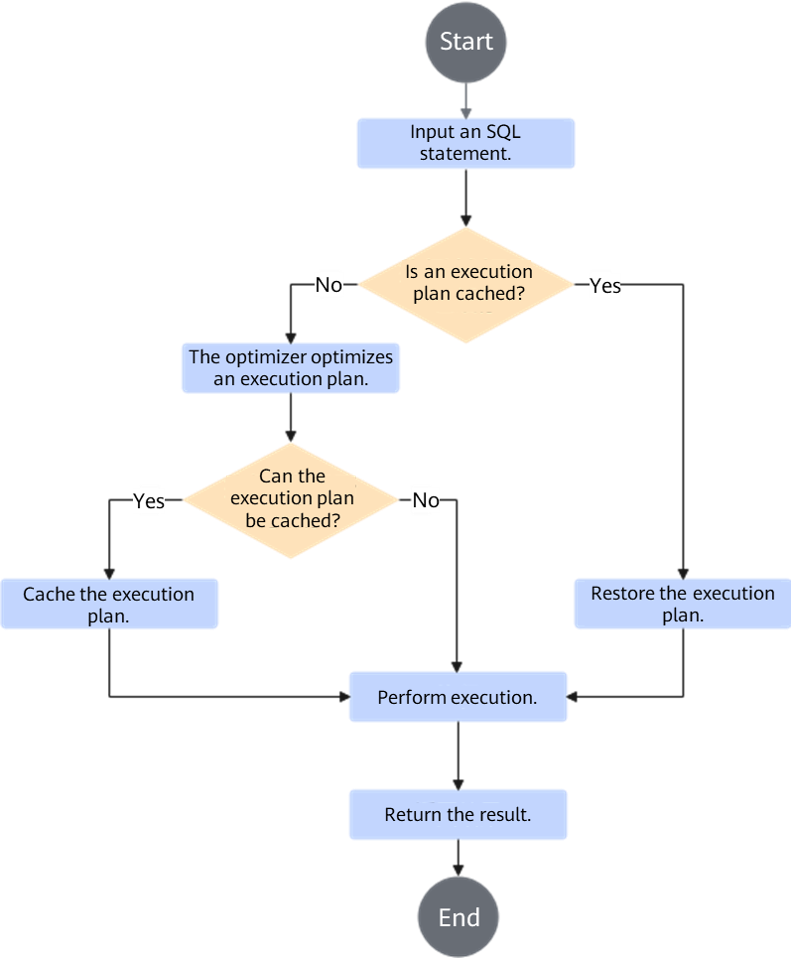
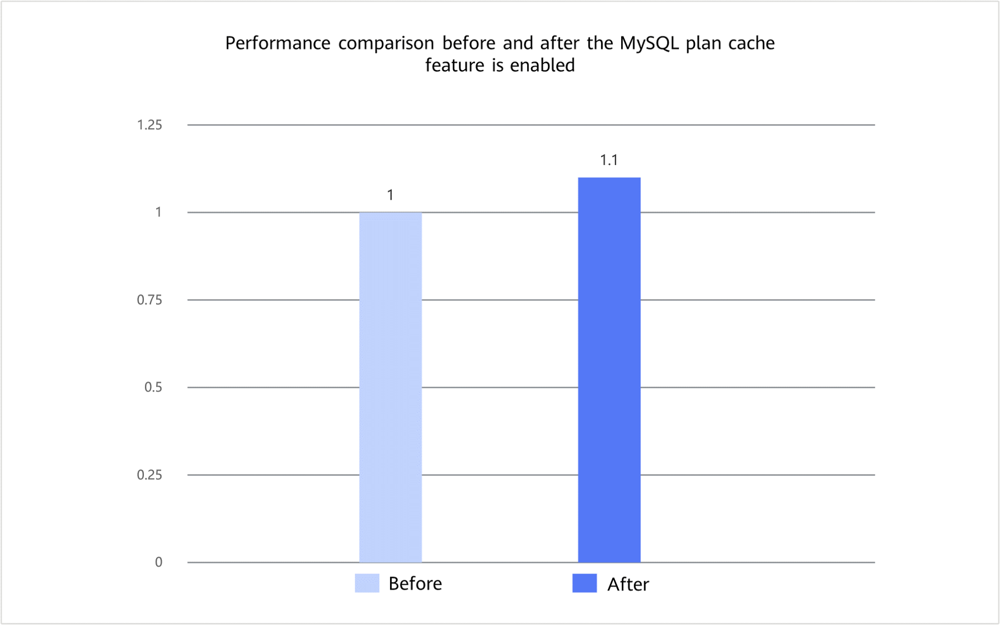

# MySQL Plan Cache Feature Guide

## Feature Description<a id="EN-US_TOPIC_0000002261217842"></a>

### Introduction<a id="EN-US_TOPIC_0000002295815681"></a>

This document describes how to install and use the MySQL plan cache feature on a server running the openEuler OS.

The MySQL plan cache feature in the current BoostDB version is supported only on Percona-Server 8.0.43-34.

When an SQL statement is input into the MySQL server, it typically goes through several stages: lexical and syntactic analysis, optimization, execution plan generation, and execution. The primary output of the first three stages is the execution plan for the SQL statement. When there are multiple possible execution plans for an SQL statement, the optimizer selects the most optimal one (usually the one that consumes the least system resources, including CPU and I/O) as the final execution plan to be executed. The process of generating execution plans can be time-consuming, especially when there are many possible execution plans.

Prepared statements use placeholders to replace values in SQL statements, thereby enabling template-based or parameter-based optimization for SQL statements. Traditional MySQL prepared statements can only save the time required for parsing and rewriting SQL statements. However, optimizing an SQL statement and generating an execution plan for it can be resource-intensive and time-consuming.

To address this issue, Kunpeng BoostKit introduces the MySQL plan cache feature. This feature caches the final execution plan of a prepared statement. When the `EXECUTE` statement is executed, the cached execution plan is directly used. This skips execution plan generation for the SQL statement to improve the execution performance, thus enhancing MySQL OLTP performance. This feature can improve the performance by 10% in sysbench read-only scenarios.

### Principles<a id="EN-US_TOPIC_0000002261222518"></a>

[Figure 1](#fig32415431294) shows the basic principles and process of the MySQL plan cache feature based on prepared statements.

**Figure 1** Plan cache workflow<a id="fig32415431294"></a><br>


1. The system responds to the `EXECUTE` request and restores the execution context of the current prepared statement.
2. The system determines whether there is a cached plan that can be directly reused for the current query.
   - If a cached plan exists, the system checks the applicability of the plan and its context information.
   - If the applicability check is passed, the cached plan is restored and the query continues to be executed, with most of the optimization processes skipped.
   - If the applicability check fails, the cached plan is invalidated and the native MySQL optimization process is used to generate a new execution plan.
3. If no cached plan exists for the current query, the optimization and execution plan generation are performed based on the native MySQL process.
4. After the optimization is complete, the system checks whether the current statement meets the cache conditions.
   - If the conditions are met, the current execution plan is cached for subsequent reuse by the same prepared statement.
   - If the conditions are not met, the query is executed according to the native MySQL process, and no cache is created.

The applicability check of MySQL plan cache focuses on the following aspects:

- Whether the current statement is still a prepared `SELECT` statement that can be cached.
- Whether the table metadata, number of table records, and execution environment are compatible with those when the plan is cached.
- Whether the environments that may affect the optimization result, such as `optimizer_switch` and the character set, have changed.
- Whether the number of table records has changed beyond the threshold defined by `plan_cache_allow_change_ratio`.

## Verified Environments<a id="EN-US_TOPIC_0000002261165610"></a>

This document provides guidance based on the Kunpeng server and openEuler OS. Before performing operations, ensure that your hardware and software meet the requirements.

**Hardware Requirements<a id="section152448269180"></a>**

**Table 1** Hardware requirement

| Item| Specifications             |
| ------ | ------------------- |
| CPU  | Kunpeng 920 series|

**OS and Software Requirements**

**Table 2** OS and software requirements<a id="section10405204515189"></a>

| Item    | Name                    | Version                           | How to Obtain|
| ---------- | -------------------------- | --------------------------------- | --- |
| OS| openEuler 24.03 LTS SP3  | openEuler 24.03 LTS SP3 for Arm| [Link](https://repo.openeuler.org/openEuler-24.03-LTS-SP3/ISO/aarch64/openEuler-24.03-LTS-SP3-everything-aarch64-dvd.iso)|
| Percona    | percona-server-8.0.43-34 | 8.0.43-34                       | For details, see [BoostDB-Percona Installation Guide](./boostdb-percona-install.md).|

## Feature Installation<a id="EN-US_TOPIC_0000002295742629"></a>

The optimized BoostDB-Percona version has integrated the MySQL plan cache feature by default. Therefore, you do not need to obtain the patch package separately and recompile and install the code.

The following steps apply only to Percona-Server 8.0.43-34.

1. Install the optimized BoostDB-Percona version as instructed in [BoostDB-Percona Installation Guide](./boostdb-percona-install.md).
2. Start and log in to the database, and check whether the new variables and status variables exist. For details, see "Running Percona" in [Percona Installation Guide](https://www.hikunpeng.com/document/detail/en/kunpengdbs/ecosystemEnable/Percona/kunpengpercona_03_0012.html).

   ```sql
   SHOW VARIABLES LIKE 'plan_cache%';
   SHOW STATUS LIKE 'Cached_plan%';
   ```

   If the preceding variables can be queried, the MySQL plan cache feature has been successfully enabled.
3. (Optional) Perform the sysbench test to compare the performance before and after this feature is enabled. For details about the test procedure, see [Sysbench 0.5 & 1.0 Test Guide](https://www.hikunpeng.com/document/detail/en/kunpengdbs/testguide/tstg/kunpengsysbench_02_0001.html). The MySQL plan cache feature can improve the performance of Percona-Server 8.0.43-34 by 10% in sysbench read-only scenarios. [**Figure 2**](#mysql-plan-cache-perf-compare) shows the performance comparison before and after the optimization.

   **Figure 2** Performance comparison before and after the MySQL plan cache feature is enabled<a name="fig937192253920"></a><a id="mysql-plan-cache-perf-compare"></a><br>
   

## Feature Usage<a id="EN-US_TOPIC_0000002295815685"></a>

>  **NOTE:**
> The MySQL plan cache feature uses the session-level parameter `plan_cache` to control whether to enable the plan cache; `plan_cache_allow_change_ratio` to control the threshold for cached plan invalidation caused by changes in the number of table records; and `Cached_plan_count`, `Cached_plan_hits`, and `Cached_plan_invalidations` to observe the number of cached plans, number of cached plan hits, and number of cached plan invalidations, respectively.
>
> - `plan_cache` indicates whether to enable the execution plan cache. The value is of the Boolean type (`ON` or `OFF`). The default value is `ON`.
> - `plan_cache_allow_change_ratio` indicates the change threshold for the number of table records. The value is of the `double` type. The default value is `0.2`. If the value is `0`, the cache is not considered invalid due to changes in the number of table records.
> - `Cached_plan_count` indicates the number of cached execution plans.
> - `Cached_plan_hits` indicates the number of cached plan hits.
> - `Cached_plan_invalidations` indicates the number of cached plan invalidations.

1. View the session-level plan cache configuration.

   ```sql
   SHOW VARIABLES LIKE 'plan_cache%';
   ```

2. Explicitly enable the MySQL plan cache feature in the current session if necessary.

   ```sql
   SET SESSION plan_cache = ON;
   ```

3. Precompile a `SELECT` statement. The following is an example:

   ```sql
   CREATE TABLE t_order (
     id BIGINT PRIMARY KEY,
     user_id BIGINT NOT NULL,
     order_status INT NOT NULL,
     KEY idx_user_status (user_id, order_status)
   );

   PREPARE stmt_order
   FROM 'SELECT id FROM t_order WHERE user_id = ? AND order_status = ?';
   ```

4. Run the `EXECUTE` statement to execute the same SQL statement for multiple times, and observe the cached plan creation and hit status using status variables.

   ```sql
   SET @uid = 10001;
   SET @status = 1;

   EXECUTE stmt_order USING @uid, @status;
   EXECUTE stmt_order USING @uid, @status;
   EXECUTE stmt_order USING @uid, @status;

   SHOW STATUS LIKE 'Cached_plan%';
   ```

   Generally, the first execution is optimized based on the native procedure, and the cache is created when the conditions are met. If the cached plan is successfully reused in subsequent executions, `Cached_plan_hits` increases.
5. View the configuration of the change threshold for the number of table records.

   ```sql
   SELECT @@session.plan_cache_allow_change_ratio;
   ```

6. To adjust the cache invalidation sensitivity of the current session, modify `plan_cache_allow_change_ratio`.

   ```sql
   SET SESSION plan_cache_allow_change_ratio = 0.2;
   ```

7. To disable plan cache of the current session, run the following command:

   ```sql
   SET SESSION plan_cache = OFF;
   ```

8. (Optional) To observe the thread-level memory occupied by plan cache, you can view the `memory/sql/plan_cache_mem_root` event item in `performance_schema.memory_summary_by_thread_by_event_name`.

   ```sql
   SELECT thread_id
   FROM performance_schema.threads
   WHERE processlist_id = CONNECTION_ID();

   SELECT event_name, current_number_of_bytes_used
   FROM performance_schema.memory_summary_by_thread_by_event_name
   WHERE event_name = 'memory/sql/plan_cache_mem_root';
   ```

## Function Constraints<a id="EN-US_TOPIC_0000002300986149"></a>

### Statement Types<a id="EN-US_TOPIC_0000002266497158"></a>

- Non-`SELECT` statements are not supported.
- Queries using non-prepared statements are not supported.
- Currently, only single-table query is supported. Multi-table query is not supported.
- `WITH ROLLUP` is not supported.
- Set operation statements, including `UNION`, `INTERSECT`, and `EXCEPT`, are not supported.
- `LOCK TABLES`-related scenarios are not supported.
- Stored procedures and functions are not supported.
- Full-text index access paths are not supported.
- Queries related to temporary tables, `information_schema`, `performance_schema`, and system views are not supported.
- Tables that use secondary engines are not supported.
- If user variables or system variables are directly used in SQL expressions, plan cache is not supported.
- Subqueries are supported only in restricted scenarios, which are typically required to be non-correlated scalar subqueries.

### Cache Invalidation Conditions<a id="EN-US_TOPIC_0000002300987093"></a>

- The table structure changes, or other DDL operations cause the cached plan to be incompatible with the current metadata.
- Prepared statements are re-preprocessed.
- Environments such as `optimizer_switch` or the character set change.
- The number of table records has changed beyond the threshold specified by `plan_cache_allow_change_ratio`.
- After `OPTIMIZE TABLE` is executed on the target table, the cached plan may become invalid.
- During plan restoration, if the system detects that the environment does not match or the restoration fails, the cached plan will become invalid immediately and the native optimization process will be used.

## Security Check and Hardening<a name="EN-US_TOPIC_0000002543538365"></a>

Address space layout randomization (ASLR) is a security technology against buffer overflow. It randomizes the layout of linear areas such as heap, stack, and shared library mapping to make it difficult for attackers to predict target addresses and directly locate code, thereby preventing overflow attacks.

```shell
echo 2 >/proc/sys/kernel/randomize_va_space
```


