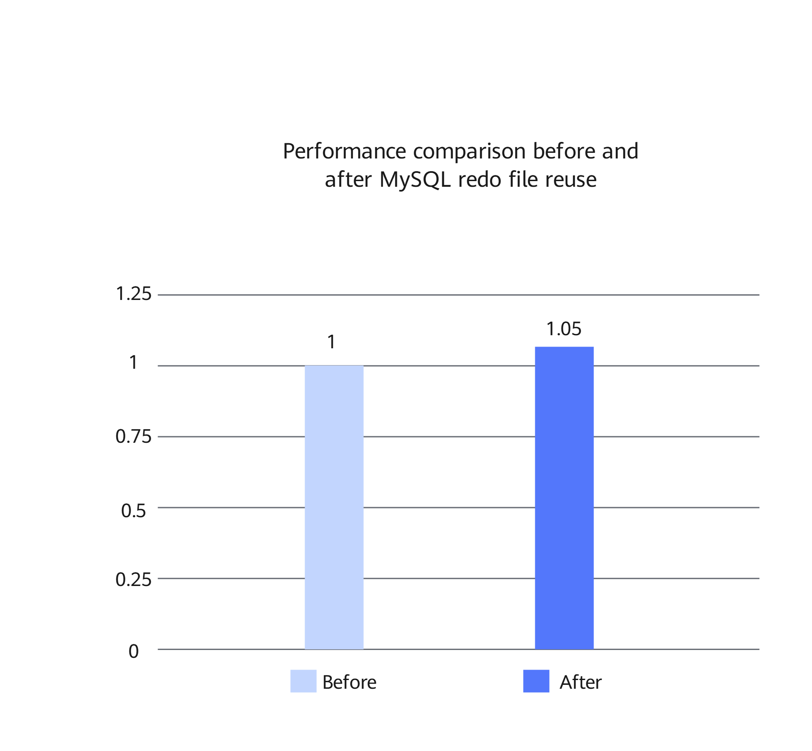

# MySQL Redo File Reuse Feature Guide

<!-- md-trans-meta sourceCommit=a91d586ee1df326de1c60f476331c708ca42990d translatedAt=2026-09-16T07:03:05.250Z pushedAt=2026-09-16T09:01:45.423Z -->

## Feature Description<a name="EN-US_TOPIC_0000002605100002"></a>

### Introduction<a name="ZH-CN_TOPIC_0000002605100003"></a>

During the restart of a MySQL instance, InnoDB checks the `#innodb_redo` directory and decides whether to create new redo files based on the current redo file layout. The original implementation first cleans up the unused redo files in the directory and then proceeds to the subsequent creation process. When the directory already contains unused redo files that meet the current requirements, this approach incurs additional deletion, creation, and pre-allocation overhead.

To address this issue, Kunpeng BoostKit provides an optimization for reusing unused redo files. When the unused redo files in the directory meet the consecutive numbering and target size requirements, InnoDB can directly reuse these files instead of deleting and then recreating them. This reduces unnecessary file operations during the startup phase.

This document uses Percona-Server as an example to describe how to optimize redo file management during the InnoDB startup phase on Kunpeng servers, so as to reduce the extra I/O overhead.

### Principles<a name="ZH-CN_TOPIC_0000002605100004"></a>

This feature reduces extra file operations on the redo file directory by adjusting the processing logic for unused redo files during the InnoDB startup phase.

InnoDB 8.0 uses the `#innodb_redo` directory to manage common and temporary redo files. During startup, the system determines whether to create a redo file based on `innodb_redo_log_capacity`, the existing file layout, and the recovery result. In the original implementation, unused redo files are cleaned up before a new target file is created.

This feature adds the parameter `innodb_redo_log_reuse_unused_files` to the startup path. When this parameter is set to `ON`, the system retains the unused redo files in the directory and then determines whether these files can be reused. Cleanup is performed only in the following scenarios:

- The user explicitly sets `innodb_redo_log_reuse_unused_files` to `OFF`.
- The existing file layout does not meet the reuse conditions.
- The subsequent code execution requires the deletion and recreation of the redo files.

To reuse unused redo files, the following two conditions must be met simultaneously:

- The file numbers must start from the number following that of the current file and must be consecutive.
- The file size must be consistent with the current `next_file_size`.

When the preceding conditions are met, InnoDB can directly use these files, avoiding repeated deletion, creation, and preallocation.

## Environment Requirements<a name="ZH-CN_TOPIC_0000002605100005"></a>

This document provides guidance based on specific environments. Before performing operations, ensure that your hardware and software meet the requirements.

**Table 1** Hardware requirement<a id="redo_reuse_hardware_requirements"></a>

|Item|Specification|
|--|--|
|CPU|Kunpeng 920 processor, new Kunpeng 920 processor model, or Kunpeng 950 processor|

**Table 2** OS and software requirements<a id="redo_reuse_software_requirements"></a>

|Item|Name|Version|How to Obtain|
|--|--|:-:|--|
|OS|openEuler|22.03 LTS SP4|[Link](https://repo.huaweicloud.com/openeuler/openEuler-22.03-LTS-SP4/ISO/aarch64/openEuler-22.03-LTS-SP4-everything-aarch64-dvd.iso)|
|Percona|Percona-Server|8.0.43-34|See [BoostDB-Percona Installation Guide](./boostdb-percona-install.md).|

## Feature Installation and Usage<a name="ZH-CN_TOPIC_0000002605100006"></a>

The optimized BoostDB-Percona version has integrated this optimization feature by default. Therefore, you do not need to obtain the patch separately and recompile and install the code.

The following uses Percona-Server 8.0.43-34 as an example to describe how to install and use this optimization feature. The procedure is as follows:

1. Install the optimized BoostDB-Percona version as instructed in [BoostDB-Percona Installation Guide](./boostdb-percona-install.md).
2. Start the database. For details, see [Running MySQL](https://www.hikunpeng.com/document/detail/en/kunpengdbs/ecosystemEnable/MySQL/kunpengmysql8017_03_0013.html) in the *MySQL Porting Guide*.
3. (Optional) Perform the sysbench test to compare the performance before and after the optimization feature is enabled. For details about the test procedure, see [Sysbench 0.5 & 1.0 Test Guide](https://www.hikunpeng.com/document/detail/en/kunpengdbs/testguide/tstg/kunpengsysbench_02_0001.html). The redo file reuse feature can improve the sysbench write-only performance by 5% in a container with 32 vCPUs and 256 GB memory. [Figure 1](#performance-compare-redo-file-reuse) shows the performance comparison before and after the optimization.

**Figure 1** Performance comparison in sysbench write scenarios<a name="fig937192253919"></a><a id="performance-compare-redo-file-reuse"></a>



## Configuring and Starting the Instance

1. Start the instance with the default configuration. By default, `innodb_redo_log_reuse_unused_files` is set to `ON`. Therefore, no additional configuration is required to enable the feature.

2. After startup, run the following command to confirm that the parameter has taken effect.

   ```sql
   SHOW VARIABLES LIKE 'innodb_redo_log_reuse_unused_files';
   ```

   The expected result is as follows:

   The returned value is `ON`.

3. To disable the feature, explicitly set the parameter to `OFF` in the startup parameters.

   ```ini
   [mysqld]
   innodb_redo_log_reuse_unused_files=OFF
   ```

   > **NOTE:**
   > `innodb_redo_log_reuse_unused_files` is a read-only startup parameter and takes effect only after the instance is restarted.

## Security Check and Hardening<a name="EN-US_TOPIC_0000002605100008"></a>

Address space layout randomization (ASLR) is a security technology against buffer overflow. It randomizes the layout of linear areas such as heap, stack, and shared library mapping to make it difficult for attackers to predict target addresses and directly locate code, thereby preventing overflow attacks.

```bash
echo 2 >/proc/sys/kernel/randomize_va_space
```


