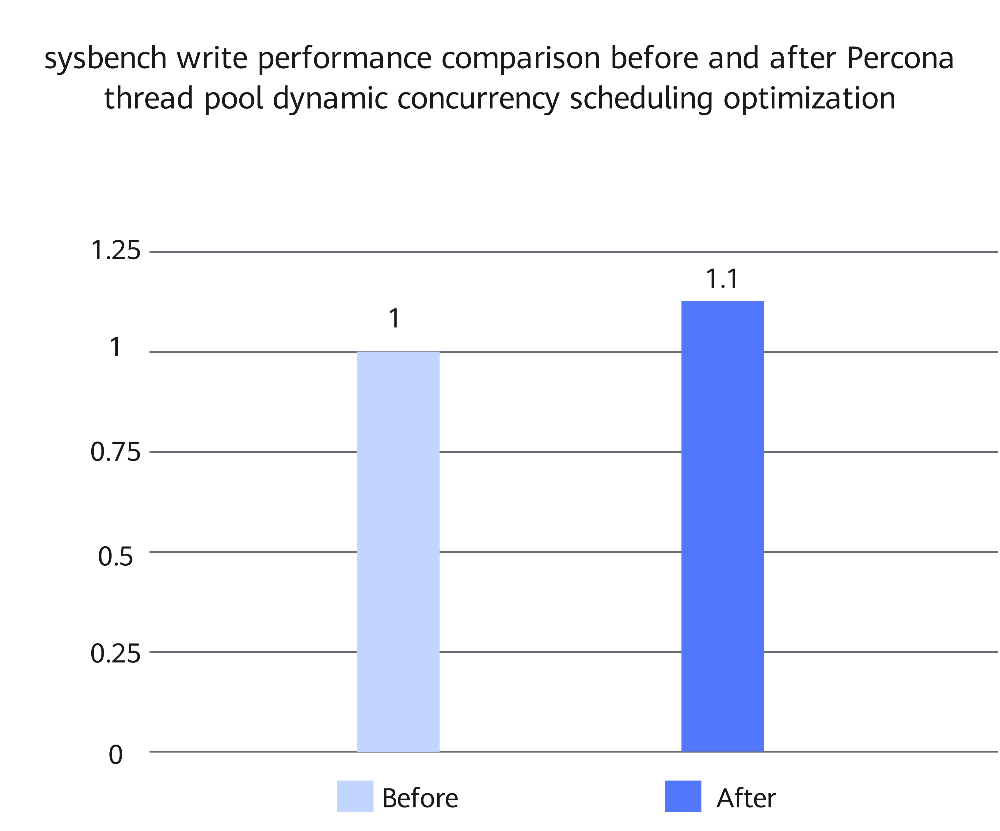

# Percona Thread Pool Dynamic Concurrency Scheduling Optimization Feature Guide

<!-- md-trans-meta sourceCommit=a91d586ee1df326de1c60f476331c708ca42990d translatedAt=2026-09-16T06:56:56.354Z pushedAt=2026-09-16T09:30:03.320Z -->

## Feature Description<a name="EN-US_TOPIC_0000002602100302"></a>

### Introduction<a name="EN-US_TOPIC_0000002602100303"></a>

This document uses Percona-Server 8.0.43-34 as an example to describe how to install, configure, and use the Percona thread pool dynamic concurrency scheduling optimization feature on Kunpeng servers.

The Percona Server thread pool does not adjust the number of worker threads based on the process CPU usage and context switching frequency. Ordered commit waits occupy worker threads and may cause queued requests to keep waiting.

Percona thread pool dynamic concurrency scheduling optimization adjusts the thread pool concurrency quota based on the process CPU usage and context switching frequency, and wakes up or creates worker threads based on the thread pool status during ordered commit waits.

### Constraints<a name="EN-US_TOPIC_0000002602100311"></a>

This feature depends on the Percona Server thread pool feature and does not take effect when the thread pool is not enabled.

### Principles<a name="EN-US_TOPIC_0000002602100304"></a>

Before optimization, the Percona Server thread pool assigns connections to thread groups, and the worker threads within a group obtain tasks from the request queue and execute them. `thread_pool_size` (the number of thread groups) determines the total number of thread groups. The thread pool decides whether to wake up or create worker threads based on the number of active threads and waiting threads in the group and `thread_pool_oversubscribe` (the thread group concurrency limit parameter).

When the follower threads of Percona's ordered commit wait for the leader thread to complete the flush or sync phase, they enter the general waiting processing path. The original thread pool does not collect the process CPU usage and context switching frequency, nor does it calculate the global active worker thread quota. Therefore, this waiting path can only be processed based on local states such as the number of active threads and waiting threads in the thread group, and cannot determine whether to wake up or create worker threads based on process-level resource pressure.

#### Dynamically Adjusting the Concurrency Quota

After Percona thread pool dynamic concurrency scheduling optimization is enabled, the thread pool timer thread periodically updates the following statistics:

- Normalized process CPU usage
- Number of voluntary context switches per second per vCPU
- Number of involuntary context switches per second per vCPU
- `active_threads_quota` (global active worker thread quota) calculated based on the above metrics. This quota is an internal code state variable and is not configurable.

When any of the following conditions is met, the thread pool lowers `active_threads_quota`.

- The process CPU usage is higher than `thread_pool_cpu_usage_threshold` (the process CPU usage threshold, in percentage).
- The voluntary context switching frequency is higher than `thread_pool_nvcsw_freq_threshold` (the voluntary context switching frequency threshold, measured in switch count per second per vCPU).
- The involuntary context switching frequency is higher than `thread_pool_nivcsw_freq_threshold` (the involuntary context switching frequency threshold, measured in switch count per second per vCPU).

When none of the three sampled values exceeds the corresponding threshold, the thread pool increases `active_threads_quota`. The lower limit of this quota is `thread_pool_size`, and the upper limit is `thread_pool_oversubscribe × thread_pool_size`.

#### Handling Ordered Commit Waits

The adjusted `active_threads_quota` is used to limit the number of simultaneously active worker threads in the thread pool. After a follower thread of an ordered commit enters waiting, the thread pool uses this quota as one of the conditions for determining whether to add a worker thread to the current thread group.

On the Linux AArch64 (64-bit Arm architecture) platform, when a follower thread in an ordered commit enters the `tx_commit_pending` wait path, the thread pool checks the following conditions:

- `thread_pool_commit_burst_threads=ON` (enables burst worker threads for ordered commits).
- The number of global active worker threads is greater than `thread_pool_size` and less than `active_threads_quota`.
- The request queue of the current thread group is not empty.
- The current thread group has not reached its `active` (number of active threads) and `busy` (number of active threads plus waiting threads) limits.
- The mutex of the current thread group can be acquired immediately.

When all the above conditions are met, the thread pool wakes up or creates a worker thread for the current thread group; when any condition is not met, this operation is not performed.

## Environment Requirements<a name="EN-US_TOPIC_0000002602100305"></a>

This document provides guidance based on specific environments. Before performing operations, ensure that your hardware and software environments meet the requirements.

**Table 1** Hardware requirement

|Item|Specification|
|--|--|
|CPU|Kunpeng 920 processor, new Kunpeng 920 processor model, or Kunpeng 950 processor|

<a id="thread_pool_dynamic_concurrency_software_requirements"></a>
**Table 2** OS and software requirements

|Item|Name|How to Obtain|
|--|--|--|
|OS|openEuler 22.03 LTS SP4|[Link](https://repo.huaweicloud.com/openeuler/openEuler-22.03-LTS-SP4/ISO/aarch64/openEuler-22.03-LTS-SP4-everything-aarch64-dvd.iso)|
|Percona|Percona-Server|[8.0.43-34](./boostdb-percona-install.md)|

## Feature Installation and Usage<a name="EN-US_TOPIC_0000002602100306"></a>

The optimized BoostDB-Percona version has integrated this optimization feature by default. Therefore, you do not need to obtain the patch separately and recompile and install the code.

The following uses Percona-Server 8.0.43-34 as an example to describe how to install and use this optimization feature. The procedure is as follows:

1. Install the optimized BoostDB-Percona version as instructed in [BoostDB-Percona Installation Guide](./boostdb-percona-install.md).
2. Start the database. For details, see [Running MySQL](https://www.hikunpeng.com/document/detail/en/kunpengdbs/ecosystemEnable/MySQL/kunpengmysql8017_03_0013.html) in the *MySQL Porting Guide*.
3. (Optional) Perform the sysbench test to compare the performance before and after the optimization feature is enabled. For details about the test procedure, see [Sysbench 0.5 & 1.0 Test Guide](https://www.hikunpeng.com/document/detail/en/kunpengdbs/testguide/tstg/kunpengsysbench_02_0001.html). In a container with 32 vCPUs and 256 GB memory, the Percona thread pool dynamic concurrency scheduling optimization feature can improve the sysbench write-only performance by 10%. [Figure 1](#fig937192253919) shows the performance comparison before and after optimization.

**Figure 1** sysbench write performance comparison before and after optimization<a name="sysbench_write_performance_comparison_before_and_after_optimization"></a><a id="fig937192253919"></a><br>



## Configuring and Starting the Instance<a name="EN-US_TOPIC_0000002602100308"></a>

1. Enable the thread pool in `my.cnf`.

    ```ini
    [mysqld]
    thread_handling=pool-of-threads
    ```

   `thread_handling` needs to take effect when the instance starts. `thread_pool_size` defaults to the number of CPUs detected at instance startup, and the default value of `thread_pool_oversubscribe` is `3`. These two parameters together determine the lower and upper limits of `active_threads_quota`.
2. The default value of `thread_pool_commit_burst_threads` is `ON`. The following configuration explicitly sets the feature switch and the three threshold parameters:

    ```ini
    [mysqld]
    thread_pool_commit_burst_threads=ON
    thread_pool_cpu_usage_threshold=90
    thread_pool_nvcsw_freq_threshold=10000
    thread_pool_nivcsw_freq_threshold=4294967295
    ```

3. Start or restart the MySQL instance by following instructions in [Percona Porting Guide](https://www.hikunpeng.com/document/detail/en/kunpengdbs/ecosystemEnable/Percona/kunpengpercona_02_0001.html) to make `thread_handling=pool-of-threads` take effect.

## Configuring Feature Parameters<a name="EN-US_TOPIC_0000002602100309"></a>

The newly added parameters are described as follows.

| Parameter                                  | Meaning         | Default Value          | Range              | Unit       | Scope         | Runtime Effective | Restart Required | Recommended Value | Description                                                  |
| ----------------------------------- | ------------ | ------------ | --------------- | -------- | ----------- | ---- | ---- | -------- | --------------------------------------------------- |
| `thread_pool_commit_burst_threads`  | Ordered commit burst worker thread toggle | `ON`        | `ON`/`OFF`        | /      | GLOBAL (instance-level) | Yes    | No    | Retain the default value `ON`. | When this parameter is set to `ON`, additional worker threads can be woken up or created according to the quota during ordered commit waits; when it is set to `OFF`, this operation is not performed. |
| `thread_pool_cpu_usage_threshold`   | Process CPU usage threshold   | `90`        | 0–100| Percentage      | GLOBAL (instance-level) | Yes    | No    | Retain the default value `90`; the value can be lowered when sustained high load affects throughput, and can be raised when CPUs are sufficient but threads are limited. | When the sampled process CPU usage is greater than this value, `active_threads_quota` is reduced.           |
| `thread_pool_nvcsw_freq_threshold`  | Voluntary context switching frequency threshold  | `10000`      | 0–4294967295 | Switch count per second per vCPU | GLOBAL (instance-level) | Yes    | No    | Retain the default value `10000`; the value can be lowered when voluntary switches frequently trigger quota reduction, and can be raised when latency is high and resources are sufficient, with monitoring statistics taken into account. | When the sampled voluntary context switching frequency is greater than this value, `active_threads_quota` is reduced.          |
| `thread_pool_nivcsw_freq_threshold`| Involuntary context switching frequency threshold  | `4294967295` | 0–4294967295 | Switch count per second per vCPU | GLOBAL (instance-level) | Yes    | No    | Retain the default value `4294967295`; the value can be lowered only when the involuntary switching frequency causes obvious system pressure and quota reduction is confirmed to be necessary. The source of the problem should be confirmed before adjustment. | When the sampled involuntary context switching frequency is greater than this value, `active_threads_quota` is reduced.          |

After the instance is started, these parameters can be adjusted online through `SET GLOBAL`.

```sql
SET GLOBAL thread_pool_commit_burst_threads = ON;
SET GLOBAL thread_pool_cpu_usage_threshold = 90;
SET GLOBAL thread_pool_nvcsw_freq_threshold = 10000;
SET GLOBAL thread_pool_nivcsw_freq_threshold = 4294967295;
```

The four new parameters are all global variables, meaning that the parameter values take effect for the entire MySQL instance. They support modification at runtime and do not require an instance restart. `SET GLOBAL` only modifies the parameter values in the currently running instance; when custom values need to be retained after an instance restart, they should also be written to `my.cnf`.

## Observing Functions<a name="EN-US_TOPIC_0000002602100310"></a>

You can check the parameters and status information in the following ways.

```sql
SHOW GLOBAL VARIABLES LIKE 'thread_pool_commit_burst_threads';
SHOW GLOBAL VARIABLES LIKE 'thread_pool_cpu_usage_threshold';
SHOW GLOBAL VARIABLES LIKE 'thread_pool_nvcsw_freq_threshold';
SHOW GLOBAL VARIABLES LIKE 'thread_pool_nivcsw_freq_threshold';

SHOW GLOBAL STATUS LIKE 'Threadpool_statistics_detail';
SHOW GLOBAL STATUS LIKE 'Threadpool_active_threads';
SHOW GLOBAL STATUS LIKE 'Threadpool_waiting_threads';
```

The status items and fields are described as follows.

| Status Item or Field                         | Meaning        | Unit       | Description                                                   |
| ------------------------------ | ----------- | -------- | ------------------------------------------------------ |
| `Threadpool_statistics_detail`| Thread pool scheduling statistics detail   | N/A      | This status item summarizes the following five fields in string form.                                    |
| `n_cpu`                        | Normalized CPU base    | count        | Number of vCPUs used for calculating the CPU usage and context switching frequency.                            |
| `cpu_pct`                   | Process CPU usage    | Percentage      | Compared with `thread_pool_cpu_usage_threshold`; if it is greater than the threshold, quota reduction is performed.   |
| `nvcsw_freq`                   | Voluntary context switching frequency   | Switch count per second per vCPU | Compared with `thread_pool_nvcsw_freq_threshold`; if it is greater than the threshold, quota reduction is performed.  |
| `nivcsw_freq`                  | Involuntary context switching frequency   | Switch count per second per vCPU | Compared with `thread_pool_nivcsw_freq_threshold`; if it is greater than the threshold, quota reduction is performed. |
| `active_threads_quota`         | Global active worker thread quota  | Threads        | This value being greater than the current global active worker thread count is one of the conditions for worker thread wake-up and creation.                  |
| `Threadpool_active_threads`    | Current global active worker thread count | Threads        | This value should be greater than `thread_pool_size` and less than `active_threads_quota`.        |
| `Threadpool_waiting_threads`   | Current global waiting worker thread count | Threads        | This field summarizes `waiting_thread_count` of all thread groups, used to observe the number of waiting threads.             |

To disable this feature and fall back to the original thread pool behavior, run the following command:

```sql
SET GLOBAL thread_pool_commit_burst_threads = OFF;
```

## Security Check and Hardening<a name="EN-US_TOPIC_0000002602100312"></a>

Address space layout randomization (ASLR) is a security technology against buffer overflow. It randomizes the layout of linear areas such as heap, stack, and shared library mapping to make it difficult for attackers to predict target addresses and directly locate code, thereby preventing overflow attacks.

```bash
echo 2 >/proc/sys/kernel/randomize_va_space
```


## Change History

|Date|Description|
|--|--|
|2026-09-30|This is the first official release.|
