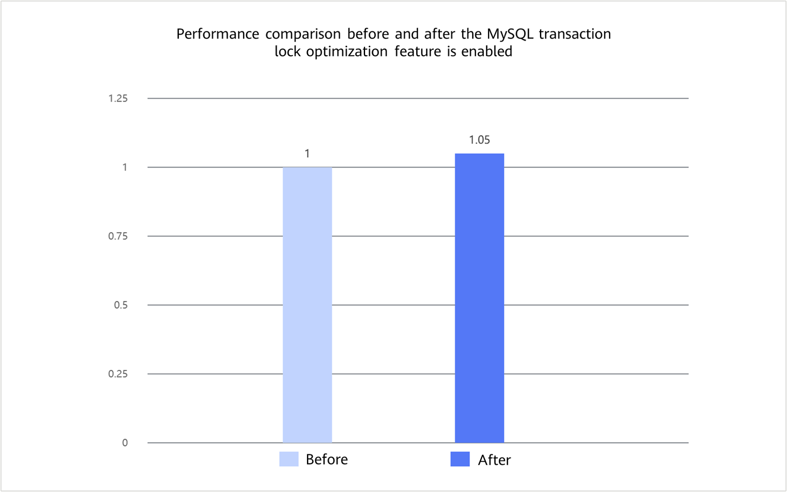

# MySQL Transaction Lock Optimization Feature Guide

## Feature Description<a name="EN-US_TOPIC_0000002602100002"></a>

### Overview<a name="EN-US_TOPIC_0000002602100003"></a>

This document describes how to install and use the MySQL transaction lock optimization feature on a Kunpeng server.

In MySQL online transaction processing (OLTP) scenarios with high-concurrency read/write operations, the lock management, table lock queue check, and ReadView lifecycle management in the InnoDB transaction system are likely to become hotspots. This may cause global contention, high overhead of linked list scanning, and insufficient multi-version concurrency control (MVCC) view reuse. To address these issues, Kunpeng BoostKit provides multiple optimizations to improve system performance. This document uses Percona-Server as an example to describe how to optimize the InnoDB transaction lock system on a Kunpeng server to enhance performance in high-concurrency write scenarios.

### Principles<a name="EN-US_TOPIC_0000002602100004"></a>

The MySQL transaction lock optimization feature enables enhancements in three aspects: lock system sharding, table lock queue check optimization, and ReadView version tracking.

**Lock-sys Fine-grained Lock Tuning<a name="section_lock_sys_sharding"></a>**

Each table or row in the MySQL database can be considered as a resource, and a transaction can request access to resources. However, concurrent transactions may cause a conflict of access to resources. The Lock-sys is designed to orchestrate access to tables and rows.

The Lock-sys maintains a separate queue for each resource. When a request for a resource is initiated, the Lock-sys queries whether the resource is occupied in the corresponding queue. No matter whether the requested resource is occupied, the Lock-sys inserts a lock request into the corresponding queue and marks the lock request as WAITING or GRANTED. To support concurrent operations, the queue needs to be locked during query and insertion.

Access to all queues is managed by a latch. This means that even if only one queue is accessed, all other queues are locked. This implementation mode is inefficient in high-concurrency scenarios. To solve this problem, a fine-grained latch is introduced.

The queues are divided into a fixed number of shards based on the original global latch. Each shard is protected by its own mutex. To efficiently latch all shards, the global latch in the new feature is designed as a read/write latch. Before a queue is accessed, the shared global latch and then the mutex of the corresponding shard must be obtained. This implementation is similar to the process for accessing a MySQL database record, where an intent lock is added to the table and then the record is locked. In certain special scenarios where all queues need to be latched, only the exclusive global latch needs to be obtained.

By distributing the contention originally concentrated on a single hotspot to multiple shards, this optimization reduces mutual blocking among different transactions on the lock system path, making it more suitable for high-concurrency OLTP loads.

**Table Lock Queue Check Optimization<a name="section_table_lock_queue"></a>**

In OLTP scenarios, transactions usually apply for table-level intent locks before accessing records. These intent locks indicate that the transactions will request row locks, which are finer-grained, later. In a load dominated by DML operations, there are many requests for such intent locks, but the number of table locks (such as `LOCK_S` and `LOCK_X`) that actually conflict with the intent locks is small.

In the original implementation, when an intent lock enters the table lock queue, the entire queue needs to be scanned for compatibility check. After the lock is released, the waiting relationship in the queue also needs to be checked again. When the number of concurrent requests is large, the traversal overhead is amplified, which becomes the extra overhead on the table lock path.

This feature adds a more direct status check mechanism to the table lock queue, so that the system can first determine whether there are any table lock types in the queue that conflict with the intent lock. For scenarios where `LOCK_S` or `LOCK_X` does not exist, unnecessary queue traversal can be skipped, allowing the compatibility check to be completed directly.

By reducing repeated scanning, this optimization can reduce the overhead of table lock checks, waiting judgments, and queue wakeups in high-concurrency DML scenarios. In addition, the `AUTOINC` table lock status is maintained in a unified manner, making the status management of the table lock queue simpler.

**ReadView Version Tracking<a name="section_read_view_version"></a>**

In read/write mixed scenarios, the MVCC frequently creates, closes, and reuses ReadView. In the original implementation, ReadView management is closely dependent on the global status of the transaction system, and the conditions for view reuse are conservative. Therefore, the overhead on the `trx_sys->mutex` path is high in high-concurrency scenarios.

This feature adds a version tracking mechanism to ReadView. When the transaction system status that affects the view content changes, the version information is updated synchronously. In this way, when ReadView is opened again, the system can determine whether the existing view is still valid based on the version. If the status corresponding to the view does not change, the existing view is directly reused, and no additional removal, rebuilding, or locking operation is required.

This optimization reduces repeated work during ReadView management and is applicable to read/write hybrid workloads where views are frequently created and closed under isolation levels such as `READ COMMITTED`.

## Environment Requirements<a name="EN-US_TOPIC_0000002602100005"></a>

This document provides guidance based on specific environments. Before performing operations, ensure that your hardware and software environments meet the requirements.

**Table 1** Hardware requirement<a id="hardware-requirement"></a>

|Item|Specifications|
|--|--|
|CPU|Kunpeng 920 series processor or Kunpeng 950 processor|

**Table 2** OS and software requirements<a id="os-and-software-requirements"></a>

|Item|Name|Version|How to Obtain|
|--|--|--|--|
|OS|openEuler|22.03 LTS SP4|[Link](https://repo.huaweicloud.com/openeuler/openEuler-22.03-LTS-SP4/ISO/aarch64/openEuler-22.03-LTS-SP4-everything-aarch64-dvd.iso)|
|Percona|Percona-Server|5.7.44-53|For details, see [BoostDB-Percona Installation Guide](./boostdb-percona-install.md).|

## Feature Installation and Usage<a name="EN-US_TOPIC_0000002602100006"></a>

The optimized BoostDB-Percona version has integrated the MySQL transaction lock optimization feature by default. Therefore, you do not need to obtain the patch separately and recompile and install the code.

The following uses Percona-Server 5.7.44-53 as an example to describe how to install and use the MySQL transaction lock optimization feature. The procedure is as follows:

1. Install the optimized BoostDB-Percona version as instructed in [BoostDB-Percona Installation Guide](./boostdb-percona-install.md).
2. Start the database. For details, see [Running MySQL](https://www.hikunpeng.com/document/detail/en/kunpengdbs/ecosystemEnable/MySQL/kunpengmysql8017_03_0013.html) in the *MySQL Porting Guide*.
3. (Optional) Perform the sysbench test to compare the performance before and after the optimization feature is enabled. For details about the test procedure, see [Sysbench 0.5 & 1.0 Test Guide](https://www.hikunpeng.com/document/detail/en/kunpengdbs/testguide/tstg/kunpengsysbench_02_0001.html). The transaction lock optimization feature improves performance by 5% in sysbench write-only scenarios. [**Figure 1**](#fig937192253919) shows the performance before and after the optimization.

    **Figure 1** Performance comparison before and after the MySQL transaction lock optimization feature is enabled<a name="fig937192253919"></a><a id="fig937192253919"></a><br>

    

## Security Check and Hardening<a name="EN-US_TOPIC_0000002602100008"></a>

Address space layout randomization (ASLR) is a security technology against buffer overflow. It randomizes the layout of linear areas such as heap, stack, and shared library mapping to make it difficult for attackers to predict target addresses and directly locate code, thereby preventing overflow attacks.

```bash
echo 2 >/proc/sys/kernel/randomize_va_space
```


