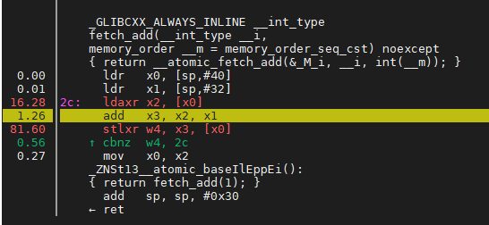
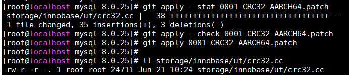
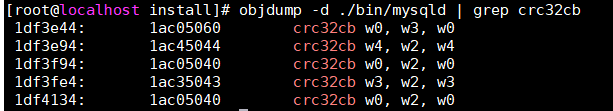
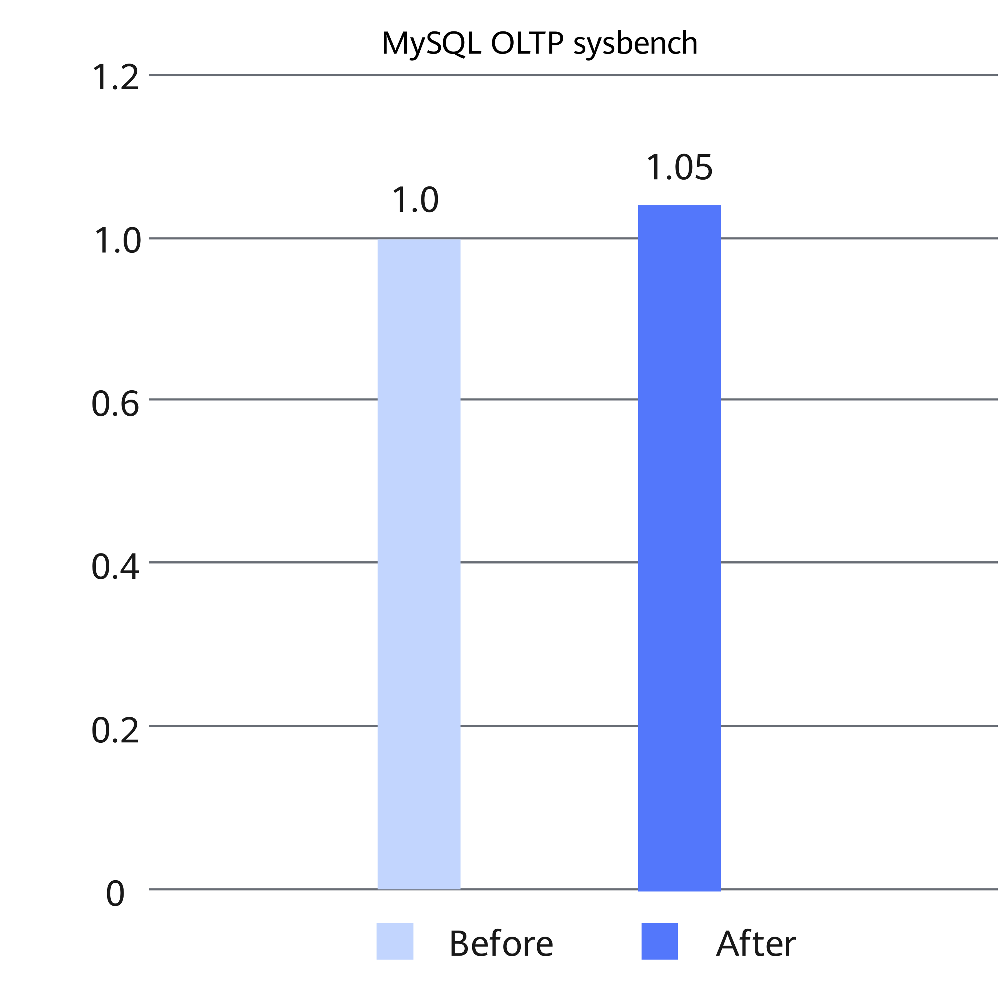

# CRC32 Instruction Optimization Feature Guide

## Feature Description<a name="EN-US_TOPIC_0000002550140085"></a>

### Introduction<a name="EN-US_TOPIC_0000002550140083"></a>

In the Kunpeng processor, the CRC32 instruction optimization feature uses Kunpeng CRC32 hardware instructions to replace the CRC32 software algorithm, lowering the CRC32 calculation overhead. This document uses MySQL as an example to describe how to use the CRC32 instruction optimization feature on a Kunpeng server running the openEuler OS. For other databases, you can refer to this document to perform adaptation and optimization.

The Linux kernel contains the C language implementation of the CRC32 algorithm, but the performance is low and may become a system performance bottleneck. This problem is more obvious when the proportion of CRC32 function calls in kernel space is high. To solve this problem, you can use Kunpeng CRC32 hardware instructions to replace the software implementation of the CRC32 algorithm, thereby improving system performance. This feature improves the MySQL sysbench write performance by 5%.

**Compatibility<a name="section65704516331"></a>**

This feature is compatible with other features. For details about the compatibility between MySQL features, see [Compatibility Between Features](https://www.hikunpeng.com/document/detail/en/kunpengdbs/appAccelFeatures/compbf/kunpengdbsmysqlfeaturecompatibility_20_0001.html).

### Principles<a name="EN-US_TOPIC_0000002550180079"></a>

#### CRC32 Hardware Acceleration Unit<a name="EN-US_TOPIC_0000002550180077"></a>

**Prerequisites<a name="section7271131495817"></a>**

Run the following command to check whether the CPU supports CRC32 hardware instructions:

```
cat /proc/cpuinfo
```

If the `Features` line in the command output contains `crc32`, the CPU supports CRC32 hardware instructions.


**Compilation Options<a name="section9456123913580"></a>**

During GCC compilation, the `-march` option can be used to specify the Arm architecture version and extension instruction set. In this feature patch, `-march=armv8-a+crc` is used, and CRC32 hardware instructions are used to replace the software implementation of the CRC32 algorithm.


#### LSE Compilation Instructions<a name="EN-US_TOPIC_0000002518700242"></a>

In the case of multiple cores and severe atomic lock contention, add the Large System Extensions (LSE) options to the GCC compilation options to ease lock contention.

Load-link/Store-conditional (LL/SC) atomic instructions load shared variables to the L1 cache where the current core is located and modify them. The performance is good when there is little lock contention. In an intense lock contention scenario, the performance deteriorates severely. The Armv8.1 specification introduces a new atomic operation instruction extension LSE, which puts computation operations into the L3 cache to increase the scope of data sharing, reduce cache consistency time consumption, and improve lock performance when lock contention is intense.

LL/SC instructions (ldaxr and stlxr):



LSE instruction (ldaddal):


In the MySQL source package, the `-march=armv8-a+lse` compilation option can be added to the `CMakeLists.txt` file to use the atomic instruction extension LSE for performance optimization.


## Environment Requirements<a name="EN-US_TOPIC_0000002518540334"></a>

This document provides guidance based on the Kunpeng server and openEuler OS. Before performing operations, ensure that your hardware and software meet the requirements.

**Hardware Requirements<a name="section116628440251"></a>**

[**Table 1**](#hardware-requirement) lists the hardware requirement.

**Table 1** Hardware requirement<a id="hardware-requirement"></a>

|Item|Specifications|
|--|--|
|CPU|Kunpeng 920|


**OS and Software Requirements<a name="section1240364411598"></a>**

[**Table 2**](#os-and-software-requirements) lists the OS and software requirements.

**Table 2** OS and software requirements<a id="os-and-software-requirements"></a>

|Item|Version|How to Obtain|
|--|--|--|
|OS|openEuler 20.03 LTS SP1<br>openEuler 22.03 LTS SP1|openEuler 20.03 LTS SP1: [Link](https://www.openeuler.org/en/download/archive/detail/?version=openEuler%2020.03%20LTS%20SP1)<br>openEuler 22.03 LTS SP1: [Link](https://www.openeuler.org/en/download/archive/detail/?version=openEuler%2022.03%20LTS%20SP1)|
|mysql-boost-8.0.25.tar.gz|MySQL 8.0.25|[Link](https://downloads.mysql.com/archives/get/p/23/file/mysql-boost-8.0.25.tar.gz)|
|0001-CRC32-AARCH64.patch|-|[Link](https://gitcode.com/boostkit/mysql/blob/MySQL-8.0.25/boostdb-patches/0001-CRC32-AARCH64.patch)|


## Feature Installation and Usage<a name="EN-US_TOPIC_0000002550180081"></a>

The CRC32 instruction optimization feature is provided as a patch file for MySQL. After applying the patch file to the MySQL source code, compile and install MySQL to use this feature. The patch is developed for MySQL 8.0.25.

1. Download the MySQL installation package `mysql-boost-8.0.25.tar.gz` and decompress it.

    For details about how to obtain the package, see [**Table 2**](#os-and-software-requirements).

2. Download the `0001-CRC32-AARCH64.patch` package of the CRC32 instruction optimization feature and decompress it. Extract and upload the patch file to the MySQL installation directory.

    For details about how to obtain the package, see [**Table 2**](#os-and-software-requirements).

3. In the root directory of the source code, run the `git init` command to create Git management information.

    ```
    git init
    git add -A
    git commit -m "Initial commit"
    ```

    > **NOTE:**
    >-   Generally, Git is provided by the system. If not, configure the Yum repository by following instructions in [MySQL Porting Guide](https://www.hikunpeng.com/document/detail/en/kunpengdbs/ecosystemEnable/MySQL/kunpengmysql8017_02_0001.html) and then install Git.
    >    ```
    >    yum install git
    >    ```
    >-   If the Git commit user information is not configured, configure the user email and user name before running the `git commit` command.
    >    ```
    >    git config user.email "123@example.com"
    >    git config user.name "123"
    >    ```

4. Run the following commands in the MySQL installation directory to apply the patch file of the CRC32 instruction optimization feature:

    ```
    # Display patch file statistics.
    git apply --stat 0001-CRC32-AARCH64.patch
    # Check whether the patch file can be successfully applied to the current code repository.
    git apply --check 0001-CRC32-AARCH64.patch
    # Apply the patch file to the current code repository, modify relevant files, and generate a new commit.
    git apply 0001-CRC32-AARCH64.patch
    ```

    

5. Compile and install MySQL. For details, see [MySQL Porting Guide](https://www.hikunpeng.com/document/detail/en/kunpengdbs/ecosystemEnable/MySQL/kunpengmysql8017_02_0001.html).
6. Run the following command. If crc32cb dissembling information in the figure is displayed, the CRC32 instruction optimization feature is successfully enabled.

    ```
    objdump -d ./bin/mysqld | grep crc32cb
    ```

    

7. Perform the sysbench test to measure the performance improvement after the CRC32 instruction optimization feature is used. For details about the test procedure, see [Sysbench 0.5 & 1.0 Test Guide](https://www.hikunpeng.com/document/detail/en/kunpengdbs/testguide/tstg/kunpengsysbench_02_0001.html).

    The CRC32 instruction optimization feature can improve the sysbench write performance by 5%. [**Figure 1**](#performance-comparison) compares the performance before and after optimization.

    **Figure 1** Performance comparison<a name="fig20274152011365"></a><a id="performance-comparison"></a><br>
    


## Security Management<a name="EN-US_TOPIC_0000002518540336"></a>

**Routine Check Using Antivirus Software<a name="en-us_topic_0000001821389094_section11752161613273"></a>**

Periodically scan clusters for viruses. This protects clusters from viruses, malicious code, spyware, and malicious programs, reducing risks such as system breakdown and information leakage. Mainstream antivirus software can be used for antivirus check.

**Vulnerability Fixing<a name="en-us_topic_0000001821389094_section208601325152718"></a>**

To ensure the security of the production environment and reduce the risk of attacks, periodically fix the following vulnerabilities:

- OS vulnerabilities
- OpenSSL vulnerabilities
- Vulnerabilities in other components


## Acronyms and Abbreviations<a name="EN-US_TOPIC_0000002518700244"></a>

|Acronym/Abbreviation|Full Spelling|
|--|--|
|CRC|cyclic redundancy check|


## Change History<a name="EN-US_TOPIC_0000002518700240"></a>

|Date|Description|
|--|--|
|2024-03-30|This issue is the first official release.|
