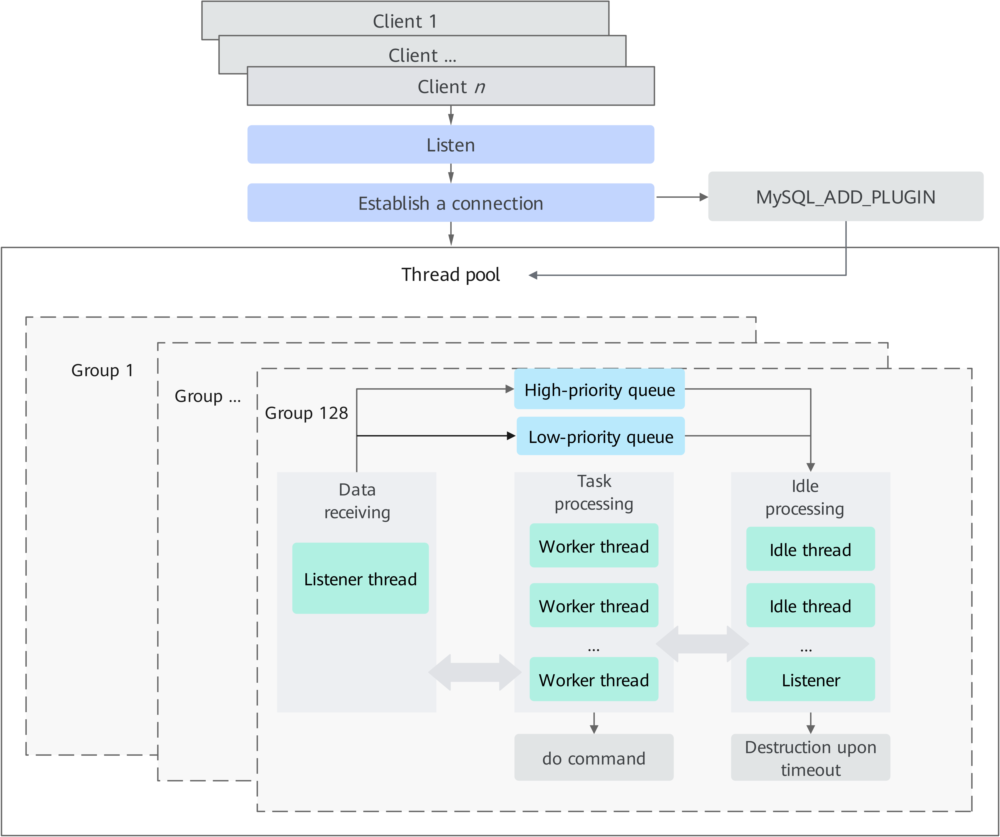
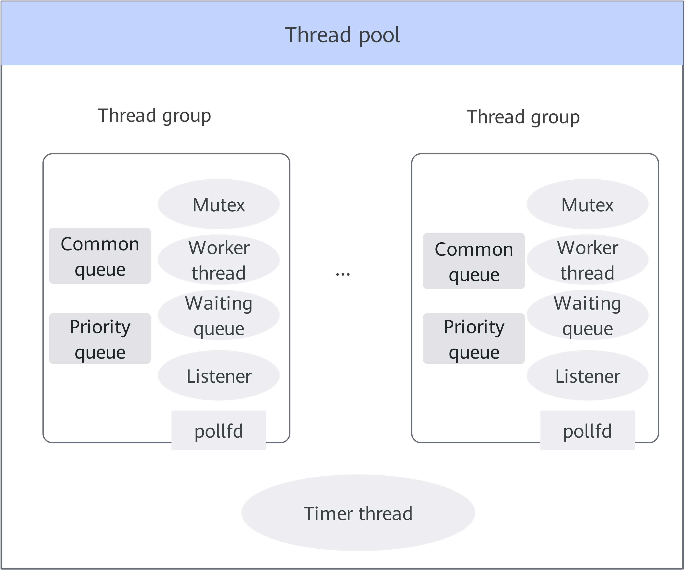

# MySQL 5.7.27 Thread Pool Feature Guide

## Feature Description<a name="EN-US_TOPIC_0000002518542638"></a>

### Introduction<a name="EN-US_TOPIC_0000002518702548"></a>

The default MySQL connector allocates a thread to each connection. As the number of connections increases, context switching and the contention for hot locks may occupy many CPU resources, deteriorating service performance. Kunpeng BoostKit introduces the thread pool connector module to address this issue.

### Application Scenarios<a name="EN-US_TOPIC_0000002518542650"></a>

- OLTP short queries with a large number of connections
- Read-only short queries with a large number of connections
- A large number of long query connections (You can set a small number of thread groups in the thread pool configuration to prevent performance deterioration due to long queries.)

This feature is implemented using a patch file. For details about how to use the patch file, see [Installation Description](#installation-description).

### Principles<a name="EN-US_TOPIC_0000002518702538"></a>

When a thread pool connector module is used, as shown in [**Figure 1**](#working-principle-of-the-mysql-thread-pool), it takes over the connection establishment and scheduling. With a dynamically scalable and multi-group thread pool, the server can have no performance loss even when there are a large number of client connections. In the thread pool solution, the listener thread in each group listens to network tasks and allocates triggered tasks to a high-priority or low-priority queue. Then idle worker threads obtain tasks from the queue based on priorities. Each CPU can process a limited number of tasks at the same time. Generally, two to five tasks can be processed concurrently while maintaining stable service performance.

**Figure 1** Working principle of the MySQL thread pool<a name="fig11588201933612"></a><a id="working-principle-of-the-mysql-thread-pool"></a><br>


**Figure 2** Overall principle framework<a name="fig179241351104514"></a><a id="overall-principle-framework"></a><br>


A thread pool consists of multiple thread groups and one timer thread. The number of thread groups is the number of CPU cores on the server by default. You can modify the number of thread groups in the configuration file or by running related commands. For details, see [thread_pool_size](#thread_pool_size). User connections are allocated to the corresponding thread group in polling mode. All query requests in the connections are processed by the bound thread group. When a client connection sends an SQL statement, the thread group allocates a worker thread to the connection for processing. After the SQL statement is executed, the thread group reclaims the worker thread. The number of worker threads is controlled within a proper range by a policy to ensure high service performance.

Each thread group in a thread pool contains:

- A `pollfd`, which is the poll descriptor returned by `epoll_create`.
- Zero or one listener thread. `epoll_wait` waits for network readable events.
- A common queue that stores connection objects (including TCP connection information and SQL execution context status) with network readable events to be processed by worker threads.
- A priority queue that stores connection objects that have network readable events and are in the middle of a transaction. Such connections will be processed by the worker threads first.
- Zero or more worker threads that obtain connection objects with network readable events, process login verification of connections, receive and execute SQL statements, and return results. If there is no listener thread in a thread group, the first idle worker thread that enters the sleep state becomes a listener thread.
- A waiting queue. When a worker thread has no task to process, it enters the waiting state and is placed in the waiting queue. After the thread is woken up by an external signal or is automatically woken up due to waiting timeout, the thread status is re-marked as active to process tasks or the thread just exits.
- A mutex that protects resources in a thread group from being simultaneously accessed by multiple threads.

All thread groups share one timer thread. A timer thread detects whether a task in a thread group is suspended, that is, whether no new task is generated in a period of time or no task is consumed when the task queue is not empty.

A thread pool supports the following functions:

- The number of thread groups can be system-defined or user-defined.
- For better performance, priority and common queues process transaction connections, lock connections, and common query statement connections separately. For details, see [thread_pool_high_prio_mode](#thread_pool_high_prio_mode) and [thread_pool_high_prio_tickets](#thread_pool_high_prio_tickets).
- The number of worker threads is dynamically scaled to ensure that the number of running threads is within a proper range for efficient processing.
- Thread pool lockups or starvation is prevented.
- An extra connector is used for local UNIX socket connections.
- Four status information tables are added to `information_schema` to monitor the thread pool status in real time.

For details about the function configuration, see [Parameters](#parameters).

## Installation Description<a name="EN-US_TOPIC_0000002550142385" id="installation-description"></a>

- The feature used for optimization is provided in a patch. Apply the patch in the MySQL source code, and then compile and install the MySQL database.
- The patch is developed for MySQL 5.7.27.
- For details about the environment requirements for using the patch, see [MySQL Porting Guide](https://www.hikunpeng.com/document/detail/en/kunpengdbs/ecosystemEnable/MySQL/kunpengmysql8017_02_0001.html).

1. Create a MySQL user. See [Creating a User Group and User](https://www.hikunpeng.com/document/detail/en/kunpengdbs/ecosystemEnable/MySQL/kunpengmysql8017_03_0006.html) in the *MySQL Porting Guide*.
2. Use the `root` account to log in to the server, and download and decompress the MySQL 5.7.27 source package.

    ```shell
    cd /home
    wget https://dev.mysql.com/get/Downloads/MySQL-5.7/mysql-boost-5.7.27.tar.gz --no-check-certificate
    tar -zxvf mysql-boost-5.7.27.tar.gz
    cd mysql-5.7.27
    ```

    > **NOTE:**
    >You can also download [mysql-boost-5.7.27.tar.gz](https://dev.mysql.com/get/Downloads/MySQL-5.7/mysql-boost-5.7.27.tar.gz) and save it to the target path, for example, `/home`.

3. In the root directory of the source code, run the `git init` command to create Git management information.

    ```shell
    git init
    git add -A
    git commit -m "Initial commit"
    ```

    > **NOTE:**
    >- If an error is reported when you run the `git add -A` command, run the `git config --global --add safe.directory /home/mysql-5.7.27` command as prompted.
    >- Generally, Git is provided by the system. If not, configure the Yum repository by following instructions in [MySQL Porting Guide](https://www.hikunpeng.com/document/detail/en/kunpengdbs/ecosystemEnable/MySQL/kunpengmysql8017_02_0001.html) and then install Git.
>
    > ```shell
    > yum install git
    >    ```
>
    >- If the Git commit user information is not configured, configure the user email and user name before running the `git commit` command.
>
    > ```shell
    > git config user.email "123@example.com"
    > git config user.name "123"
    >    ```

4. Download the patch file.

    ```shell
    wget https://gitcode.com/boostkit/mysql/blob/MySQL-5.7.27/boostdb-patches/0001-THREAD_POOL_5.patch --no-check-certificate
    ```

5. Check whether the content is modified.

    ```shell
    git status
    ```

    The following shows that a `0001-THREAD_POOL_5.patch` file is added.

    ```text
    # On branch master
    # Untracked files:
    #   (use "git add <file>..." to include in what will be committed)
    #
    #       0001-THREAD_POOL_5.patch
    nothing added to commit but untracked files present (use "git add" to track)
    ```

6. Apply the patch file.

    ```shell
    git apply --check 0001-THREAD_POOL_5.patch
    git apply --whitespace=nowarn 0001-THREAD_POOL_5.patch
    ```

7. Compile and install the MySQL source code. For details, see [MySQL Porting Guide](https://www.hikunpeng.com/document/detail/en/kunpengdbs/ecosystemEnable/MySQL/kunpengmysql8017_02_0001.html).
8. After MySQL is compiled and installed successfully, log in to MySQL to check the new `information_schema` table in the thread pool to ensure that the patch has taken effect. For details, see [New information_schema Tables](#new-information-schema-tables).

## Parameters<a name="EN-US_TOPIC_0000002550182393" id="parameters"></a>

### Parameter Usage Description<a name="EN-US_TOPIC_0000002550142387"></a>

MySQL parameters are also called system variables, which are used to set service functions and performance of MySQL. For details, see the official MySQL document [Server System Variables](https://dev.mysql.com/doc/refman/8.0/en/server-system-variables.html).

There are two ways to use configuration parameters:

- CLI:

    ```shell
    mysqld --thread_handling=pool-of-threads
    ```

- Configuration file, that is, add a line to the `my.cnf` file, for example:

    ```text
    thread_handling=pool-of-threads
    ```

### thread_handling<a name="EN-US_TOPIC_0000002518542640"></a>

Support CLI: Yes

Support configuration file: Yes

Support dynamic modification: No

Scope: global

Parameter type: string

Default value: `one-thread-per-connection`

Possible values: `one-thread-per-connection`, `pool-of-threads`, and `no-threads`

This parameter specifies how the server handles threads for client connections. The options are described as follows:

- `one-thread-per-connection`: A thread is allocated to each connection to handle the requests of the connection. This mode applies to scenarios with a small number of connections.
- `pool-of-threads`: The thread pool is used to handle all requests of all connections. This mode applies to short queries with a large number of connections.
- `no-threads`: The main thread is used to process all connections. This mode is generally used for debugging.

### thread_pool_size<a name="EN-US_TOPIC_0000002550182395" id="thread_pool_size"></a>

Support CLI: Yes

Support configuration file: Yes

Support dynamic modification: Yes

Scope: global

Parameter type: numeric

Default value: number of CPU cores

Value range: 1–1024

This parameter specifies the number of thread groups in a thread pool. The default value indicates that the number of thread groups is the same as the number of CPU cores. You can set this parameter to one to three times the number of CPU cores to achieve better performance based on your requirements (for example, when the number of connections exceeds the number of logical CPU cores, the performance bottleneck is not caused by lock contention, and the CPU is not fully occupied).

### thread_pool_max_threads<a name="EN-US_TOPIC_0000002550142381"></a>

Support CLI: Yes

Support configuration file: Yes

Support dynamic modification: Yes

Scope: global

Parameter type: numeric

Default value: `100000`

Value range: 1–100000

This parameter specifies the maximum number of threads in a thread pool. When the specified value is reached, you cannot create any new thread.

### thread_pool_stall_limit<a name="EN-US_TOPIC_0000002518702540"></a>

Support CLI: Yes

Support configuration file: Yes

Support dynamic modification: Yes

Scope: global

Parameter type: numeric

Default value: `500` (ms)

Value range: 10–4294967295

This parameter specifies the interval for the timer thread to check the status of a thread group, in milliseconds. If a thread group is identified to be stalled, the thread group wakes up a sleeping thread or creates a new thread. This prevents the problem that a new query cannot be processed because a long query occupies a worker thread for a long time.

### thread_pool_idle_timeout<a name="EN-US_TOPIC_0000002550142383"></a>

Support CLI: Yes

Support configuration file: Yes

Support dynamic modification: Yes

Scope: global

Parameter type: numeric

Default value: `60` (s)

Value range: 1–4294967295

This parameter specifies the waiting time of an idle thread after the worker thread enters the idle state. If the idle thread is not woken up by a new task after the period specified by this parameter, the idle thread exits.

### thread_pool_oversubscribe<a name="EN-US_TOPIC_0000002518542644"></a>

Support CLI: Yes

Support configuration file: Yes

Support dynamic modification: Yes

Scope: global

Parameter type: numeric

Default value: `3`

Value range: 1–1000

This parameter specifies the oversubscribing number of threads in each thread group. If it is set to the default value, it indicates the oversubscribing number of threads of each CPU core. The default value is `3`, which is an empirical value that can fully utilize CPU resources. If this parameter is set to a value smaller than `3`, more sleep and wake-up events may occur. If the number of active worker threads in a thread group exceeds the value of this parameter, the system considers that there are too many active worker threads and you need to reduce this number.

### thread_pool_toobusy<a name="EN-US_TOPIC_0000002550142389"></a>

Support CLI: Yes

Support configuration file: Yes

Support dynamic modification: Yes

Scope: global

Parameter type: numeric

Default value: `13`

Value range: 1–1000

This parameter specifies the threshold number of worker threads for determining whether a thread group is busy. If (*Number of active worker threads in a thread group* + *Number of worker threads in lock or I/O waiting*) > (`thread_pool_toobusy` + 1), the thread group is busy and does not handle low-priority tasks until the thread group returns to a non-busy state. Instead, the thread group waits for the ongoing tasks and high-priority tasks to be handled.

### thread_pool_high_prio_mode<a name="EN-US_TOPIC_0000002518542646" id="thread_pool_high_prio_mode"></a>

Support CLI: Yes

Support configuration file: Yes

Support dynamic modification: Yes

Scope: global, session

Parameter type: string

Default value: `transactions`

Possible values: `transactions`, `statements`, and `none`

This parameter is used to provide finer-grained control over high-priority scheduling either global or per-connection.

- `transactions`: Only statements from started transactions can enter the high-priority queue, depending on the number of high-priority tickets currently available in the connection. For details, see [thread_pool_high_prio_tickets](#thread_pool_high_prio_tickets).
- `statements`: All individual statements enter the high-priority queue, regardless of the transaction status of the connection or the number of available high-priority tickets. This option can be used to prioritize sessions for specific connections.

    > **NOTICE:**
    >Setting this parameter to `statements` globally essentially disables high-priority scheduling, since in this case all statements from all connections have the same priority.

- `none`: The high-priority queue of a connection is disabled. Some connections (for example, the monitoring connection) are insensitive to execution latency and never occupy any server resources that would otherwise impact performance in other connections. Such connections do not really require high-priority scheduling. You can set their priority to `none` in the session scope.

    > **NOTICE:**
    >Setting this parameter to `none` globally essentially disables high-priority scheduling, since in this case all statements from all connections have the same priority.

### thread_pool_high_prio_tickets<a name="EN-US_TOPIC_0000002550182399" id="thread_pool_high_prio_tickets"></a>

Support CLI: Yes

Support configuration file: Yes

Support dynamic modification: Yes

Scope: global, session

Parameter type: numeric

Default value: `4294967295`

Value range: 0–4294967295

This parameter controls the high-priority queue policy. Each new connection is assigned this many tickets to enter the high-priority queue. Setting this parameter to `0` disables the high-priority queue. The number of tickets is decremented by 1 each time a connection is put into the high-priority queue. If the number of tickets decreases to 0, connections enter the low-priority queue instead. When a connection enters a low-priority queue, the number of tickets held by the connection is reset to the `thread_pool_high_prio_tickets` preset value of the session of the connection. The goal is to prevent worker threads from being occupied by a large number of high-priority connections for a long time, so that low-priority connections can be processed.

### thread_pool_dedicated_listener<a name="EN-US_TOPIC_0000002518542648"></a>

Support CLI: Yes

Support configuration file: Yes

Support dynamic modification: Yes

Scope: global

Parameter type: bool

Default value: `OFF`

Possible values: `OFF` and `ON`

This variable specifies whether the listener thread only waits for network events by calling `epoll_wait`. The default value is `OFF`. That is, when one or more network events occur and the priority and common queues are empty (the network is not busy), the listener thread reserves the first network event and puts the other events (if there are multiple network events polled in one `epoll_wait`) in the common queue or high-priority queue. The listener thread becomes a worker thread to process the first reserved network event to reduce thread context switches.

Set this parameter to `ON` if you configure a small `thread_pool_size`. After network events are obtained, the listener thread puts all network event tasks in the priority queue or common queue, and then calls `epoll_wait` to wait for network events. In this way, network events can be obtained more efficiently.

### extra_port<a name="EN-US_TOPIC_0000002550142391"></a>

Support CLI: Yes

Support configuration file: Yes

Support dynamic modification: No

Scope: global

Parameter type: numeric

Default value: `0`

Value range: 0–4294967295

This parameter is used to specify an extra port to listen on. The specified port can be used in case that new connections cannot be established because all worker threads are busy or locked when the thread pool feature is enabled. If this parameter is set to `0`, no extra port is enabled.

Run the following command to connect to the extra port (similar to the method of using the `port` parameter, whose value defaults to `3306`):

```shell
mysql --port='extra-port-number' --protocol=tcp
```

> **NOTE:**
>If this parameter is set to `0` and new connections cannot be established because all worker threads are busy or locked when the thread pool feature is enabled, you can use the local connection to access the system where the MySQL service is running.
>
>```shell
>mysql -uroot -S xxxxx.sock -p
>```
>
>Or
>
>```shell
>mysql -uroot -h localhost -P3306 -p
>```

### extra_max_connections<a name="EN-US_TOPIC_0000002550182403"></a>

Support CLI: Yes

Support configuration file: Yes

Support dynamic modification: Yes

Scope: global

Parameter type: numeric

Default value: `1`

Value range: 1–100000

This parameter specifies the maximum number of user connections allowed on the extra port. When the specified value is reached, an extra SUPER user connection can be established on the extra port. This parameter is used with `extra_port` in case all worker threads are busy or locked when the thread pool feature is enabled and new connections cannot be established.

## Setting thread_pool_size to a Small Value<a name="EN-US_TOPIC_0000002550142379"></a>

Compared with the default configuration mode, setting a small `thread_pool_size` creates more active threads in each thread group. In this manner, after the connection of a long query is bound to a thread group, executing the long query only has a minor impact on the execution of other short queries in the thread group.

In OLTP write-only scenarios, when there are many connections (for example, 8192), the performance can remain about 90% of the optimal in the configuration mode of a small number of thread groups.

Compared with the default mode (which uses default parameters), configuring a small number of thread groups can achieve higher peak performance when there are many concurrent connections. For details about the configuration, see [**Table 1**](#reference-for-configuring-a-small-number-of-thread-groups).

**Table 1** Reference for configuring a small number of thread groups<a id="reference-for-configuring-a-small-number-of-thread-groups"></a>

|Parameter|Default Mode|Configuration with a Small Number of Thread Groups|
|--|--|--|
|thread_pool_size|Use the default value (the number of logical CPU cores). You can also manually set it to one to three times the number of logical CPU cores.|Set this parameter to four times the number of NUMA nodes (empirical value in TPC-H scenarios).|
|thread_pool_dedicated_listener|Use the default value <code>OFF</code> which indicates that the listener thread can be converted to a worker thread.|Set it to <code>ON</code>, so that the listener thread only waits for network events and will not be converted to a worker thread.|
|thread_pool_oversubscribe|Use the default value <code>3</code>.|Set it to the number of connections for the optimal performance of the baseline version divided by the value of <code>thread_pool_size</code>.|
|thread_pool_toobusy|Use the default value <code>13</code>.|Set it to the same value as <code>thread_pool_oversubscribe</code>.|

## New Status Variables<a name="EN-US_TOPIC_0000002550182397"></a>

Status variables provide information about the MySQL server operation, which can be used for MySQL management and optimization. Two status variables are added: `threadpool_idle_threads` and `threadpool_threads`.

For details about status variables, see the official MySQL document [Server Status Variables](https://dev.mysql.com/doc/refman/8.0/en/server-status-variables.html).

[**Table 1**](#new-status-variable-table) describes the new status variables. An example of querying a new status variable is as follows:

```sql
show status like "%Threadpool_idle_threads%";
```

**Table 1** New status variables<a id="new-status-variable-table"></a>

|New Status Variable|Variable Type|Variable Scope|Description|
|--|--|--|--|
|threadpool_idle_threads|Numeric|Global|This variable displays the total number of idle threads in a thread pool.|
|threadpool_threads|Numeric|Global|This variable displays the total number of threads in a thread pool.|

## New information_schema Tables<a name="EN-US_TOPIC_0000002518702550" id="new-information-schema-tables"></a>

### Overview<a name="EN-US_TOPIC_0000002518702542"></a>

For details about `INFORMATION_SCHEMA`, see the MySQL official document [INFORMATION_SCHEMA Tables](https://dev.mysql.com/doc/refman/8.0/en/information-schema.html).

An example of query from `INFORMATION_SCHEMA` is as follows:

```sql
select * from information_schema.THREAD_POOL_GROUPS;
```

### THREAD_POOL_GROUPS Table<a name="EN-US_TOPIC_0000002550182391"></a>

`THREAD_POOL_GROUPS` provides information about a thread group.

**Table 1** THREAD_POOL_GROUPS<a id="THREAD_POOL_GROUPS"></a>

|Field|Description|
|--|--|
|GROUP_ID|Thread group ID.|
|CONNECTIONS|Number of connections in a thread group. The value increases by 1 when a connection is established.|
|THREADS|Number of threads in a thread group, including active, waiting, and idle threads.|
|ACTIVE_THREADS|Number of active threads in a thread group. The value:<br>· Increases by 1 after a thread is created and its initial status is active.<br>· Increases by 1 when the listener thread changes to a worker thread or a worker thread changes from the idle or waiting state to the active state.<br>· Decreases by 1 when a worker thread changes to the listener thread or enters the idle/waiting state.|
|STANDBY_THREADS|Number of waiting threads in a thread group.<br>· When a thread enters the waiting state due to events such as I/O, lock, condition variable, and sleep, the number of waiting threads in the group increases by 1.<br>· When a thread ends the waiting state, the value decreases by 1.|
|QUEUE_LENGTH|Total length of the priority queue and common queue in a thread group, that is, the number of tasks waiting to be processed in the thread group. The value:<br>· Increases by 1 when a connection is established and a login request is put into the common queue.<br>· Increases by 1 when the thread group receives a network event of user connection and places the task in the common queue or priority queue.<br>· Decreases by 1 when a network event task is pulled out from the priority queue or common queue.|
|HAS_LISTENER|Whether a listener thread exists in a thread group.<br>Possible cases:<br>· When a worker thread does not obtain any task, the worker thread determines that there is no listener in the thread group before entering the idle state. In this case, the worker thread changes to a listener thread.<br>· When a thread group is closed, the listener thread exits.<br>· After a listener thread polls a network event by calling <code>epoll_wait</code>, if there is no task in the priority and common queues, the listener thread changes to a worker thread to process the first network event polled, and the listener thread no longer exists.|
|IS_STALLED|Whether a thread group is stalled. If neither the common queue nor the priority queue is empty, and no new task is put into the queues or no task is pulled out for processing in a period of time, the thread group is stalled.<br>Possible cases:<br>· A thread group that is being initialized is not in the stalled state.<br>· When executing <code>check_stall</code>, the timer thread checks whether any task in the thread group has been pulled from the queue since the last <code>check_stall</code> and whether the common and priority queues are empty. If no task has been pulled from the queue and the queues are not empty, the thread group is stalled.<br>· When a worker thread pulls a task from the waiting queue, the task is about to be executed and the thread group is not stalled.|

### THREAD_POOL_QUEUES Table<a name="EN-US_TOPIC_0000002518702546"></a>

`THREAD_POOL_QUEUES` provides connection information in a thread group queue.

**Table 1** THREAD_POOL_QUEUES<a id="THREAD_POOL_QUEUES"></a>

|Field|Description|
|--|--|
|GROUP_ID|Thread group ID.|
|POSITION|Sequence number assigned to a task in the combined queue of the priority and common queues of all thread groups in a pool.|
|PRIORITY|The value <code>0</code> indicates the high-priority queue, and <code>1</code> indicates the common queue.|
|CONNECTION_ID|Unique ID of a connection. The value is the same as the value of <code>id</code> in the output of the <code>show processlist</code> command.|
|QUEUEING_TIME_MICROSECONDS|Waiting time of a task in a queue, in μs.|

### THREAD_POOL_STATS Table<a name="EN-US_TOPIC_0000002550182401"></a>

`THREAD_POOL_STATS` provides statistics about thread group status, for example, the number of threads created by `check_stall` or the number of tasks polled by a listener thread.

**Table 1** THREAD_POOL_STATS<a id="THREAD_POOL_STATS"></a>

|Field|Description|
|--|--|
|thread_creations|Total number of times that threads are successfully created since the thread group is initialized.|
|thread_creations_due_to_stall|Number of times that threads are successfully created by <code>check_stall</code> since the thread group is initialized.|
|wakes|Total number of thread wake-ups since the thread group is initialized.|
|wakes_due_to_stall|Total number of thread wake-ups by the timer thread since the thread group is initialized.|
|throttles|Total number of times that threads are successfully created due to timeout detection since the thread group is initialized. The value increases by 1 each time when the timer thread identifies that the interval between the last thread creation time and the current creation time exceeds the value of <code>throttling_interval</code> by calling <code>check_stall</code>.|
|stalls|Number of suspensions detected by the timer thread since the thread group is initialized. The value increases by 1 each time when the timer thread identifies that the thread group is stalled by calling <code>check_stall</code>.|
|dequeues_by_listenerdequeues_by_worker|Number of times that tasks are pulled from the queue since the thread group is initialized.<br>· <code>dequeues_by_worker</code> indicates that the dequeue initiator is a worker thread.<br>· <code>dequeues_by_listener</code> indicates that the initiator is a listener.|
|polls_by_listenerpolls_by_worker|Total number of epoll network events since the thread group is initialized.<br>· <code>polls_by_worker</code> indicates that the poll initiator is a worker thread.<br>· <code>polls_by_listener</code> indicates that the initiator is a listener.|

### THREAD_POOL_WAITS Table<a name="EN-US_TOPIC_0000002518542642"></a>

`THREAD_POOL_WAITS` provides statistics about reasons that worker threads in a thread group enter the waiting state during SQL statement execution. Reasons for the waiting are `UNKNOWN`, `SLEEP`, `DISKIO`, `ROW_LOCK`, `GLOBAL_LOCK`, `META_DATA_LOCK`, `TABLE_LOCK`, `USER_LOCK`, `BINLOG`, `GROUP_COMMIT`, `SYNC`, and `NET`.

**Table 1** THREAD_POOL_WAITS<a id="THREAD_POOL_WAITS"></a>

|Field|Description|
|--|--|
|REASON|Reason why a thread enters the waiting state. <code>wait_reasons</code> stores the reasons in the form of an array string.|
|COUNT|Number of times that a worker thread enters the waiting state due to a certain reason (lock, I/O, etc.) since the thread group is initialized.|
