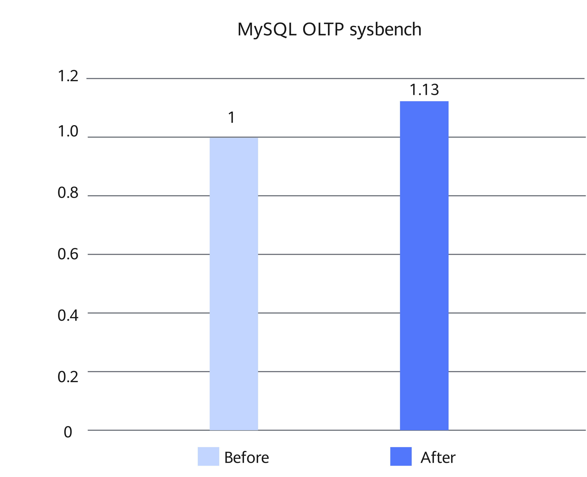

# MySQL Binlog Optimization Feature Guide

## Feature Description<a name="EN-US_TOPIC_0000002518537838"></a>

### Overview<a name="EN-US_TOPIC_0000002518537840"></a>

This document describes how to install and enable the binlog optimization feature on a Kunpeng server.

MySQL's binary log (binlog) records all database data changes (such as INSERT, UPDATE, and DELETE), and is primarily used for data replication and restoration. After the binlog function is enabled, MySQL uses two-phase commit to ensure data consistency between the redo log and binlog, with the binlog acting as the coordinator of transactions. The two-phase commit mechanism makes the binlog a performance bottleneck. Kunpeng BoostKit provides several optimizations to improve system performance. This document uses Percona-Server as an example to describe how to use the binlog optimization feature on a Kunpeng server. Sysbench write-only tests show that the feature can improve the performance of Percona-Server 5.7.44-53 running on a container with 8 vCPU and 16 GB memory by 13%.

### Principles<a name="EN-US_TOPIC_0000002518697750"></a>

The binlog optimization is achieved through pre-allocation, lock splitting, and writeset_history data structure optimization to improve system performance.

**Binlog Pre-Allocation<a name="section479993815484"></a>**

During transaction group commit, the leader thread calls the `write` function in the FLUSH phase to commit the binlog and the `fdatasync` function in the SYNC phase to forcibly flush the binlog to drives. Dynamic growth of binlog files will bring extra metadata overhead (for example, updating binlog file metadata). To address this, the size of binlog files when being created is pre-allocated as `max_binlog_size`. This prevents metadata operations caused by dynamic file size growth during writes, thereby reducing I/O overhead and improving system performance.

**Binlog Lock Splitting<a name="section695124719482"></a>**

During transaction group commit, all followers in the FLUSH, SYNC, and COMMIT phases share the same lock and condition variable (`m_lock_done` and `m_cond_done`). When the leader thread in the COMMIT phase successfully commits transactions, it calls `pthread_cond_broadcast` to wake up all followers in the FLUSH, SYNC, and COMMIT phases. Then, the followers in the FLUSH and SYNC phases call `pthread_cond_wait` to enter the waiting state. Excessive false wakeups increase the system overhead associated with `pthread_cond_wait`/`pthread_cond_broadcast` calls and intensify lock contention. To solve this problem, locks are split so that phase-specific followers wait for different locks, reducing the possibility of false wakeups between different groups.

**Binlog writeset_history Data Structure Optimization<a name="section199911550174819"></a>**

During transaction group commit, the leader thread in the FLUSH phase calls `Writeset_trx_dependency_tracker::get_dependency` to obtain transaction dependencies. The `sequence_number` information of transactions is stored in the `m_writeset_history` variable, which uses the std::map data structure. std::map stores elements in a red-black tree, and its insertion and search time complexity is O(log N). This data structure can be replaced with the hash map, reducing the insertion and search time complexity to O(1) for higher efficiency.

## Environment Requirements<a name="EN-US_TOPIC_0000002518697748"></a>

This document provides guidance based on specific environments. Before performing operations, ensure that your hardware and software meet the requirements.

**Table 1** Hardware requirement<a id="hardware-requirement"></a>

|Item|Specifications|
|--|--|
|CPU|New Kunpeng 920 processor model or Kunpeng 950 processor|

**Table 2** OS and software requirements<a id="os-and-software-requirements"></a>

|Item|Version|How to Obtain|
|--|--|--|
|OS|openEuler 22.03 LTS SP4|[Link](https://repo.huaweicloud.com/openeuler/openEuler-22.03-LTS-SP4/ISO/aarch64/openEuler-22.03-LTS-SP4-everything-aarch64-dvd.iso)|
|Percona|Percona-Server 5.7.44-53|[Link](https://gitcode.com/boostkit/boostdb/releases/download/MySQL-Percona-Server-5.7.44-53-v3/BoostDB-Percona-5.7.44-53.aarch64.rpm)|
|Percona|Percona-Server 8.0.43-34|[Link](https://gitcode.com/boostkit/boostdb/releases/download/MySQL-Percona-Server-8.0.43-34-v2/BoostDB-Percona-8.0.43-34.aarch64.rpm)|

## Feature Installation and Enablement<a name="EN-US_TOPIC_0000002550137589"></a>

The following uses Percona-Server 5.7.44-53 as an example to describe how to install and enable the feature. The procedure is as follows:

1. Install the dependencies as instructed in [Configuring the Compilation Environment](https://www.hikunpeng.com/document/detail/en/kunpengdbs/ecosystemEnable/Percona/kunpengpercona_02_0014.html) in the *Percona Porting Guide*.
2. Download the Percona-Server 5.7.44-53 RPM package described in [**Table 2**](#os-and-software-requirements) and save the package to the target path, for example, `/home`.
3. Run the following command to install the RPM package. The default installation directory is `/usr/local/mysql`.

    ```shell
    cd /home
    rpm -ivh BoostDB-Percona-5.7.44-53.aarch64.rpm
    ```

    > **NOTE:**
    >If dependency packages have been installed but the RPM-related check fails, run the following command to skip the dependency check (using `--nodeps`):
>
    >```shell
    >rpm -ivh BoostDB-Percona-5.7.44-53.aarch64.rpm --nodeps
    >```

4. Start the database. For details, see [Running MySQL](https://www.hikunpeng.com/document/detail/en/kunpengdbs/ecosystemEnable/MySQL/kunpengmysql8017_03_0013.html) in the *MySQL Porting Guide*.
5. (Optional) Perform the sysbench test to compare the performance before and after the binlog optimization feature is enabled. For details about the test procedure, see [Sysbench 0.5 & 1.0 Test Guide](https://www.hikunpeng.com/document/detail/en/kunpengdbs/testguide/tstg/kunpengsysbench_02_0001.html). The binlog optimization feature improves the sysbench write performance by 13%. [**Figure 1**](#performance-comparison) shows the performance before and after the optimization.

    **Figure 1** Performance comparison before and after binlog optimization<a name="fig937192253919"></a><a id="performance-comparison"></a><br>
    

## Troubleshooting<a name="EN-US_TOPIC_0000002550177591"></a>

### "version `GLIBCXX_3.4.29' not found" Is Displayed During MySQL Startup<a name="EN-US_TOPIC_0000002518537836"></a>

**Symptom<a name="en-us_topic_0000002533421305_section642124153116"></a>**

The error message "/usr/local/mysql/bin/mysqld: /usr/local/mysql/bin/mysqld: /usr/lib64/libstdc++.so.6: version `GLIBCXX_3.4.29' not found (required by /usr/local/mysql/bin/mysqld)" is displayed during MySQL startup.

**Key Process and Cause Analysis<a name="en-us_topic_0000002533421305_section145813300553"></a>**

The `libstdc++.so.6` version of the system is too early, and GLIBCXX_3.4.29 is missing.

**Conclusion and Solution<a name="en-us_topic_0000002533421305_section164566494716"></a>**

1. Download GCC 12.3.1 (GCC for openEuler 3.0.3).

    ```shell
    cd /home
    wget https://mirrors.huaweicloud.com/kunpeng/archive/compiler/kunpeng_gcc/gcc-12.3.1-2024.12-aarch64-linux.tar.gz
    ```

2. Decompress the installation package.

    ```shell
    tar zxvf gcc-12.3.1-2024.12-aarch64-linux.tar.gz
    ```

3. Back up `libstdc++.so.6` of the current system and create a symbolic link for a later version of `libstdc++.so.6`.

    ```shell
    mv /usr/lib64/libstdc++.so.6 /usr/lib64/libstdc++.so.6.bak
    ln -s /home/gcc-12.3.1-2024.12-aarch64-linux/lib64/libstdc++.so.6 /usr/lib64/libstdc++.so.6
    ```

4. Check the current library version. If any output is displayed, the requirement is met.

    ```text
    strings /usr/lib64/libstdc++.so.6 | grep GLIBCXX_3.4.29
    ```

5. Restart MySQL.

## Security Check and Hardening<a name="EN-US_TOPIC_0000002550177593"></a>

Address space layout randomization (ASLR) is a security technology against buffer overflow. It randomizes the layout of linear areas such as heap, stack, and shared library mapping to make it difficult for attackers to predict target addresses and directly locate code, thereby preventing overflow attacks.

```shell
echo 2 >/proc/sys/kernel/randomize_va_space
```


