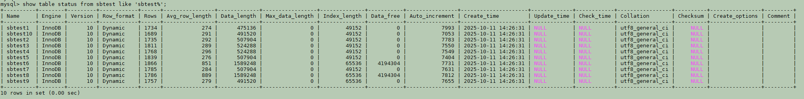
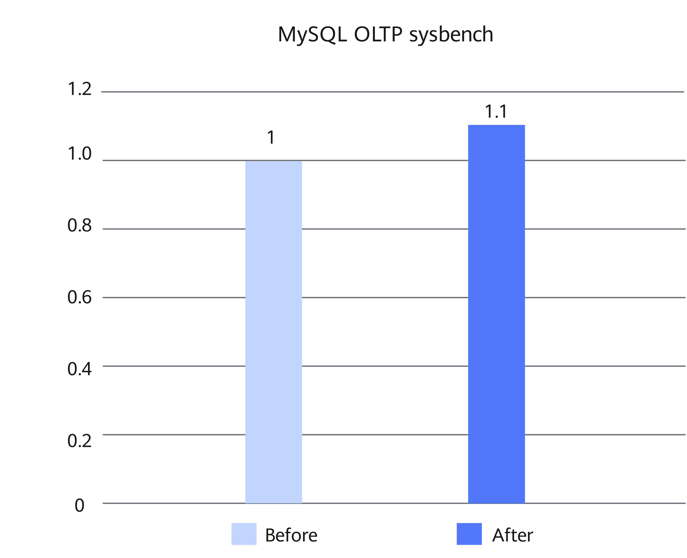
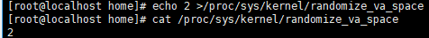

# MySQL Computing Path Optimization Feature Guide

## Feature Description<a name="EN-US_TOPIC_0000002518697734"></a>

### Overview<a name="EN-US_TOPIC_0000002518537818"></a>

This document describes how to install and enable the computing path optimization feature on a Kunpeng server.

In MySQL online transaction processing (OLTP) scenarios, when the sysbench tool is used to perform read-only tests, performance monitoring reveals that the main hotspot functions include record matching-related functions (such as `row_search_mvcc`, `rec_get_offsets_func`, `page_cur_search_with_match`, and `btr_cur_search_to_nth_level`) and character set processing-related functions (such as `my_strnxfrm_unicode`, `my_ismbchar_utf8`, `my_charpos_mb`, `my_hash_sort_utf8`, and `my_lengthsp_8bit`). Kunpeng BoostKit has made multiple optimizations on these hotspot functions, significantly improving the execution efficiency.

In addition, the new Kunpeng 920 processor model supports unaligned memory access. Therefore, the unaligned memory access optimization policies implemented on the x86 architecture can be smoothly migrated to the Arm architecture. This further improves the overall system performance.

With the preceding optimizations, sysbench read-only tests show that the performance of Percona-Server 5.7.44-53 running on a container with 8 vCPU and 16 GB memory can be improved by about 10%.

### Principles<a name="EN-US_TOPIC_0000002550177569"></a>

Computing path optimization includes record matching optimization, Single Instruction Multiple Data (SIMD)-based character set processing optimization, and unaligned memory access optimization.

**Record Matching Optimization<a name="section479993815484"></a>**

For records that use the fixed row format, this optimization replaces field-by-field traversal matching with faster whole-record comparison using `memcmp`.

In the InnoDB storage engine, the original comparison logic relies on the `cmp_dtuple_rec_with_match_low` function to compare data structures dtuple_t (memory record format) against rec_t (page physical record format) field by field. Before the comparison, the `rec_get_offsets` function needs to be called to obtain the field offsets. After the optimization, `memcmp` is used to directly compare the entire record, which reduces the number of comparison operations and avoids the overhead of frequent `rec_get_offsets` calls.

In code, the main adjustments are as follows:

- In the `row_search_mvcc` function, `cmp_dtuple_rec` is replaced with `memcmp`.
- In the `page_cur_search_with_match` function, `rec_get_offsets` and `cmp_dtuple_rec_with_match` calls are replaced with the new byte-level comparison method `rec_direct_memcmp`.

To use `memcmp` for record comparison, the following conditions must be met:

- All fields can be compared using `memcmp`. For details, see the `dtype_is_memcmp_deterministic` function.
- All fields are of fixed length and are defined as non-null.
- All fields are sorted in ascending order.

In addition, InnoDB only caches the record offsets of internal tables. This optimization extends the offset caching mechanism to all indexes that contain fixed-length fields. By reusing the cached offsets, this optimization reduces redundant calculations, thereby improving the overall performance of B-tree search.

**SIMD-based Character Set Processing Optimization<a name="section695124719482"></a>**

This optimization uses SIMD instructions to accelerate the vectorization of utf8/utf8mb4 character set processing, improving the efficiency of related operations.

As utf8/utf8mb4 is a variable-length encoding, the length of a character needs to be calculated or the character needs to be converted to a fixed-length Unicode format (2 bytes) before subsequent processing. ASCII characters (ranging from 0 to 127) are single-byte fixed-length, and their Unicode representation remains the same as the original value (with higher bytes padded with zeros). Therefore, SIMD-based parallel processing can be implemented for these characters to improve the processing throughput.

In code, the following functions are optimized:

- In `my_collation_utf8_general_ci_handler`, `my_strnxfrm_unicode`, `my_hash_sort_utf8`, and `my_hash_sort_utf8mb4` are optimized.
- In `my_charset_utf8_handler`, `my_numchars_mb` and `my_charpos_mb` are optimized.

**Unaligned Memory Access Optimization<a name="section199911550174819"></a>**

Early Arm architecture (such as ARMv5) does not support unaligned memory access. As such, MySQL reads bytes one by one and performs shift and accumulation operations to convert pointers to integers. The x86 architecture supports unaligned memory access. This allows for direct type conversion of pointers. Kunpeng 920 processors support unaligned memory access. Therefore, the corresponding optimization policies on the x86 architecture can be ported to the Arm architecture to directly convert pointers to the integer type, improving the type conversion efficiency.


## Environment Requirements<a name="EN-US_TOPIC_0000002518697732"></a>

This document provides guidance based on specific environments. Before performing operations, ensure that your hardware and software meet the requirements.

**Table 1** Hardware requirement<a id="hardware-requirement"></a>

|Item|Specifications|
|--|--|
|CPU|New Kunpeng 920 processor model or Kunpeng 950 processor|


**Table 2** OS and software requirements<a id="os-and-software-requirements"></a>

|Item|Version|How to Obtain|
|--|--|--|
|OS|openEuler 22.03 LTS SP4|[Link](https://repo.huaweicloud.com/openeuler/openEuler-22.03-LTS-SP4/ISO/aarch64/openEuler-22.03-LTS-SP4-everything-aarch64-dvd.iso)|
|Percona|Percona-Server 5.7.44-53|[Link](https://gitcode.com/boostkit/boostdb/releases/download/MySQL-Percona-Server-5.7.44-53-v3/BoostDB-Percona-5.7.44-53.aarch64.rpm)|
|Percona|Percona-Server 8.0.43-34|[Link](https://gitcode.com/boostkit/boostdb/releases/download/MySQL-Percona-Server-8.0.43-34-v2/BoostDB-Percona-8.0.43-34.aarch64.rpm)|


## Feature Installation and Enablement<a name="EN-US_TOPIC_0000002550177571"></a>

The following uses Percona-Server 5.7.44-53 as an example to describe how to install and enable the computing path optimization feature. The procedure is as follows:

1. Install the dependencies as instructed in [Configuring the Compilation Environment](https://www.hikunpeng.com/document/detail/en/kunpengdbs/ecosystemEnable/Percona/kunpengpercona_02_0014.html) in the *Percona Porting Guide*.
2. Download the Percona-Server 5.7.44-53 RPM package described in [**Table 2**](#os-and-software-requirements) and save the package to the target path, for example, `/home`.
3. Run the following command to install the RPM package. The default installation directory is `/usr/local/mysql`.

    ```
    cd /home
    rpm -ivh BoostDB-Percona-5.7.44-53.aarch64.rpm
    ```

    > **NOTE:**
    >If dependency packages have been installed but the RPM-related check fails, run the following command to skip the dependency check (using `--nodeps`):
    >```
    >rpm -ivh BoostDB-Percona-5.7.44-53.aarch64.rpm --nodeps
    >```

4. For SIMD-based character set processing optimization, add the collation configuration to the MySQL configuration file `/etc/my.cnf`.
    1. Open the `/etc/my.cnf` file.

        ```
        vi /etc/my.cnf
        ```

    2. Press `i` to go to the insert mode.
        - If the character set is `utf8`, add the following configuration to the `[mysqld]` section:

            ```
            character_set_server = utf8
            collation_server = utf8_general_ci
            ```

        - If the character set is `utf8mb4`, add the following configuration to the `[mysqld]` section:

            ```
            character_set_server = utf8mb4
            collation_server = utf8mb4_general_ci
            ```

    3. Press `Esc` to exit the insert mode. Type `:wq!` and press `Enter` to save the file and exit.

5. Start the database. For details, see [Running MySQL](https://www.hikunpeng.com/document/detail/en/kunpengdbs/ecosystemEnable/MySQL/kunpengmysql8017_03_0013.html) in the *MySQL Porting Guide*.
6. For SIMD-based character set processing optimization, query the character set and collation configuration of a database and table. (The following uses the `sbtest` database and the `sbtest1` table in the database as an example.)

    ```
    show create database sbtest;
    SHOW VARIABLES LIKE 'collation_database';
    show create table sbtest1;
    show full columns from sbtest1;
    show table status from sbtest like 'sbtest%';
    ```

    > **NOTE:**
    >For details about how to access the client, see [Running MySQL](https://www.hikunpeng.com/document/detail/en/kunpengdbs/ecosystemEnable/MySQL/kunpengmysql8017_03_0013.html) in the *MySQL Porting Guide*.

    **Figure 1** Querying the character set and collation of the database<a name="fig1447410214484"></a><a id="querying-the-character-set-and-collation-of-the-database"></a><br>
    

    **Figure 2** Querying the character set and collation of the table<a name="fig13338178174811"></a><a id="querying-the-character-set-and-collation-of-the-table"></a><br>
    

    **Figure 3** Obtaining the table information of the database (The `collation` column indicates the collation.)<a name="fig762681216487"></a><a id="obtaining-the-table-information-of-the-database"></a><br>
    

7. (Optional) Perform the sysbench test to compare the performance before and after the computing path optimization feature is enabled. For details about the test procedure, see [Sysbench 0.5 & 1.0 Test Guide](https://www.hikunpeng.com/document/detail/en/kunpengdbs/testguide/tstg/kunpengsysbench_02_0001.html). The computing path optimization feature improves performance by 10% in sysbench read-only scenarios. [**Figure 4**](#performance-comparison) shows the performance before and after the optimization.

    **Figure 4** Performance comparison before and after computing path optimization<a name="fig937192253919"></a><a id="performance-comparison"></a><br>
    

## Troubleshooting<a name="EN-US_TOPIC_0000002550137571"></a>

### "version `GLIBCXX_3.4.29' not found" Is Displayed During MySQL Startup<a name="EN-US_TOPIC_0000002550137567"></a>

**Symptom<a name="section642124153116"></a>**

The error message "/usr/local/mysql/bin/mysqld: /usr/local/mysql/bin/mysqld: /usr/lib64/libstdc++.so.6: version `GLIBCXX_3.4.29' not found (required by /usr/local/mysql/bin/mysqld)" is displayed during MySQL startup.

**Key Process and Cause Analysis<a name="section145813300553"></a>**

The `libstdc++.so.6` version of the system is too early, and GLIBCXX_3.4.29 is missing.

**Conclusion and Solution<a name="section164566494716"></a>**

1. Download GCC 12.3.1 (GCC for openEuler 3.0.3).

    ```
    cd /home
    wget https://mirrors.huaweicloud.com/kunpeng/archive/compiler/kunpeng_gcc/gcc-12.3.1-2024.12-aarch64-linux.tar.gz
    ```

2. Decompress the installation package.

    ```
    tar zxvf gcc-12.3.1-2024.12-aarch64-linux.tar.gz
    ```

3. Back up `libstdc++.so.6` of the current system and create a symbolic link for a later version of `libstdc++.so.6`.

    ```
    mv /usr/lib64/libstdc++.so.6 /usr/lib64/libstdc++.so.6.bak
    ln -s /home/gcc-12.3.1-2024.12-aarch64-linux/lib64/libstdc++.so.6 /usr/lib64/libstdc++.so.6
    ```

4. Check the current library version. If any output is displayed, the requirement is met.

    ```
    strings /usr/lib64/libstdc++.so.6 | grep GLIBCXX_3.4.29
    ```

5. Restart MySQL.


## Security Check and Hardening<a name="EN-US_TOPIC_0000002518537816"></a>

Address space layout randomization (ASLR) is a security technology against buffer overflow. It randomizes the layout of linear areas such as heap, stack, and shared library mapping to make it difficult for attackers to predict target addresses and directly locate code, thereby preventing overflow attacks.

```
echo 2 >/proc/sys/kernel/randomize_va_space
```


