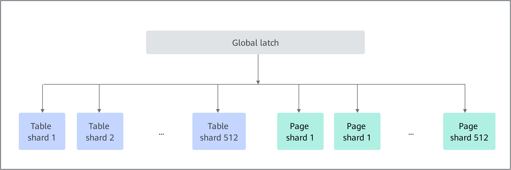
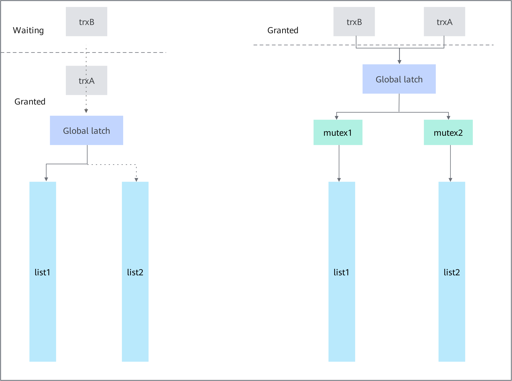
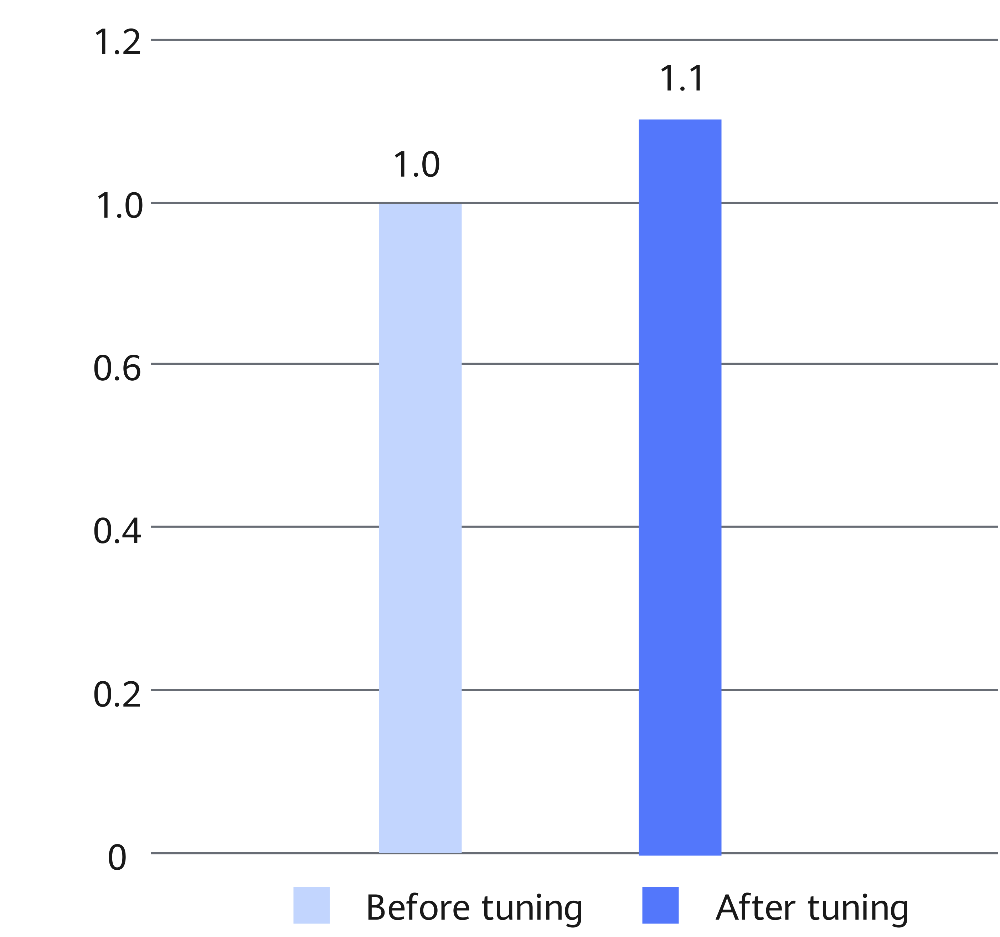

# MySQL Fine-Grained Lock Tuning Feature Guide

## Principles<a name="EN-US_TOPIC_0000002550144937"></a>

In MySQL online transaction processing (OLTP) applications, a large number of data manipulation language (DML) statements (INSERT, UPDATE, and DELETE) are concurrently executed on the key data structures in the lock_sys->mutex global lock, causing severe lock contention and performance deterioration. To solve this problem, Kunpeng BoostKit provides fine-grained hash bucket locks to replace the global lock, which reduces lock conflicts and improves concurrency.

Each table or row in the MySQL database can be considered as a resource, and a transaction can request access to resources. However, concurrent transactions may cause a conflict of access to resources. The Lock-sys is designed to orchestrate access to tables and rows.

The Lock-sys maintains a separate queue for each resource. When a request for a resource is initiated, the Lock-sys queries whether the resource is occupied in the corresponding queue. No matter whether the requested resource is occupied, the Lock-sys inserts a lock request into the corresponding queue and marks the lock request as WAITING or GRANTED. To support concurrent operations, the queue needs to be locked during query and insertion.

In a database, the concepts of lock and latch are different.

- A lock is used to lock database objects, such as tables and rows.
- A latch is used to protect the memory data structure.

Access to all queues is managed by a latch. This means that even if only one queue is accessed, all other queues are locked. This implementation mode is inefficient in high-concurrency scenarios. To solve this problem, a fine-grained latch is introduced.

The queues are divided into a fixed number of shards based on the original global latch. Each shard is protected by its own mutex. To efficiently latch all shards, the global latch in the new feature is designed as a read/write latch. Before a queue is accessed, the shared global latch and then the mutex of the corresponding shard must be obtained. This implementation is similar to the process for accessing a MySQL database record, where an intent lock is added to the table and then the record is locked. In certain special scenarios where all queues need to be latched, only the exclusive global latch needs to be obtained. The general idea is that one or two Lock-sys queues are involved in most operations and are independent of other queues. The following figure shows the relationship between the global latch and its managed objects.



The following figure shows how the new latching mode improves efficiency. The left part illustrates the access without lock optimization. If transaction A and transaction B need to access queue 1 and queue 2 respectively, transaction B will be blocked because both transactions need to latch the global latch. With the new feature (as indicated by the right part of the figure), transaction A and transaction B can request the shared global latch, and then request mutex 1 and mutex 2 respectively. That is, transaction A and transaction B can be performed at the same time, which improves the concurrency.



Accessing two queues to obtain two records involves the following steps:

1. S-latch the global latch.
2. Identify the two pages to which the records belong.
3. Identify the two hash buckets which contain the queues for the given pages.
4. Identify the IDs of the shards which contain these two buckets.
5. Latch mutexes for the two shards in the order of their addresses.

All of the preceding steps (except step 2, as we usually know the page already) are accomplished by using the following code:

```
locksys::Shard_latches_guard guard{*block_a, *block_b};
```

For the "stop the world" operation, x-latch the global latch by using the following code:

```
locksys::Exclusive_global_latch_guard guard{};
```

To use friend guard classes, like Shard_latches_guard, this class does not expose too many public functions.


## Code Implementation<a name="EN-US_TOPIC_0000002518705092"></a>

- **Changes in latch guards:**

    The following table lists the classes added by this optimization feature. When Exclusive_global_latch_guard is used only for rare events such as deadlock parsing, Shard_latch_guard, Shard_latches_guard, and Exclusive_global_latch_guard can handle most cases. However, there are special cases in our code that require other finer-grained tools.

|**Class**|**Description**|
|--|--|
|Shard_latch_guard|S-latches the global latch and latches the shard mutex for its lifetime.|
|Shard_latches_guard|S-latches the global latch and latches two shard mutexes in correct order for its lifetime.|
|Exclusive_global_latch_guard|X-latches the global latch for its lifetime.|
|Shared_global_latch_guard|S-latches only the global latch, but not any of shards. This will allow the class to latch shards individually when iterating over a list of transaction locks in an efficient way during the transaction lock release phase.|
|Naked_shard_latch_guard|Latches only a shard, but not the global latch. This class is used in combination with Shared_global_latch_guard.|
|Try_exclusive_global_latch|Tries to x-latch the global latch for its lifetime. This class is the only use case in the srv_printf_innodb_monitor() function, and the class tries to avoid interfering with workload when the function reports InnoDB monitor output.|
|Unsafe_global_latch_manipulator|Manually latches and unlatches the exclusive global latch on demand in a non-structured way. This class is required in the following code implementation path: srv_printf_innodb_monitor() => srv_printf_locks_and_transactions() => lock_print_info_all_transactions() => lock_trx_print_locks() => lock_rec_fetch_page()|


- **Changes in trx->mutex:**

    Interaction between Lock-sys and trx->mutex-es is rather complicated. In particular, we allow a thread performing Lock-sys operations to request another trx->mutex even though it already holds one for a different trx. Therefore, one has to prove that it is impossible to form a deadlock cycle in the hypothesized wait graph in which edges go from a thread trying to obtain trx->mutex to a thread which holds it at the moment.

    In the past it was simple, because Lock-sys was protected by a global mutex, which meant that there was at most one thread which could try to possess more than one trx->mutex. Therefore, a cycle cannot be formed in a graph in which only one node has both incoming and outgoing edges.

    As long as multiple threads happen in different shards, these threads can perform Lock-sys operations in parallel. Therefore, Lock-sys mutex can be split.

- **Changes in dict_table_t::autoinc_trx:**

    This field is used to store the pointer to trx which currently holds an AUTO_INC lock. There can be at most one such transaction, as these locks are mutually exclusive. This field is "peeked at" by row_lock_table_autoinc_for_mysql() to see if the current transaction already has an AUTO_INC granted, in which case it can follow a fast path. Such checks are done without any latch. This requires changing the type to atomic<>, but is otherwise correct, as the result of such comparison is guaranteed to be meaningful, given that we only change the value of this field during granting and releasing, and releasing cannot happen concurrently with the thread running the transaction. However, some comments around this code, assertions, and the type of the field have to be modified, to better explain why and how all this works.

- **Changes in dict_table_t::n_rec_locks:**

    This field counts how many record locks (granted or waiting) are currently associated with the given table. As such locks can be created and destroyed in parallel now as long as they are in different shards, this field needs to become atomic<>, and transactions should acquire an exclusive global latch to read the value of this field. Otherwise, the value can get modified before we act on the result. Here again we need to update some comments.

- **Changes in hit list:**

    For high-priority transactions, we have a mechanism which tries to abort conflicting transactions of lower priority to avoid waiting on record locks. The procedure of identifying and aborting conflicting transactions will require the exclusive global latch, because (among other reasons) it may require accessing an unrelated Lock-sys queue in which the blocking transactions are waiting themselves. To avoid taking this exclusive global latch in the probable case of our high-priority transaction not being in the waiting state at all, we need a reliable, thread-safe way of checking if the transaction is waiting. Whether this can be simply done using "hp_trx->lock.que_state == TRX_QUE_LOCK_WAIT" is to be determined.

    Some places in code seem to modify this field without any latch, which looks unsafe. Alternative, a correct approach, would be to use "hp_trx->lock.blocking_trx.load() != nullptr" instead, which requires only a minor change in comments, to clarify that it is important to clear this field when wait finishes (it has been done in trunk, but comments leave some doubt). Fixing que_state is out of scope of this feature.

- **Changes in lock_release():**

    Releasing all locks of the transaction requires iterating over its locks and for each of them performing some actions in respective lock queue. Simple, but inefficient, way of doing it is to acquire an exclusive global latch.

    It is much better for parallelism, to instead acquire just a shared global latch, and then latch one by one only the shards containing particular locks as we iterate. The difficulty with this approach is that the latching order rule requires acquiring Lock-sys latches before trx latches, and trx->mutex protects the list of transaction locks. In particular, this rule prevents concurrent B-tree modifications causing relocation of locks between pages (and thus shards). So, there is a chicken-and-egg problem: We want to know which shard to latch, for which we need to know what is the next lock. However, to iterate over the list, we need trx->latch, which we can only take after latching the shard. To overcome this, we will first latch trx->mutex, note down the shard ID of the last lock in the list, release trx->mutex, latch the particular shard, and latch trx->mutex again. Make sure that the lock is still at the tail of the list, and only then proceed. This might seem complicated, but is actually much faster than the "stop the world" approach.

- **Changes in lock_trx_release_read_locks():**

    The lock_trx_release_read_locks() function is mostly used in group replication appliers to release read gap locks. In testing, it turned out to be a bottleneck if the exclusive global latch is used to iterate over transaction locks. Similar to the lock_release() function, we should instead acquire a shared global latch, and latch shards one by one when we iterate. The problem is that other threads can modify the lock list concurrently (for example, because of implicit-to-explicit conversion, or B-tree reorganization), and we cannot simply compare the current lock with the tail because we are not removing all locks, but a subset of them. Therefore, the trick with operating only at the tail of the list is insufficient. To notice such situations (and restart iteration), we will introduce "uint64_t trx->lock.trx_locks_version", which is incremented each time a lock is added to or removed from the trx lock list. After several failed restarts, we can switch back to the old lock_trx_release_read_locks_in_x_mode().

- **Other changes:**
    - Separate the whole latching logic to the dedicated class locksys::Latches and document extensively the design in its header.

    - All new functions will be in the locksys namespace.

    - All usages of lock_mutex_enter()/lock_mutex_exit() will be replaced with appropriate latch guards, preferably locksys::Shard_latch_guard.

    - table->n_rec_locks must become atomic, because it can now be incremented or decremented in parallel during creation or destruction of record locks for given tables.

    - `dict/mem.cc` does not really need to include `lock0lock.h` when compiled for UNIV_LIBRARY.

    - Remove lock_mutex from PSI.

    - Add lock_sys_global_latch_rw_lock to PSI.

    - Add lock_sys_page_mutex to PSI.

    - Add lock_sys_table_mutex to PSI.

    - All places where we use the exclusive global latch will be documented to specify the remaining reasons we have to resort to such strong synchronization.
    - The `table->autoinc_trx` field should be atomic as it is "peeked" without any latch, and confusing or wrong comments and assertions around it have to be cleaned up, to clarify why it is correct.
    - lock_rec_expl_exist_on_page() should return a "bool" instead of a potentially dangling pointer to a "lock_t".
    - lock_print_info_summary and the logic inside srv_printf_innodb_monitor() in general need at least some small refactoring so that the latch guards can be used.
    - The lock_mutex_own() debug predicate would have to be replaced with more specific owns_exclusive_global_latch(), owns_shared_global_latch(), owners_page_shard(page), owners_page_shard(table), and so on.
    - bool Sharded_rw_lock::try_x_lock needs to be implemented.
    - The control flow of lock_rec_insert_check_and_lock() (and its copy lock_prdt_insert_check_and_lock) can be simplified by removing code duplication, before we can use latch guards.
    - The code around lock_rec_queue_validate() could be simplified by removing code duplication, and using more structured latching.
    - Update sync0debug so it has proper rules for latching order.


## Usage Description<a name="EN-US_TOPIC_0000002518545196"></a>

Fix vulnerabilities as soon as possible based on the Common Vulnerabilities and Exposures (CVE) of MySQL 8.0.20 on the [MySQL official website](https://www.mysql.com/).

**Release Description<a name="section1167448114718"></a>**

This feature is released with Kunpeng Computing DC Solution 20.0.3.

**Application Scenarios<a name="section1223118489461"></a>**

When there are many write operations (such as update, insert, and delete) in the OLTP workload, the global latch in the MySQL database may be the main factor that affects the throughput. If the Performance Schema shows that there is contention on `lock_mutex` while the CPU usage is low, this feature can be used to alleviate the contention and improve the system throughput.

The MySQL fine-grained lock tuning feature takes effect immediately after the patch is installed and the MySQL database is recompiled. You do not need to configure system variables.

**Compilation and Installation Method<a name="section14445125111461"></a>**

The MySQL fine-grained lock tuning feature is provided as a patch file. This patch is developed based on MySQL 8.0.20 and is open-sourced in the Gitee community. Before using this feature, apply the patch to the MySQL source code, and then compile and install MySQL. The detailed procedure is as follows:

1. Download the [MySQL 8.0.20 source code](https://downloads.mysql.com/archives/get/p/23/file/mysql-boost-8.0.20.tar.gz), upload it to the `/home` directory on the server and decompress it, and then go to the root directory of the MySQL source code.

    ```
    cd /home
    tar -zxvf mysql-boost-8.0.20.tar.gz
    cd mysql-8.0.20
    ```

2. Download the [MySQL fine-grained lock tuning patch](https://gitcode.com/boostkit/mysql/blob/MySQL-8.0.20/boostdb-patches/0001-SHARDED-LOCK-SYS.patch) and upload it to the root directory of the MySQL source code.
3. Decompress the source package and go to the MySQL source code directory.

    ```
    tar -zxvf mysql-boost-8.0.20.tar.gz
    cd mysql-8.0.20
    ```

4. In the root directory of the source code, run the `git init` command to create Git management information.

    ```
    git init
    git add -A
    git commit -m "Initial commit"
    ```

    > **NOTE:**
    >-   Generally, Git is provided by the system. If not, configure the Yum repository by following instructions in [MySQL Porting Guide](https://www.hikunpeng.com/document/detail/en/kunpengdbs/ecosystemEnable/MySQL/kunpengmysql8017_02_0001.html) and then install Git.
    >    ```
    >    yum install git
    >    ```
    >-   If the Git commit user information is not configured, configure the user email and user name before running the `git commit` command.
    >    ```
    >    git config user.email "123@example.com"
    >    git config user.name "123"
    >    ```

5. (Optional) If the Yum repository is not configured, configure it. For details, see [Configuring the Yum Repository](https://www.hikunpeng.com/document/detail/en/kunpengdbs/ecosystemEnable/MySQL/kunpengmysql8017_02_0013.html).
6. (Optional) If dos2unix is not installed, run the following command to install it:

    ```
    yum install dos2unix
    ```

7. Apply the MySQL fine-grained lock tuning patch.

    ```
    dos2unix 0001-SHARDED-LOCK-SYS.patch
    git apply --check 0001-SHARDED-LOCK-SYS.patch
    git apply --whitespace=nowarn 0001-SHARDED-LOCK-SYS.patch
    ```

    If no error information is displayed, the patch is successfully applied.

8. Compile and install the MySQL source code. For details, see [MySQL Porting Guide](https://www.hikunpeng.com/document/detail/en/kunpengdbs/ecosystemEnable/MySQL/kunpengmysql8017_02_0001.html).
9. (Optional) Perform a TPC-C test to obtain the performance improvement data after the MySQL fine-grained lock tuning feature is used. For details about the test procedure, see [BenchmarkSQL Test Guide](https://www.hikunpeng.com/document/detail/en/kunpengdbs/testguide/tstg/kunpengbenchmarksql_06_0001.html).

    This feature improves the comprehensive TPC-C performance by 10%.

    **Figure 1** Performance comparison before and after MySQL fine-grained lock tuning is used<a name="fig20903163123514"></a><a id="performance-comparison"></a><br>
    


## Change History<a name="EN-US_TOPIC_0000002550184931"></a>

|Date|Description|
|--|--|
|2023-07-25|This issue is the second official release. Updated the commands for applying the patch of the MySQL fine-grained lock tuning feature in section "Usage Description".|
|2020-07-13|This issue is the first official release.|
