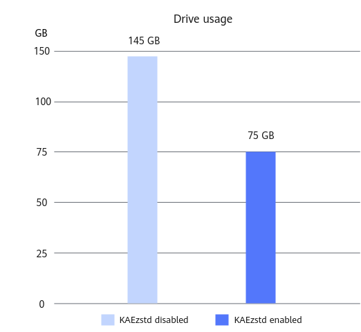
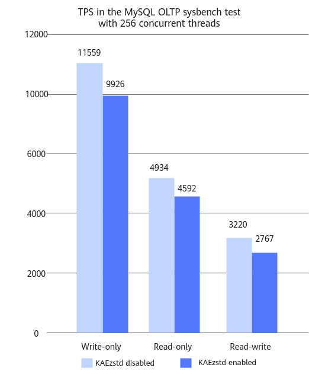

# MySQL KAEzstd Page Compression and Decompression Optimization Feature Guide

## Introduction<a name="EN-US_TOPIC_0000002092944173"></a>

This document describes how to integrate the patch package of the MySQL KAEzstd page compression and decompression optimization feature into MySQL, and install and enable KAEzstd on a Kunpeng server running the openEuler operating system \(OS\).

MySQL is a relational database management system \(RDBMS\) developed by the Swedish company MySQL AB. It is a popular RDBMS in the industry, especially in web applications. Relational databases deliver high efficiency and flexibility because data is stored in different tables instead of in a large data warehouse. MySQL is optimal for small- and medium-sized websites thanks to its small size, fast speed, low cost, and especially the open source code. It uses the Structured Query Language \(SQL\), the most common standard language for accessing databases. Adopting dual-licensing distribution, MySQL is available in community and commercial editions. For more information, visit  [MySQL official website](https://www.mysql.com/).

KAEzstd is the compression module of Kunpeng Accelerator Engine \(KAE\). It uses the Kunpeng hardware acceleration module to implement the lz77\_zstd algorithm and provides the standard zstd library interface. KAE can improve application performance in different scenarios and significantly enhances compression efficiency. For more information, see  [Kunpeng Accelerator Engine Development Guide \(KAEzip\)](https://support.huawei.com/enterprise/en/doc/EDOC1100433049).

MySQL transparent page compression is a data compression technology provided by the MySQL InnoDB storage engine. It can compress data at the page level to save drive space. This technology is employed by the MySQL KAEzstd page compression and decompression optimization feature, which uses KAEzstd of KAE to compress data pages, reducing drive usage. For example, in sysbench tests, 64 10-million-row tables are used to test the feature. After the MySQL KAEzstd page compression and decompression optimization solution is applied, the drive usage is reduced by about half. In addition, the transactions per second \(TPS\) deteriorate by no more than 15% in high-concurrency and heavy-load scenarios.

This document describes how to integrate the patch package of the MySQL KAEzstd page compression and decompression optimization feature into MySQL, and install and enable KAEzstd on a Kunpeng server running the openEuler operating system \(OS\).

## Environment Requirements<a name="EN-US_TOPIC_0000002056943832"></a>

This section provides guidance based on the Kunpeng server and openEuler OS. Before performing operations, ensure that your software and hardware meet the requirements.

**Hardware Requirements<a name="section155601083715"></a>**

[Table 1](#table1683114183710)  lists the hardware requirements.

**Table  1**  Hardware requirements<a id="table1683114183710"></a>

|Item|Specifications|
|--|--|
|Server|Kunpeng server|
|CPU|New Kunpeng 920 processor model|
|Drive|A performance test requires at least one system drive and one data drive. Use an SSD or NVMe drive as the data drive for higher performance.Otherwise, create a data directory on the system drive.Configure the number of drives based on actual requirements.|

**OS and Software Requirements<a name="section8546756417"></a>**

[Table 2](#table9419183614416)  lists the OS and software requirements.

**Table  2**  OS and software requirements<a id="table9419183614416"></a>

|Item|Version|Download URL|
|--|--|--|
|OS|openEuler 22.03 LTS SP4 for Arm|<https://repo.huaweicloud.com/openeuler/openEuler-22.03-LTS-SP4/ISO/aarch64/openEuler-22.03-LTS-SP4-everything-aarch64-dvd.iso>|
|MySQL|8.0.25|<https://cdn.mysql.com/archives/mysql-8.0/mysql-boost-8.0.25.tar.gz>|
|KAE|KAE 2.0|<https://gitee.com/kunpengcompute/KAE/tree/kae2/>|
|0001-zstd-for-page-compress.patch|-|<https://gitee.com/kunpengcompute/mysql-server/releases/download/KunpengBoostKit240.RC4.TPC_WITH_ZSTD/0001-support-transparent-page-compression-for-zstd.patch>|

This section provides guidance based on the Kunpeng server and openEuler OS. Before performing operations, ensure that your software and hardware meet the requirements.

## Installing MySQL and Integrating the Patch Package<a name="EN-US_TOPIC_0000002056785492"></a>

Obtain the MySQL source code, integrate the patch package of the MySQL KAEzstd page compression and decompression optimization feature into MySQL, configure compilation parameters, and compile and install MySQL.

1. Obtain the MySQL source code.

    Download URL is listed in  [Table 2](#table9419183614416).

2. Decompress the MySQL source package and go to the source code directory.

    ```shell
    tar -xzvf mysql-boost-8.0.25.tar.gz
    cd mysql-8.0.25
    ```

3. Download the MySQL KAEzstd page compression and decompression optimization feature patch package and save it to any directory on the server, for example,  **/home**.

    Download URL is listed in  [Table 2](#table9419183614416).

4. In the root directory of the MySQL source code, use the  **git**  command to create management information.

    ```shell
    git init
    git add -A
    git commit -m "Initial commit"
    ```

5. Integrate the MySQL KAEzstd page compression and decompression optimization feature patch package.

    ```shell
    dos2unix /home/0001-zstd-for-page-compress.patch
    git apply --check -p1 < /home/0001-zstd-for-page-compress.patch
    git apply  --whitespace=nowarn -p1 < /home/0001-zstd-for-page-compress.patch
    ```

    If no error is reported in the command output, the patch package has been successfully applied.

6. Compile and install MySQL.

    Follow instructions in  [MySQL Porting Guide](https://www.hikunpeng.com/document/detail/en/kunpengdbs/ecosystemEnable/MySQL/kunpengmysql8017_02_0003.html)  to compile and install MySQL. During the operation, add the  **-DWITH\_ZSTD=system**  parameter to the following commands from the section  [Compiling and Installing MySQL](https://www.hikunpeng.com/document/detail/en/kunpengdbs/ecosystemEnable/MySQL/kunpengmysql8017_02_0008.html).

    ```shell
    cd build
    cmake .. -DBUILD_CONFIG=mysql_release -DCMAKE_INSTALL_PREFIX=/usr/local/mysql -DMYSQL_DATADIR=/data/mysql/data -DWITH_BOOST=/home/mysql-8.0.25/boost/boost_1_73_0
    ```

    That is, change the preceding commands as follows:

    ```shell
    cd build
    cmake .. -DBUILD_CONFIG=mysql_release -DWITH_ZSTD=system -DCMAKE_INSTALL_PREFIX=/usr/local/mysql -DMYSQL_DATADIR=/data/mysql/data -DWITH_BOOST=/home/mysql-8.0.25/boost/boost_1_73_0
    ```

    > **NOTE:** 
    >If "Cannot find system zstd libraries" is displayed after you run the  **cmake**  command, see  [The zstd Library Cannot Be Found During the Integration of the MySQL KAEzstd Page Compression and Decompression Optimization Patch Package](#EN-US_TOPIC_0000002133806097).

    Follow the subsequent steps in the  _MySQL Porting Guide_  to finish the compilation and installation.

Obtain the MySQL source code, integrate the patch package of the MySQL KAEzstd page compression and decompression optimization feature into MySQL, configure compilation parameters, and compile and install MySQL.

## Installing and Enabling KAEzstd<a name="EN-US_TOPIC_0000002092944181"></a>

Install, enable, and verify KAEzstd in MySQL, and use sysbench to assess the storage performance optimization effect before and after KAEzstd is enabled.

1. Install KAEzstd. Follow instructions in  [Kunpeng Accelerator Engine Developer Guide \(KAEzip\)](https://support.huawei.com/enterprise/en/doc/EDOC1100433049). Before installing KAEzstd, prepare for the installation such as preparing the installation environment and obtaining the KAE license.
2. Enable KAEzstd.
    1. Configure the environment variable  **LD\_LIBRARY\_PATH**  so that the MySQL database can find and use the KAEzstd library during running.

        ```shell
        export LD_LIBRARY_PATH=/usr/local/kaezstd/lib:$LD_LIBRARY_PATH
        ```

    2. Configure environment variables to modify the compression level and window length.

        The  **KAE\_ZSTD\_COMP\_TYPE**  parameter sets the compression level. Its value can be  **8**  or  **9**. The default value is  **8**.

        ```shell
        export KAE_ZSTD_COMP_TYPE=9
        ```

        The  **KAE\_ZSTD\_WINTYPE**  parameter sets the window length. Its value can be  **4**,  **8**,  **16**, or  **32**. The default value is  **32**.

        ```shell
        export KAE_ZSTD_WINTYPE=8
        ```

3. Check whether KAEzstd is in use.

    Monitor the number of instance queues.

    ```shell
    watch -n 0.2 cat /sys/class/uacce/hisi_zip*/available_instances
    ```

    If the number of instance queues decreases, KAEzstd is enabled successfully.

4. Perform the sysbench test to obtain data about the saved storage space and the TPS deterioration before and after the MySQL KAEzstd page compression and decompression optimization feature is applied. For details about the test procedures, see  [sysbench 0.5 & 1.0 Test Guide](https://www.hikunpeng.com/document/detail/en/kunpengdbs/testguide/tstg/kunpengsysbench_02_0001.html).

    > **NOTICE:** 
    >When sysbench is used to import data, add the following command to the table creation statement in the sysbench script  **oltp\_common.lua**:
>
    >```shell
    >COMPRESSION = 'zstd'
    >```

    After KAEzstd is enabled for MySQL transparent page compression, the drive space can be reduced by about half, as shown in  [Figure 1](#fig17358537141717).

    **Figure  1**  Drive space usage before and after KAEzstd is enabled<a name="fig17358537141717"></a>  
    

    In addition, after KAEzstd is enabled for MySQL transparent page compression, the TPS deterioration does not exceed 15%, as shown in  [Figure 2](#fig197530542544).

    **Figure  2**  TPS values before and after KAEzstd is enabled<a name="fig197530542544"></a>  
    

Install, enable, and verify KAEzstd in MySQL, and use sysbench to assess the storage performance optimization effect before and after KAEzstd is enabled.

## Troubleshooting<a name="EN-US_TOPIC_0000002133846477"></a>

### The zstd Library Cannot Be Found During the Integration of the MySQL KAEzstd Page Compression and Decompression Optimization Patch Package<a id="EN-US_TOPIC_0000002133806097"></a>

**Symptom<a name="section99584372123"></a>**

During the integration of the MySQL KAEzstd page compression and decompression optimization patch package, the message "Cannot find system zstd libraries" is displayed.

**Key Process and Cause Analysis<a name="section16784917181413"></a>**

The zstd-devel dependency is not installed during MySQL installation.

**Conclusion and Solution<a name="section199982525918"></a>**

1. Install the zstd-devel dependency.

    ```shell
    yum install zstd-devel
    ```

2. Run the  **cmake**  command again.

    ```shell
    cmake .. -DBUILD_CONFIG=mysql_release -DWITH_ZSTD=system -DCMAKE_INSTALL_PREFIX=/usr/local/mysql -DMYSQL_DATADIR=/data/mysql/data -DWITH_BOOST=/home/mysql-8.0.25/boost/boost_1_73_0
    ```
