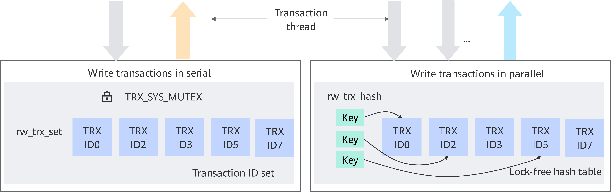
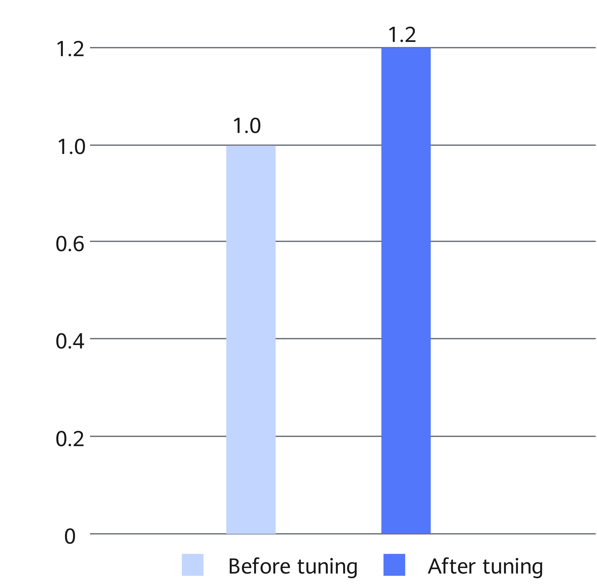

# MySQL Lock-Free Tuning Feature Guide

## Principles<a name="EN-US_TOPIC_0000002518545282"></a>

In MySQL OLTP applications, a large number of DML statements (Insert, Update, and Delete) are concurrently executed on key data structures in the Trx_sys global structure, causing resource contention and synchronization bottlenecks in the critical region. To solve this problem, Kunpeng BoostKit reconstructs the MySQL transaction manager. As shown in [**Figure 1**](#principles-of-the-mysql-lock-free-tuning-feature), a lock-free hash table is used to maintain transaction units. In read/write scenarios, the synchronous lock mechanism is used to implement transaction isolation levels and multi-version concurrency control (MVCC), reducing lock conflicts and improving concurrency.

**Figure 1** Principles of the MySQL lock-free tuning feature<a name="fig1889142703912"></a><a id="principles-of-the-mysql-lock-free-tuning-feature"></a><br>


The MySQL transaction manager uses data structures, such as linked lists and arrays, to maintain global transaction records. Trx-sys is a global instance in MySQL. It maintains transaction system information, like the following transaction instance containers:

- rw_trx_list: a linked list of read-write transaction instances.
- mysql_trx_list: a linked list of all user transaction instances.
- rw_trx_ids: an array of read-write transaction IDs for quick copy of snapshots. It is implemented by using std::vector.
- rw_trx_set: mapping from transaction IDs to transaction instances. It is used to quickly locate a transaction instance based on a trx_id and is implemented by using std::set.

These containers, however, are not thread-safe. Sometimes, multiple data objects (including these containers and other data) in Trx-sys need to be synchronized. In the original code, Trx-sys->mutex is used to achieve this purpose. For example, to set a transaction as a read-write transaction through trx_set_rw_mode, the code is as follows:


In a high-concurrency write scenario, a large number of read/write transaction operations exist in the system, and the contention for Trx-sys->mutex becomes a throughput bottleneck.

Among the operations in the critical region protected by Trx-sys->mutex, two time-consuming operations are identified through profiling: rw_trx_set.insert and rw_trx_set.erase. rw_trx_set is std::set. The underlying implementation is usually a balance tree of a certain type. The comment in the original code indicates that the original author has tried std::unordered_set. As indicated by the test results, std::unordered_set has no performance advantage here.

In this feature, the lock-free hash rw_trx_hash is used to replace the function of rw_trx_set to reduce the time consumed in the critical region of Trx-sys->mutex and relieve the contention for Trx-sys->mutex, thereby improving system throughput. MySQL has used lock-free hash in performance schema and MDL. The original code has LF_HASH implementation and can be reused. Although thread security is ensured for rw_trx_hash access, the rw_trx_hash and data objects in the critical region are not synchronized because related operations have been moved out of the critical region. The logic must be correct during code implementation.


## Code Implementation<a name="EN-US_TOPIC_0000002518705186"></a>

[**Table 1**](#new-classes) lists the new classes of the MySQL lock-free tuning feature.

**Table 1** New classes<a id="new-classes"></a>

|Class|Description|
|--|--|
|rw_trx_hash_t|Lock-free hash container, which encapsulates the MySQL LF_HASH.|
|rw_trx_hash_element_t|Elements of rw_trx_hash_t.|


**Changes in trx_lists_init_at_db_start:** During the database startup process, the TrxIdSet whose life cycle is trx_lists_init_at_db_start is used to implement the original global TrxIdSet function. In "Resurrect transactions that were doing updates" of trx_resurrect, trxid is used to locate the transaction instance, which prevents repeated creation of trx instances.

**Changes in trx_reference:** Atomic operations are used to replace the original mutex protection.

**Changes in trx_erase_lists:** The rw_trx_set.erase operation is removed from the trx_sys->mutex critical region.

**Changes in trx_release_impl_and_expl_locks:**

- trx_sys->rw_trx_hash.erase is added outside the critical region of trx_sys->mutex to replace rw_trx_set.erase in trx_erase_lists.
- To ensure that rw_trx_hash contains only transactions in the PREPARED or ACTIVE state, trx->state = TRX_STATE_COMMITTED_IN_MEMORY in trx_release_impl_and_expl_locks is moved out of the critical region of trx_sys->mutex.
- The original code contains the following comment:

    

    As trx->state = TRX_STATE_COMMITTED_IN_MEMORY has been moved out of the critical region of trx_sys->mutex, method (1) does not work anymore. As a result, the lock_rec_convert_impl_to_expl of method (1) may see that trx has been moved out of rw_trx_hash, but the state has not been TRX_STATE_COMMITTED_IN_MEMORY. In this case, the correctness of the lock_rec_convert_impl_to_expl is ensured as follows:

    1. In the context of lock_rec_convert_impl_to_expl, trx does not exist in rw_trx_hash, which is equivalent to !trx_rw_is_active() of the original logic.
    2. lock_rec_convert_impl_to_expl uses lock_rec_convert_impl_to_expl_for_trx to determine the transaction status again, that is, "deciding for the final time if we really want to create explicit lock on behalf of implicit lock holder" in the comment.

**Changes in trx_rw_is_active and trx_rw_is_active_low:** The two interfaces are deleted and replaced by rw_trx_hash.find.

**Changes in trx_get_rw_trx_by_id:** This interface is deleted and replaced by rw_trx_hash.find.

**Changes in trx_assert_recovered:** This interface is deleted because it is not used.

**Changes in trx_sys_rw_trx_add:** This interface is deleted because it has incorrect semantics.  rw_trx_hash.insert is used instead.

**Changes in rec_queue_validate_latched:** Due to the changes in trx_release_impl_and_expl_locks, a method similar to lock_rec_convert_impl_to_expl_for_trx is used to determine the transaction state.


## Usage Description<a name="EN-US_TOPIC_0000002550185029"></a>

Fix vulnerabilities as soon as possible based on the Common Vulnerabilities and Exposures (CVE) of MySQL 8.0.20 on the official website.

**Release Description<a name="section672118517482"></a>**

This feature is released with Kunpeng Computing DC Solution 20.0.3.

**Application Scenarios<a name="section8748937134614"></a>**

When there are many write operations (such as update, insert, and delete) in the MySQL OLTP scenario, the global latch in the MySQL database may be the main factor that affects the throughput. After the [MySQL fine-grained lock tuning feature](https://www.hikunpeng.com/document/detail/en/kunpengdbs/appAccelFeatures/fglocktf/kunpengdbsmysqlfglock_20_0001.html) is applied, if the Performance Schema shows that there is contention on trx_sys_mutex while the CPU usage is low, this feature can be used to alleviate the contention and improve the system throughput.

The MySQL lock-free tuning feature takes effect immediately after the patch is installed and the MySQL database is recompiled. You do not need to configure system variables.

**Compilation and Installation Method<a name="section496843417465"></a>**

The MySQL lock-free tuning feature is provided as a patch file. This patch is developed based on MySQL 8.0.20 and is open-sourced in the Gitee community. Before using this feature, apply the patch to the MySQL source code, and then compile and install MySQL.

1. Download the [MySQL 8.0.20 source code](https://github.com/mysql/mysql-server/archive/mysql-8.0.20.tar.gz), upload it to the `/home` directory on the server and decompress it, and then go to the root directory of the MySQL source code.

    ```
    cd /home
    tar -zxvf mysql-boost-8.0.20.tar.gz
    cd mysql-8.0.20
    ```

2. Download the [fine-grained lock tuning patch](https://gitcode.com/boostkit/mysql/blob/MySQL-8.0.20/boostdb-patches/0001-SHARDED-LOCK-SYS.patch) and [lock-free tuning patch](https://gitcode.com/boostkit/mysql/blob/MySQL-8.0.20/boostdb-patches/0002-LOCK-FREE-TRX-SYS.patch) and upload them to the root directory of the MySQL source code.
3. In the root directory of the source code, run the `git init` command to create Git management information.

    ```
    git init
    git add -A
    git commit -m "Initial commit"
    ```

    > **NOTE:**
    >-   Generally, Git is provided by the system. If not, configure the Yum repository by following instructions in [MySQL Porting Guide](https://www.hikunpeng.com/document/detail/en/kunpengdbs/ecosystemEnable/MySQL/kunpengmysql8017_02_0001.html) and then install Git.
    >    ```
    >    yum install git
    >    ```
    >-   If the Git commit user information is not configured, configure the user email and user name before running the `git commit` command.
    >    ```
    >    git config user.email "123@example.com"
    >    git config user.name "123"
    >    ```

4. If the Yum repository is not configured, configure it. For details, see [Configuring the Yum Repository](https://www.hikunpeng.com/document/detail/en/kunpengdbs/ecosystemEnable/MySQL/kunpengmysql8017_02_0013.html).
5. If dos2unix is not installed, run the following command to install it:

    ```
    yum install dos2unix
    ```

6. Apply the patch of the [MySQL fine-grained lock tuning](https://www.hikunpeng.com/document/detail/en/kunpengdbs/appAccelFeatures/fglocktf/kunpengdbsmysqlfglock_20_0001.html) feature, and then apply the patch of the MySQL lock-free tuning feature.

    This feature is based on MySQL fine-grained lock tuning. Therefore, the MySQL fine-grained lock tuning feature must be incorporated in advance.

    Make the fine-grained lock tuning patch and lock-free tuning patch take effect.

    ```
    dos2unix 0001-SHARDED-LOCK-SYS.patch
    git apply --check 0001-SHARDED-LOCK-SYS.patch
    git apply --whitespace=nowarn 0001-SHARDED-LOCK-SYS.patch
    dos2unix 0002-LOCK-FREE-TRX-SYS.patch
    git apply --check 0002-LOCK-FREE-TRX-SYS.patch
    git apply --whitespace=nowarn 0002-LOCK-FREE-TRX-SYS.patch
    ```

    If no error information is displayed, the patches are successfully applied.

7. Compile and install the MySQL source code. For details, see [MySQL Porting Guide](https://www.hikunpeng.com/document/detail/en/kunpengdbs/ecosystemEnable/MySQL/kunpengmysql8017_02_0001.html).
8. Perform a TPC-C test to obtain the performance improvement data after the MySQL lock-free tuning feature is used. For details about the test procedure, see [BenchmarkSQL Test Guide](https://www.hikunpeng.com/document/detail/en/kunpengdbs/testguide/tstg/kunpengbenchmarksql_06_0001.html).

    This feature improves the sysbench write performance by 20%.

    **Figure 1** Performance comparison before and after MySQL lock-free tuning is used<a name="fig289014232378"></a><a id="performance-comparison"></a><br>
    


## Change History<a name="EN-US_TOPIC_0000002550145029"></a>

|Date|Description|
|--|--|
|2023-07-25|This issue is the second official release. Updated the commands for applying the patch of the MySQL lock-free tuning feature in section "Usage Description".|
|2020-07-13|This issue is the first official release.|
