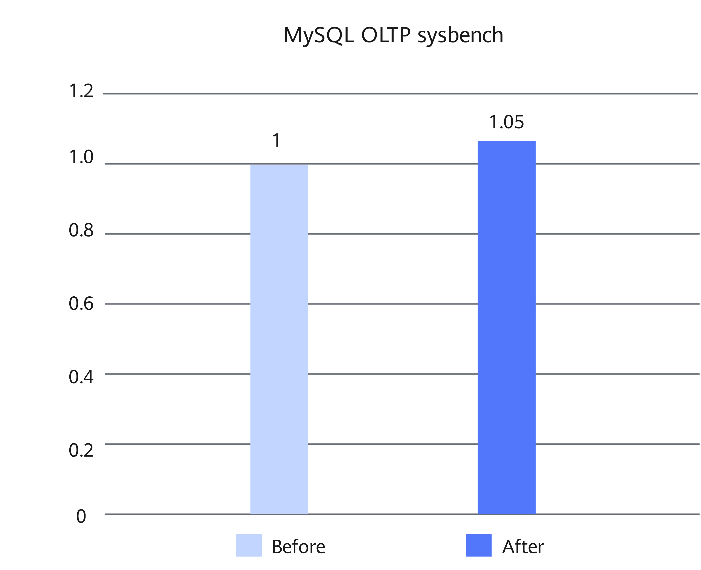

# MySQL LSE and rec_get_offsets Optimization Feature Guide 

## Feature Description<a name="EN-US_TOPIC_0000002511086264"></a>

### Overview<a name="EN-US_TOPIC_0000002542566231"></a>

This document describes how to install and enable the MySQL Large System Extensions (LSE) and rec_get_offsets optimization feature on a Kunpeng server.

In MySQL online transaction processing (OLTP) scenarios, a large number of concurrent read and write operations result in lock contention, causing linear performance deterioration. LSE is a hardware-accelerated atomic operation solution designed for multi-core and high-concurrency environments. It resolves the scalability bottleneck of load-link/store-conditional (LL/SC) instructions through single-instruction atomic operations. In addition, each call to the rec_get_offsets function relies on dict_table_is_comp to check whether the table uses the compact row format. By performing this check ahead of time and passing the result as a parameter to the refactored function, the record read efficiency is improved.


### Principles<a name="EN-US_TOPIC_0000002511086262"></a>

This feature introduces LSE hardware-based acceleration and optimizes the rec_get_offsets call logic to alleviate performance deterioration under high concurrency and improve the overall performance and system stability of MySQL on Kunpeng servers.

**LSE<a name="section479993815484"></a>**

In the case of multiple cores and severe atomic lock contention, add the LSE options to the GCC compilation options to ease lock contention.

LL/SC atomic instructions load shared variables to the L1 cache where the current core is located and modify them. The performance is good when there is little lock contention. In an intense lock contention scenario, the performance deteriorates severely. The Armv8.1 specification introduces a new atomic operation instruction extension LSE, which puts computation operations into the L3 cache to increase the scope of data sharing, reduce cache consistency time consumption, and improve operation efficiency when lock contention is intense.

**Figure 1** LL/SC instructions (ldaxr and stlxr)<a name="fig1834732512417"></a><a id="ll-sc-instructions-ldaxr-and-stlxr"></a><br>
")

**Figure 2** LSE instruction (ldaddal)<a name="fig12283173611418"></a><a id="lse-instruction-ldaddal"></a><br>
")

**rec_get_offsets Optimization<a name="section695124719482"></a>**

In the InnoDB storage engine, the rec_get_offsets function is used to determine the byte offset of each field in a physical record (rec_t). In the original implementation, each call to this function relies on dict_table_is_comp to check whether the table uses the compact row format. As this function is called frequently during physical record reads, the repeated checks introduce additional overhead. To improve performance, this feature allows the row format check to be performed before rec_get_offsets calls, and passes the result as a parameter to the rec_get_offsets_with_comp function. The new function directly uses the input compact flag, avoiding internal repeated queries. This reduces the call overhead and improves the efficiency of the InnoDB storage engine in processing records.


## Environment Requirements<a name="EN-US_TOPIC_0000002542686221"></a>

This document provides guidance based on specific environments. Before performing operations, ensure that your hardware and software meet the requirements.

**Table 1** Hardware requirement<a id="hardware-requirement"></a>

|Item|Specifications|
|--|--|
|CPU|New Kunpeng 920 processor model or Kunpeng 950 processor|


**Table 2** OS and software requirements<a id="os-and-software-requirements"></a>

|Item|Version|How to Obtain|
|--|--|--|
|OS|openEuler 22.03 LTS SP4|[Link](https://repo.huaweicloud.com/openeuler/openEuler-22.03-LTS-SP4/ISO/aarch64/openEuler-22.03-LTS-SP4-everything-aarch64-dvd.iso)|
|OS|openEuler 24.03 LTS SP3|[Link](https://repo.huaweicloud.com/openeuler/openEuler-24.03-LTS-SP3/ISO/aarch64/openEuler-24.03-LTS-SP3-everything-aarch64-dvd.iso)|
|Percona|Percona-Server 5.7.44-53|[Link](https://gitcode.com/boostkit/boostdb/releases/download/MySQL-Percona-Server-5.7.44-53-v4/BoostDB-Percona-5.7.44-53.aarch64.rpm)|
|Percona|Percona-Server 8.0.43-34|[Link](https://gitcode.com/boostkit/boostdb/releases/download/MySQL-Percona-Server-8.0.43-34-v3/BoostDB-Percona-8.0.43-34.aarch64.rpm)|

## Feature Installation and Enablement<a name="EN-US_TOPIC_0000002542566233"></a>

The following uses Percona-Server 5.7.44-53 as an example to describe how to install and enable the MySQL LSE and rec_get_offsets optimization feature. The procedure is as follows:

1. Install the dependencies as instructed in [Configuring the Compilation Environment](https://www.hikunpeng.com/document/detail/en/kunpengdbs/ecosystemEnable/Percona/kunpengpercona_02_0014.html) in the *Percona Porting Guide*.
2. Download the Percona-Server 5.7.44-53 RPM package described in [**Table 2**](#os-and-software-requirements) and save the package to the target path, for example, `/home`.
3. Run the following command to install the RPM package. The default installation directory is `/usr/local/mysql`.

    ```
    cd /home
    rpm -ivh BoostDB-Percona-5.7.44-53.aarch64.rpm
    ```

    > **NOTE:**
    >If dependency packages have been installed but the RPM-related check fails, run the following command to skip the dependency check (using `--nodeps`):
    >```
    >rpm -ivh BoostDB-Percona-5.7.44-53.aarch64.rpm --nodeps
    >```

4. Start the database. For details, see [Running MySQL](https://www.hikunpeng.com/document/detail/en/kunpengdbs/ecosystemEnable/MySQL/kunpengmysql8017_03_0013.html) in the *MySQL Porting Guide*.
5. (Optional) Perform the sysbench test to compare the performance before and after this feature is enabled. For details about the test procedure, see [Sysbench 0.5 & 1.0 Test Guide](https://www.hikunpeng.com/document/detail/en/kunpengdbs/testguide/tstg/kunpengsysbench_02_0001.html). The MySQL LSE and rec_get_offsets optimization feature can improve the overall sysbench performance (read-only, read-write, and write-only) with a configuration of 8 vCPU and 16 GB memory by 5% under a workload of 256 concurrent threads. [**Figure 3**](#performance-comparison) shows the performance comparison before and after the optimization.

   **Figure 3** Performance comparison<a name="fig937192253919"></a><a id="performance-comparison"></a><br>
   

## Security Check and Hardening<a name="EN-US_TOPIC_0000002543538365"></a>

Address space layout randomization (ASLR) is a security technology against buffer overflow. It randomizes the layout of linear areas such as heap, stack, and shared library mapping to make it difficult for attackers to predict target addresses and directly locate code, thereby preventing overflow attacks.

```
echo 2 >/proc/sys/kernel/randomize_va_space
```


