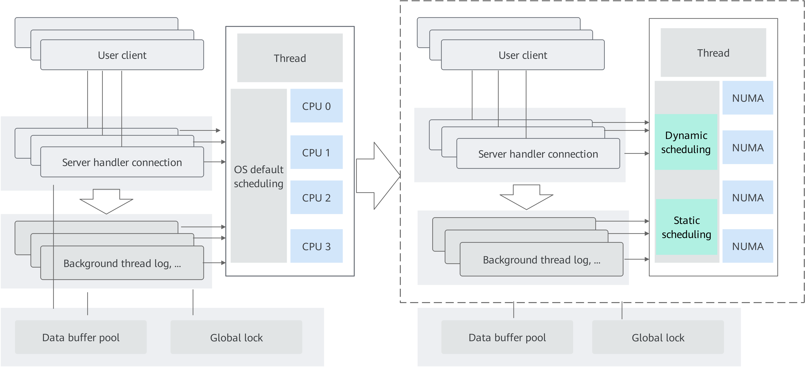
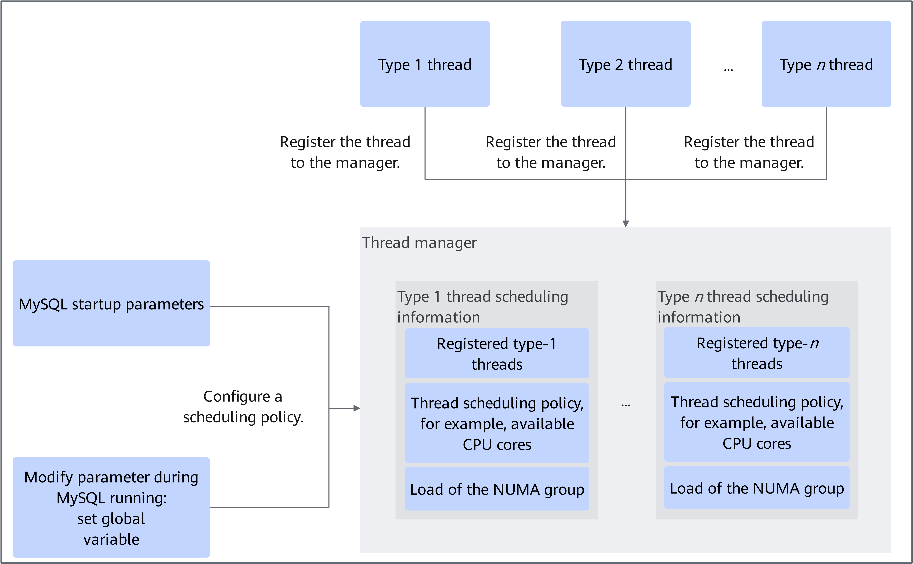

# MySQL NUMA Scheduling Tuning Feature Guide

## Feature Description<a name="EN-US_TOPIC_0000002550140085"></a>

### Overview<a name="EN-US_TOPIC_0000002550140083"></a>

In MySQL OLTP applications, the system schedules MySQL threads on the CPUs running the OS by default in the case of high concurrency, as shown in the left part in [**Figure 1**](#mysql-numa-scheduling-tuning-framework-figure). As a result, cross-NUMA access happens frequently, which increases CPU overheads and restricts the performance. Therefore, thread scheduling needs to be tuned to reduce the overhead of cross-NUMA access and improve system performance, as shown in the right part in [**Figure 1**](#mysql-numa-scheduling-tuning-framework-figure).

The MySQL NUMA scheduling tuning feature implements fine-grained scheduling of MySQL foreground and background threads. This feature improves the processing efficiency of key threads and reduces remote memory access to improve system performance. For details, see [**Figure 2**](#workflow-figure).

- Background thread: This feature involves seven types of background threads that affect the system performance. The threads are related to the redo log and purge logic. The number of background threads is fixed. Each type of thread has only one thread instance and is started when the MySQL instance is started. You can specify a type of threads to run only on specified CPU cores. Proper parameter settings can isolate the CPU cores of different threads from each other so that the CPU cores can be fully scheduled, avoiding system bottlenecks.
- Foreground thread: MySQL assigns one thread for each client connection, so the number of foreground threads increases with the number of sessions. Similar to background thread scheduling, you can specify foreground threads to run on specified CPU cores. In addition, CPU cores can be grouped based on the NUMA information. In the lifecycle of the current session, foreground threads are migrated only on the CPU cores in the same group, but not across NUMA nodes, exploiting spatial locality in data access. To achieve load balancing between groups, new foreground threads are scheduled to the group with lighter load. The load level is reflected by the number of sessions in the group.

### Principles<a name="EN-US_TOPIC_0000002550180079"></a>

#### MySQL NUMA Scheduling Tuning Framework<a name="EN-US_TOPIC_0000002550180077"></a>

**Figure 1** MySQL NUMA scheduling tuning framework<a id="mysql-numa-scheduling-tuning-framework-figure"></a><br>


#### Workflow<a name="EN-US_TOPIC_0000002518700242"></a>

**Figure 2** Workflow<a id="workflow-figure"></a><br>


## Environment Requirements<a name="EN-US_TOPIC_0000002518540334"></a>

Fix vulnerabilities as soon as possible based on the Common Vulnerabilities and Exposures (CVE) of MySQL 8.0.20 on the [MySQL official website](https://www.mysql.com/).

This document provides guidance based on the Kunpeng server and openEuler OS. Before performing operations, ensure that your hardware and software meet the requirements.

**Hardware Requirements<a name="section116628440251"></a>**

[**Table 1**](#hardware-requirement) lists the hardware requirement.

**Table 1** Hardware requirement<a id="hardware-requirement"></a>

|Item|Specifications|
|--|--|
|CPU|Kunpeng server|

**OS and Software Requirements<a name="section1240364411598"></a>**

[**Table 2**](#os-and-software-requirements) lists the OS and software requirements.

**Table 2** OS and software requirements<a id="os-and-software-requirements"></a>

|Item|Version|How to Obtain|
|--|--|--|
|OS|openEuler/CentOS|Prepare it based on the actual environment.|
|MySQL source code|MySQL 8.0.20<br>MySQL 8.0.25|MySQL 8.0.20: [Link](https://downloads.mysql.com/archives/get/p/23/file/mysql-boost-8.0.20.tar.gz)<br>MySQL 8.0.25: [Link](https://downloads.mysql.com/archives/get/p/23/file/mysql-boost-8.0.25.tar.gz)|
|NUMA scheduling tuning patch|Patch for MySQL 8.0.20 and 8.0.25|[Link](https://gitcode.com/boostkit/boostdb/releases/download/MySQL-patch-release/boostdb-patch-release-20260330.zip)|

## Feature Installation and Usage<a id="EN-US_TOPIC_0000002550180081"></a>

The MySQL NUMA scheduling tuning feature is provided as a patch file. This patch is developed based on MySQL 8.0.20 or MySQL 8.0.25 and is open-sourced in the Gitee community. Before using this feature, apply the patch to the MySQL source code, and then compile and install MySQL.

1. Download the MySQL source code described in [**Table 2**](#os-and-software-requirements) and upload it to the `/home` directory on the server.

2. Download the MySQL NUMA scheduling tuning patch described in [**Table 2**](#os-and-software-requirements) and upload it to the root directory of the MySQL source code.

3. (Optional) If the Yum repository is not configured, configure it. For details, see [MySQL Porting Guide](https://www.hikunpeng.com/document/detail/en/kunpengdbs/ecosystemEnable/MySQL/kunpengmysql8017_02_0013.html).
4. This feature depends on libnuma. Install related dependencies before compiling MySQL (take CentOS as an example):

    ```shell
    yum install -y numactl numactl-devel numactl-libs
    ```

    > **NOTE:**
    MySQL can still be compiled even if the libnuma dependencies are not found during compilation. But this feature will not take effect.

5. Upload the MySQL source package to the `/home` directory, decompress the source package, and go to the root directory of the MySQL source code. (Assume that the MySQL version is 8.0.20.)

    ```shell
    cd /home
    tar -zxvf mysql-boost-8.0.20.tar.gz
    cd mysql-8.0.20
    ```

6. In the root directory of the source code, run the `git init` command to create Git management information.

    ```shell
    git init
    git add -A
    git commit -m "Initial commit"
    ```

    > **NOTE:**
    >- Generally, Git is provided by the system. If not, configure the Yum repository by following instructions in [MySQL Porting Guide](https://www.hikunpeng.com/document/detail/en/kunpengdbs/ecosystemEnable/MySQL/kunpengmysql8017_02_0001.html) and then install Git.
>
     > ```shell
     > yum install git
     >  ```
>
    >- If the Git commit user information is not configured, configure the user email and user name before running the `git commit` command.
>
    > ```shell
    > git config user.email "123@example.com"
    > git config user.name "123"
    >  ```

7. (Optional) If dos2unix is not installed, run the following command to install it:

    ```shell
    yum install dos2unix
    ```

8. Apply the NUMA scheduling tuning patch.

    ```shell
    dos2unix 0001-SCHED-AFFINITY.patch
    git apply --check 0001-SCHED-AFFINITY.patch
    git apply --whitespace=nowarn 0001-SCHED-AFFINITY.patch
    ```

   > **NOTE:**
   > This step uses MySQL 8.0.20 as an example. If you want to apply this feature to other versions, modify the preceding commands based on the actual patch name.

    If no error information is displayed, the patch is successfully applied.

9. Compile and install the MySQL source code. For details, see [MySQL Porting Guide](https://www.hikunpeng.com/document/detail/en/kunpengdbs/ecosystemEnable/MySQL/kunpengmysql8017_02_0001.html).
10. After recompiling MySQL, configure system variables in the configuration file or startup parameters or during system running for the recompilation to take effect.

    The MySQL system variables described in [**Table 5**](#parameter-description-and-recommended-configuration-of-mysql-numa-scheduling-tuning) are added, which can be set in the configuration file, in the startup parameters, or during system running as required.

    **Table 5** Parameter description and recommended configuration of MySQL NUMA scheduling tuning<a id="parameter-description-and-recommended-configuration-of-mysql-numa-scheduling-tuning"></a>

    |Parameter|Description|Recommended Configuration|
    |--|--|--|
    |sched_affinity_numa_aware|A global parameter of the Boolean type. If it is set to <code>ON</code> and <code>sched_affinity_foreground_thread</code> is not left blank, the CPU cores specified by <code>sched_affinity_foreground_thread</code> are grouped by NUMA node, and the thread of a session is migrated only between CPU cores in a specified group.<br><br>This parameter can be modified when the database is running. The default value is <code>OFF</code>.|Specifies whether to enable core binding for foreground processes. If <code>sched_affinity_foreground_thread</code> is not left blank, CPU cores specified by <code>sched_affinity_foreground_thread</code> are grouped by NUMA node, and the thread of a session is migrated only between cores in a specified group. You are advised to set this parameter to <code>ON</code>.|
    |sched_affinity_foreground_thread|A global parameter of the String type. It is used to set the CPU cores that can be used for MySQL foreground threads.<br>The value is a character string consisting of digits representing core IDs. Core IDs can be separated by commas (,) and the value range can be represented by a minus sign (-). For example, the following lists valid values of CPU cores:<br>- Blank<br>- <code>5</code><br>- <code>0,5,7</code><br>- <code>0,2-5,7</code><br><br>This parameter can be modified when the database is running. It is left blank by default, indicating that this type of threads is scheduled by the OS, that is, this parameter is not used.|Specifies the CPU cores on which MySQL foreground threads (user threads) run. You are advised to bind foreground threads and background threads to different cores.|
    |sched_affinity_log_writer|A global parameter of the String type. It is used to set the CPU cores that can be used for the MySQL log_writer thread.<br>The value is a character string consisting of digits representing core IDs. Core IDs can be separated by commas (,) and the value range can be represented by a minus sign (-). For example, the following lists valid values of CPU cores:<br>- Blank<br>- <code>5</code><br>- <code>0,5,7</code><br>- <code>0,2-5,7</code><br><br>This parameter can be modified when the database is running. It is left blank by default, indicating that the log_writer thread is scheduled by the OS.|Specifies the CPU cores that can be used for the MySQL log_writer thread. You are advised to bind background threads to cores of the same NUMA node.|
    |sched_affinity_log_flusher|A global parameter of the String type. It is used to set the CPU cores that can be used for the MySQL log_flusher thread.<br>The value is a character string consisting of digits representing core IDs. Core IDs can be separated by commas (,) and the value range can be represented by a minus sign (-). For example, the following lists valid values of CPU cores:<br>- Blank<br>- <code>5</code><br>- <code>0,5,7</code><br>- <code>0,2-5,7</code><br><br>This parameter can be modified when the database is running. It is left blank by default, indicating that the log_flusher thread is scheduled by the OS.|Specifies the CPU cores that can be used for the MySQL log_flusher thread. You are advised to bind background threads to cores of the same NUMA node.|
    |sched_affinity_log_write_notifier|A global parameter of the String type. It is used to set the CPU cores that can be used for the MySQL log_write_notifier thread.<br>The value is a character string consisting of digits representing core IDs. Core IDs can be separated by commas (,) and the value range can be represented by a minus sign (-). For example, the following lists valid values of CPU cores:<br>- Blank<br>- <code>5</code><br>- <code>0,5,7</code><br>- <code>0,2-5,7</code><br><br>This parameter can be modified when the database is running. It is left blank by default, indicating that the log_write_notifier thread is scheduled by the OS.|Specifies the CPU cores that can be used for the MySQL log_write_notifier thread. You are advised to bind background threads to cores of the same NUMA node.|
    |sched_affinity_log_flush_notifier|A global parameter of the String type. It is used to set the CPU cores that can be used for the MySQL log_flush_notifier thread.<br>The value is a character string consisting of digits representing core IDs. Core IDs can be separated by commas (,) and the value range can be represented by a minus sign (-). For example, the following lists valid values of CPU cores:<br>- Blank<br>- <code>5</code><br>- <code>0,5,7</code><br>- <code>0,2-5,7</code><br><br>This parameter can be modified when the database is running. It is left blank by default, indicating that the log_flush_notifier thread is scheduled by the OS.|Specifies the CPU cores that can be used for the MySQL log_flush_notifier thread. You are advised to bind background threads to cores of the same NUMA node.|
    |sched_affinity_log_checkpointer|A global parameter of the String type. It is used to set the CPU cores that can be used for the MySQL log_checkpointer thread.<br>The value is a character string consisting of digits representing core IDs. Core IDs can be separated by commas (,) and the value range can be represented by a minus sign (-). For example, the following lists valid values of CPU cores:<br>- Blank<br>- <code>5</code><br>- <code>0,5,7</code><br>- <code>0,2-5,7</code><br><br>This parameter can be modified when the database is running. It is left blank by default, indicating that the log_checkpointer thread is scheduled by the OS.|Specifies the CPU cores that can be used for the MySQL log_checkpointer thread. You are advised to bind background threads to cores of the same NUMA node.|
    |sched_affinity_purge_coordinator|A global parameter of the String type. It is used to set the CPU cores that can be used for the MySQL purge_coordinator thread.<br>The value is a character string consisting of digits representing core IDs. Core IDs can be separated by commas (,) and the value range can be represented by a minus sign (-). For example, the following lists valid values of CPU cores:<br>- Blank<br>- <code>5</code><br>- <code>0,5,7</code><br>- <code>0,2-5,7</code><br><br>This parameter can be modified when the database is running. It is left blank by default, indicating that the purge_coordinator thread is scheduled by the OS.|Specifies the CPU cores that can be used for the MySQL purge_coordinator thread. You are advised to bind background threads to cores of the same NUMA node.|
    |sched_affinity_log_closer|A global parameter of the String type. It is used to set the CPU cores that can be used for the MySQL log_closer thread.<br>The value is a character string consisting of digits representing core IDs. Core IDs can be separated by commas (,) and the value range can be represented by a minus sign (-). For example, the following lists valid values of CPU cores:<br>- Blank<br>- <code>5</code><br>- <code>0,5,7</code><br>- <code>0,2-5,7</code><br><br>This parameter can be modified when the database is running. It is left blank by default, indicating that the log_closer thread is scheduled by the OS.<br><br>**NOTICE:**<br>The log_closer thread is deleted from MySQL 8.0.25. Therefore, this parameter is not provided in the corresponding patch version.|Specifies the CPU cores that can be used for the MySQL log_closer thread. You are advised to bind background threads to cores of the same NUMA node.|

    - **Method 1: Modify the configuration file.** This method takes effect only after the database is restarted.
      1. Configure system variables in the configuration file. Example:

         ```ini
         sched_affinity_numa_aware=ON
         sched_affinity_foreground_thread=0-29
         sched_affinity_log_writer=30
         sched_affinity_log_flusher=30
         sched_affinity_log_write_notifier=31
         sched_affinity_log_flush_notifier=31
         sched_affinity_log_checkpointer=31
         sched_affinity_purge_coordinator=31
         ```

         > **NOTE:**
         > The default path to the database configuration file is `/etc/my.cnf`. You can also run the following command to set the `defaults-file` option, where `/tmp/myconfig.txt` indicates the configuration file path.
>
         > ```shell
         > mysqld --defaults-file=/tmp/myconfig.txt
         > ```

      2. Restart the database.

    - **Method 2: Modify the database startup parameters.**
      1. When starting the database, add system variable configurations to the boot command. This method takes effect only after the database is restarted. Example:

         ```shell
         mysqld --defaults-file=/etc/my.cnf \
         --sched_affinity_numa_aware=ON \
         --sched_affinity_foreground_thread=0-29 \
         --sched_affinity_log_writer=30 \
         --sched_affinity_log_flusher=30 \
         --sched_affinity_log_write_notifier=31 \
         --sched_affinity_log_flush_notifier=31 \
         --sched_affinity_log_checkpointer=31 \
         --sched_affinity_purge_coordinator=31
         ```

      2. Restart the database.

    - **Method 3: Connect to the database during system running and configure system variables using SQL statements.** This method does not require restarting the database. Example:

      ```sql
      set global sched_affinity_numa_aware=ON;
      set global sched_affinity_foreground_thread="0-29";
      set global sched_affinity_log_writer="30";
      set global sched_affinity_log_flusher="30";
      set global sched_affinity_log_write_notifier="31";
      set global sched_affinity_log_flush_notifier="31";
      set global sched_affinity_log_checkpointer="31";
      set global sched_affinity_purge_coordinator="31";
      ```

11. (Optional) Check the MySQL status variables.

    The MySQL status variables described in [**Table 6**](#mysql-status-variables) are added in this feature, enabling you to query the internal status of the scheduling manager.

    **Table 6** MySQL status variables<a id="mysql-status-variables"></a>

    |Status Variable|Description|
    |--|--|
    |Sched_affinity_status|Returns the load status of each group in the scheduling manager.|
    |Sched_affinity_group_number|Returns the total number of NUMA nodes in the system.|
    |Sched_affinity_group_capacity|Returns the number of cores on each NUMA node.|

    After the MySQL NUMA scheduling tuning feature is enabled, execute the following SQL statement to view information about MySQL status variables:

    ```sql
    show status like "%<Status_variable>%";
    ```

12. (Optional) Perform a TPC-C test to obtain the performance improvement data after the MySQL NUMA scheduling tuning feature is used. For details about the test procedure, see [BenchmarkSQL Test Guide](https://www.hikunpeng.com/document/detail/en/kunpengdbs/testguide/tstg/kunpengbenchmarksql_06_0001.html).

    The MySQL NUMA scheduling tuning feature improves the comprehensive TPC-C performance by 10%. [**Figure 3**](#performance-comparison-before-and-after-mysql-numa-scheduling-tuning-is-used) shows the effect before and after the tuning.

    **Figure 3** Performance comparison before and after MySQL NUMA scheduling tuning is used<a name="fig_mysql_numa_perf"></a><a id="performance-comparison-before-and-after-mysql-numa-scheduling-tuning-is-used"></a><br>
    

## Code Implementation<a name="EN-US_TOPIC_0000002518700244"></a>

[**Table 7**](#new-classes) lists the new classes of this feature.

**Table 7** New classes<a id="new-classes"></a>

|Class|Description|
|--|--|
|Sched_affinity_manager|Scheduling manager interface.<br><br>- The register_thread method is used to register a thread with the scheduling manager when the thread starts, and then its scheduling is managed by the scheduling manager.<br>- The unregister_thread method is used to deregister a thread from the scheduling manager before the thread is destroyed.<br>- The rebalance_group method is used to update the internal status of the scheduling manager and the scheduling status of the existing threads when CPU core parameters are changed.<br>- The update_numa_aware method is used to update the internal status of the scheduling manager and the scheduling status of the existing threads when the <code>sched_affinity_numa_aware</code> parameter is changed.<br>- The take_group_snapshot method is used to return a snapshot of the internal status of the scheduler manager, in the form of a string. The snapshot can be queried by the user.<br>- The get_total_node_number method is used to return the total number of NUMA nodes in the system.<br>- The get_cpu_number_per_node method is used to return the number of cores on each NUMA node in the system.<br>- The check_cpu_string method is used to check the validity of the input CPU cores.|
|Sched_affinity_manager_numa|Implements the scheduling manager.|
|Sched_affinity_manager_dummy|Standby for implementing the scheduling manager. The implementation of all interfaces only returns values that meet the caller's expectation.<br><br>If Sched_affinity_manager_numa is unavailable (for example, the libnuma dependencies do not meet the requirements), Sched_affinity_manager_dummy is enabled.|

## Security Management<a name="EN-US_TOPIC_0000002518540336"></a>

**Routine Check Using Antivirus Software<a name="en-us_topic_0000001821389094_section11752161613273"></a>**

Periodically scan clusters for viruses. This protects clusters from viruses, malicious code, spyware, and malicious programs, reducing risks such as system breakdown and information leakage. Mainstream antivirus software can be used for antivirus check.

**Vulnerability Fixing<a name="en-us_topic_0000001821389094_section208601325152718"></a>**

To ensure the security of the production environment and reduce the risk of attacks, periodically fix the following vulnerabilities:

- OS vulnerabilities
- OpenSSL vulnerabilities
- Vulnerabilities in other components

## Acronyms and Abbreviations<a name="EN-US_TOPIC_0000002518700246"></a>

|Acronym/Abbreviation|Full Spelling|
|--|--|
|NUMA|non-uniform memory access|
|OLTP|online transaction processing|
|TPC-C|Transaction Processing Performance Council Benchmark C|

## Change History<a name="EN-US_TOPIC_0000002518700240"></a>

|Date|Description|
|--|--|
|2023-07-25|This is the second official release.<br>Updated the commands for applying the patch of the MySQL NUMA scheduling tuning feature in [Feature Installation and Usage](#EN-US_TOPIC_0000002550180081).|
|2021-06-30|This is the first official release.|
