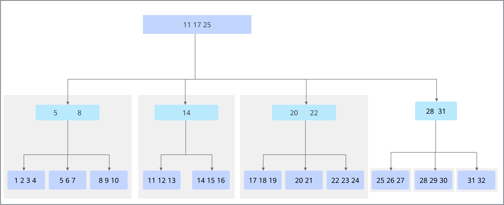
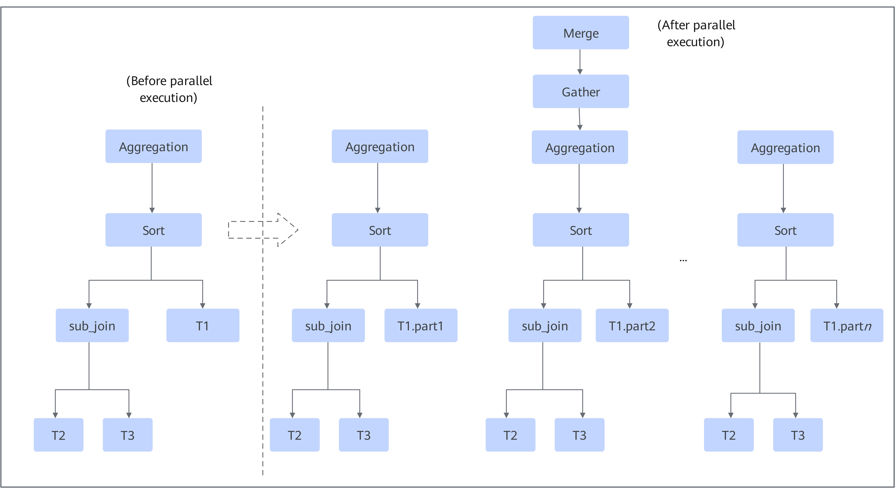
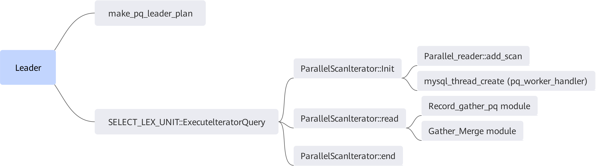
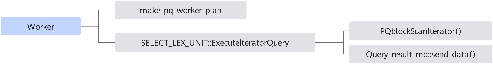
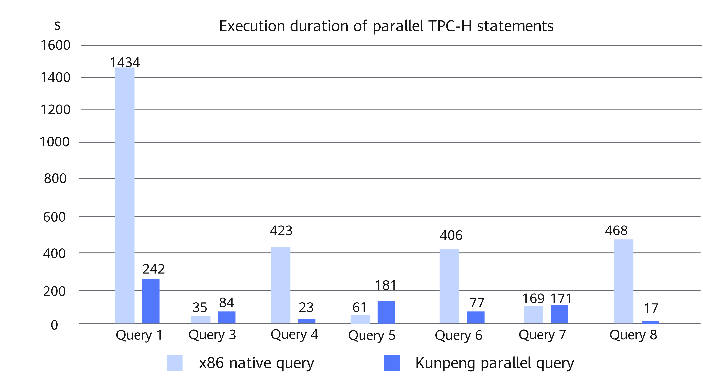

# MySQL Parallel Query Tuning Feature Guide

## Introduction<a name="EN-US_TOPIC_0000002518704730"></a>

### Application Scenarios<a name="EN-US_TOPIC_0000002518544830"></a>

MySQL parallel query tuning is mainly used in online analytical processing (OLAP) scenarios. In an OLAP scenario, a large amount of data is analyzed and queried from multiple dimensions. Generally, scalability, data consistency, high performance, and high security are required for the scenario. In the scenario, the quick query response and high throughput of the database are critical to ensuring the normal running of applications. Kunpeng BoostKit provides in-depth optimization for databases in terms of OLAP capabilities, and open-sources the optimization feature as a patch package to the Gitee community. Developers need to apply the patch to the MySQL source code, and then compile and install MySQL. For details, see [Patch Usage](#patch-usage).

The MySQL parallel query tuning feature enables parallel data read, and allows executing an SQL statement by using multiple cores and threads, and therefore accelerates the execution of query statements. This feature is mainly used in service scenarios such as data analysis, BI report, and decision-making support. The following types of single-table scan queries can be performed in parallel:

- JT_ALL
- JT_INDEX_SCAN
- JT_REF
- JT_RANGE

In addition to single tables, simple parallel query of multiple tables is allowed. Subquery is not supported. Semi join is supported in some scenarios. The solution works in trustlist mode. The details are as follows.

- Single-table trustlist:

    ```
    select {<Column_name>| Aggregate } from table where {=|>| < |>= |<= |like |between…and| in} group by {<Column_name>} having {<Column_name>}order by {<Column_name>| Aggregate } limit x
    ```

    > **NOTE:**
    >-   In the trustlist format, `select` and `from` are mandatory, and `where`, `group by`, `having`, `order by`, and `limit` are optional.
    >-   Aggregate can be SUM, MIN, MAX, AVG, or COUNT.

- Multi-table trustlist:

    ```
    select {<Column_name>| Aggregate } from table1 table2 …  where {=|>| < |>= |<= |like |between…and| in} group by {<Column_name>} having {<Column_name>}order by {<Column_name>} limit x
    ```

    > **NOTE:**
    >-   In the trustlist format, `select` and `from` are mandatory, and `where`, `group by`, `having`, `order by`, and `limit` are optional.
    >-   Parallel query does not take effect for system tables, temporary tables, non-InnoDB tables, stored procedures, or serialized isolation levels.

- Semi-join query:

    Some semi-join queries may become common simple queries after being processed by the MySQL optimizer. If the innermost table in the execution plan is a foreign table, such SQL statements also support parallel query.

- Four arithmetic operations of aggregation:

    Four arithmetic operations of aggregation are supported, for example, `sum()/sum()` and `a*sum()`, where `a` is a constant.

**Security Hardening Statement<a name="section1867017506565"></a>**

MySQL parallel query tuning supports MySQL 8.0.20 and MySQL 8.0.25. Promptly fix the CVE vulnerabilities of the corresponding MySQL versions released on the MySQL official website.


### Parallel Query<a name="EN-US_TOPIC_0000002518544828"></a>

#### Principles<a name="EN-US_TOPIC_0000002550144559"></a>

Parallel query involves two key events: table splitting and execution plan reconstruction.

- Table splitting

    The data to be scanned is split into partitions to enable multiple threads to scan the data in parallel. The InnoDB engine is an index-organized table that stores data in B-tree index structure. The partitioning logic is as follows: The system scans the root node page layer by layer. When the number of branches at a layer exceeds the configured threads, the system stops splitting. The partitioning process consists of two partitioning operations. In the first partitioning operation, partitioning is performed according to the quantity of branches of a root node page. A record of a leftmost leaf node of each branch is a lower left bound, and the record is denoted as an upper right bound of an adjacent upper branch. In this way, the B-tree is split into multiple subtrees, and each subtree is a scanning partition. After the first partitioning operation, the threads may not be fully used. For example, if the number of parallel scanning threads is set to 3 and 4 partitions are generated after the first partitioning, at most one thread is used to scan the fourth partition after the first three partitions are processed in parallel. In this case, multi-core resources cannot be fully utilized.

    To solve the load imbalance caused by the first partitioning operation, the fourth partition is partitioned for the second time. After the second partitioning operation, multiple smaller blocks are obtained. In this way, the scanning data of each thread is more balanced.

    **Figure 1** Table splitting logic<a name="fig14723134494516"></a><a id="table-splitting-logic"></a><br>
    

- Execution plan reconstruction

    The MySQL execution plan is a left-deep tree. Before parallel execution, MySQL uses a thread to recursively execute the left-deep tree, and then performs sorting or aggregation on the join result. Parallel execution aims to use multiple threads to execute the execution plan tree in parallel. The first non-const primary table is split. The execution plan of each thread is the same as the original execution plan, but the first table is only part of the table. In this way, each thread executes part of the execution plan. These threads are called worker threads. After the execution is complete, the results are submitted to the leader for summary, and then sorted and aggregated, or the results are directly sent to the client.

    **Figure 2** Execution plan reconstruction<a name="fig17701652134517"></a><a id="execution-plan-reconstruction"></a><br>
    


#### Key Function Process<a name="EN-US_TOPIC_0000002518544826"></a>

In the parallel framework, there are the leader thread and worker threads.



The `make_pq_leader_plan` function of the leader thread determines whether statements can be executed in parallel, generates the leader's execution plan based on the original execution plan, and calls the ParallelScanIterator iterator to execute the statements.

- Init

    In the init process, the leader thread calls the `add_scan` table that can be executed in parallel to split the table into multiple data shards and put all shards in the same queue. Then, `mysql_thread_create` is called to create multiple worker threads. The worker threads cyclically obtain shards from the queue until all shards are executed.

- Read

    During the read process, the leader thread invokes the gather module to obtain data from the message queue. If necessary, you can perform additional operations, such as count and sum aggregate operations. Finally, the data is transmitted to the upper layer and then to the client.

- End

    The end operations of an iterator include releasing the memory and returning the read data status.



The worker threads are created and started by the leader thread. The number of worker threads to be started depends on the parallelism degree. The worker thread calls `make_pq_worker_plan` to generate its own execution plan. In this process, a replaceable iterator in the original execution plan is replaced with the parallel iterator PQblockScanlterator. Then, the `read` function of PQblockScanIterator is called. This function calls the interaction interface with the InnoDB storage engine to obtain data from InnoDB. Then the `send_data` function is called to send the data to the message queue for the leader thread.


## Patch Usage<a name="EN-US_TOPIC_0000002550144563" id="patch-usage"></a>

The detailed procedure is as follows:

1. Download the MySQL source code based on [**Table 1**](#download-urls-for-different-mysql-versions) and save it to the target path, for example, `/home`.

    **Table 1** Download URLs for different MySQL versions<a id="download-urls-for-different-mysql-versions"></a>

|Version|Download URL|
|--|--|
|MySQL 8.0.20|[Link](https://github.com/mysql/mysql-server/archive/mysql-8.0.20.tar.gz)|
|MySQL 8.0.25|[Link](https://github.com/mysql/mysql-server/archive/mysql-8.0.25.tar.gz)|


   **NOTICE:**
    The code downloaded from GitHub does not contain the `boost` folder. You can download the source code containing `boost` from the MySQL official website and obtain the `boost` folder from the source code. The path to the `boost` folder will be used during compilation.

2. Download the patch packages of the MySQL parallel query tuning feature based on [**Table 2**](#patch-packages-for-different-mysql-versions).

    **Table 2** Patch packages for different MySQL versions<a id="patch-packages-for-different-mysql-versions"></a>

|Supported Version|Patch Package|Description|
|--|--|--|
|MySQL 8.0.20|[code-pq.patch](https://gitcode.com/boostkit/mysql/blob/MySQL-8.0.20/boostdb-patches/code-pq.patch)|Source code patch, which contains all the code required by parallel query.|
|MySQL 8.0.20|[mtr-pq.patch](https://gitcode.com/boostkit/mysql/blob/MySQL-8.0.20/boostdb-patches/mtr-pq.patch)|Patch for MTR tests in mysql-test, which ensures that all MTR tests are passed.|
|MySQL 8.0.25|[code-pq-for-MySQL-8.0.25.patch](https://gitcode.com/boostkit/mysql/blob/MySQL-8.0.25/boostdb-patches/code-pq-for-MySQL-8.0.25.patch)|Source code patch, which contains all the code required by parallel query.|
|MySQL 8.0.25|[mtr-pq-for-MySQL-8.0.25.patch](https://gitcode.com/boostkit/mysql/blob/MySQL-8.0.25/boostdb-patches/mtr-pq-for-MySQL-8.0.25.patch)|Patch for MTR tests in mysql-test, which ensures that all MTR tests are passed.|


    - The patch packages are generated based on MySQL 8.0.20 and 8.0.25 in the Gitee community.
    - The patch packages have been verified on the AArch64 Linux platform.
    - The patch packages do not support the x86 hardware platform.

3. Decompress the source package and go to the MySQL source code directory.

    ```
    tar -zxvf mysql-boost-8.0.20.tar.gz
    cd mysql-8.0.20
    ```

4. In the root directory of the source code, run the `git init` command to create Git management information.

    ```
    git init
    git add -A
    git commit -m "Initial commit"
    ```

    > **NOTE:**
    >-   Generally, Git is provided by the system. If not, configure the Yum repository by following instructions in [MySQL Porting Guide](https://www.hikunpeng.com/document/detail/en/kunpengdbs/ecosystemEnable/MySQL/kunpengdbs_02_0002.html) and then install Git.
    >    ```
    >    yum install git
    >    ```
    >-   If the Git commit user information is not configured, configure the user email and user name before running the `git commit` command.
    >    ```
    >    git config user.email "123@example.com"
    >    git config user.name "123"
    >    ```

5. Apply the patches of the MySQL parallel query tuning feature.

    ```
    git apply --whitespace=nowarn -p1 < mtr-pq.patch
    git apply  --whitespace=nowarn -p1 < code-pq.patch
    ```

    If no error information is displayed, the patches are successfully applied.

6. Compile and install the MySQL source code. For details, see [MySQL Porting Guide](https://www.hikunpeng.com/document/detail/en/kunpengdbs/ecosystemEnable/MySQL/kunpengdbs_02_0002.html).


## Parallel Query Parameters<a name="EN-US_TOPIC_0000002550184565"></a>

[**Table 1**](#parallel-query-parameter) describes the six new parallel query parameters.

**Table 1** Parallel query parameters<a id="parallel-query-parameter"></a>

|Parameter|Description|Value|
|--|--|--|
|parallel_cost_threshold|Global- and session-level parameter, which is used to set the threshold for parallel query of SQL statements.<br>Parallel queries are executed only when the estimated cost of a query is higher than this threshold. When the estimated cost is lower than this threshold, a query process of open-source MySQL is executed.|Value range: [0, <code>ULONG_MAX</code>]<br>Default value: <code>1000</code>|
|parallel_default_dop|Global- and session-level parameter, which is used to set the maximum number of parallel queries for each SQL statement.<br>The query parallelism of a SQL statement is dynamically adjusted based on the table size. If the binary tree of the table is too small (the number of table slices is less than the concurrency), set the query concurrency based on the number of table slices. The maximum degree of parallelism for each query does not exceed the value of <code>parallel_default_dop</code>. The value of this parameter cannot be greater than that of <code>parallel_max_threads</code>. Otherwise, parallel query of SQL statements cannot be enabled.|Value range: [0, 1024]<br>Default value: <code>4</code>|
|parallel_max_threads|Global-level parameter, which is used to set the total number of concurrent query threads.|Value range: [0, <code>ULONG_MAX</code>]<br>Default value: <code>64</code>|
|parallel_memory_limit|Global-level parameter, which is used to set the upper limit of the total memory used by the leader thread and worker threads in parallel execution.|Value range: [0, <code>ULONG_MAX</code>]<br>Default value: 100 × 1024 × 1024|
|parallel_queue_timeout|Global- and session-level parameter, which is used to set the timeout interval for parallel queries.<br>If system resources are insufficient, for example, the number of running parallel query threads reaches the value of <code>parallel_max_threads</code>, the parallel query statements will wait for available resources. If no resource is available after timeout, a query process of open-source MySQL is executed.|Value range: [0, <code>ULONG_MAX</code>], in milliseconds<br>Default value: <code>0</code>|
|force_parallel_execute|Global- and session-level parameter, which is used to set the switch for parallel queries.|The bool value is <code>on</code> or <code>off</code>.<br>The value <code>on</code> enables parallel query while <code>off</code> disables parallel query.<br>Default value: <code>off</code>|


[**Table 2**](#status-variables) describes the four new status variables.

**Table 2** Status variables<a id="status-variables"></a>

|Status Variable|Description|
|--|--|
|PQ_threads_running|Global-level variable, which indicates the total number of running parallel threads.|
|PQ_memory_used|Global-level variable, which indicates the total memory used for parallel execution.|
|PQ_threads_refused|Global-level variable, which indicates the total number of parallel queries that cannot be executed due to the limit on the total number of threads.|
|PQ_memory_refused|Global-level variable, which indicates the total number of parallel queries that fail to be executed due to the total memory limit.|


## Parallel Query Usage<a name="EN-US_TOPIC_0000002550184561"></a>

This section explains how to use the parallel query tuning feature, including how to set system parameters and use the hint syntax. In addition, this section describes the performance improvement brought by this feature.

You can use the parallel query tuning feature in either of the following ways:

- Method 1: Set system parameters.

    The global parameter `force_parallel_execute` is used to determine whether to enable parallel query. The global parameter `parallel_default_dop` is used to control the number of threads used for parallel query. You can modify those parameters at any time without restarting the database.

    For example, if you want to enable parallel execution and the number of parallel threads is 4, run the following commands:

    ```
    force_parallel_execute=on;
    parallel_default_dop=4;
    ```

    You can change the value of `parallel_cost_threshold` based on the actual requirements. If the value is set to `0`, all queries will be executed in parallel. If this parameter is set to a non-zero value, parallel query is performed when the estimated cost is greater than the value.

    > **NOTE:**
    >If the MySQL parallel query tuning feature does not take effect after being enabled, see [Solution](https://www.hikunpeng.com/document/detail/en/kunpengdbs/troubleshooting/trouble/boostkit_database_troublecase_029.html).

- Method 2: Use the hint syntax.

    The hint syntax can be used to control whether a single statement is executed in parallel. If parallel execution is disabled by default, the hint syntax can be used to accelerate a specific SQL statement. The degree of parallelism specified in the hint cannot be greater than `parallel_max_threads`. Otherwise, parallel query of SQL statements cannot be enabled. You can also restrict certain types of SQL statements from being executed in parallel.

    - `SELECT /*+ PQ */ … FROM …`: Use the default 4 threads to perform parallel queries.
    - `SELECT /*+ PQ(8) */ … FROM …`: Use 8 threads to perform parallel queries.
    - `SELECT /*+ NO_PQ */ … FROM …`: Do not use parallel queries.

Perform a TPC-H test to obtain the performance improvement data after the MySQL parallel query tuning feature is used. For details about the test procedure, see [TPC-H Test Guide (for MySQL)](https://www.hikunpeng.com/document/detail/en/kunpengdbs/testguide/tstg/kunpengtpch_02_0001.html).

According to the test data, the parallelism degree is improved after MySQL parallel query tuning is enabled, and the query performance is more than doubled. (The performance improvement is subject to the parallelism degree).




## Possible Incompatibility with Serial Results<a name="EN-US_TOPIC_0000002518704732"></a>

The parallel execution result may be incompatible with the serial execution result in the following scenarios:

- The number of errors or alarms may increase.

    For queries that encounter errors or alarms during serial execution, if they are executed in parallel, each worker thread may report errors or alarms. As a result, the total number of errors or alarms increases.

- The precision is incorrect.

    During parallel execution, intermediate results may be generated. If the intermediate results are of the floating-point type, the floating-point data may have precision deviation. As a result, the final result may be slightly different.

- Sequences of the result sets are different.

    When multiple worker threads execute the query, the returned result set may have a different sequence from the serial execution sequence. If the `GROUP BY` statement exists, the sequence in the group after grouping may be different from the serial execution sequence. If the `LIMIT` statement exists, it is more likely that the parallel execution result is different from the serial execution result.


## Constraints<a name="EN-US_TOPIC_0000002550184563"></a>

[**Table 1**](#query-statements-that-cannot-be-executed-in-parallel) describes the query statements that cannot be executed in parallel.

**Table 1** Query statements that cannot be executed in parallel<a id="query-statements-that-cannot-be-executed-in-parallel"></a>

|Statement Type|Description|
|--|--|
|Table|System table<br>Temporary table<br>Non-InnoDB table<br>Partition table<br>const table|
|Data type|BLOB<br>TEXT<br>JSON<br>GEOMETRY|
|Index|Spatial index<br>Full-text index<br>Index merge|
|Function|Window functions<br>with rollup<br>Spatial functions (such as <code>SP_WITHIN_FUNC</code>)<br>distinct<br>User-defined functions<br>GROUP_CONCAT<br>JSON functions<br>XML functions<br>STD/STDDEV/STDDEV_POP<br>VARIANCE/VAR_POP/VAR_SAMP<br>BIT_AND, BIT_OR, BIT_XOR<br>randst_distance<br>get_lock<br>is_free_lock, is_used_lock, release_lock, release_all_locks<br>sleep<br>weight_string<br>SHA, SHA1, SHA2, MD5<br>row_count<br>round<br>VARIANCE|
|Others|Subqueries<br>union<br>Stored procedure<br>Triggers<br>Lock queries, such as the serializable isolation level and "for update/share lock"<br>Prepared Statements<br>generated column<br>Not compliant with the <code>only_full_group_by</code> condition<br>No line of data returned in the execution result (The execution plan displays Zero limit, Impossible WHERE, Impossible HAVING, No matching min/max row, Select tables optimized away, Impossible HAVING noticed after reading const tables, no matching row in const table, etc.)|


## FAQs<a name="EN-US_TOPIC_0000002518704728"></a>

[**Table 1**](#faqs-about-mysql-parallel-query-tuning) lists the frequently asked questions in the application scenarios of MySQL parallel query tuning.

**Table 1** FAQs about MySQL parallel query tuning<a id="faqs-about-mysql-parallel-query-tuning"></a>

|No.|Question|Answer|
|--|--|--|
|1|Are <code>where</code> and <code>limit</code> mandatory for the trustlist format in the application scenarios of MySQL parallel query tuning?|No. In the trustlist format, <code>select</code> and <code>from</code> are mandatory, and <code>where</code>, <code>group by</code>, <code>having</code>, <code>order by</code>, and <code>limit</code> are optional.|
|2|Must the trigger conditions of MySQL parallel query tuning meet the trustlist format?|Yes.|
|3|Some semi-join queries do not support parallel queries. Can I get an example?|Parallel queries may not be supported in scenarios where semi-join queries involve complex subqueries or special join operations, for example, multi-level nested subqueries and uncommon join operations like anti-join (a variant of NOT EXISTS).|
|4|Does the trustlist format need to be met when the hint syntax is used for parallel query?|Yes. The trigger conditions of MySQL parallel query tuning must meet the trustlist format.|
|5|Will parallel query be triggered when system parameters meet requirements and the trustlist format is met?|Yes.|
|6|How do I determine whether a parallel query is triggered?|Check whether the keyword <code>parallel</code> is displayed in the execution plan.|
|7|Can the four parallel query status variables <code>PQ_threads_running</code>, <code>PQ_memory_used</code>, <code>PQ_threads_refused</code>, and <code>PQ_memory_refused</code> be used as the indicators of parallel query initiation?|The <code>PQ_threads_running</code> status variable can be used as the indicator of parallel query initiation. If a parallel query is performed, the value of <code>PQ_threads_running</code> increases. After the query is complete, the value of <code>PQ_threads_running</code> is restored.|
|8|When the trustlist format is met, the parallel query function is enabled, and the threshold is 0, will parallel query be triggered if there is only one data record (for example, <code>select * from t1;</code>) in t1?|Only one data record is considered as a const table and parallel query will not be triggered. If there is more than one data record, parallel query will be triggered. However, if the data volume is too small, the parallel query performance may be undermined.|
|9|In parallel query, can only <code>t1,t2;</code> be used to combine multiple tables in the multi-table trustlist? Is there any other format?|The format is not limited to <code>t1,t2;</code>. The supported formats depend on the query optimizer and execution plan generation policy of the database.<br>Take <code>SELECT t1.a, t2.b FROM t1 INNER JOIN t2 ON t1.id = t2.id;</code> as an example. If t1 and t2 meet the single-table conditions for parallel query, this query statement may trigger parallel query.|
|10|If the associated field has indexes in two tables or the indexes in two tables are used in the condition, is it possible for index merging to occur while a parallel query is not triggered?|In this case, if the index merging conditions are met, index merging will be triggered. Index merging optimization is performed for a single table. When a table uses multiple indexes for condition scanning at the same time, index merging optimization may be triggered. You can query the execution plan to check whether index merging is triggered. If index merge is triggered, parallel query will not be triggered.|


## Change History<a name="EN-US_TOPIC_0000002550144561"></a>

|Date|Description|
|--|--|
|2024-11-28|This issue is the fourth official release. Added FAQs about MySQL parallel query tuning.|
|2023-07-04|This issue is the third official release. Added section "Constraints".|
|2022-07-07|This issue is the second official release. Adapted to MySQL 8.0.25.|
|2021-03-30|This issue is the first official release.|
