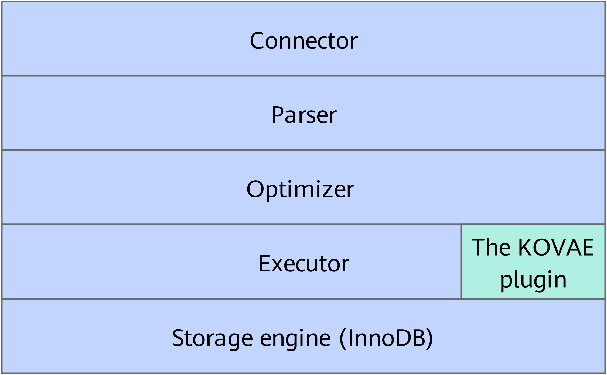
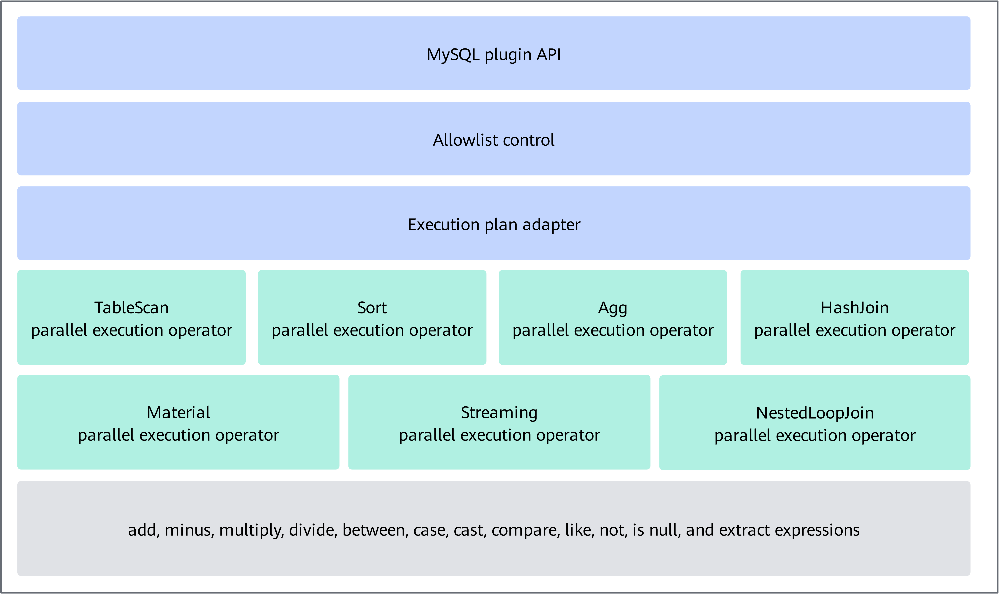
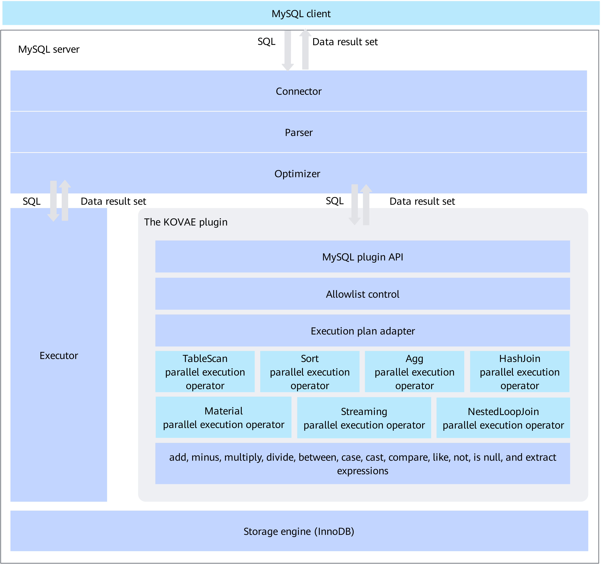
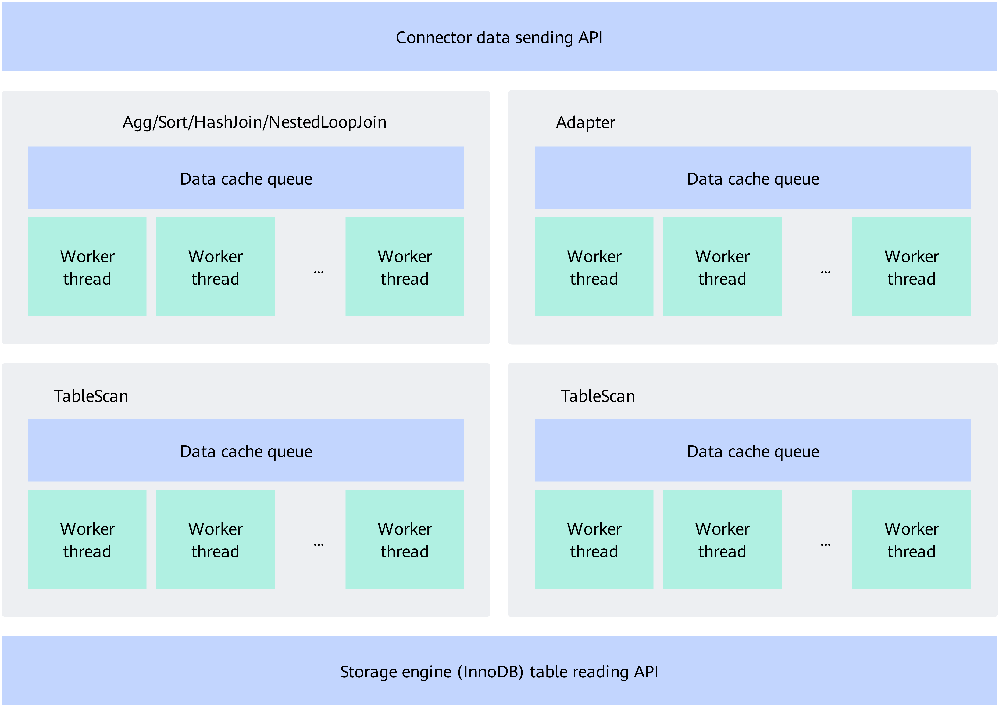
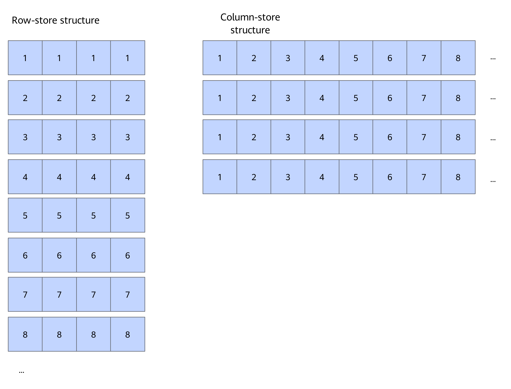

# MySQL Pluggable Online Vectorized Analysis Engine Feature Guide

## Feature Description<a name="EN-US_TOPIC_0000002550183953"></a>

### Overview<a name="EN-US_TOPIC_0000001805304434"></a>

This document describes how to deploy MySQL Pluggable Kunpeng Online Vectorized Analysis Engine (KOVAE) on a Kunpeng server running the openEuler OS and use the KOVAE features. This document also provides solutions to faults that may occur during the use of KOVAE.

To improve the performance of online analytical processing (OLAP), MySQL provides a reserved interface for the secondary engine. KOVAE is a lightweight implementation of the secondary engine, and it presents itself as a MySQL plugin.

Providing features of the secondary engine, KOVAE as a plugin has the following advantages:

- Free of intrusive modification on the MySQL source code
- Hot-installable or hot-uninstallable as a plugin without restarting or interrupting services
- Offloading suitable SQL statements to the secondary engine for execution, significantly shortening the execution time of the SQL statements through parallel execution
- KAEzip in Kunpeng Accelerator Engine (KAE) is utilized by drive flushing operators to compress flushed files, saving drive space

The parallel acceleration technology provided by KOVAE improves the query performance of OLAP by over three times.

**Related Concepts<a name="section184141303214"></a>**

KAE is a hardware acceleration solution based on the Kunpeng 920 processor. It includes KAE encryption and decryption as well as KAEzip. KAEzip is the compression module of KAE. It implements the deflate algorithm and works with the lossless user-space driver framework to provide high-performance gzip or zlib interfaces. For more information about KAEzip, see [Kunpeng Accelerator Engine User Guide](https://www.hikunpeng.com/document/detail/en/kunpengaccel/kae/usermanual/kunpengaccel_16_0002.html).

**Compatibility<a name="section65704516331"></a>**

This feature is compatible with other features. For details about the compatibility between MySQL features, see [Compatibility Between Features](https://www.hikunpeng.com/document/detail/en/kunpengdbs/appAccelFeatures/compbf/kunpengdbsmysqlfeaturecompatibility_20_0001.html).


### Software Architecture<a name="EN-US_TOPIC_0000002550183951"></a>

KOVAE is an engine in the MySQL executor layer which is below the optimizer layer. KOVAE uses the plugin API provided by MySQL, and filters and transfers the SQL statements that meet the parallel conditions to the KOVAE execution engine for parallel execution. KOVAE better leverages the multi-core advantage of the Kunpeng server, thereby improving the SQL statement execution performance.

[**Figure 1**](#location-of-kovae-in-mysql) shows the location of KOVAE in MySQL. After the optimizer layer makes an execution plan, KOVAE determines whether the execution plan is to be executed by the MySQL executor or KOVAE itself. In some cases, KOVAE can transfer the execution plan back to the MySQL executor for execution.

**Figure 1** Location of KOVAE in MySQL<a name="fig20233125111417"></a><a id="location-of-kovae-in-mysql"></a><br>


[**Figure 2**](#kovae-architecture) shows the KOVAE architecture.

- MySQL plugin API: It is a standard API of the MySQL secondary engine and supports hot installation and hot uninstallation of KOVAE.
- Allowlist control: It ensures that only supported execution plans with performance improvement are executed in KOVAE.
- Execution plan adapter: It transforms MySQL execution plans into execution plans that feature column-store, batch processing, and multi-thread parallel execution.
- Parallel execution operators such as TableScan and Sort: They allow for parallel data processing by operators. For details, see [**Table 1**](#support-for-select-statement-elements-table). This improves the multi-core CPU usage and SQL statement execution performance.
- Expressions such as add and minus: They process the column-store data in batches, so that the vectorization feature of the Arm server can be used to improve the SQL statement execution performance.

**Figure 2** KOVAE architecture<a name="fig666215371344"></a><a id="kovae-architecture"></a><br>



### SQL Statement Specifications Supported by KOVAE<a name="EN-US_TOPIC_0000002550143937" id="sql-statement-specifications-supported-by-kovae"></a>

#### Support for SELECT Statement Elements<a name="EN-US_TOPIC_0000002550183943"></a>

A complete set of SELECT statement elements is as follows. For details about the SELECT statement syntax, visit the [MySQL official website](https://dev.mysql.com/doc/refman/8.0/en/select.html).

```
SELECT
[ALL | DISTINCT | DISTINCTROW ]
[HIGH_PRIORITY]
[STRAIGHT_JOIN]
[SQL_SMALL_RESULT] [SQL_BIG_RESULT] [SQL_BUFFER_RESULT]
[SQL_NO_CACHE] [SQL_CALC_FOUND_ROWS]
select_expr [, select_expr] ...
[into_option]
[FROM table_references
[PARTITION partition_list]]
[WHERE where_condition]
[GROUP BY {col_name | expr | position}, ... [WITH ROLLUP]]
[HAVING where_condition]
[WINDOW window_name AS (window_spec)
[, window_name AS (window_spec)] ...]
[ORDER BY {col_name | expr | position}
[ASC | DESC], ... [WITH ROLLUP]]
[LIMIT {[offset,] row_count | row_count OFFSET offset}]
[into_option]
[FOR {UPDATE | SHARE}
[OF tbl_name [, tbl_name] ...]
[NOWAIT | SKIP LOCKED]
| LOCK IN SHARE MODE]
[into_option]

into_option: {
INTO OUTFILE 'file_name'
[CHARACTER SET charset_name]
export_options
| INTO DUMPFILE 'file_name'
| INTO var_name [, var_name] ...
}
```

[**Table 1**](#support-for-select-statement-elements-table) describes the support for each element in SELECT statements.

**Table 1** Support for SELECT statement elements<a id="support-for-select-statement-elements-table"></a>

|SELECT Statement Element|Description|Supported or Not|
|--|--|--|
|[ALL \| DISTINCT \| DISTINCTROW]|<code>DISTINCT</code> and <code>DISTINCTROW</code> indicate that duplicate columns are returned. <code>ALL</code> (or not using <code>ALL</code>, <code>DISTINCT</code>, and <code>DISTINCTROW</code>) indicates that all records are returned.|Only <code>ALL</code> is supported.<br><code>DISTINCT</code> or <code>DISTINCTROW</code> is not supported.|
|[HIGH_PRIORITY]|Serves for the optimizer and does not affect the execution result set.|This keyword applies to the MySQL optimizer and does not affect KOVAE's execution or judgment.|
|[STRAIGHT_JOIN]|Serves for the optimizer and does not affect the execution result set.|This keyword applies to the MySQL optimizer and does not affect KOVAE's execution or judgment.|
|[SQL_SMALL_RESULT] [SQL_BIG_RESULT] [SQL_BUFFER_RESULT]|Serves for the optimizer and does not affect the execution result set.|This keyword applies to the MySQL optimizer and does not affect KOVAE's execution or judgment.|
|[SQL_NO_CACHE] [SQL_CALC_FOUND_ROWS]|Serves for the optimizer and does not affect the execution result set.|This keyword applies to the MySQL optimizer and does not affect KOVAE's execution or judgment.|
|select_expr [, select_expr] ...|Indicates the expression of the SELECT list. KOVAE judges the type of each item and parameter, and performs recursive judgment on each parameter.|Some are supported. For details, see [Support for Item Types](https://www.hikunpeng.com/document/detail/en/kunpengdbs/appAccelFeatures/kovae/kunpengkovae_20_008.html).|
|[into_option]|Indicates that the result set is written to files on the server.|Not supported. This is not a common scenario.|
|[FROM table_references[PARTITION partition_list]]|Indicates the SQL-related tables and their <code>JOIN</code> relationship.|Some table access types are supported. For details, see [**Table 3**](#supported-table-access-types). Only non-temporary tables are supported. Only InnoDB tables are supported. Full-text indexes are not supported. Partitioned tables are not supported.|
|[WHERE where_condition]|Indicates the expression of the <code>WHERE</code> condition. KOVAE judges the type of each item and parameter, and performs recursive judgment on each parameter.|Some are supported. For details, see [Support for Item Types](https://www.hikunpeng.com/document/detail/en/kunpengdbs/appAccelFeatures/kovae/kunpengkovae_20_008.html).|
|[GROUP BY {col_name \| expr \| position}, ... [WITH ROLLUP]]|Indicates the <code>GROUP BY</code> clause. KOVAE judges the type of each item and parameter, and performs recursive judgment on each parameter.|Some are supported. For details, see [Support for Item Types](https://www.hikunpeng.com/document/detail/en/kunpengdbs/appAccelFeatures/kovae/kunpengkovae_20_008.html).|
|[HAVING where_condition]|Indicates the expression of the <code>HAVING</code> condition. KOVAE judges the type of each item and parameter, and performs recursive judgment on each parameter.|Some are supported. For details, see [Support for Item Types](https://www.hikunpeng.com/document/detail/en/kunpengdbs/appAccelFeatures/kovae/kunpengkovae_20_008.html).|
|[WINDOW window_name AS (window_spec) [, window_name AS (window_spec)] ...]|Indicates window functions.|Not supported.|
|[ORDER BY {col_name \| expr \| position}[ASC \| DESC], ... [WITH ROLLUP]]|Indicates the <code>ORDER BY</code> clause. KOVAE judges the type of each item and parameter, and performs recursive judgment on each parameter.|Some are supported. For details, see [Support for Item Types](https://www.hikunpeng.com/document/detail/en/kunpengdbs/appAccelFeatures/kovae/kunpengkovae_20_008.html).|
|[LIMIT {[offset,] row_count \| row_count OFFSET offset}]|Indicates the <code>LIMIT</code> clause.|Supported.|
|[into_option]|Indicates that the result set is written to files on the server.|Not supported. This is not a common scenario.|
|[FOR {UPDATE \| SHARE}[OF tbl_name [, tbl_name] ...]<br>[NOWAIT \| SKIP LOCKED]<br>\| LOCK IN SHARE MODE]|Indicates that locking reads are performed on the queried data.|Not supported.|
|[into_option]|Indicates that the result set is written to files on the server.|Not supported. This is not a common scenario.|


**Table 2** Support for other items<a id="support-for-other-items"></a>

|Item|Supported or Not|
|--|--|
|Statement type|Only the same type of statements (SELECT query) as <code>SQLCOM_SELECT</code> is supported. Other statement types such as <code>UPDATE</code> are not supported.|
|Union|Simple non-UNION SELECT statements are supported.|
|Number of primary tables/Number of constant tables|Queries where primary tables contain constant tables are not supported.|
|AGG row number estimation|Execution plans that have not fully evaluated AGG are not supported.|
|Querying the maximum number of fields|Query statements where the number of fields is greater than the value of <code>MAX_FIELDS</code> are not supported.|
|Query in which the optimizer determines an empty result set|If the optimizer has determined that the query result set must be an empty set, the query is not supported.|
|Character set|Only the UTF8MB4 character set is supported.|


Only the first five table access types in [**Table 3**](#supported-table-access-types) are supported.

**Table 3** Supported table access types<a id="supported-table-access-types"></a>

|Table Access Type|Description|Supported or Not|
|--|--|--|
|JT_EQ_REF|Equality matching on a unique index|Supported|
|JT_REF|Equality matching on a non-unique index|Supported|
|JT_ALL|Full table scanning|Supported|
|JT_RANGE|Range scanning|Supported|
|JT_INDEX_SCAN|Scanning on leaf nodes of indexes|Supported|
|JT_SYSTEM|-|Not supported|
|JT_CONST|-|Not supported|
|JT_FT|-|Not supported|
|JT_REF_OR_NULL|-|Not supported|
|JT_INDEX_MERGE|-|Not supported|


#### Support for Execution Plans<a name="EN-US_TOPIC_0000002518544216"></a>

##### Support for Operators<a name="EN-US_TOPIC_0000002550143943"></a>

[**Table 1**](#supported-operators) describes the operators supported by KOVAE. Other operators are not supported so far.

**Table 1** Supported operators<a id="supported-operators"></a>

|MySQL Open-Source Operator|Description|Supported or Not|
|--|--|--|
|TableScanIterator|Full table scan operator iterator|Supported|
|IndexRangeScanIterator|Index range scan iterator|Supported|
|RefIterator|Operator iterator of equality matching on a non-unique index|Supported|
|EQRefIterator|Equality matching on a unique index|Supported|
|LimitOffsetIterator|Limit operator|Supported|
|FilterIterator|Filter operator|Supported|
|NestedLoopIterator|NestedLoopJoin operator|Supported|
|HashJoinIterator|HashJoin operator|Supported|
|AggregateIterator|Aggregate operator|Supported|
|SortingIterator|Sort operator|Supported|
|TemptableAggregateIterator|Aggregate operator for saving grouping results in a temporary table|Supported|
|MaterializeIterator|Materialize operator|Supported|
|StreamingIterator|Streaming operator|Supported|


##### Support for Item Types<a name="EN-US_TOPIC_0000002550143935"></a>

[**Table 1**](#supported-item-types) lists the item types supported by KOVAE. Other item types are not supported so far.

**Table 1** Supported item types<a id="supported-item-types"></a>

|Item Type|Description|Supported or Not|
|--|--|--|
|FIELD_ITEM|Common data column|Supported|
|FUNC_ITEM|Common function|Supported|
|SUM_FUNC_ITEM|SUM function|Supported|
|COND_ITEM|AND function or OR function|Supported|
|REF_ITEM|Column reference|Supported|
|STRING_ITEM|Constant of the string type|Supported|
|INT_ITEM|Constant of the int type|Supported|
|DECIMAL_ITEM|Constant of the decimal type|Supported|
|CACHE_ITEM|-|Supported|


[**Table 2**](#supported-functions) lists the functions supported by KOVAE. Other functions are not supported so far.

**Table 2** Supported functions<a id="supported-functions"></a>

|Function|Description|
|--|--|
|+|Addition, arithmetic operations|
|-|Subtraction, arithmetic operations|
|*|Multiplication, arithmetic operations|
|/|Division, arithmetic operations|
|>|Greater than, assertion|
|<|Less than, assertion|
|=|Equal to, assertion|
|<>|Not equal to, assertion|
|>=|Greater than or equal to, assertion|
|<=|Less than or equal to, assertion|
|like|Substring match|
|and|AND, logical operation|
|or|OR, logical operation|
|sum|Summation|
|avg|Averaging|
|count|Count|
|min|Minimum value|
|date_literal|Date literal|
|between...and...|Between|
|case|Enumeration processing of <code>CASE THEN</code>|
|IN|In|
|not|Negation|
|isnull|Null or not|
|substr|Obtaining a substring of a character string|
|date|Forcible conversion to the date type|
|date_add|Date addition|
|year|Extracting year from data|
|timestamp|Forcible conversion to the timestamp type|
|cast|Forcible conversion to a specified type|
|extract|Extracting a specific part of the date|


##### Support for Data Types<a name="EN-US_TOPIC_0000002550183955"></a>

[**Table 1**](#supported-data-types) lists the data types supported by KOVAE. Other data types are not supported so far.

**Table 1** Supported data types<a id="supported-data-types"></a>

|Data Type|Description|
|--|--|
|MYSQL_TYPE_LONG|Integer type|
|MYSQL_TYPE_DATE|Date type|
|MYSQL_TYPE_TIMESTAMP|Timestamp type|
|MYSQL_TYPE_STRING|Character string type (only the UTF8MB3 and UTF8MB4 character sets are supported)|
|MYSQL_TYPE_VARCHAR|Variable-length string type (only the UTF8MB3 and UTF8MB4 character sets are supported)|
|MYSQL_TYPE_FLOAT|Float type|
|MYSQL_TYPE_DOUBLE|Double type|
|MYSQL_TYPE_LONGLONG|BIGINT type|
|MYSQL_TYPE_DATETIME|Datetime type|
|MYSQL_TYPE_NEWDECIMAL|High-precision decimal or numeric type|


##### Other Support Rules<a name="EN-US_TOPIC_0000002518704108"></a>

In addition to the support rules for SELECT statement elements, operators, items, and data types, there are some other restrictions and rules on the secondary engine usage, as shown in [**Table 1**](#other-support-rules-table).

**Table 1** Other support rules<a id="other-support-rules-table"></a>

|Rule|Description|
|--|--|
|Support for the aggregate function COUNT|<code>INVALID_TYPE</code> is not supported. Other data types are supported.|
|Support for the aggregate functions SUM and AVG|<code>MYSQL_TYPE_DATE</code>, <code>MYSQL_TYPE_TIME</code>, <code>MYSQL_TYPE_TIMESTAMP</code>, <code>MYSQL_TYPE_STRING</code>, and <code>MYSQL_TYPE_VARCHAR</code> are not supported.|
|Support for the aggregate functions MIN and MAX|<code>MYSQL_TYPE_STRING</code> and <code>MYSQL_TYPE_VARCHAR</code> are not supported.|
|Aggregate functions COUNT, SUM, AVG, MIN, and MAX not supporting the <code>distinct</code> parameter|Aggregate functions do not support parameters with <code>distinct</code>, for example, <code>sum(distinct a)</code> and <code>sum(distinct (a+b))</code>.|
|Support for HashJoin|Connection of 10 same data types is supported. The data types must be all signed numbers or all unsigned numbers. Connection of constant columns (for examples, column <code>1 as b</code> in a view) is not supported.|
|Support for NestedLoopJoin|Only the scenario where the internal table uses the equality index scanning operator or the filtering and equality index scanning operator is supported.|
|Support for the equality index scanning operator|Primary key indexes, unique indexes, common indexes, and composite indexes are supported. Prefix indexes are not supported. For index conditions, only same data types are supported, and constants and expressions are not supported.|


### Reference Standards and Protocols<a name="EN-US_TOPIC_0000002518704104"></a>

- [MySQL SELECT statement structure standards](https://dev.mysql.com/doc/refman/8.0/en/select.html)
- [MySQL plugin standards](https://dev.mysql.com/doc/refman/8.0/en/plugin-loading.html)
- [MySQL configuration parameter standards](https://dev.mysql.com/doc/refman/8.0/en/server-option-variable-reference.html)


### Constraints<a name="EN-US_TOPIC_0000002518544208"></a>

Before configuring KOVAE, you are advised to understand the impact of KOVAE on the system and its constraints on applications.

**Impact on the System<a name="section1848994713253"></a>**

- For the database, after KOVAE is installed, some SQL statements that meet the conditions are offloaded to KOVAE for execution. The execution time of these SQL statements can be shortened.
- For the OS, after KOVAE is installed:
    - CPU usage will increase. The extent depends on the combined impact of `kovae_threadpool_size`, `kovae_parallel_threads`, the available number of CPUs, and the number of SQL statements being executed on KOVAE.
    - Memory usage will increase. The maximum memory usage when executing a single SQL statement ≈ (Total number of parallel operators related to the SQL statement + Number of operators × Data queue size) × 1,024 rows × Size of data in a single row.

        > **NOTE:**
        >The default maximum number of lines that can be processed in a batch is 1,024.

    - The occupied drive space may increase. If the amount of data stored by the Join, Sort, Materialize, and Agg operators exceeds the specified value, data is flushed to drives and cached in the drive space. In addition, based on the configured log level, KOVAE outputs logs to the MySQL error log file or performs standard log output in the background.

**Application Constraints<a name="section0549122572711"></a>**

- Currently, KOVAE adapts only to MySQL 8.0.25. Other MySQL versions are not verified.
- KOVAE performs parallel executions. If the SQL statements specify no result set sorting information, the result set may be sorted differently from that of the open-source MySQL.
- Only some SQL statements can be offloaded to KOVAE for execution. For details, see [SQL Statement Specifications Supported by KOVAE](#sql-statement-specifications-supported-by-kovae). You can add hints or set cost thresholds to control the offloading conditions for SQL statements.


### Application Scenarios<a name="EN-US_TOPIC_0000002550143953"></a>

KOVAE applies to OLAP query, large data volume, and multi-core CPU scenarios.

The required scenarios where this feature can apply to are as follows:

- OLAP query, which does not require transaction support
- Large amount of data to be queried (more than 10,000 lines recommended)
- Multi-core CPUs for parallel advantage, requiring the number of logical CPU cores greater than 2


### Principles<a name="EN-US_TOPIC_0000002518544210"></a>

Before configuring KOVAE, you are advised to understand the running principles and internal execution process of the KOVAE system. KOVAE optimizes the execution plans of SQL queries, leverages the advantages of parallel processing mechanism and column-store structure to efficiently process SQL queries.

SQL statements from the client are received by the MySQL connector and passed through the parser and optimizer to generate execution plans for the query. According to the rules, execution plans are either executed by the default executor or offloaded to KOVAE for execution. After the execution is complete, the result set is returned to the client. [**Figure 1**](#kovae-running-principle) shows the data flows of the SQL statement and execution result set.

**Figure 1** KOVAE running principle<a name="fig122196231119"></a><a id="kovae-running-principle"></a>


[**Figure 2**](#parallel-execution-architecture) shows the KOVAE internal execution process.

**Figure 2** Parallel execution architecture<a name="fig1778034211311"></a><a id="parallel-execution-architecture"></a><br>


The TableScan operator uses multiple worker threads to concurrently invoke the API for InnoDB table reading and saves the data in the cache queue of the TableScan operator.

Upper-layer operators (such as Agg, Sort, HashJoin or NestedLoopJoin) of the TableScan operator obtain the data from the data cache queue of the lower-layer operator for processing. Each upper-layer operator can contain multiple worker threads for parallel processing, which can give full play to the multi-core advantage of Arm servers.

**Figure 3** Row-store and column-store structures<a name="fig1049515441142"></a><a id="row-store-and-column-store-structures"></a><br>


MySQL InnoDB uses the row-store structure while KOVAE uses the column-store structure. When a specified column is calculated, data in the same column is adjacent in the memory, which makes data processing more efficient.


## KOVAE Deployment<a name="EN-US_TOPIC_0000002550183945"></a>

### Environment Requirements<a name="EN-US_TOPIC_0000002518704116"></a>

KOVAE is used as a MySQL plugin library and cannot run independently. It must be used on a server where MySQL 8.0.25 has been installed.

For details about how to compile and install MySQL 8.0.25, see [MySQL Porting Guide](https://www.hikunpeng.com/document/detail/en/kunpengdbs/ecosystemEnable/MySQL/kunpengmysql8017_02_0001.html).

**Hardware Requirements<a name="section54967495"></a>**

[**Table 1**](#hardware-requirements) lists the hardware requirements.

**Table 1** Hardware requirements<a id="hardware-requirements"></a>

|Item|Description|
|--|--|
|Server|Kunpeng server|
|Processor|Kunpeng 920 series|
|Drive|If a performance test needs to be performed, at least two drives are required: one system drive and one data drive. If no performance test needs to be performed, a data directory can be directly created on the system drive. Configure the number of drives based on actual requirements.|


**OS and Software Requirements<a name="section771295715106"></a>**

- Run the `cat /etc/*-release` command to query the OS information.

    Run the `lscpu` command to query the processor information.

    Run the `uname -r` command to query the kernel version.

    Run the `uname -a` command to query the environment information.

- If you need to install an OS, choose `Minimal Install` and select `Development Tools` to minimize manual operations.

[**Table 2**](#os-and-software-requirements) lists the OS and software requirements.

**Table 2** OS and software requirements<a id="os-and-software-requirements"></a>

|Item|Version|How to Obtain|
|--|--|--|
|OS|20.03 LTS SP1 for Arm|[Link](https://repo.huaweicloud.com/openeuler/openEuler-20.03-LTS-SP1/ISO/aarch64/openEuler-20.03-LTS-SP1-everything-aarch64-dvd.iso)|
|OS|22.03 LTS SP1 for Arm|[Link](https://repo.huaweicloud.com/openeuler/openEuler-22.03-LTS-SP1/ISO/aarch64/openEuler-22.03-LTS-SP1-everything-aarch64-dvd.iso)|
|CMake|3.5.2 (openEuler 20.03)|[Link](https://cmake.org/files/v3.5/cmake-3.5.2.tar.gz)|
|CMake|3.11.4 (openEuler 22.03)|By default, CMake 3.11.4 is provided by openEuler 22.03.|
|GCC|7.3.0 (openEuler 20.03)|[Link](https://mirrors.tuna.tsinghua.edu.cn/gnu/gcc/gcc-7.3.0/gcc-7.3.0.tar.gz)|
|GCC|10.3.1 (openEuler 22.03)|By default, GCC 10.3.1 is provided by openEuler 22.03.|
|KAE|KAE 1.0 (for openEuler kernel 4.19)|[Link](https://gitee.com/kunpengcompute/KAE/tree/kae1/)|
|KAE|KAE 2.0 (for openEuler kernel 5.10)|The KAE 2.0 source package contains the KAEzip module. You can install all KAE modules in one-click mode or install the KAEzip module separately.<br>[Link](https://gitcode.com/boostkit/KAE/tree/kae2)|
|BoostKit_Kovae_1.0.0.zip|1.0.0|Download the [BoostKit_Kovae_1.0.0.zip](https://kunpeng-repo.obs.cn-north-4.myhuaweicloud.com/Kunpeng%20BoostKit/Kunpeng%20BoostKit%2024.0.0/BoostKit_Kovae_1.0.0.zip) package and decompress it to obtain the <code>ha_kovae.so</code> file.<br>Before using the software package, read and agree to [Kunpeng BoostKit User License Agreement 2.0](https://www.hikunpeng.com/en/developer/boostkit/software/protocol).|
|MySQL|8.0.25|[Link](https://downloads.mysql.com/archives/get/p/23/file/mysql-boost-8.0.25.tar.gz)


### Integrity Verification<a name="EN-US_TOPIC_0000002518544212"></a>

After obtaining the software package, verify that it is consistent with that provided on the corresponding website.

1. Obtain the software digital certificate and software package from the enterprise website or Kunpeng community.
2. <a id="li761512252359"></a>Obtain the [verification tool and guide](https://support.huawei.com/enterprise/en/tool/pgp-verify-TL1000000054).
3. Verify the software package integrity by following the procedure described in the *OpenPGP Signature Verification Guide* obtained in [2](#li761512252359).

### KAEzip Installation<a name="EN-US_TOPIC_0000002518544200"></a>

Install KAEzip to reduce the drive space required by the system.

1. Install KAEzip.

    The KAE source package contains the KAEzip module. You can install all KAE modules in one-click mode or install the KAEzip module separately. For details, see [Kunpeng Accelerator Engine User Guide](https://www.hikunpeng.com/document/detail/en/kunpengaccel/kae/usermanual/kunpengaccel_16_0002.html). Strictly follow the operations in this guide. Before installing KAEzip, prepare for the installation such as preparing for the installation environment and obtaining the KAE license.

2. Create a symbolic link.

    ```
    ln -s /usr/local/kaezip/lib/libz.so.1.2.11 /usr/local/kaezip/lib/libzkae.so
    ```

3. Set the path for loading the dynamic library.

    ```
    export LD_LIBRARY_PATH=/usr/local/kaezip/lib:/usr/local/lib:$LD_LIBRARY_PATH
    ```


### KOVAE Installation<a name="EN-US_TOPIC_0000002518704102"></a>

KOVAE can be loaded to the MySQL service by modifying the `my.cnf` configuration file or running the `install plugin` statement on the MySQL client. The method of modifying the configuration file requires database startup for the modifications to take effect.

**Procedure<a name="section1292258692"></a>**

1. Obtain the KOVAE package `BoostKit_Kovae_1.0.0.zip` and decompress it to obtain the `ha_kovae.so` file.

    For details about how to obtain the package, see [**Table 2**](#os-and-software-requirements).

2. Log in to the MySQL service through the MySQL client.
3. On the MySQL client, send a statement to query the path where the MySQL plugin is stored (`plugin_dir`):

    ```
    show variables like "%plugin_dir%";
    ```

    The following information is displayed, in which `/usr/local/mysql-8.0.25/lib/plugin/` indicates the path for storing the MySQL plugin (`plugin_dir`).

    ```
    +---------------+--------------------------------+
    | Variable_name | Value                          |
    +---------------+--------------------------------+
    | plugin_dir    | /usr/local/mysql-8.0.25/lib/plugin/ |
    +---------------+--------------------------------+
    1 row in set (0.00 sec)
    ```

4. Copy the `ha_kovae.so` file to the path for storing the MySQL plugin.
    1. Use SFTP or SCP to copy `ha_kovae.so` to the path specified by `plugin_dir`. In this example, the path is `/usr/local/mysql-8.0.25/lib/plugin/`.
    2. After copying the file, use a terminal tool such as SSH to log in to the server.
    3. On the SSH terminal, run the following command to check `ha_kovae.so` in the path specified by `plugin_dir`:

        ```
        ls /usr/local/mysql-8.0.25/lib/plugin/ha_kovae.so
        ```

        The `ha_kovae.so` file information is returned as follows:

        ```
        /usr/local/mysql-8.0.25/lib/plugin/ha_kovae.so
        ```

5. Grant the execute permission on `ha_kovae.so`.

    ```
    chmod 755 /usr/local/mysql-8.0.25/lib/plugin/ha_kovae.so
    ```

    Check the configured permission on `ha_kovae.so`.

    ```
    ll /usr/local/mysql-8.0.25/lib/plugin/ha_kovae.so
    ```

    The following information is displayed, indicating that the permission on `ha_kovae.so` is set to `-rwxr-xr-x`:

    ```
     -rwxr-xr-x 1 root root 1839816 May 16 17:00 /usr/local/mysql-8.0.25/lib/plugin/ha_kovae.so
    ```

6. Load the `ha_kovae.so` plugin to the MySQL service.

    Install the KOVAE plugin in either of the following ways.

    > **NOTE:**
    >To prevent buffer overflow attacks, you are advised to use the address space layout randomization (ASLR) technology to randomize the layout of linear areas such as the heap, stack, and shared library mapping to make it more difficult for attackers to predict target addresses and locate code. This technology can be applied to heaps, stacks, and memory mapping areas (mmap base addresses, shared libraries, and vDSO pages).
    >Run the following command to enable ASLR:
    >```
    >echo 2 > /proc/sys/kernel/randomize_va_space
    >```

    - Method 1: Automatically load and install the plugin. Add a configuration line under the `[mysqld]` section in the `my.cnf` file. Restart the database to make the configuration take effect. For example:

        ```
        plugin-load-add=ha_kovae.so
        ```

    - Method 2: Manually load and install the plugin.
        1. Log in to the MySQL service through the MySQL client.
        2. Install the `ha_kovae.so` plugin.

            ```
            install plugin kovae soname "ha_kovae.so";
            ```

            If the following information is displayed, the installation is successful:

            ```
            Query OK, 0 rows affected (0.01 sec)
            ```


### KOVAE Enablement<a name="EN-US_TOPIC_0000002518544204"></a>

After KOVAE is installed, you need to enable KOVAE in the database and ensure that the SQL statements related to the target tables are executed in KOVAE. This section uses the test table `t1` as an example.

**Procedure<a name="section027774044912"></a>**

1. Log in to the MySQL service through the MySQL client. For example:

    ```
    mysql -uroot -p -S /data/mysql/run/mysql.sock
    ```

    Change the path of the `/data/mysql/run/mysql.sock` file based on actual requirements.

2. Execute the following statement on the MySQL client to set the secondary engine of the target table to KOVAE. Each table needs to be configured only once. Reconfiguration is not required after the MySQL service is restarted. `t1` indicates the name of the target table. Change it based on actual requirements.

    ```
    ALTER TABLE t1 SECONDARY_ENGINE = kovae;
    ```

    If the following information is displayed, the operation is successful:

    ```
    Query OK, 0 rows affected (0.01 sec)
    Records: 0  Duplicates: 0  Warnings: 0
    ```

3. Check the secondary engine settings of the table. `t1` indicates the name of the target table. Change it based on actual requirements.

    ```
    show create table t1;
    ```

    If `SECONDARY_ENGINE=kovae` is displayed in the target table creation information, the operation is successful.

    ```
    +-------+--------------------------------------------------------------------------------------------------------------------------------------------------------------+
    | Table | Create Table
                  |
    +-------+--------------------------------------------------------------------------------------------------------------------------------------------------------------+
    | t1    | CREATE TABLE `t1` (
      `a` int DEFAULT NULL,
      `b` int DEFAULT NULL
    ) ENGINE=InnoDB DEFAULT CHARSET=utf8mb4 COLLATE=utf8mb4_0900_ai_ci SECONDARY_ENGINE=kovae |
    +-------+--------------------------------------------------------------------------------------------------------------------------------------------------------------+
    1 row in set (0.00 sec)
    ```

4. Load the target table to KOVAE, so that the SQL statements related to the target table can be executed in KOVAE. `t1` indicates the name of the target table. Change it based on actual requirements.

    > **NOTICE:**
    >Each table needs to be configured only once. The target table needs to be loaded to KOVAE again after the MySQL service is restarted.

    ```
    ALTER TABLE t1 SECONDARY_LOAD;
    ```

    If the following information is displayed, the operation is successful:

    ```
    Query OK, 0 rows affected (0.00 sec)
    ```


### KOVAE Verification<a name="EN-US_TOPIC_0000002550183961"></a>

After setting the secondary engine of the target table to KOVAE, perform the following steps to verify whether KOVAE is available for use. This section uses the test table `t1` as an example.

**Procedure<a name="section570975244916"></a>**

1. Log in to the MySQL service through the MySQL client.
2. Execute the following statement on the MySQL client to set the connection character set:

    ```
    set character_set_connection=utf8mb4;
    ```

    If the following information is displayed, the operation is successful:

    ```
     Query OK, 0 rows affected (0.00 sec)
    ```

    Check whether the connection character set is configured successfully.

    ```
    show variables like "%character_set_connection%";
    ```

    The expected result for successful connection character set configuration is as follows:

    ```
    +--------------------------+---------+
    | Variable_name            | Value   |
    +--------------------------+---------+
    | character_set_connection | utf8mb4 |
    +--------------------------+---------+
    1 row in set (0.00 sec)
    ```

3. After setting the secondary engine of the target table to KOVAE, run the following command to load the table. `t1` indicates the name of the target table. Change it based on actual requirements.

    ```
    ALTER TABLE t1 SECONDARY_LOAD;
    ```

    If the following information is displayed, the operation is successful:

    ```
     Query OK, 0 rows affected (0.00 sec)
    ```

4. Set `secondary_engine_cost_threshold` to `0` to ensure that SQL statements can access the secondary engine.

    ```
    set secondary_engine_cost_threshold=0;
    ```

    If the following information is displayed, the operation is successful:

    ```
     Query OK, 0 rows affected (0.00 sec)
    ```

    1. Check the statistics of the current KOVAE status variable.

        ```
        show status like '%kovae%';
        ```

        The expected result is as follows:

        ```
        +-------------------------------+-------+
        | Variable_name                 | Value |
        +-------------------------------+-------+
        | kovae_enter_times             | 0     |
        | kovae_execution_times         | 0     |
        | kovae_execution_succeed_times | 0     |
        +-------------------------------+-------+
        3 rows in set (0.00 sec)
        ```

    2. Query all data in the `t1` table.

        ```
        select * from t1;
        ```

        The expected result is as follows:

        ```
        +------+------+
        | a    | b    |
        +------+------+
        |    1 |    2 |
        |    2 |    3 |
        +------+------+
        2 rows in set (0.01 sec)
        ```

    3. Run the following command to check the updated statistics of the KOVAE status variable:

        ```
        show status like '%kovae%';
        ```

        It can be seen that the value of `kovae_execution_succeed_times` is updated, that is, the SQL statements have accessed KOVAE and are successfully executed in KOVAE.

        ```
        +-------------------------------+-------+
        | Variable_name                 | Value |
        +-------------------------------+-------+
        | kovae_enter_times             | 1     |
        | kovae_execution_times         | 1     |
        | kovae_execution_succeed_times | 1     |
        +-------------------------------+-------+
        3 rows in set (0.00 sec)
        ```


### KOVAE Uninstallation<a name="EN-US_TOPIC_0000002550143951"></a>

Perform the following steps only when you no longer need KOVAE. Before uninstalling KOVAE, change all the secondary engine tables of KOVAE to the `UNLOAD` state. This section uses the test table `t1` as an example.

For details about the configuration and operation of standard MySQL plugins, see [Installing and Uninstalling Plugins](https://dev.mysql.com/doc/refman/8.0/en/plugin-loading.html).

**Procedure<a name="section142673063219"></a>**

1. Log in to the MySQL service through the MySQL client.
2. Unload all tables whose secondary engine is KOVAE. `t1` indicates the name of the target table. Change it based on actual requirements.

    > **NOTE:**
    >If multiple tables need to be unloaded, execute the SQL statement to unload the target tables one by one.

    ```
    ALTER TABLE t1 SECONDARY_UNLOAD;
    ```

    If the following information is displayed, the operation is successful:

    ```
    Query OK, 0 rows affected (0.00 sec)
    ```

3. Change the secondary engine of the tables from KOVAE to `null`. `t1` indicates the name of the target table. Change it based on actual requirements.

    ```
    ALTER TABLE t1 SECONDARY_ENGINE = null;
    ```

    If the following information is displayed, the operation is successful:

    ```
    Query OK, 0 rows affected (0.01 sec)
    Records: 0  Duplicates: 0  Warnings: 0
    ```

4. Execute the following statement to uninstall KOVAE:

    ```
    uninstall plugin kovae;
    ```

    If the following information is displayed, the operation is successful:

    ```
    Query OK, 0 rows affected (0.32 sec)
    ```


## Feature Usage<a name="EN-US_TOPIC_0000002550143939" id="feature-usage"></a>

### Setting and Clearing the Secondary Engine Attribute of a Data Table<a name="EN-US_TOPIC_0000002550143949" id="setting-and-clearing-the-secondary-engine-attribute-of-a-data-table"></a>

To set and clear the secondary engine attribute of a data table, you must have the permission to modify the data table. When unloading the secondary engine or managing and maintaining the data table, you may be involved in setting the secondary engine attribute of the data table. This section uses the test table `t1` as an example.

**Setting the Secondary Engine Attribute of a Data Table<a name="section41214268588"></a>**

1. Log in to the MySQL service through the MySQL client.
2. Set the secondary engine of the data table to KOVAE. `t1` indicates the name of the target table. Change it based on actual requirements.

    ```
    ALTER TABLE t1 SECONDARY_ENGINE = kovae;
    ```

    If the following information is displayed, the operation is successful:

    ```
    Query OK, 0 rows affected (0.01 sec)
    Records: 0  Duplicates: 0  Warnings: 0
    ```

**Clearing the Secondary Engine Attribute of a Data Table<a name="section103429537019"></a>**

1. Log in to the MySQL service through the MySQL client.
2. Clear the secondary engine configuration information of the data table. `t1` indicates the name of the target table. Change it based on actual requirements.

    ```
    ALTER TABLE t1 SECONDARY_ENGINE = null;
    ```

    If the following information is displayed, the operation is successful:

    ```
    Query OK, 0 rows affected (0.01 sec)
    Records: 0  Duplicates: 0  Warnings: 0
    ```


### Loading and Unloading a Data Table on the Secondary Engine<a name="EN-US_TOPIC_0000002550183959" id="loading-and-unloading-a-data-table-on-the-secondary-engine"></a>

Loading a data table to the secondary engine is the prerequisite for offloading the table-related SQL statements to KOVAE for execution. Before uninstalling KOVAE, you need to perform this operation to change all the secondary engine tables of KOVAE to the `UNLOAD` state. To load and unload a data table on the secondary engine, you must have the permission to modify the data table. This section uses the test table `t1` as an example.

**Loading a Data Table to the Secondary Engine<a name="section1033819566214"></a>**

1. Log in to the MySQL service through the MySQL client.
2. Load a data table to the secondary engine. `t1` indicates the name of the target table. Change it based on actual requirements.

    ```
    ALTER TABLE t1 SECONDARY_LOAD;
    ```

    If the following information is displayed, the operation is successful:

    ```
    Query OK, 0 rows affected (0.00 sec)
    ```

**Unloading a Data Table from the Secondary Engine<a name="section15827423945"></a>**

1. Log in to the MySQL service through the MySQL client.
2. Unload a data table from the secondary engine. `t1` indicates the name of the target table. Change it based on actual requirements.

    ```
    ALTER TABLE t1 SECONDARY_UNLOAD;
    ```

    If the following information is displayed, the operation is successful:

    ```
    Query OK, 0 rows affected (0.00 sec)
    ```


### Setting Whether an SQL Statement Accesses the Secondary Engine for Execution<a name="EN-US_TOPIC_0000002518544206" id="setting-whether-a-sql-statement-accesses-the-secondary-engine-for-execution"></a>

You can set whether an SQL statement accesses the secondary engine for execution using one of the following methods: Adding hints to rewrite the SQL statement, setting the query cost threshold, or using the allowlist for filtering.

**Adding Hints to Rewrite SQL Statements<a name="section10704509124"></a>**

For an SQL statement, add hints to force the SQL statement to access the secondary engine or not.

1. Log in to the MySQL service through the MySQL client.
2. Set whether the SQL statement accesses the secondary engine for execution.
    - Force it to access the secondary engine.

        ```
        SELECT /*+ SET_VAR(use_secondary_engine = FORCED) */ ... FROM ...
        ```

    - Force it not to access the secondary engine.

        ```
        SELECT /*+ SET_VAR(use_secondary_engine = OFF) */ ... FROM ...
        ```

**Setting the Query Cost Threshold<a name="section1259118499167"></a>**

1. Log in to the MySQL service through the MySQL client.
2. Set the query cost threshold.

    ```
    set secondary_engine_cost_threshold=<Cost_threshold>;
    ```

    For example, in the following SELECT statement, `cost` in the statement is `0.35`. After `secondary_engine_cost_threshold` is set to a value less than `0.35` (for example, `0.1`), the statement can access KOVAE to be filtered by the allowlist and be executed in KOVAE if it passes the filtering.

    ```
    explain format=tree select * from t1;
    ```

    ```
    +------------------------------------------+
    | EXPLAIN                                  |
    +------------------------------------------+
    | -> Table scan on t1  (cost=0.35 rows=1)  |
    +------------------------------------------+
    1 row in set (0.00 sec)
    ```

**Allowlist Filtering<a name="section1131174110213"></a>**

Currently, the allowlist cannot be manually configured. For details about the support for SQL statements by KOVAE, see [SQL Statement Specifications Supported by KOVAE](#sql-statement-specifications-supported-by-kovae).


### Setting and Querying KOVAE Parameters and Querying Status Variables<a name="EN-US_TOPIC_0000002518704112" id="setting-and-querying-kovae-parameters-and-querying-status-variables"></a>

You can configure KOVAE parameters by using the database startup command line, the configuration file, or the dynamic modification during the running of MySQL. Three status variables `kovae_enter_times`, `kovae_execution_times`, and `kovae_execution_succeed_times` are added to KOVAE to check KOVAE-related statistics.

**Setting and Querying KOVAE Parameters<a name="section1252641142616"></a>**

[**Table 1**](#kovae-parameters) describes the KOVAE parameters.

**Table 1** KOVAE parameters<a id="kovae-parameters"></a>

|Parameter|Support Startup Command Line or Not|Support the Startup Configuration File or Not|Support Dynamic Modification or Not|Application Scope|Type|Default Value|Value Range|Description|
|--|--|--|--|--|--|--|--|--|
|secondary_engine_cost_threshold|Yes|Yes|Yes|Global|Double|100000|0 to <code>DBL_MAX</code> (maximum double value)|Queries the cost threshold for using the secondary engine. When the cost is greater than the cost threshold, the secondary engine will be used for the query execution.|
|innodb_parallel_read_threads|Yes|Yes|Yes|Session|Unsigned long|4|1–256|Indicates the number of threads that concurrently read a table.|
|kovae_aggregator_hash_type|Yes|Yes|Yes|Session|Unsigned int|0|0 and 1|Indicates the working mode of the Agg operator during hash grouping. <code>0</code> indicates that all worker threads share a hash table. <code>1</code> indicates that each worker thread uses its own hash table. When the number of grouping records is large and the number of grouping result records is small, using mode <code>1</code> has a significant improvement effect. When the number of grouping records and the number of grouping result records are both large (the number of grouping result records is far greater than the number of parallel threads of the current query), mode <code>0</code> is recommended.|
|kovae_hashjoin_batch_num|Yes|Yes|Yes|Session|Unsigned long|1024|128–4096|Indicates the maximum number of partitions in a hash table.|
|kovae_log_level|Yes|Yes|Yes|Global|Unsigned int|2|1–5|Indicates the log output level. The log levels and their corresponding values are as follows:<br>- <code>ERR</code>: <code>1</code><br>- <code>WARNING</code>: <code>2</code><br>- <code>NOTICE</code>: <code>3</code><br>- <code>INFO</code>: <code>4</code><br>- <code>DEBUG</code>: <code>5</code><br>After the log output level is set, logs whose levels are lower than or equal to the configured value will be generated in the error log file of MySQL.|
|kovae_memory_buffer_size|Yes|Yes|Yes|Session|Unsigned long long|1073741824|268435456 to 2<sup>64</sup>–1 (maximum unsigned long long value)|If the memory used by the Sort, Aggregation, HashJoin, and Materialize operators exceeds the number of bytes of the configured value, the flushing process is triggered to reduce the memory usage, which may affect the performance.|
|kovae_memory_control|Yes|Yes|Yes|Global|Bool|0|0 and 1|Indicates the main switch of the memory control function. If this parameter is disabled, the memory for parallel queries tends to be requested from the OS. If this parameter is enabled, the memory that can be requested for parallel queries is controlled by the value of `kovae_memory_max_size`, and all the memory requests for parallel queries from the OS are counted and monitored.|
|kovae_memory_max_size|Yes|Yes|Yes|Global|Long long|10 × 2<sup>30</sup>|2<sup>30</sup> to 2<sup>63</sup>–1 (maximum long long value)|Indicates the total memory that can be requested for parallel queries. The value of <code>kovae_memory_max_size</code> takes effect only after <code>kovae_memory_control</code> is enabled. If the total number of bytes of the memory requested for all query statements exceeds the value of <code>kovae_memory_max_size</code>, the system cannot continue the parallel query process and memory requests may fail. In this case, the query process automatically exits. The memory control is not strict to single byte, and there may be certain errors. The precision of memory control is affected by the operators and number of parallel queries. The value of <code>kovae_memory_max_size</code> should be less than the available memory to ensure that there is reserved memory.|
|kovae_memory_save_num|Yes|Yes|Yes|Global|Unsigned int|100|0–1000|Configures the number of latest parallel query records that can be cached in the <code>information_schema.KOVAE_MEMORY_HISTORY</code> table. After memory control for parallel queries is enabled, you can check historical memory usage records by checking the <code>information_schema.KOVAE_MEMORY_HISTORY</code> table.|
|kovae_serial_mode|Yes|Yes|Yes|Global|Bool|0|0 and 1|Specifies whether to enable the serial mode. After this parameter is enabled, only one SQL statement can be executed for a query.|
|kovae_threadpool_size|Yes|Yes|Yes|Global|Unsigned int|Number of CPU cores. If the number of CPU cores fails to be obtained, the value is <code>1</code>.|1–65535|Indicates the maximum number of threads that can be reserved in the thread pool. All worker threads for parallel queries are requested from the thread pool. When the number of threads in the thread pool is used up, new thread requests are restricted by the <code>kovae_threadpool_stalltime</code> parameter. When the number of requested threads reaches the value of <code>kovae_threadpool_size</code>, new threads can only be requested after the interval specified by <code>kovae_threadpool_stalltime</code>. Generally, the value of <code>kovae_threadpool_size</code> can be set to three to five times the number of available CPU cores.|
|kovae_parallel_threads|Yes|Yes|Yes|Session|Unsigned int|2|1–1000|Indicates the maximum number of worker threads that can be requested in a single parallel query. Generally, <code>kovae_parallel_threads</code> can be set to the value of <code>kovae_threadpool_size</code>/Number of parallel queries and sessions that are simultaneously executed with a high probability.|
|kovae_threadpool_stalltime|Yes|Yes|Yes|Global|Unsigned int|1800|0 to 2<sup>32</sup>–1 (maximum unsigned int value)|When all threads in the thread pool are requested and there are no idle threads, new queries cannot obtain available worker threads. To avoid excessive thread creation and resource waste, a waiting time parameter <code>kovae_threadpool_stalltime</code> is set. Only when the time of two failed requests exceeds the waiting time (in seconds), a new worker thread is created for new parallel queries. Retain the default value of <code>kovae_threadpool_stalltime</code>.|
|kovae_statement_history_schema_size|Yes|Yes|No|Global|Unsigned long long|10000|100 to 2<sup>63</sup>–1 (maximum long long value)|Indicates the maximum number of cached rows in the <code>INFORMATION_SCHEMA.KOVAE_STATEMENT_HISTORY</code> table. The recorded cache is applied for allocation when KOVAE is loaded and released when KOVAE is uninstalled.|
|kovae_threads_history_schema_size|Yes|Yes|No|Global|Unsigned long long|100000|10000 to 2<sup>63</sup>–1 (maximum long long value)|Indicates the maximum number of cached rows in the <code>INFORMATION_SCHEMA.KOVAE_THREADS_HISTORY</code> table. The recorded cache is applied for allocation when KOVAE is loaded and released when KOVAE is uninstalled.|
|kovae_memory_detail_history_schema_size|Yes|Yes|No|Global|Unsigned long long|1000000|10000 to 2<sup>63</sup>–1 (maximum long long value)|Indicates the maximum number of cached rows in the <code>INFORMATION_SCHEMA.KOVAE_MEMORY_DETAIL_HISTORY</code> table. The recorded cache is applied for allocation when KOVAE is loaded and released when KOVAE is uninstalled.|
|kovae_buffer_detail_history_schema_size|Yes|Yes|No|Global|Unsigned long long|1000000|10000 to 2<sup>63</sup>–1 (maximum long long value)|Indicates the maximum number of cached rows in the <code>INFORMATION_SCHEMA.KOVAE_BUFFER_DETAIL_HISTORY</code> table. The recorded cache is applied for allocation when KOVAE is loaded and released when KOVAE is uninstalled.|
|kovae_memory_detail_rowadapter|Yes|Yes|Yes|Global|Bool|false|true and false|Indicates whether the rowadapter operator collects statistics on memory requests and release. If this parameter is enabled, the operator performance slightly deteriorates.|
|kovae_memory_detail_tablescan|Yes|Yes|Yes|Global|Bool|false|true and false|Indicates whether the TableScan operator collects statistics on memory requests and release.|
|kovae_memory_detail_indexrangescan|Yes|Yes|Yes|Global|Bool|false|true and false|Indicates whether the index range scan operator collects statistics on memory requests and release.|
|kovae_memory_detail_indexscan|Yes|Yes|Yes|Global|Bool|false|true and false|Indicates whether the index scan operator collects statistics on memory requests and release.|
|kovae_memory_detail_agg|Yes|Yes|Yes|Global|Bool|false|true and false|Indicates whether the Agg operator collects statistics on memory requests and release.|
|kovae_memory_detail_material|Yes|Yes|Yes|Global|Bool|false|true and false|Indicates whether the Materialize operator collects statistics on memory requests and release.|
|kovae_memory_detail_sort|Yes|Yes|Yes|Global|Bool|false|true and false|Indicates whether the Sort operator collects statistics on memory requests and release.|
|kovae_memory_detail_hashjoin|Yes|Yes|Yes|Global|Bool|false|true and false|Indicates whether the HashJoin operator collects statistics on memory requests and release.|
|kovae_memory_detail_limit|Yes|Yes|Yes|Global|Bool|false|true and false|Indicates whether the Limit operator collects statistics on memory requests and release.|
|kovae_memory_detail_nestedloopjoin|Yes|Yes|Yes|Global|Bool|false|true and false|Indicates whether the NestedLoopJoin operator collects statistics on memory requests and release.|
|kovae_memory_detail_streaming|Yes|Yes|Yes|Global|Bool|false|true and false|Indicates whether the Streaming operator collects statistics on memory requests and release.|
|kovae_buffer_view_tablescan|Yes|Yes|Yes|Global|Bool|false|true and false|Indicates whether the TableScan operator collects statistics on cache usage and release.|
|kovae_buffer_view_agg|Yes|Yes|Yes|Global|Bool|false|true and false|Indicates whether the Agg operator collects statistics on cache usage and release.|
|kovae_buffer_view_sort|Yes|Yes|Yes|Global|Bool|false|true and false|Indicates whether the Sort operator collects statistics on cache usage and release.|
|kovae_buffer_view_hashjoin|Yes|Yes|Yes|Global|Bool|false|true and false|Indicates whether the HashJoin operator collects statistics on cache usage and release.|
|kovae_buffer_view_material|Yes|Yes|Yes|Global|Bool|false|true and false|Indicates whether the Materialize operator collects statistics on cache usage and release.|


1. Log in to the MySQL service through the MySQL client.
2. Run the following commands to set KOVAE parameters:

    ```
    set variable <Parameter_name>=<Parameter_value>;
    set global variable <Parameter_name>=<Parameter_value>;
    ```

3. Run the following command to check the configured KOVAE parameters:

    ```
    show variables like "%<Parameter_name>%";
    ```

**Querying Status Variables<a name="section6847162819286"></a>**

Three status variables listed in [**Table 2**](#status-variables) are added to KOVAE to check KOVAE-related statistics.

**Table 2** Status variables<a id="status-variables"></a>

|Status Variable|Description|
|--|--|
|kovae_enter_times|Indicates the number of SQL statements that access KOVAE.|
|kovae_execution_times|Indicates the number of SQL statements filtered by the allowlist control and executed in KOVAE.|
|kovae_execution_succeed_times|Indicates the number of SQL statements that have been executed in KOVAE.|


1. Log in to the MySQL service through the MySQL client.
2. Run the following command to query the value of a status variable:

    ```
    show status like "%<Status_variable>%";
    ```

### Setting Memory Control<a name="EN-US_TOPIC_0000002518544214" id="setting-memory-control"></a>

When the number of parallel queries is large and the available memory is small, you can use the memory control function to prevent the database from breaking down due to out of memory (OOM).

The parameters related to memory control for parallel queries are as follows. For details, see [Setting and Querying KOVAE Parameters and Querying Status Variables](#setting-and-querying-kovae-parameters-and-querying-status-variables).

- `kovae_memory_control`
- `kovae_memory_max_size`
- `kovae_memory_save_num`

**Procedure<a name="section158532180511"></a>**

1. Log in to the MySQL service through the MySQL client.
2. Set KOVAE parameters.

    ```
    set variable <Parameter_name>=<Parameter_value>;
    set global variable <Parameter_name>=<Parameter_value>;
    ```

3. Check the configured parameters.

    ```
    show variables like "%<Parameter_name>%";
    ```


### Setting the Number of Parallel Operators in the Secondary Engine<a name="EN-US_TOPIC_0000002550143947"></a>

If the usage of available CPU cores is not high and you require to improve the performance of parallel queries, you can adjust the number of parallel operators.

The parameters related to the number of parallel operators are as follows. For details, see [Setting and Querying KOVAE Parameters and Querying Status Variables](#setting-and-querying-kovae-parameters-and-querying-status-variables).

- `innodb_parallel_read_threads`
- `kovae_threadpool_size`
- `kovae_parallel_threads`
- `kovae_threadpool_stalltime`

**Procedure<a name="section1840819429519"></a>**

1. Log in to the MySQL service through the MySQL client.
2. Set KOVAE parameters.

    ```
    set variable <Parameter_name>=<Parameter_value>;
    set global variable <Parameter_name>=<Parameter_value>;
    ```

3. Check the configured parameters.

    ```
    show variables like "%<Parameter_name>%";
    ```


### Setting Cache Flushing to Drives for Operators<a name="EN-US_TOPIC_0000002518544218"  id="setting-cache-flushing-to-drives-for-operators"></a>

When the Agg, HashJoin, Sort, and Materialize operators cache a large amount of data, you can adjust the cache-flushing parameters for operators to improve the success rate of parallel queries.

KOVAE's default drive cache file directory is the directory displayed in the value of the `tmpdir` parameter. This parameter can only be configured in the configuration file or by modifying the MySQL service command line parameter. It cannot be dynamically modified when MySQL is running.

KOVAE has the Agg, HashJoin, Sort, and Materialize operators, which support the mechanism of triggering cache flushing when the cache exceeds the configured value. `kovae_memory_buffer_size` is the threshold configuration parameter related to operator cache flushing. For details, see [Setting and Querying KOVAE Parameters and Querying Status Variables](#setting-and-querying-kovae-parameters-and-querying-status-variables).

**Procedure<a name="section17835195675110"></a>**

1. Log in to the MySQL service through the MySQL client.
2. Set KOVAE parameters.

    ```
    set variable <Parameter_name>=<Parameter_value>;
    set global variable <Parameter_name>=<Parameter_value>;
    ```

3. Check the configured parameters.

    ```
    show variables like "%<Parameter_name>%";
    ```


### Querying the Number of SQL Statement Execution Times in the Secondary Engine<a name="EN-US_TOPIC_0000002550183957" id="querying-the-number-of-sql-statement-execution-times-in-the-secondary-engine"></a>

To check the success rate of queries in the secondary engine, check the status variables `kovae_enter_times`, `kovae_execution_times`, and `kovae_execution_succeed_times`.

The status variables related to the number of SQL statement execution times in the secondary engine are as follows. For details, see [Setting and Querying KOVAE Parameters and Querying Status Variables](#setting-and-querying-kovae-parameters-and-querying-status-variables).

- `kovae_enter_times`
- `kovae_execution_times`
- `kovae_execution_succeed_times`

If an SQL statement fails to be filtered by the allowlist, the value of `kovae_enter_times` may be greater than that of `kovae_execution_times`.

If an SQL statement fails to be executed in KOVAE, the value of `kovae_execution_times` may be greater than that of `kovae_execution_succeed_times`.

**Procedure<a name="section184811775521"></a>**

1. Log in to the MySQL service through the MySQL client.
2. Check the value of a status variable.

    ```
    show status like "%<Status_variable>%";
    ```


### Querying Tables Related to Parallel Query Information Monitoring<a name="EN-US_TOPIC_0000002550143945" id="querying-tables-related-to-parallel-query-information-monitoring"></a>

**INFORMATION_SCHEMA.KOVAE_THREADS_LIST Table<a name="section6129059124511"></a>**

The `INFORMATION_SCHEMA.KOVAE_THREADS_LIST` table is used to query the thread usage of the current parallel query.

**Table 1** Fields in the INFORMATION_SCHEMA.KOVAE_THREADS_LIST table<a id="fields-in-the-information-schema-kovae-threads-list-table"></a>

|Field|Type|Description|
|--|--|--|
|Id|Int|Unique ID of a session connection, which corresponds to the ID column in <code>processlist</code>|
|type|Varchar|Thread type. Currently, only the <code>main</code> and <code>worker</code> types are supported.<br>· <code>main</code>: main thread of a session<br>· <code>worker</code>: worker parallel thread of a session|
|User|Varchar|User name of a session connection|
|Host|Varchar|IP address and port number of the client connected to the session|
|Command|Varchar|Command that is being executed by a session connection|
|ThreadId|Int|Thread ID, corresponding to the thread ID on the OS|
|Time|Int|Statistics about the thread running time, in milliseconds. In parallel queries, if the record in the current row is the main thread of the session connection, the total running time of all worker threads in the session is displayed. If the record in the current row is the worker thread of the session connection, the running time of that worker thread is displayed.|


**INFORMATION_SCHEMA.KOVAE_MEMORY_ACTIVE Table<a name="section8151122312462"></a>**

The `INFORMATION_SCHEMA.KOVAE_MEMORY_ACTIVE` table is used to query the memory usage of the session where parallel queries are being executed.

**Table 2** Fields in the INFORMATION_SCHEMA.KOVAE_MEMORY_ACTIVE table<a id="fields-in-the-information-schema-kovae-memory-active-table"></a>

|Column Name|Data Type|Description|
|--|--|--|
|SESSION_ID|MYSQL_TYPE_LONG|Session ID|
|SQL|MYSQL_TYPE_STRING|SQL statement|
|TIMESTAMP|MYSQL_TYPE_TIME|Timestamp|
|OPERATOR_ID|MYSQL_TYPE_LONG|Operator ID|
|OPERATOR|MYSQL_TYPE_STRING|Execution operator|
|USED_MEMORY|MYSQL_TYPE_LONGLONG|Size of the used memory|
|PEAK_MEMORY|MYSQL_TYPE_LONGLONG|Peak memory size|


**INFORMATION_SCHEMA.KOVAE_MEMORY_HISTORY Table<a name="section112972348461"></a>**

The `INFORMATION_SCHEMA.KOVAE_MEMORY_HISTORY` table records the memory usage information of the latest queries. The value of `kovae_memory_save_num` is the number of queries.

**Table 3** Fields in the INFORMATION_SCHEMA.KOVAE_MEMORY_HISTORY table<a id="fields-in-the-information-schema-kovae-memory-history-table"></a>

|Column Name|Data Type|Description|
|--|--|--|
|SESSION_ID|MYSQL_TYPE_LONG|Session ID|
|SQL|MYSQL_TYPE_STRING|SQL statement|
|TIMESTAMP|MYSQL_TYPE_TIME|Timestamp|
|OPERATOR_ID|MYSQL_TYPE_LONG|Operator ID|
|OPERATOR|MYSQL_TYPE_STRING|Execution operator|
|USED_MEMORY|MYSQL_TYPE_LONGLONG|Memory size when the execution ends|
|PEAK_MEMORY|MYSQL_TYPE_LONGLONG|Peak memory size|


**INFORMATION_SCHEMA.KOVAE_STATEMENT_HISTORY Table<a name="section134359220127"></a>**

The `INFORMATION_SCHEMA.KOVAE_STATEMENT_HISTORY` table displays the SQL statements that have been executed in KOVAE. The maximum number of rows that can be displayed is specified by `kovae_statement_history_schema_size`.

**Table 4** Fields in the INFORMATION_SCHEMA.KOVAE_STATEMENT_HISTORY table<a id="fields-in-the-information-schema-kovae-statement-history-table"></a>

|Column Name|Data Type|Description|
|--|--|--|
|SESSION_ID|MYSQL_TYPE_LONGLONG|Session ID of the current query (ID of the session thread)|
|QUERY_ID|MYSQL_TYPE_LONGLONG|SQL statement ID of the current query|
|USER|MYSQL_TYPE_STRING|User name of the current query|
|HOST|MYSQL_TYPE_STRING|IP address and port number of the current query|
|QUERY_STATEMENT|MYSQL_TYPE_STRING|SQL information of the current query|
|TIMER_START|MYSQL_TYPE_LONGLONG|Start timestamp of the current query (from <code>1970-01-01 00:00:00</code> to the query start time, in nanoseconds)|
|TIMER_END|MYSQL_TYPE_LONGLONG|End timestamp of the current query (from <code>1970-01-01 00:00:00</code> to the query end time, in nanoseconds)|


**INFORMATION_SCHEMA.KOVAE_THREADS_HISTORY Table<a name="section227162861413"></a>**

The `INFORMATION_SCHEMA.KOVAE_THREADS_HISTORY` table displays the used worker threads (`WORKER_THREAD_ID`) during the parallel execution of the SQL statement (`QUERY_ID`) in KOVAE. The maximum number of rows that can be displayed is the value of `kovae_threads_history_schema_size`.

The `KOVAE_STATEMENT_HISTORY` table is associated with the `KOVAE_THREADS_HISTORY` table through `QUERY_ID` to obtain the start time and end time of each worker thread during the SQL statement execution.

**Table 5** Fields in the INFORMATION_SCHEMA.KOVAE_THREADS_HISTORY table<a id="fields-in-the-information-schema-kovae-threads-history-table"></a>

|Column Name|Data Type|Description|
|--|--|--|
|QUERY_ID|MYSQL_TYPE_LONGLONG|SQL statement ID of the current query|
|WORKER_THREAD_ID|MYSQL_TYPE_LONGLONG|Worker thread ID of the current query|
|TIMER_START|MYSQL_TYPE_LONGLONG|Start timestamp of the worker thread execution in the current query (from <code>1970-01-01 00:00:00</code> to the query start time, in nanoseconds)|
|TIMER_END|MYSQL_TYPE_LONGLONG|End timestamp of the worker thread execution in the current query (from <code>1970-01-01 00:00:00</code> to the query end time, in nanoseconds)|


**INFORMATION_SCHEMA.KOVAE_MEMORY_DETAIL_HISTORY Table<a name="section16582146171417"></a>**

The `INFORMATION_SCHEMA.KOVAE_MEMORY_DETAIL_HISTORY` table displays which worker threads (`WORKER_THREAD_ID`) request or release what amount of memory in which modules during the parallel execution of the SQL statement (`QUERY_ID`) in KOVAE. The maximum number of rows that can be displayed is the value of `kovae_memory_detail_history_schema_size`. Based on the time value and number of bytes of the operation, the memory usage trend curve of the SQL statement execution in KOVAE can be obtained.

**Table 6** Fields in the INFORMATION_SCHEMA.KOVAE_MEMORY_DETAIL_HISTORY table<a id="fields-in-the-information-schema-kovae-memory-detail-history-table"></a>

|Column Name|Data Type|Description|
|--|--|--|
|QUERY_ID|MYSQL_TYPE_LONGLONG|SQL statement ID of the current operation|
|WORKER_THREAD_ID|MYSQL_TYPE_LONGLONG|Worker thread ID of the current operation|
|SOURCE|MYSQL_TYPE_STRING|Module for the current operation, or the phase name or operator name of the SQL statement execution in KOVAE|
|OPERATE|MYSQL_TYPE_STRING|Operation type (<code>malloc</code>: memory request; <code>free</code>: memory release)|
|POINTER|MYSQL_TYPE_LONGLONG|Identifier value of the memory handle in the current operation|
|NUMBER_OF_BYTES|MYSQL_TYPE_LONGLONG|Number of bytes in the memory of the current operation|
|TIMER_STAMP|MYSQL_TYPE_LONGLONG|Timestamp of the current operation (from <code>1970-01-01 00:00:00</code> to the operation time, in nanoseconds)|


**INFORMATION_SCHEMA.KOVAE_BUFFER_DETAIL_HISTORY Table<a name="section138351756201417"></a>**

The `INFORMATION_SCHEMA.KOVAE_BUFFER_DETAIL_HISTORY` table displays which worker threads (`WORKER_THREAD_ID`) in which modules occupy what amount of cache (key cache concerned by the service, such as the sorting cache of the Sort operator and the hash cache of HashAgg, HashJoin, and Material) during the parallel execution of the SQL statement (`QUERY_ID`) in KOVAE. The maximum number of rows that can be displayed is the value of `kovae_buffer_detail_history_schema_size`.

**Table 7** Fields in the INFORMATION_SCHEMA.KOVAE_BUFFER_DETAIL_HISTORY table<a id="fields-in-the-information-schema-kovae-buffer-detail-history-table"></a>

|Column Name|Data Type|Description|
|--|--|--|
|QUERY_ID|MYSQL_TYPE_LONGLONG|SQL statement ID of the current operation|
|WORKER_THREAD_ID|MYSQL_TYPE_LONGLONG|Worker thread ID of the current operation|
|SOURCE|MYSQL_TYPE_STRING|Module for the current operation, or the phase name or operator name of the SQL statement execution in KOVAE|
|OPERATE|MYSQL_TYPE_STRING|Operation type|
|POINTER|MYSQL_TYPE_LONGLONG|Identifier value of the cache handle in the current operation|
|NUMBER_OF_BYTES|MYSQL_TYPE_LONGLONG|Number of bytes in the cache of the current operation|
|TIMER_STAMP|MYSQL_TYPE_LONGLONG|Timestamp of the current operation (from <code>1970-01-01 00:00:00</code> to the operation time, in nanoseconds)|


**Procedure<a name="section2016465018266"></a>**

1. Log in to the MySQL service through the MySQL client.
2. Check the `INFORMATION_SCHEMA` table. Use the `INFORMATION_SCHEMA.KOVAE_THREADS_LIST` table as an example:

    ```
    select * from information_schema.KOVAE_THREADS_LIST;
    ```


## Feature Tuning<a name="EN-US_TOPIC_0000002550143941"></a>

You can adjust KOVAE parameter configurations to improve server performance.

This section provides tuning suggestions for memory parameters, thread parameters, and hash parameters, as shown in [**Table 1**](#tuning-suggestions-for-memory-parameters), [**Table 2**](#tuning-suggestions-for-thread-parameters), and [**Table 3**](#tuning-suggestions-for-hash-parameters).

**Table 1** Tuning suggestions for memory parameters<a id="tuning-suggestions-for-memory-parameters"></a>

|Parameter|Description|Tuning Suggestion|
|--|--|--|
|kovae_memory_max_size|When memory control is enabled, a larger value of this parameter indicates that more parallel queries are supported and a larger value of <code>kovae_memory_buffer_size</code> can be set.|When the memory is sufficient, you are advised to set a larger value of <code>kovae_memory_max_size</code>.|
|kovae_memory_buffer_size|If drive flushing operators (such as the Sort, Aggregation, HashJoin, and Materialize operators) exist in a query while the query table contains a large amount of data, this parameter has a significant impact on the performance.|A larger value of this parameter usually indicates a better performance. However, when memory control is disabled, an excessively large value of this parameter may trigger OOM. When memory control is enabled, an excessively large value of this parameter may trigger insufficient memory that causes query failures. You are advised to set the value of this parameter to 10% of the KOVAE maximum available memory.|
|kovae_serial_mode|When memory control is enabled and only one client is executing queries, this parameter (the serial mode) can be enabled to improve query performance.|After the serial mode is enabled, KOVAE automatically adjusts the cache size of drive flushing operators to minimize data flushing.|


**Table 2** Tuning suggestions for thread parameters<a id="tuning-suggestions-for-thread-parameters"></a>

|Parameter|Description|Tuning Suggestion|
|--|--|--|
|kovae_threadpool_size|Indicates the maximum number of threads that can be reserved in the thread pool.|You are advised to set the value of this parameter to three to five times the number of available CPU cores. When configuring <code>kovae_threadpool_size</code>, ensure that it matches the kernel parameter <code>/proc/sys/vm/max_map_count</code> (maximum number of mapped partitions) to prevent the number of threads in the thread pool from exceeding the limit specified by this parameter. You are advised to set <code>kovae_threadpool_size</code> to a value less than 10% of <code>/proc/sys/vm/max_map_count</code>.|
|kovae_parallel_threads|Indicates the maximum number of worker threads that can be requested in a single parallel query.|The default value is <code>2</code>. When the number of sessions is small (that is, the number of sessions is less than 5), you are advised to set the value of this parameter to the number of available CPU cores. Generally, the parameter can be set to the value of <code>kovae_threadpool_size</code>/Number of parallel queries and sessions that are simultaneously executed with a high probability.|
|kovae_threadpool_stalltime|When the thread usage reaches the upper limit, a smaller value of this parameter indicates a better overall performance. However, a new query request will wait for a longer time and starvation occurs.|To gain a better overall performance, you can decrease the value of <code>kovae_threadpool_stalltime</code>.|
|innodb_parallel_read_threads|Indicates the number of threads that concurrently read a table.|If the number of sessions is small, increase the value of this parameter to accelerate the query. You are advised to set the parameter to the value of Number of available CPU cores/Number of parallel queries and sessions that are simultaneously executed with a high probability.|


**Table 3** Tuning suggestions for hash parameters<a id="tuning-suggestions-for-hash-parameters"></a>

|Parameter|Description|Tuning Suggestion|
|--|--|--|
|kovae_aggregator_hash_type|Indicates the working mode of the Agg operator during hash grouping.|When the number of groups generated by the <code>GROUP BY</code> operation on a column is small, you can set the value of <code>kovae_aggregator_hash_type</code> to <code>1</code> to improve the query speed.|


**Table 4** Typical configurations (example hardware environment: Kunpeng 920 processor + 512 GB memory + 1 TB drive)<a id="typical-configurations"></a>

|Parameter|Typical Configuration Value|Recommended Configuration Description|
|--|--|--|
|kovae_threadpool_size|<code>256</code>|Set the value of this parameter to twice the number of CPU cores. For example, in scenarios where a server uses two Kunpeng 920 processors, set the value to <code>256</code> (128 (cores) × 2).|
|kovae_parallel_threads|<code>64</code>|Set the value of this parameter to the value of <code>kovae_threadpool_size</code>/Number of connections. For example, if there are four connections in a common OLAP scenario, set the value to <code>kovae_threadpool_size</code>/4 = <code>64</code>.|
|innodb_parallel_read_threads|<code>32</code>|Set the value of this parameter to the value of Number of CPU cores/Number of connections. For example, if there are four connections in a common AP scenario, set the value to <code>32</code> (128/4).|
|kovae_memory_max_size|<code>200</code> × <code>1024</code> × <code>1024</code> × <code>1024</code> = 200 GB|Set the value constraint relationship as: MySQL <code>innodb_buffer_pool_size</code> + <code>kovae_memory_max_size</code> ≤ 70% of the physical machine memory.<br>For example, 512 GB memory of a physical machine × 70% is 358.4 GB. The typical value of <code>innodb_buffer_pool_size</code> for a 100 GB TPC-H database is 150 GB. Therefore, the typical value of <code>kovae_memory_max_size</code> is 200 GB.|
|kovae_memory_buffer_size|<code>20</code> × <code>1024</code> × <code>1024</code> × <code>1024</code> = 20 GB|Set the value of this parameter to 10% of the <code>kovae_memory_max_size</code> value.|
|Other parameters|Retain the default value.|-|


## Troubleshooting<a name="EN-US_TOPIC_0000002518544202"></a>

### Unexpected Result of Querying the Performance Schema Lock Wait Event<a name="EN-US_TOPIC_0000002550183949"></a>

**Symptom<a name="section630775318814"></a>**

The result of querying the Performance Schema (PFS) lock wait events is not as expected. Some expected wait events are missing, or some wait events that are not expected are generated.

**Key Process and Cause Analysis<a name="section1776123175520"></a>**

The `performance_schema.events_waits_history_long` table contains *N* latest wait events that have ended globally in all threads. *N* indicates the size of the `event_waits_history_long` table and can be set through the `performance_schema_events_waits_history_long_size` variable. The default value of the variable is `10000`, and the maximum value is `1048576`.

When the number of records in the table exceeds the configured value of this variable, the table is full. If a wait event to be recorded is generated, the earliest row record is discarded and the latest wait event row record is saved.

**Conclusion and Solution<a name="section451920170912"></a>**

If some expected wait events are missing in the returned result from the query, you can set the size of the `events_waits_history_long` table to a larger value by adding the following line to the configuration file to obtain the expected wait events:

```
performance_schema_events_waits_history_long_size=1048576
```

If some wait events that are not expected to be generated are returned, the possible cause is that the `events_waits_history_long` table contains wait event records of historical SQL statements. Run the following command to clear the wait event records generated by historical SQL statements, run the SQL statement again, and query wait events:

```
TRUNCATE table performance_schema.events_waits_history_long;
```

Other performance event records in PFS are similar to lock wait events. You can solve similar problems by configuring size parameters of the related tables or using `TRUNCATE table`.


### Error Reported During SQL Statement Execution Due to Too Few Files That Can Be Opened by Users and Too Many Files Flushed to Drives<a name="EN-US_TOPIC_0000002550183947"></a>

**Symptom<a name="section083420268350"></a>**

The number of files that can be opened by users is too small. During SQL statement execution, too many files are flushed to drives. As a result, an error is reported during statement execution.

**Key Process and Cause Analysis<a name="section164917023815"></a>**

Multiple files need to be created when they are flushed to drives. If the number of files to be created exceeds the limit set in the system, file creation fails. Therefore, you need to modify the system limit.

**Conclusion and Solution<a name="section19639114515413"></a>**

1. Execute the following statement to modify the limit:

    ```
    ulimit -SHn 1000000000
    ```

2. After the limit is modified, restart the database.


### Failed to Execute SQL Queries Due to Insufficient Drive Space<a name="EN-US_TOPIC_0000002518704106"></a>

**Symptom<a name="section36069266345"></a>**

During SQL query execution, the query fails due to insufficient drive space, and the message "Write file error" is displayed.

**Key Process and Cause Analysis<a name="section591512260380"></a>**

The possible causes are as follows:

- The drive space is insufficient. As a result, the file fails to be written.
- The write permission on the file is missing. As a result, a write error occurs.
- The drive is faulty.

**Conclusion and Solution<a name="section17359181735512"></a>**

Check the error logs of the database and take the following measures accordingly:

- If the logs indicate that the drive space is insufficient, increase the drive space.
- If the logs indicate that the write permission on the file is missing, grant the write permission on the file.
- If the logs indicate that the drive is faulty, replace the drive.


## Acronyms and Abbreviations<a name="EN-US_TOPIC_0000002518704110"></a>

|**Acronym/Abbreviation**|**Full Spelling**|
|--|--|
|KAE|Kunpeng Accelerator Engine|
|KOVAE|Kunpeng Online Vectorized Analysis Engine|
|OLAP|online analytical processing|
|OOM|out of memory|
