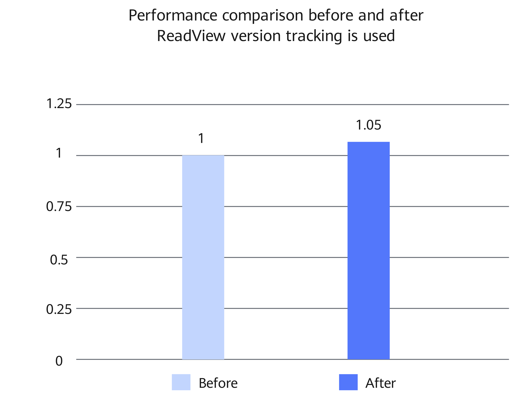

# MySQL ReadView Version Tracking Feature Guide

<!-- md-trans-meta sourceCommit=2f6e0d8c590d432e22d4361f9d2a3759f3fda286 translatedAt=2026-08-03T06:48:04.495Z pushedAt=2026-08-06T02:20:46.990Z -->

## Feature Description<a name="EN-US_TOPIC_0000002602100002"></a>

### Overview<a name="EN-US_TOPIC_0000002602100003"></a>

This document describes how to install and use the MySQL ReadView version tracking feature on a Kunpeng server.

In MySQL online transaction processing (OLTP) scenarios with high-concurrency read/write operations, the ReadView lifecycle management in the InnoDB transaction system is likely to become a hotspot. This may cause insufficient multi-version concurrency control (MVCC) view reuse. This document uses Percona-Server as an example to describe how to optimize the InnoDB transaction system on a Kunpeng server to improve performance in high-concurrency write scenarios.

In read/write mixed scenarios, the MVCC frequently creates, closes, and reuses ReadViews. In the original implementation, ReadView management is closely dependent on the global status of the transaction system, and the conditions for view reuse are conservative. Therefore, the overhead on the `trx_sys->mutex` path is high in high-concurrency scenarios.

This feature adds a version tracking mechanism to ReadViews. When the transaction system status that affects the view content changes, the version information is updated synchronously. In this way, when a ReadView is opened again, the system can determine whether the existing view is still valid based on the version. If the status corresponding to the view does not change, the existing view is directly reused, and no additional removal, rebuilding, or locking operation is required.

This optimization reduces repeated work during ReadView management and is applicable to read/write hybrid workloads where views are frequently created and closed under isolation levels such as `READ COMMITTED`.

## Environment Requirements<a name="EN-US_TOPIC_0000002602100005"></a>

This document provides guidance based on specific environments. Before performing operations, ensure that your hardware and software environments meet the requirements.

**Table 1** Hardware requirement<a id="hardware-requirement"></a>

|Item|Specifications|
|--|--|
|CPU|Kunpeng 920 series processor or Kunpeng 950 processor|

**Table 2** OS and software requirements<a id="os-and-software-requirements"></a>

|Item|Name|Version|How to Obtain|
|--|--|--|--|
|OS|openEuler|22.03 LTS SP4|[Link](https://repo.huaweicloud.com/openeuler/openEuler-22.03-LTS-SP4/ISO/aarch64/openEuler-22.03-LTS-SP4-everything-aarch64-dvd.iso)|
|Percona|Percona-Server|5.7.44-53|For details, see [BoostDB-Percona Installation Guide](./boostdb-percona-install.md).|

## Feature Installation and Usage<a name="EN-US_TOPIC_0000002602100006"></a>

The optimized BoostDB-Percona version has integrated this feature by default. Therefore, you do not need to obtain the patch separately and recompile and install the code.

The following uses Percona-Server 5.7.44-53 as an example to describe how to install and use this feature. The procedure is as follows:

1. Install the optimized BoostDB-Percona version as instructed in [BoostDB-Percona Installation Guide](./boostdb-percona-install.md).

2. Start the database. For details, see [Running MySQL](https://www.hikunpeng.com/document/detail/en/kunpengdbs/ecosystemEnable/MySQL/kunpengmysql8017_03_0013.html) in the *MySQL Porting Guide*.

3. (Optional) Perform the sysbench test to compare the performance before and after the optimization feature is enabled. For details about the test procedure, see [Sysbench 0.5 & 1.0 Test Guide](https://www.hikunpeng.com/document/detail/en/kunpengdbs/testguide/tstg/kunpengsysbench_02_0001.html). This feature improves performance by 5% in sysbench write-only scenarios. [Figure 1](#readview-version-tracking-performance-comparison) shows the performance before and after the optimization.

    **Figure 1** Performance comparison before and after ReadView version tracking is used<a name="fig937192253919"></a><a id="readview-version-tracking-performance-comparison"></a><br>

    

## Security Check and Hardening<a name="EN-US_TOPIC_0000002602100008"></a>

Address space layout randomization (ASLR) is a security technology against buffer overflow. It randomizes the layout of linear areas such as heap, stack, and shared library mapping to make it difficult for attackers to predict target addresses and directly locate code, thereby preventing overflow attacks.

```bash
echo 2 >/proc/sys/kernel/randomize_va_space
```

