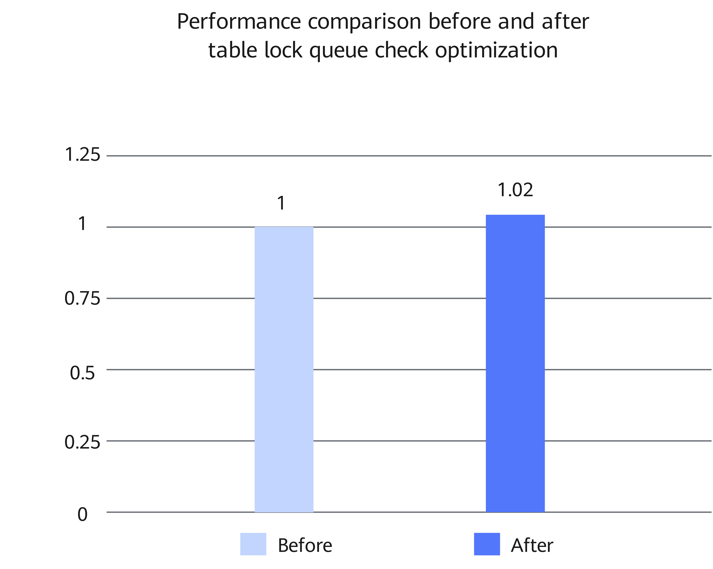

# MySQL Table Lock Queue Check Optimization Feature Guide

<!-- md-trans-meta sourceCommit=2f6e0d8c590d432e22d4361f9d2a3759f3fda286 translatedAt=2026-08-03T06:48:31.902Z pushedAt=2026-08-06T02:34:06.168Z -->

## Feature Description<a name="EN-US_TOPIC_0000002602100002"></a>

### Overview<a name="EN-US_TOPIC_0000002602100003"></a>

This document describes how to install and use the MySQL table lock queue check optimization feature on a Kunpeng server.

In MySQL online transaction processing (OLTP) scenarios with high-concurrency read/write operations, the table lock queue check in the InnoDB transaction system can easily become a hotspot. This may cause high overhead of linked list scanning. This document uses Percona-Server as an example to describe how to optimize the InnoDB transaction system on a Kunpeng server to improve performance in high-concurrency write scenarios.

In OLTP scenarios, transactions usually apply for table-level intent locks before accessing records. These intent locks indicate that the transactions will request row locks, which are finer-grained, later. In a load dominated by DML operations, there are many requests for such intent locks, but the number of table locks (such as `LOCK_S` and `LOCK_X`) that actually conflict with the intent locks is small.

In the original implementation, when an intent lock enters the table lock queue, the entire queue needs to be scanned for compatibility check. After the lock is released, the waiting relationship in the queue also needs to be checked again. When the number of concurrent requests is large, the traversal overhead is amplified, which becomes the extra overhead on the table lock path.

This feature adds a more direct status check mechanism to the table lock queue, so that the system can first determine whether there are any table lock types in the queue that conflict with the intent lock. For scenarios where `LOCK_S` or `LOCK_X` does not exist, unnecessary queue traversal can be skipped, allowing the compatibility check to be completed directly.

By reducing repeated scanning, this optimization can reduce the overhead of table lock checks, waiting judgments, and queue wakeups in high-concurrency DML scenarios. In addition, the `AUTOINC` table lock status is maintained in a unified manner, making the status management of the table lock queue simpler.

## Environment Requirements<a name="EN-US_TOPIC_0000002602100005"></a>

This document provides guidance based on specific environments. Before performing operations, ensure that your hardware and software environments meet the requirements.

**Table 1** Hardware requirement<a id="hardware-requirement"></a>

|Item|Specifications|
|--|--|
|CPU|Kunpeng 920 series processor or Kunpeng 950 processor|

**Table 2** OS and software requirements<a id="os-and-software-requirements"></a>

|Item|Name|Version|How to Obtain|
|--|--|--|--|
|OS|openEuler|22.03 LTS SP4|[Link](https://repo.huaweicloud.com/openeuler/openEuler-22.03-LTS-SP4/ISO/aarch64/openEuler-22.03-LTS-SP4-everything-aarch64-dvd.iso)|
|Percona|Percona-Server|5.7.44-53|For details, see [BoostDB-Percona Installation Guide](./boostdb-percona-install.md).|

## Feature Installation and Usage<a name="EN-US_TOPIC_0000002602100006"></a>

The optimized BoostDB-Percona version has integrated this feature by default. Therefore, you do not need to obtain the patch separately and recompile and install the code.

The following uses Percona-Server 5.7.44-53 as an example to describe how to install and use this feature. The procedure is as follows:

1. Install the optimized BoostDB-Percona version as instructed in [BoostDB-Percona Installation Guide](./boostdb-percona-install.md).

2. Start the database. For details, see [Running MySQL](https://www.hikunpeng.com/document/detail/en/kunpengdbs/ecosystemEnable/MySQL/kunpengmysql8017_03_0013.html) in the *MySQL Porting Guide*.

3. (Optional) Perform the sysbench test to compare the performance before and after the optimization feature is enabled. For details about the test procedure, see [Sysbench 0.5 & 1.0 Test Guide](https://www.hikunpeng.com/document/detail/en/kunpengdbs/testguide/tstg/kunpengsysbench_02_0001.html). This feature improves performance by 2% in sysbench write-only scenarios. [Figure 1](#performance-comparison-before-and-after-table-lock-queue-check-optimization) shows the performance before and after the optimization.

    **Figure 1** Performance comparison before and after table lock queue check optimization<a name="fig937192253919"></a><a id="performance-comparison-before-and-after-table-lock-queue-check-optimization"></a><br>

    

## Security Check and Hardening<a name="EN-US_TOPIC_0000002602100008"></a>

Address space layout randomization (ASLR) is a security technology against buffer overflow. It randomizes the layout of linear areas such as heap, stack, and shared library mapping to make it difficult for attackers to predict target addresses and directly locate code, thereby preventing overflow attacks.

```bash
echo 2 >/proc/sys/kernel/randomize_va_space
```

