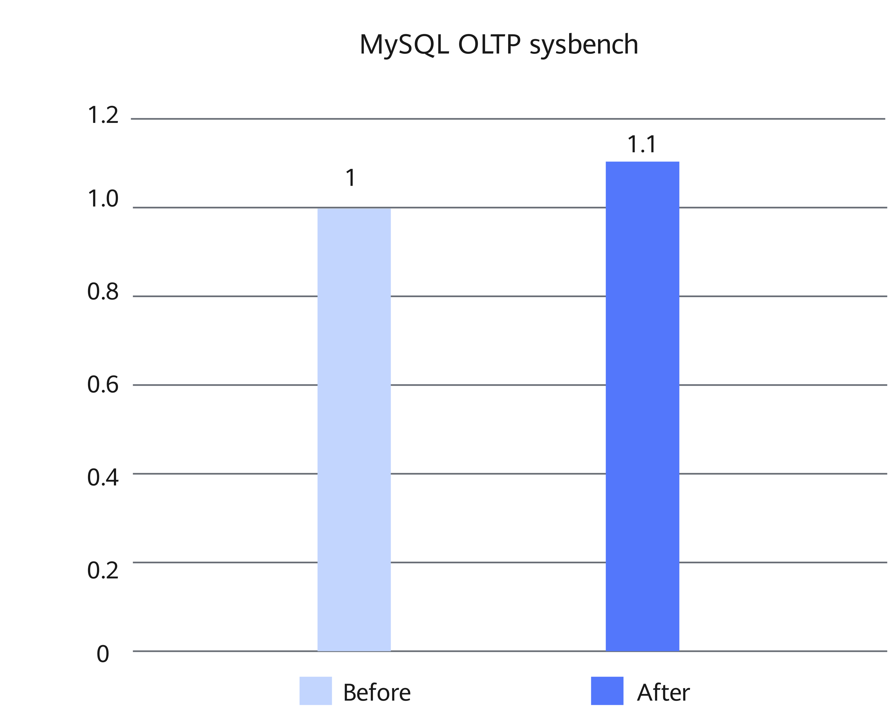

# MySQL Unaligned Memory Access Optimization Feature Guide

## Feature Description<a name="EN-US_TOPIC_0000002518697734"></a>

### Overview<a name="EN-US_TOPIC_0000002518537818"></a>

This document describes how to install and enable the unaligned memory access optimization feature on a Kunpeng server.

The new Kunpeng 920 processor model supports unaligned memory access. Therefore, the unaligned memory access optimization policies implemented on the x86 architecture can be smoothly migrated to the Arm architecture. This further improves the overall system performance.

With the combined use of record matching optimization, SIMD-based character set processing optimization, and unaligned memory access optimization, the performance of Percona-Server 5.7.44-53 with a container configuration of 8 vCPU and 16 GB memory is improved by about 10% in sysbench read-only test scenarios.

### Principles<a name="EN-US_TOPIC_0000002550177569"></a>

**Unaligned Memory Access Optimization<a name="section199911550174819"></a>**

Early Arm architecture (such as ARMv5) does not support unaligned memory access. As such, MySQL reads bytes one by one and performs shift and accumulation operations to convert pointers to integers. The x86 architecture supports unaligned memory access. This enables forcible type conversion for pointers. Kunpeng 920 processors support unaligned memory access. Therefore, the corresponding optimization policies on the x86 architecture can be ported to the Arm architecture to directly convert pointers to the integer type, improving the type conversion efficiency.

## Environment Requirements<a name="EN-US_TOPIC_0000002518697732"></a>

This document provides guidance based on specific environments. Before performing operations, ensure that your hardware and software meet the requirements.

**Table 1** Hardware requirement<a id="hardware-requirement"></a>

|Item|Specifications|
|--|--|
|CPU|New Kunpeng 920 processor model or Kunpeng 950 processor|

**Table 2** OS and software requirements<a id="os-and-software-requirements"></a>

|Item|Version|How to Obtain|
|--|--|--|
|OS|openEuler 22.03 LTS SP4|[Link](https://repo.huaweicloud.com/openeuler/openEuler-22.03-LTS-SP4/ISO/aarch64/openEuler-22.03-LTS-SP4-everything-aarch64-dvd.iso)|
|Percona|Percona-Server 5.7.44-53|[Link](https://gitcode.com/boostkit/boostdb/releases/download/MySQL-Percona-Server-5.7.44-53-v3/BoostDB-Percona-5.7.44-53.aarch64.rpm)|
|Percona|Percona-Server 8.0.43-34|[Link](https://gitcode.com/boostkit/boostdb/releases/download/MySQL-Percona-Server-8.0.43-34-v2/BoostDB-Percona-8.0.43-34.aarch64.rpm)|

## Feature Installation and Enablement<a name="EN-US_TOPIC_0000002550177571"></a>

The following uses Percona-Server 5.7.44-53 as an example to describe how to install and enable the unaligned memory access optimization feature. The procedure is as follows:

1. Install the dependencies as instructed in [Configuring the Compilation Environment](https://www.hikunpeng.com/document/detail/en/kunpengdbs/ecosystemEnable/Percona/kunpengpercona_02_0014.html) in the *Percona Porting Guide*.
2. Download the Percona-Server 5.7.44-53 RPM package described in [**Table 2**](#os-and-software-requirements) and save the package to the target path, for example, `/home`.
3. Run the following commands to install the RPM package. The default installation directory is `/usr/local/mysql`.

    ```shell
    cd /home
    rpm -ivh BoostDB-Percona-5.7.44-53.aarch64.rpm
    ```

    > **NOTE:**
    >If dependency packages have been installed but the RPM-related check fails, run the following command to skip the dependency check (using `--nodeps`):
    >
    >```shell
    >rpm -ivh BoostDB-Percona-5.7.44-53.aarch64.rpm --nodeps
    >```

4. Start the database. For details, see [Running MySQL](https://www.hikunpeng.com/document/detail/en/kunpengdbs/ecosystemEnable/MySQL/kunpengmysql8017_03_0013.html) in the *MySQL Porting Guide*.

5. (Optional) Perform the sysbench test to compare the performance before and after the unaligned memory access optimization feature is enabled. For details about the test procedure, see [Sysbench 0.5 & 1.0 Test Guide](https://www.hikunpeng.com/document/detail/en/kunpengdbs/testguide/tstg/kunpengsysbench_02_0001.html).<br>With the combined use of record matching optimization, SIMD-based character set processing optimization, and unaligned memory access optimization, the performance can be improved by about 10% in sysbench read-only test scenarios. [**Figure 1**](#performance-comparison-before-and-after-optimization-with-the-three-features) shows the performance comparison before and after the optimization.

    **Figure 1** Performance comparison before and after optimization with the three features<a name="fig937192253919"></a><a id="performance-comparison-before-and-after-optimization-with-the-three-features"></a><br>
    

## Troubleshooting<a name="EN-US_TOPIC_0000002550137571"></a>

### "version `GLIBCXX_3.4.29' not found" Is Displayed During MySQL Startup<a name="EN-US_TOPIC_0000002550137567"></a>

**Symptom<a name="section642124153116"></a>**

The error message "/usr/local/mysql/bin/mysqld: /usr/local/mysql/bin/mysqld: /usr/lib64/libstdc++.so.6: version `GLIBCXX_3.4.29' not found (required by /usr/local/mysql/bin/mysqld)" is displayed during MySQL startup.

**Key Process and Cause Analysis<a name="section145813300553"></a>**

The `libstdc++.so.6` version of the system is too early, and GLIBCXX_3.4.29 is missing.

**Conclusion and Solution<a name="section164566494716"></a>**

1. Download GCC 12.3.1 (GCC for openEuler 3.0.3).

    ```shell
    cd /home
    wget https://mirrors.huaweicloud.com/kunpeng/archive/compiler/kunpeng_gcc/gcc-12.3.1-2024.12-aarch64-linux.tar.gz
    ```

2. Decompress the installation package.

    ```shell
    tar zxvf gcc-12.3.1-2024.12-aarch64-linux.tar.gz
    ```

3. Back up `libstdc++.so.6` of the current system and create a symbolic link for a later version of `libstdc++.so.6`.

    ```shell
    mv /usr/lib64/libstdc++.so.6 /usr/lib64/libstdc++.so.6.bak
    ln -s /home/gcc-12.3.1-2024.12-aarch64-linux/lib64/libstdc++.so.6 /usr/lib64/libstdc++.so.6
    ```

4. Check the current library version. If any output is displayed, the requirement is met.

    ```shell
    strings /usr/lib64/libstdc++.so.6 | grep GLIBCXX_3.4.29
    ```

5. Restart MySQL.

## Security Check and Hardening<a name="EN-US_TOPIC_0000002518537816"></a>

Address space layout randomization (ASLR) is a security technology against buffer overflow. It randomizes the layout of linear areas such as heap, stack, and shared library mapping to make it difficult for attackers to predict target addresses and directly locate code, thereby preventing overflow attacks.

```shell
echo 2 >/proc/sys/kernel/randomize_va_space
```


