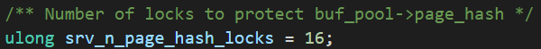
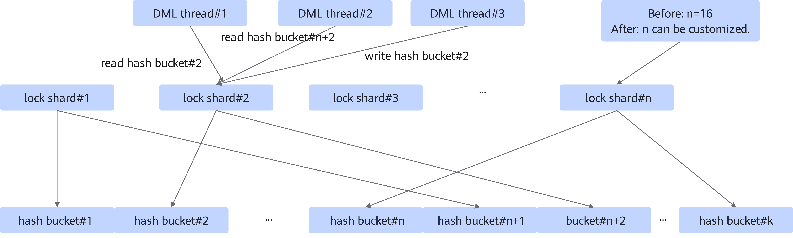
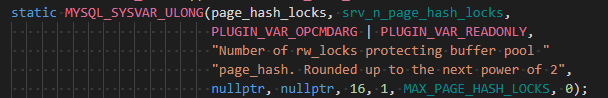
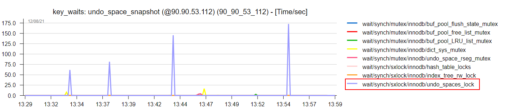
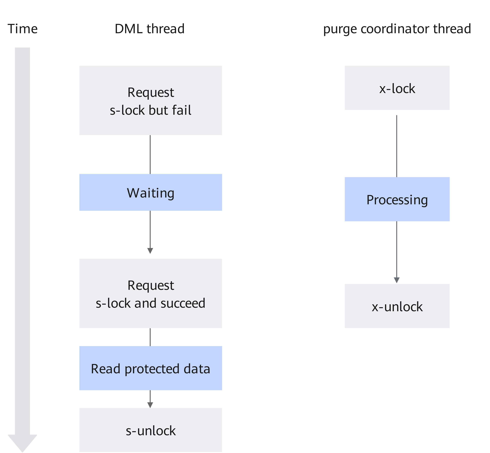
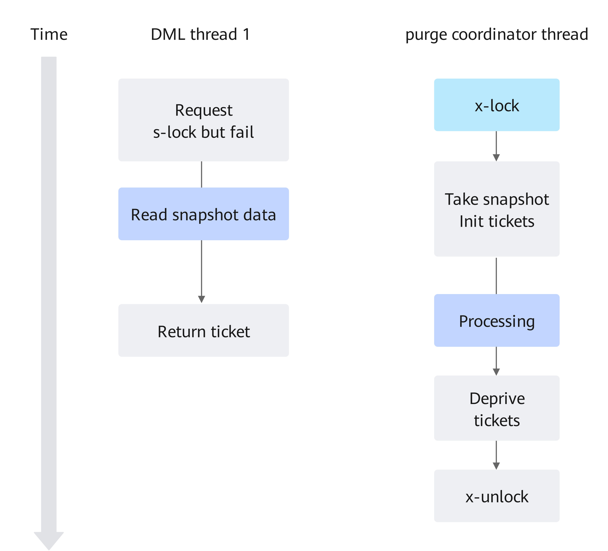
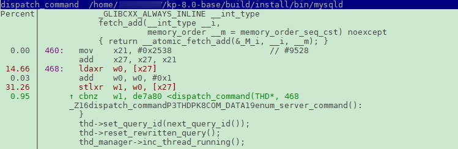
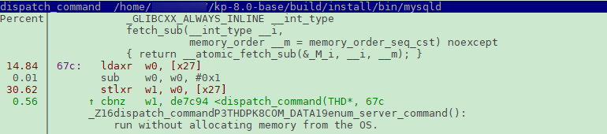
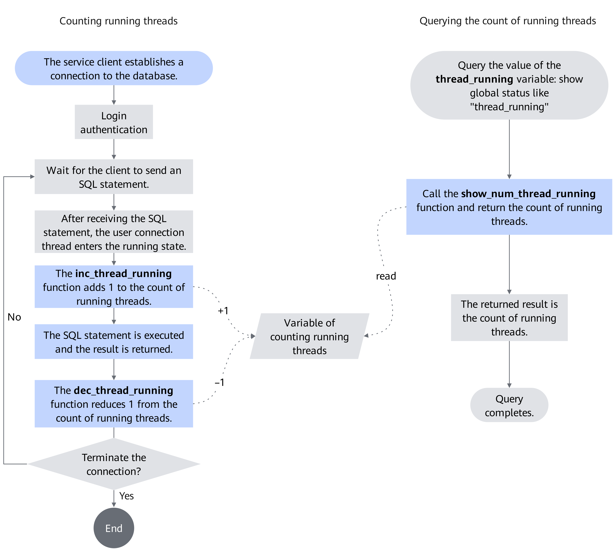
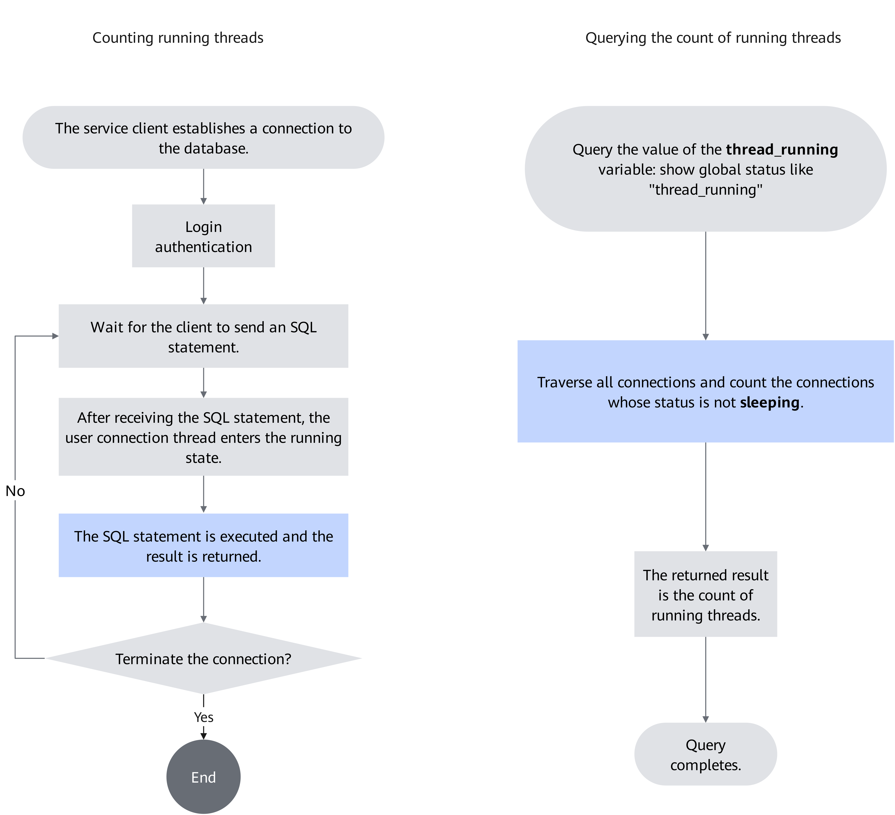

# Other MySQL Features

## hash_table_locks Tuning<a name="EN-US_TOPIC_0000002550145295"></a>

### Principles<a name="EN-US_TOPIC_0000002518545550"></a>

In the case of high throughput, `rw_lock_s_lock_func` contention is caused by `Buf_fetch_normal::get` in MySQL. The key calling path is `buf_page_get_gen`->`Buf_fetch::single_page`->`Buf_fetch_normal::get`. `Buf_fetch_normal::get` obtains the pointer to the data block of the target data page in the buffer pool. That is, obtain `buf_block_t*` by querying `space_id` and `page_no` to read and write the page content. The mapping is maintained by a hash table called `page_hash` and protected by `hash_table_locks`. The contention on `rw_lock_s_lock_func` is caused by adding read locks using `hash_table_locks`.


Sharding lock objects that are frequently accessed is a common tuning method. In the MySQL source code, sharding has been applied to tune `hash_table_locks`. The number of shards is controlled by `srv_n_page_hash_locks` and hardcoded to `16`.



**Figure 1** Comparison of hash_table_locks before and after tuning<a name="fig7931121184316"></a><a id="comparison-of-hash-table-locks-before-and-after-tuning"></a><br>



### Usage Description<a name="EN-US_TOPIC_0000002550145293"></a>

Fix vulnerabilities as soon as possible based on the Common Vulnerabilities and Exposures (CVE) of MySQL 8.0.20 on the official website.

**Application Scenarios<a name="section14995152615441"></a>**

In an OLTP workload, no matter whether a read or write operation (select, update, insert, or delete) is performed, a data page mapping table needs to be accessed to quickly locate the target data page, and `hash_table_locks` in MySQL is involved. If the Performance Schema shows that there is contention on `hash_table_locks` while the CPU usage is high, this feature can be used to alleviate resource contention and improve the system throughput.

After the patch is applied, recompile the MySQL database and configure system variables for the patch to take effect. For details, see [Adding System Variables](#section1982871514452).

**Compilation and Installation Method<a name="section1956113384414"></a>**

The MySQL hash_table_locks tuning feature is provided as a patch file. This patch is developed based on MySQL 8.0.20 and is open-sourced in the Gitee community. Before using this feature, apply the patch to the MySQL source code, and then compile and install MySQL. The detailed procedure is as follows:

1. Download the [MySQL 8.0.20 source code](https://downloads.mysql.com/archives/get/p/23/file/mysql-boost-8.0.20.tar.gz), upload it to the `/home` directory on the server and decompress it, and then go to the root directory of the MySQL source code.

    ```
    cd /home
    tar -zxvf mysql-boost-8.0.20.tar.gz
    cd mysql-8.0.20
    ```

2. Download the [hash_table_locks tuning patch](https://gitcode.com/boostkit/mysql/blob/MySQL-8.0.20/boostdb-patches/0001-HASH-TABLE-LOCKS-OPT.patch) and upload it to the root directory of the MySQL source code.
3. In the root directory of the source code, run the `git init` command to create Git management information.

    ```
    git init
    git add -A
    git commit -m "Initial commit"
    ```

    > **NOTE:**
    >-   Generally, Git is provided by the system. If not, configure the Yum repository by following instructions in [MySQL Porting Guide](https://www.hikunpeng.com/document/detail/en/kunpengdbs/ecosystemEnable/MySQL/kunpengmysql8017_02_0001.html) and then install Git.
    >    ```
    >    yum install git
    >    ```
    >-   If the Git commit user information is not configured, configure the user email and user name before running the `git commit` command.
    >    ```
    >    git config user.email "123@example.com"
    >    git config user.name "123"
    >    ```

4. Apply the hash_table_locks tuning patch.

    ```
    git am --quiet --whitespace=nowarn 0001-HASH-TABLE-LOCKS-OPT.patch
    ```

    If no error information is displayed, the patch is successfully applied.

5. Compile and install the MySQL source code. For details, see [MySQL Porting Guide](https://www.hikunpeng.com/document/detail/en/kunpengdbs/ecosystemEnable/MySQL/kunpengmysql8017_02_0001.html).
6. After recompiling MySQL, configure system variables in the configuration file or boot parameters or during system running for the recompilation to take effect. For details, see [Adding System Variables](#section1982871514452).

**Adding System Variables<a name="section1982871514452" id="section1982871514452"></a>**

This feature adds a static system variable `page_hash_locks` to allow you to configure the number of hash_table_locks shards as required. The maximum value of `page_hash_locks` is `1048576`, and the default value is `16`. A larger value alleviates better the contention on `hash_table_locks` but consumes more memory resources. It is recommended that the value be no more than `1024`.





## undo_spaces_lock Tuning<a name="EN-US_TOPIC_0000002550145291"></a>

### Principles<a name="EN-US_TOPIC_0000002550185303"></a>

When an undo tablespace truncation occurs in the MySQL database and the target undo tablespace is large, `undo_spaces_lock` is contended for.



`undo_spaces_lock` protects concurrent access to the following data:

- undo::spaces::m_spaces
- undo::space_id_bank
- undo truncation log

When the purge coordinator thread holds the `undo_spaces_lock` write lock, the DML foreground thread is blocked. The system throughput decreases.

According to the analysis of the code in the critical region, the purge coordinator thread pool holds the lock to protect `undo:: space_id_bank` and `undo truncation log`, and does not modify `undo:: spaces::m_spaces`. The DML foreground thread holds a lock to ensure that it is not modified when `undo:: spaces::m_spaces` is queried. The logic of the two types of threads does not conflict with each other.

The tuning idea of this feature is as follows: After the purge coordinator obtains the `undo_spaces_lock` write lock, the undo tablespaces generate a snapshot. Subsequently, the DML foreground thread does not need to hold the `undo_spaces_lock` read lock and directly queries the undo tablespaces snapshot. The purge coordinator thread synchronizes data with the DML foreground thread by performing atomic operations with a smaller granularity.

**Figure 1** Before tuning<a name="fig1387917546443"></a><a id="before-tuning"></a><br>


**Figure 2** After tuning<a name="fig22511022114512"></a><a id="after-tuning"></a><br>



### Usage Description<a name="EN-US_TOPIC_0000002518545546"></a>

Fix vulnerabilities as soon as possible based on the Common Vulnerabilities and Exposures (CVE) of MySQL 8.0.20 on the official website.

**Application Scenarios<a name="section4599204444318"></a>**

When an undo tablespace truncation occurs in the MySQL database and the target undo tablespace is large, `undo_spaces_lock` is contended for. If the Performance Schema and any visualization tool (such as dimSTAT) show there is contention on `undo_spaces_lock` while the system throughput fluctuates during undo tablespace truncation, use this feature to alleviate the contention and performance fluctuation.

After the patch is applied, recompile the MySQL database and configure system variables for the patch to take effect. For details, see [Adding System Variables](#section164621432154011).

**Compilation and Installation Method<a name="section62084477403"></a>**

The MySQL undo_spaces_lock tuning feature is provided as a patch file. This patch is developed based on MySQL 8.0.20 and is open-sourced in the Gitee community. Before using this feature, apply the patch to the MySQL source code, and then compile and install MySQL. The detailed procedure is as follows:

> **NOTE:**
>-   The feature used for optimization is provided in a patch. Apply the patch in the MySQL source code, and then compile and install the MySQL database.
>-   The patch is developed for MySQL 8.0.20.

1. Download the [MySQL 8.0.20 source code](https://downloads.mysql.com/archives/get/p/23/file/mysql-boost-8.0.20.tar.gz), upload it to the `/home` directory on the server and decompress it, and then go to the root directory of the MySQL source code.

    ```
    cd /home
    tar -zxvf mysql-boost-8.0.20.tar.gz
    cd mysql-8.0.20
    ```

2. Decompress the source package and go to the MySQL source code directory.

    ```
    tar -zxvf mysql-boost-8.0.20.tar.gz
    cd mysql-8.0.20
    ```

3. In the root directory of the source code, run the `git init` command to create Git management information.

    ```
    git init
    git add -A
    git commit -m "Initial commit"
    ```

    > **NOTE:**
    >-   Generally, Git is provided by the system. If not, configure the Yum repository by following instructions in [MySQL Porting Guide](https://www.hikunpeng.com/document/detail/en/kunpengdbs/ecosystemEnable/MySQL/kunpengmysql8017_02_0001.html) and then install Git.
    >    ```
    >    yum install git
    >    ```
    >-   If the Git commit user information is not configured, configure the user email and user name before running the `git commit` command.
    >    ```
    >    git config user.email "123@example.com"
    >    git config user.name "123"
    >    ```

4. Apply the patch.
    - If this feature is not used together with the [MySQL NUMA scheduling tuning](https://www.hikunpeng.com/document/detail/en/kunpengdbs/appAccelFeatures/numastf/kunpengdbsmysqlnuma_20_0001.html) feature, download the [undo_spaces_lock tuning patch](https://gitcode.com/boostkit/mysql/blob/MySQL-8.0.20/boostdb-patches/0001-UNDO-SPACES-LOCK-OPT.patch), place it to the root directory of the MySQL source code, and run the following command to make the patch take effect:

        ```
        git am --quiet --whitespace=nowarn 0001-UNDO-SPACES-LOCK-OPT.patch
        ```

        If no error information is displayed, the patch is successfully applied.

    - If this feature needs to be used together with the MySQL NUMA scheduling tuning feature, the MySQL NUMA scheduling tuning feature must be incorporated before this feature.

        Download the [NUMA scheduling feature patch](https://gitcode.com/boostkit/mysql/blob/MySQL-8.0.20/boostdb-patches/0001-SCHED-AFFINITY.patch) and [undo_spaces_lock tuning patch](https://gitcode.com/boostkit/mysql/blob/MySQL-8.0.20/boostdb-patches/0002-UNDO-SPACES-LOCK-OPT.AFTER-SCHED-AFFINITY.patch), and place them to the root directory of the MySQL source code. Then run the following command to make the patches take effect:

        ```
        git am --quiet --whitespace=nowarn 0001-SCHED-AFFINITY.patch 0002-UNDO-SPACES-LOCK-OPT.AFTER-SCHED-AFFINITY.patch
        ```

        If no error information is displayed, the patches are successfully applied.

5. Compile and install the MySQL source code. For details, see [MySQL Porting Guide](https://www.hikunpeng.com/document/detail/en/kunpengdbs/ecosystemEnable/MySQL/kunpengmysql8017_02_0001.html).

**Adding System Variables<a name="section164621432154011" id="section164621432154011"></a>**

This feature adds a dynamic system variable `innodb_undo_spaces_snapshot_tickets`. The default value is `0`, indicating that the `innodb_undo_spaces_snapshot_tickets` feature is disabled. The maximum value is `1048576`.

Three InnoDB monitors are added to facilitate `innodb_undo_spaces_snapshot_tickets` tuning.

|InnoDB Monitor Name|Description|
|--|--|
|undo_truncate_snapshot_ticket_grant_count|Number of times a snapshot ticket is granted during undo truncation|
|undo_truncate_snapshot_ticket_try_count|Number of times a snapshot ticket is tried during undo truncation|
|undo_truncate_snapshot_ticket_wait_count|Number of times the purge coordinator has waited until all tickets are returned during undo truncation|


**Parameter Setting Example<a name="section93431272006"></a>**

`innodb_undo_spaces_snapshot_tickets` controls the maximum number of times that the undo tablespaces snapshot generated during a single undo tablespace truncation process can be queried. For example, to alleviate the contention on `undo_spaces_lock`, set `innodb_undo_spaces_snapshot_tickets` to a large value, for example, `100000`, run the load again, and observe the InnoDB monitors.

- `undo_truncate_snapshot_ticket_grant_count` indicates the number of times that the DML thread successfully reads the snapshot. This many transactions would be blocked by the purge coordinator before tuning.
- `undo_truncate_snapshot_ticket_try_count` indicates the contention status when multiple DML threads read the snapshot. In most cases, the value of `undo_truncate_snapshot_ticket_try_count` is equal to or slightly greater than that of `undo_truncate_snapshot_ticket_grant_count`, indicating no contention.
- If the value of `undo_truncate_snapshot_ticket_wait_count` is small (close to 0) in most cases, the time in the critical region of the purge coordinator is not affected. In this case, if the value of `undo_truncate_snapshot_ticket_grant_count` is close to that of `innodb_undo_spaces_snapshot_tickets`, increase the value of `innodb_undo_spaces_snapshot_tickets`.
- If the value of `undo_truncate_snapshot_ticket_wait_count` is large (over 1,000 in this example), decrease the value of `innodb_undo_spaces_snapshot_tickets` to balance the gains of the DML thread and the consumption of the purge coordinator.


## Thread Counter Tuning<a name="EN-US_TOPIC_0000002550185301"></a>

### Principles<a name="EN-US_TOPIC_0000002518545548"></a>

**Symptom<a name="section22331871216"></a>**

According to sysbench's point select test on MySQL, the CPU usage of the server is reaching 100%. The perf top tool detects that mysqld's `dispatch_command` is a hotspot function and occupies more than 20% of the CPU usage. After a further analysis on the `dispatch_command` function, it is found that the CPU usage percentages of add and subtract operations on an atomic variable are extremely high, each exceeding 40%. A contention occurs, which is an obvious bottleneck. See [**Figure 1**](#hotspot-functions-of-mysqld) to [**Figure 3**](#bottleneck-2-of-dispatch-command).

**Figure 1** Hotspot functions of mysqld<a name="fig6544941161514"></a><a id="hotspot-functions-of-mysqld"></a><br>


**Figure 2** Bottleneck 1 of dispatch_command<a name="fig1858521141619"></a><a id="bottleneck-1-of-dispatch-command"></a><br>


**Figure 3** Bottleneck 2 of dispatch_command<a name="fig12699201251719"></a><a id="bottleneck-2-of-dispatch-command"></a><br>


**Tuning Principles<a name="section137419344219"></a>**

The code line where one bottleneck occurs performs an auto-increment on an atomic variable, and the code line where the other bottleneck occurs performs an auto-decrement on the same atomic variable, resulting in a contention on the atomic variable. According to an analysis of related code, the two lines of code are part of the running thread counting and query function module. This module can increase or decrease the number of running threads when SQL statements are executed and provide the interface for querying the number of running threads. [**Figure 4**](#main-process-of-the-thread-counter) shows the main process.

**Figure 4** Main process of the thread counter<a name="fig6980603194"></a><a id="main-process-of-the-thread-counter"></a><br>


In the previous counting and query process, the number of running threads is increased or decreased during SQL statement execution, and atomic variables are directly returned, which impairs service performance. By thread counter tuning, the operation of increasing or decreasing the number of running threads during SQL statement execution is deleted. In this way, the number of running threads is counted in the query process. That is, the service performance is improved at the cost of the query performance. [**Figure 5**](#tuning-process-of-the-thread-counter) shows the tuning process:

**Figure 5** Tuning process of the thread counter<a name="fig83633022119"></a><a id="tuning-process-of-the-thread-counter"></a><br>



### Usage Description<a name="EN-US_TOPIC_0000002518705456"></a>

Fix vulnerabilities as soon as possible based on the Common Vulnerabilities and Exposures (CVE) of MySQL 8.0.20 on the official website.

**Application Scenarios<a name="section4599204444318"></a>**

During the execution of SQL statements in MySQL, the thread counter updates the number of threads in real time. In high-concurrency scenarios, frequent update will cause significant contention. In sysbench's point select test, the CPU usage of the server is approximately 100%. The perf top tool detects that mysqld's `dispatch_command` is a hotspot function. After a further analysis on the `dispatch_command` function, it is found that the CPU usage of two atomic threads accounts for a high proportion. That is, a contention occurs. This feature optimizes the thread counter to relieve contention on hotspot functions.

**Compilation and Installation Method<a name="section62084477403"></a>**

The MySQL thread counter tuning feature is provided as a patch file. This patch is developed based on MySQL 8.0.20 and is open-sourced in the Gitee community. Before using this feature, apply the patch to the MySQL source code, and then compile and install MySQL. The detailed procedure is as follows:

1. Download the [MySQL 8.0.20 source code](https://downloads.mysql.com/archives/get/p/23/file/mysql-boost-8.0.20.tar.gz), upload it to the `/home` directory on the server and decompress it, and then go to the root directory of the MySQL source code.

    ```
    cd /home
    tar -zxvf mysql-boost-8.0.20.tar.gz
    cd mysql-8.0.20
    ```

2. In the root directory of the source code, run the `git init` command to create Git management information.

    ```
    git init
    git add -A
    git commit -m "Initial commit"
    ```

    > **NOTE:**
    >-   Generally, Git is provided by the system. If not, configure the Yum repository by following instructions in [MySQL Porting Guide](https://www.hikunpeng.com/document/detail/en/kunpengdbs/ecosystemEnable/MySQL/kunpengmysql8017_02_0001.html) and then install Git.
    >    ```
    >    yum install git
    >    ```
    >-   If the Git commit user information is not configured, configure the user email and user name before running the `git commit` command.
    >    ```
    >    git config user.email "123@example.com"
    >    git config user.name "123"
    >    ```

3. Download the MySQL thread counter tuning patch and upload it to the root directory of the MySQL source code.

    ```
    wget https://gitcode.com/boostkit/mysql/blob/MySQL-8.0.20/boostdb-patches/0001-THREAD_COUNTER_OPT.patch --no-check-certificate
    ```

4. Query the status of the local Git.

    ```
    git status
    ```

    The following shows that a `0001-THREAD_COUNTER_OPT.patch` file is added.

    ```
    On branch master
    Untracked files:
      (use "git add <file>..." to include in what will be committed)
    
            0001-THREAD_COUNTER_OPT.patch
    
    nothing added to commit but untracked files present (use "git add" to track)
    ```

5. Check whether the patch file conflicts with the MySQL source code.

    ```
    dos2unix 0001-THREAD_COUNTER_OPT.patch
    git apply --check 0001-THREAD_COUNTER_OPT.patch
    ```

    If no error is reported, the patch can be applied.

6. Apply the thread counter patch file.

    ```
    git apply --whitespace=nowarn 0001-THREAD_COUNTER_OPT.patch
    ```

    Warning information can be ignored. If no error information is displayed, the patch is successfully applied.

7. Compile and install the MySQL source code. For details, see [MySQL Porting Guide](https://www.hikunpeng.com/document/detail/en/kunpengdbs/ecosystemEnable/MySQL/kunpengmysql8017_02_0001.html).


## Change History<a name="EN-US_TOPIC_0000002518705458"></a>

|Date|Description|
|--|--|
|2023-07-25|This issue is the third official release. Optimized the operation procedure in the "Usage Description" section of each feature.|
|2021-12-30|This issue is the second official release. Added section "Thread Counter Tuning".|
|2020-07-13|This issue is the first official release.|
