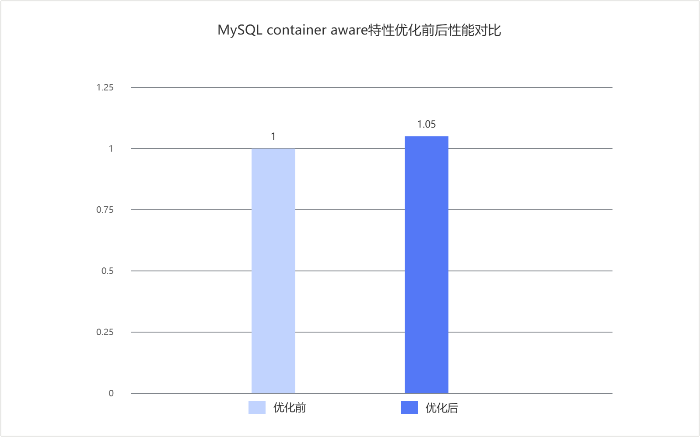

# MySQL container aware优化 特性指南

## 特性描述<a name="ZH-CN_TOPIC_0000002604100002"></a>

### 简介<a name="ZH-CN_TOPIC_0000002604100003"></a>

在容器和其他资源受限场景下，MySQL实例可用CPU和内存可能与宿主机整机资源不一致。如果InnoDB相关逻辑仍按宿主机资源进行统计和判断，可能导致CPU使用率评估偏低，进而影响redo log后台线程在高CPU场景下的等待策略。本特性通过补充实例可用资源感知能力，并优化日志后台线程的等待判断，使资源统计更贴近实例实际运行环境，减少不必要的自旋开销。

本文以Percona-Server-8.0.43-34为例，介绍如何部署并验证该特性。

### 原理描述<a name="ZH-CN_TOPIC_0000002604100004"></a>

本特性通过优化redo log后台线程在高CPU场景下的等待逻辑，并补充实例可用CPU和内存的获取能力，来减少不必要的busy spin（忙等自旋）开销，提升受限运行环境下的资源判断准确性。

在InnoDB redo log后台线程的等待逻辑中，`log_should_wait_for_events_without_spinning()`会根据CPU使用率和写请求频率决定是否继续自旋等待。在原实现中，如果实例用户态CPU百分比较高，但统计时仍按宿主机整机CPU数量进行换算，那么`srv_cpu_usage.utime_pct`就可能被低估，导致高CPU场景下日志后台线程不能及时退出自旋，继续额外消耗CPU。

为解决这个问题，本特性在`log_should_wait_for_events_without_spinning()`中增加了`srv_cpu_usage.utime_pct >= srv_log_spin_cpu_pct_hwm`判断。当实例用户态CPU百分比达到或超过高水位时，log后台线程直接跳过spin waiting（自旋等待），转入event waiting（事件等待），从而减少高CPU场景下日志后台线程额外的忙等自旋。

为了让这个判断在容器和其他cgroup受限场景下同样有效，本特性在`components/library_mysys`中新增了`my_physical_memory()`和`my_num_vcpus()`两个统一入口。其中，`my_physical_memory()`在类Unix系统上优先读取cgroup v2的`/sys/fs/cgroup/memory.max`和cgroup v1的`/sys/fs/cgroup/memory/memory.limit_in_bytes`；`my_num_vcpus()`优先读取cgroup v2的`/sys/fs/cgroup/cpu.max`以及cgroup v1的`/sys/fs/cgroup/cpu/cpu.cfs_quota_us`和`/sys/fs/cgroup/cpu/cpu.cfs_period_us`。如果未检测到资源限制，则继续使用进程亲和性、系统在线CPU数或物理内存页数等原有能力。

新的CPU数量结果会用于`srv_cpu_usage.utime_pct`的换算，同时也会被SQL层、资源组、InnoDB CPU使用率统计、表空间扫描线程数和回滚段初始化线程数等路径复用，避免各模块分别读取宿主机资源造成判断不一致。

## 环境要求<a name="ZH-CN_TOPIC_0000002604100005"></a>

本文基于特定环境提供指导，在正式操作前请确保软硬件均满足要求。

**表1** 硬件要求<a id="container_aware_hardware_requirements"></a>

|项目|规格|
|--|--|
|CPU|鲲鹏920处理器、鲲鹏920新型号处理器、鲲鹏950处理器|

**表2** 操作系统和软件要求<a id="software_requirements"></a>

|项目|名称|版本|获取地址|
|--|--|:-:|--|
|操作系统|openEuler|22.03 LTS SP4|[获取链接](https://repo.huaweicloud.com/openeuler/openEuler-22.03-LTS-SP4/ISO/aarch64/openEuler-22.03-LTS-SP4-everything-aarch64-dvd.iso)|
|Percona|Percona-Server|8.0.43-34|请参见《[BoostDB-Percona 安装指南](./boostdb-percona-install.md)》|

## 安装和使能特性<a name="ZH-CN_TOPIC_0000002604100006"></a>

BoostDB-Percona优化版本已默认集成该优化特性，无需单独获取补丁并重新编译安装。

以Percona-Server 8.0.43-34为例说明如何安装和使用当前优化特性，具体步骤如下。

1. 请参见《[BoostDB-Percona 安装指南](./boostdb-percona-install.md)》安装BoostDB-Percona优化版本。
2. 启动数据库。启动数据库的操作请参见《MySQL移植指南》的[运行MySQL](https://www.hikunpeng.com/document/detail/zh/kunpengdbs/ecosystemEnable/MySQL/kunpengmysql8017_03_0013.html)章节。
3. （可选）通过Sysbench测试可以得到使能优化特性前后的性能提升效果，详细测试步骤请参见《[Sysbench 0.5&1.0测试指导](https://www.hikunpeng.com/document/detail/zh/kunpengdbs/testguide/tstg/kunpengsysbench_02_0001.html)》。container aware优化特性在8C16G容器场景下可以使Sysbench只写场景性能提升5%，优化前后对比效果如[图1 MySQL container aware优化特性Sysbench写场景优化前后性能对比](#MySQL_container_aware优化特性Sysbench写场景优化前后性能对比)所示。

**图1** MySQL container aware优化特性Sysbench写场景优化前后性能对比<a name="fig937192253919"></a><a id="MySQL_container_aware优化特性Sysbench写场景优化前后性能对比"></a><br>



## 安全检查与加固<a name="ZH-CN_TOPIC_0000002602100008"></a>

ASLR（Address Space Layout Randomization，地址空间布局随机化）是一种针对缓冲区溢出的安全保护技术，通过对堆、栈、共享库映射等线性区布局的随机化，增加攻击者预测目的地址的难度，防止攻击者直接定位攻击代码位置，达到阻止溢出攻击的目的。

```bash
echo 2 >/proc/sys/kernel/randomize_va_space
```


