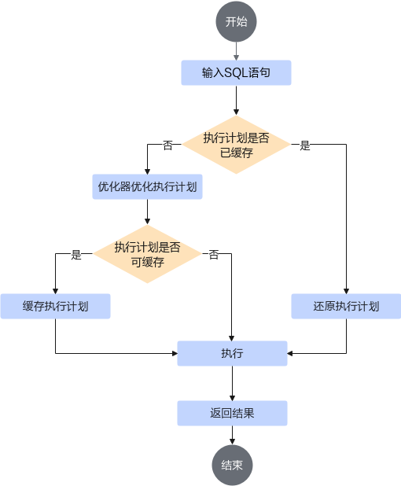
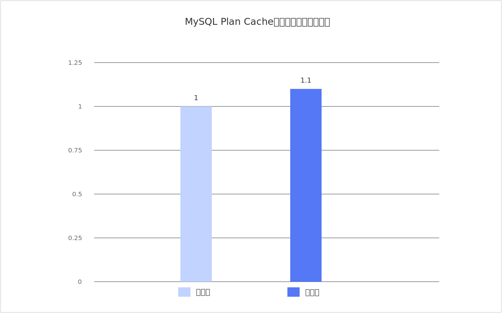

# MySQL Plan Cache特性指南

## 特性描述<a id="ZH-CN_TOPIC_0000002261217842"></a>

### 简介<a id="ZH-CN_TOPIC_0000002295815681"></a>

本文主要介绍如何在使用openEuler操作系统的服务器中安装和使用MySQL Plan Cache特性。

当前BoostDB版本的MySQL Plan Cache特性仅支持Percona-Server 8.0.43-34。

当一条SQL语句输入到MySQL服务器后，通常要经历词法语法解析、优化、生成执行计划和执行的过程。词法语法解析、优化以及生成执行计划这三个阶段的主要输出是SQL语句的执行计划。当SQL语句存在多种执行计划可供选择时，优化器会从中挑选一个最优的（通常是占用系统资源最少的，包括CPU以及IO等）作为最终的执行计划进行执行。生成执行计划的过程会消耗较多的时间，特别是存在许多可选的执行计划时。

Prepared Statement通过用占位符替代SQL语句中的值，将SQL语句模板化或参数化，以此来优化SQL语句。传统MySQL的Prepared Statement仅能节省SQL语句的解析及重写过程的时间。然而，对于一条SQL语句，优化SQL语句并生成执行计划需要耗费大量的资源以及时间。

为解决这个问题，鲲鹏BoostKit推出了MySQL Plan Cache特性。此特性通过缓存Prepared Statement语句对应的最终执行计划，在执行EXECUTE语句时直接使用已缓存的执行计划，从而跳过SQL语句生成执行计划的整个过程，提高语句的执行性能，进而提升MySQL的OLTP性能。此特性在Sysbench只读场景中可获得10%的性能提升。

### 原理描述<a id="ZH-CN_TOPIC_0000002261222518"></a>

基于Prepared Statement的MySQL Plan Cache基本原理和流程如[图1 Plan Cache工作流程](#fig32415431294)所示。

**图 1** Plan Cache工作流程<a id="fig32415431294"></a><br>


1. 响应`EXECUTE`请求，恢复当前Prepared Statement的执行上下文。
2. 判断当前查询是否存在可直接复用的缓存计划。
   - 如果存在缓存计划，则对计划及其上下文信息进行适用性检查。
   - 如果适用性检查通过，则恢复缓存计划并继续执行查询，跳过大部分优化流程。
   - 如果适用性检查失败，则使旧缓存计划失效，并回退到MySQL原生优化流程重新生成执行计划。
3. 如果当前查询不存在缓存计划，则按MySQL原生流程完成优化和执行计划生成。
4. 在优化完成后，系统会校验当前语句是否满足缓存条件。
   - 如果满足缓存条件，则缓存当前执行计划，供后续同一Prepared Statement复用。
   - 如果不满足缓存条件，则直接按MySQL原生执行流程完成本次查询，不建立缓存。

MySQL Plan Cache的适用性检查重点关注以下内容：

- 当前语句是否仍为可缓存的Prepared `SELECT`。
- 表元数据、表记录数和执行环境是否与缓存时保持兼容。
- `optimizer_switch`、字符集等会影响优化结果的环境是否发生变化。
- 表记录数变化是否超过 `plan_cache_allow_change_ratio` 定义的阈值。

## 已验证环境<a id="ZH-CN_TOPIC_0000002261165610"></a>

本文基于鲲鹏服务器和openEuler操作系统提供指导，在正式操作前请确保软硬件均满足要求。

**硬件要求<a id="section152448269180"></a>**

**表 1** 硬件要求

| 项目 | 规格              |
| ------ | ------------------- |
| CPU  | 鲲鹏920系列处理器 |

**操作系统和软件要求<a id="section10405204515189"></a>**

**表 2** 操作系统和软件要求

| 项目     | 名称                     | 版本                            | 获取地址 |
| ---------- | -------------------------- | --------------------------------- | --- |
| 操作系统 | openEuler 24.03 LTS SP3  | openEuler 24.03 LTS SP3 for ARM | [获取链接](https://repo.openeuler.org/openEuler-24.03-LTS-SP3/ISO/aarch64/openEuler-24.03-LTS-SP3-everything-aarch64-dvd.iso) |
| Percona    | percona-server-8.0.43-34 | 8.0.43-34                       | 请参见《[BoostDB-Percona 安装指南](./boostdb-percona-install.md)》 |

## 安装特性<a id="ZH-CN_TOPIC_0000002295742629"></a>

BoostDB-Percona优化版本已默认集成MySQL Plan Cache特性，无需单独获取Patch包并重新编译安装。

以下步骤仅适用于Percona-Server 8.0.43-34。

1. 请参见《[BoostDB-Percona 安装指南](./boostdb-percona-install.md)》安装BoostDB-Percona优化版本。
2. 启动并登录数据库，确认新增变量和状态变量存在。请参见《[Percona安装指南](https://www.hikunpeng.com/document/detail/zh/kunpengdbs/ecosystemEnable/Percona/kunpengpercona_03_0012.html)》的运行章节。

   ```sql
   SHOW VARIABLES LIKE 'plan_cache%';
   SHOW STATUS LIKE 'Cached_plan%';
   ```

   若能够查询到上述变量，则说明已成功使能MySQL Plan Cache特性。
3. （可选）通过Sysbench测试可以得到使能本特性前后的性能提升效果，详细测试步骤请参见《[Sysbench 0.5&1.0测试指导](https://www.hikunpeng.com/document/detail/zh/kunpengdbs/testguide/tstg/kunpengsysbench_02_0001.html)》。MySQL Plan Cache特性可以使Percona-Server 8.0.43-34在Sysbench只读场景中获得10%的性能提升，优化前后对比效果如[**图 2** MySQL Plan Cache特性优化前后性能对比](#mysql-plan-cache-perf-compare)所示。

   **图 2** MySQL Plan Cache特性优化前后性能对比<a name="fig937192253920"></a><a id="mysql-plan-cache-perf-compare"></a><br>
   

## 使用特性<a id="ZH-CN_TOPIC_0000002295815685"></a>

>  **说明：**
> MySQL Plan Cache特性通过会话级参数`plan_cache`控制是否开启计划缓存，通过`plan_cache_allow_change_ratio`控制表记录数变化导致缓存失效的阈值，并通过`Cached_plan_count`、`Cached_plan_hits`、`Cached_plan_invalidations`观测缓存数量、命中次数和失效次数。
>
> - `plan_cache`：是否使能执行计划缓存，布尔类型 `[ON/OFF]`，默认值为 `ON`。
> - `plan_cache_allow_change_ratio`：表记录数变化阈值，`double` 类型，默认值为 `0.2`。当值为 `0` 时，不因表记录数变化而判定缓存失效。
> - `Cached_plan_count`：当前缓存的执行计划数量。
> - `Cached_plan_hits`：缓存计划命中次数。
> - `Cached_plan_invalidations`：缓存计划失效次数。

1. 查看会话级Plan Cache配置。

   ```sql
   SHOW VARIABLES LIKE 'plan_cache%';
   ```

2. 如有需要，显式开启当前会话的MySQL Plan Cache特性。

   ```sql
   SET SESSION plan_cache = ON;
   ```

3. 预编译`SELECT`语句，举例如下。

   ```sql
   CREATE TABLE t_order (
     id BIGINT PRIMARY KEY,
     user_id BIGINT NOT NULL,
     order_status INT NOT NULL,
     KEY idx_user_status (user_id, order_status)
   );

   PREPARE stmt_order
   FROM 'SELECT id FROM t_order WHERE user_id = ? AND order_status = ?';
   ```

4. 使用`EXECUTE`命令执行同一类型SQL语句多次，并通过状态变量观察缓存建立和命中情况。

   ```sql
   SET @uid = 10001;
   SET @status = 1;

   EXECUTE stmt_order USING @uid, @status;
   EXECUTE stmt_order USING @uid, @status;
   EXECUTE stmt_order USING @uid, @status;

   SHOW STATUS LIKE 'Cached_plan%';
   ```

   一般情况下，第一次执行会按原生流程完成优化，并在满足条件时建立缓存；后续执行如果成功复用缓存计划，则 `Cached_plan_hits` 会增长。
5. 查看表记录数变化阈值配置。

   ```sql
   SELECT @@session.plan_cache_allow_change_ratio;
   ```

6. 如需调整当前会话的缓存失效敏感度，可修改`plan_cache_allow_change_ratio`。

   ```sql
   SET SESSION plan_cache_allow_change_ratio = 0.2;
   ```

7. 如需关闭当前会话的Plan Cache，可执行如下命令。

   ```sql
   SET SESSION plan_cache = OFF;
   ```

8. （可选）如需观察计划缓存占用的线程级内存，可结合`performance_schema.memory_summary_by_thread_by_event_name`查看`memory/sql/plan_cache_mem_root`事件项。

   ```sql
   SELECT thread_id
   FROM performance_schema.threads
   WHERE processlist_id = CONNECTION_ID();

   SELECT event_name, current_number_of_bytes_used
   FROM performance_schema.memory_summary_by_thread_by_event_name
   WHERE event_name = 'memory/sql/plan_cache_mem_root';
   ```

## 功能限制<a id="ZH-CN_TOPIC_0000002300986149"></a>

### 不支持语句类型<a id="ZH-CN_TOPIC_0000002266497158"></a>

- 不支持非`SELECT`语句。
- 不支持非Prepared Statement查询语句。
- 当前仅支持单表查询，不支持多表查询。
- 不支持 `WITH ROLLUP`。
- 不支持集合运算语句，包括 `UNION`、`INTERSECT`、`EXCEPT`。
- 不支持`LOCK TABLES`相关场景。
- 不支持存储过程和存储函数场景。
- 不支持全文索引访问路径。
- 不支持临时表、`information_schema`、`performance_schema`、系统视图相关查询。
- 不支持使用二级引擎的表。
- 当用户变量或系统变量直接参与SQL表达式时，不支持计划缓存。
- 子查询仅支持受限场景，通常要求为非相关标量子查询。

### 缓存失效条件<a id="ZH-CN_TOPIC_0000002300987093"></a>

- 表结构发生变化，或其他DDL操作导致缓存计划与当前元数据不兼容。
- Prepared Statement发生重预处理。
- `optimizer_switch` 或字符集环境发生变化。
- 表记录数变化超过 `plan_cache_allow_change_ratio` 指定的阈值。
- 对目标表执行`OPTIMIZE TABLE`后，缓存计划可能失效。
- 计划恢复过程中如果检测到环境不匹配或恢复失败，旧缓存计划会立即失效并回退到原生优化流程。

## 安全检查与加固<a name="ZH-CN_TOPIC_0000002543538365"></a>

ASLR（Address Space Layout Randomization，地址空间布局随机化）是一种针对缓冲区溢出的安全保护技术，通过对堆、栈、共享库映射等线性区布局的随机化，增加攻击者预测目的地址的难度，防止攻击者直接定位攻击代码位置，达到阻止溢出攻击的目的。

```shell
echo 2 >/proc/sys/kernel/randomize_va_space
```


