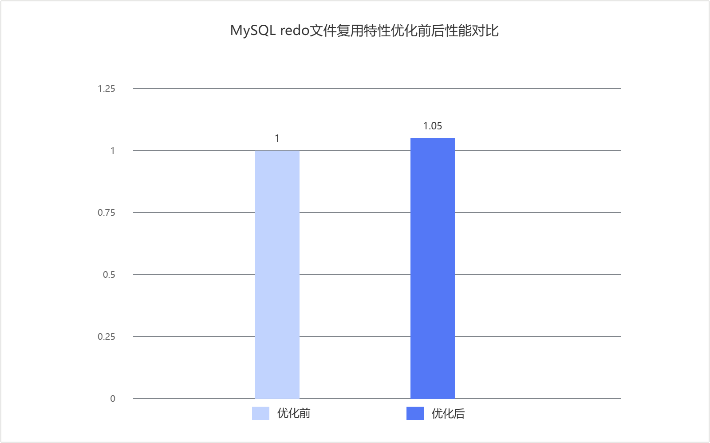

# MySQL redo文件复用优化 特性指南

## 特性描述<a name="ZH-CN_TOPIC_0000002605100002"></a>

### 简介<a name="ZH-CN_TOPIC_0000002605100003"></a>

MySQL实例重启时，InnoDB会检查`#innodb_redo`目录，并根据当前redo布局决定是否创建新的redo文件。原有实现会先清理目录中的unused redo文件，再进入后续创建流程。当目录中已经存在满足当前要求的unused redo文件时，这种处理方式会带来额外的删除、创建和预分配开销。

针对该问题，鲲鹏BoostKit提供了unused redo文件复用优化点。当目录中的unused redo文件满足连续编号和目标大小要求时，InnoDB可以直接复用这些文件，而不再先删除再创建，从而减少启动阶段不必要的文件操作。

本文以Percona-Server为例，介绍如何在鲲鹏服务器上对InnoDB redo启动阶段文件管理进行优化，以减少重启过程中的额外I/O开销。

### 原理描述<a name="ZH-CN_TOPIC_0000002605100004"></a>

本特性通过调整InnoDB启动阶段对unused redo文件的处理逻辑，减少redo目录上的额外文件操作。

InnoDB 8.0使用`#innodb_redo`目录管理redo普通文件和临时文件。启动过程中，系统会根据`innodb_redo_log_capacity`、现有文件布局以及恢复结果，决定是否创建下一个redo文件。原有实现中，在进入创建路径前会先清理unused redo文件，再创建新的目标文件。

本特性在启动路径中增加了参数`innodb_redo_log_reuse_unused_files`。当该参数为`ON`时，系统会先保留目录中的unused redo文件，再判断这些文件能否复用。只有在以下场景中才会继续执行清理：

- 用户显式将`innodb_redo_log_reuse_unused_files`设置为`OFF`。
- 现有文件布局不满足复用条件。
- 后续路径需要删除并重新创建redo文件。

unused redo文件满足复用时，需要同时满足两个条件：

- 文件编号必须从当前current file的下一个编号开始，且连续。
- 文件大小必须与当前`next_file_size`一致。

满足上述条件时，InnoDB可以直接使用这些文件，避免重复执行删除、创建和预分配。

## 环境要求<a name="ZH-CN_TOPIC_0000002605100005"></a>

本文基于特定环境提供指导，在正式操作前请确保软硬件均满足要求。

**表1** 硬件要求<a id="redo_reuse_hardware_requirements"></a>

|项目|规格|
|--|--|
|CPU|鲲鹏920处理器、鲲鹏920新型号处理器、鲲鹏950处理器|

**表2** 操作系统和软件要求<a id="redo_reuse_software_requirements"></a>

|项目|名称|版本|获取地址|
|--|--|:-:|--|
|操作系统|openEuler|22.03 LTS SP4|[获取链接](https://repo.huaweicloud.com/openeuler/openEuler-22.03-LTS-SP4/ISO/aarch64/openEuler-22.03-LTS-SP4-everything-aarch64-dvd.iso)|
|Percona|Percona-Server|8.0.43-34|请参见《[BoostDB-Percona 安装指南](./boostdb-percona-install.md)》|

## 安装和使用特性<a name="ZH-CN_TOPIC_0000002605100006"></a>

BoostDB-Percona优化版本已默认集成该优化特性，无需单独获取补丁并重新编译安装。

以Percona-Server 8.0.43-34为例说明如何安装和使用当前优化特性，具体步骤如下。

1. 请参见《[BoostDB-Percona 安装指南](./boostdb-percona-install.md)》安装BoostDB-Percona优化版本。
2. 启动数据库。启动数据库的操作请参见《MySQL移植指南》的[运行MySQL](https://www.hikunpeng.com/document/detail/zh/kunpengdbs/ecosystemEnable/MySQL/kunpengmysql8017_03_0013.html)章节。
3. （可选）通过Sysbench测试可以得到使能优化特性前后的性能提升效果，详细测试步骤请参见《[Sysbench 0.5&1.0测试指导](https://www.hikunpeng.com/document/detail/zh/kunpengdbs/testguide/tstg/kunpengsysbench_02_0001.html)》。redo文件复用优化特性在32C256G容器场景下可以使Sysbench只写场景性能提升5%，优化前后对比效果如[图1 MySQL redo文件复用优化特性Sysbench写场景优化前后性能对比](#MySQL_redo文件复用优化特性Sysbench写场景优化前后性能对比)所示。

**图1** MySQL redo文件复用优化特性Sysbench写场景优化前后性能对比<a name="fig937192253919"></a><a id="MySQL_redo文件复用优化特性Sysbench写场景优化前后性能对比"></a><br>



## 配置并启动实例

1. 使用默认配置启动实例。默认情况下，`innodb_redo_log_reuse_unused_files=ON`，不需要额外配置即可使能。

2. 启动后执行以下命令，确认参数已经生效。

   ```sql
   SHOW VARIABLES LIKE 'innodb_redo_log_reuse_unused_files';
   ```

   预期结果：

   返回值为`ON`。

3. 如需关闭该特性，可在启动参数中显式设置为`OFF`。

   ```ini
   [mysqld]
   innodb_redo_log_reuse_unused_files=OFF
   ```

   > **说明：**
   > `innodb_redo_log_reuse_unused_files`为只读启动参数，需要重启实例后生效。

## 安全检查与加固<a name="ZH-CN_TOPIC_0000002605100008"></a>

ASLR（Address Space Layout Randomization，地址空间布局随机化）是一种针对缓冲区溢出的安全保护技术，通过对堆、栈、共享库映射等线性区布局的随机化，增加攻击者预测目的地址的难度，防止攻击者直接定位攻击代码位置，达到阻止溢出攻击的目的。

```bash
echo 2 >/proc/sys/kernel/randomize_va_space
```


