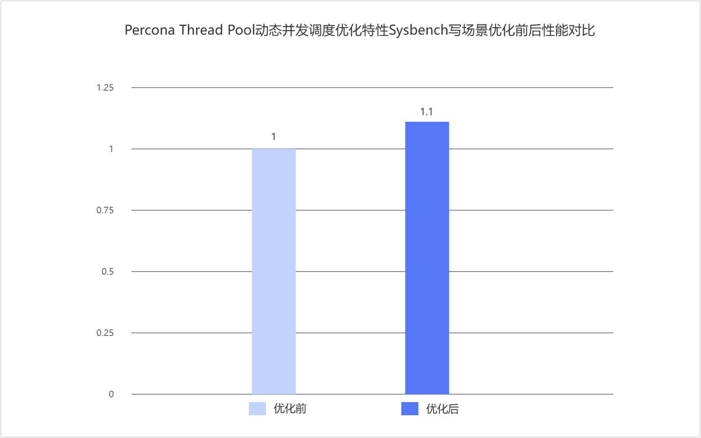

# Percona Thread Pool动态并发调度优化 特性指南

## 特性描述<a name="ZH-CN_TOPIC_0000002602100302"></a>

### 简介<a name="ZH-CN_TOPIC_0000002602100303"></a>

本文以Percona-Server 8.0.43-34为例，介绍如何在鲲鹏服务器上安装、配置和使用Percona Thread Pool动态并发调度优化特性。

Percona Server线程池不会根据进程CPU使用率和上下文切换频率调整工作线程数量。有序提交等待会占用工作线程，可能使队列中的请求继续等待。

Percona Thread Pool动态并发调度优化根据进程CPU使用率和上下文切换频率调整线程池并发配额，并在有序提交等待期间根据线程池状态唤醒或创建工作线程。

### 约束与限制<a name="ZH-CN_TOPIC_0000002602100311"></a>

该特性依赖Percona Server线程池特性，未启用线程池时不生效。

### 原理描述<a name="ZH-CN_TOPIC_0000002602100304"></a>

优化前，Percona Server线程池将连接分配到线程组（thread group），由组内工作线程（worker）从请求队列中取得任务并执行。`thread_pool_size`（线程组数量）决定线程组总数，线程池依据组内活跃线程数、等待线程数和`thread_pool_oversubscribe`（线程组并发限制参数）决定是否唤醒或创建工作线程。

Percona的组提交（ordered commit）的跟随线程（follower）等待领导线程（leader）完成写入（flush）或同步（sync）阶段时，会进入通用等待处理路径。原有线程池不采集进程CPU使用率和上下文切换频率，也不计算全局活跃工作线程配额。因此，该等待路径只能依据线程组的活跃线程数、等待线程数等局部状态处理，无法结合进程级资源压力判断是否额外唤醒或创建工作线程。

#### 动态调整并发配额

启用Percona Thread Pool动态并发调度优化后，线程池定时器线程会周期性更新以下统计信息：

- 归一化后的进程CPU使用率。
- 每秒每个vCPU（虚拟CPU）的主动上下文切换次数。
- 每秒每个vCPU的被动上下文切换次数。
- 根据上述指标计算得到的全局活跃工作线程配额`active_threads_quota`，该配额是代码内部状态量，不可配置。

当以下任一条件成立时，线程池降低全局活跃工作线程配额`active_threads_quota`：

- 进程CPU使用率高于`thread_pool_cpu_usage_threshold`（进程CPU使用率阈值，单位为百分比）。
- 主动上下文切换频率高于`thread_pool_nvcsw_freq_threshold`（主动上下文切换频率阈值，单位为次/秒/vCPU）。
- 被动上下文切换频率高于`thread_pool_nivcsw_freq_threshold`（被动上下文切换频率阈值，单位为次/秒/vCPU）。

三个采样值均未超过对应阈值时，线程池提高`active_threads_quota`。该配额的下限为`thread_pool_size`，上限为`thread_pool_oversubscribe × thread_pool_size`。

#### 处理有序提交等待

调整后的`active_threads_quota`用于限制线程池中同时活跃的工作线程数量。有序提交的跟随线程进入等待后，线程池以该配额作为是否为当前线程组增加工作线程的一项判断条件。

在Linux aarch64（64位ARM架构）平台上，有序提交的跟随线程进入`tx_commit_pending`（事务提交待处理）等待路径时，线程池检查以下条件：

- `thread_pool_commit_burst_threads=ON`（开启有序提交突发工作线程）。
- 全局活跃工作线程数大于`thread_pool_size`且小于`active_threads_quota`。
- 当前线程组的请求队列非空。
- 当前线程组未达到active（活跃线程数）和busy（活跃线程数与等待线程数之和）上限。
- 可以立即取得当前线程组的mutex（互斥锁）。

上述条件全部满足时，线程池为当前线程组唤醒或创建一个工作线程；任一条件不满足时不执行该操作。

## 环境要求<a name="ZH-CN_TOPIC_0000002602100305"></a>

本文基于特定环境提供指导，在正式操作前请确保软硬件环境满足要求。

**表1** 硬件要求

|项目|规格|
|--|--|
|CPU|鲲鹏920处理器、鲲鹏920新型号处理器、鲲鹏950处理器|

<a id="thread_pool_dynamic_concurrency_software_requirements"></a>
**表2** 操作系统和软件要求

|项目|名称|获取地址|
|--|--|--|
|操作系统|openEuler 22.03 LTS SP4|[获取链接](https://repo.huaweicloud.com/openeuler/openEuler-22.03-LTS-SP4/ISO/aarch64/openEuler-22.03-LTS-SP4-everything-aarch64-dvd.iso)|
|Percona|Percona-Server|[8.0.43-34](./boostdb-percona-install.md)|

## 安装和使用特性<a name="ZH-CN_TOPIC_0000002602100306"></a>

BoostDB-Percona优化版本已默认集成该优化特性，无需单独获取补丁并重新编译安装。

以Percona-Server 8.0.43-34为例说明如何安装和使用当前优化特性，具体步骤如下。

1. 请参见《[BoostDB-Percona 安装指南](./boostdb-percona-install.md)》安装BoostDB-Percona优化版本。
2. 启动数据库。启动数据库的操作请参见《MySQL移植指南》的[运行MySQL](https://www.hikunpeng.com/document/detail/zh/kunpengdbs/ecosystemEnable/MySQL/kunpengmysql8017_03_0013.html)章节。
3. （可选）通过Sysbench测试可以得到使能优化特性前后的性能提升效果，详细测试步骤请参见《[Sysbench 0.5&1.0测试指导](https://www.hikunpeng.com/document/detail/zh/kunpengdbs/testguide/tstg/kunpengsysbench_02_0001.html)》。Percona Thread Pool动态并发调度优化特性在32C256G容器场景下可以使Sysbench只写场景性能提升10%，优化前后对比效果如[图1 Percona Thread Pool动态并发调度优化特性Sysbench写场景优化前后性能对比](#fig937192253919)所示。

**图1** Percona Thread Pool动态并发调度优化特性Sysbench写场景优化前后性能对比<a name="Percona_Thread_Pool动态并发调度优化特性Sysbench写场景优化前后性能对比"></a><a id="fig937192253919"></a><br>



## 配置并启动实例<a name="ZH-CN_TOPIC_0000002602100308"></a>

1. 在`my.cnf`中启用线程池。

    ```ini
    [mysqld]
    thread_handling=pool-of-threads
    ```

   `thread_handling`需要在实例启动时生效。`thread_pool_size`默认取实例启动时检测到的CPU数，`thread_pool_oversubscribe`默认值为`3`。这两个参数同时决定`active_threads_quota`的下限和上限。
2. `thread_pool_commit_burst_threads`默认值为`ON`。以下配置显式设置特性开关和3个阈值参数：

    ```ini
    [mysqld]
    thread_pool_commit_burst_threads=ON
    thread_pool_cpu_usage_threshold=90
    thread_pool_nvcsw_freq_threshold=10000
    thread_pool_nivcsw_freq_threshold=4294967295
    ```

3. 参考《[Percona移植指南](https://www.hikunpeng.com/document/detail/zh/kunpengdbs/ecosystemEnable/Percona/kunpengpercona_02_0001.html)》启动或重启MySQL实例，使`thread_handling=pool-of-threads`生效。

## 配置特性参数<a name="ZH-CN_TOPIC_0000002602100309"></a>

新增参数说明如下。

| 参数                                  | 中文含义         | 默认值          | 范围              | 单位       | 作用域         | 动态生效 | 需要重启 | 配置值建议 | 说明                                                  |
| ----------------------------------- | ------------ | ------------ | --------------- | -------- | ----------- | ---- | ---- | -------- | --------------------------------------------------- |
| thread_pool_commit_burst_threads  | 有序提交突发工作线程开关 | ON        | ON/OFF        | /      | GLOBAL（实例级） | 是    | 否    | 推荐保持默认值`ON`。 | 设置为**ON**时，有序提交待处理等待可以按配额额外唤醒或创建工作线程；设置为**OFF**时不执行该操作。 |
| thread_pool_cpu_usage_threshold   | 进程CPU使用率阈值   | 90        | 0..100| 百分比      | GLOBAL（实例级） | 是    | 否    | 推荐使用默认值`90`；持续高负载且影响吞吐时可适当调低，确认CPU有余量但线程受限时可调高。 | 采样的进程CPU使用率大于该值时降低**active_threads_quota**。           |
| thread_pool_nvcsw_freq_threshold  | 主动上下文切换频率阈值  | 10000      | 0..4294967295 | 次/秒/vCPU | GLOBAL（实例级） | 是    | 否    | 推荐使用默认值`10000`；主动切换频繁触发降配额时可调低，延迟偏高且资源有余量时可调高，并结合监控评估。 | 采样的主动上下文切换频率大于该值时降低**active_threads_quota**。          |
| thread_pool_nivcsw_freq_threshold| 被动上下文切换频率阈值  | 4294967295 | 0..4294967295 | 次/秒/vCPU | GLOBAL（实例级） | 是    | 否    | 推荐使用默认值`4294967295`；仅在被动切换频率造成明显压力且确认需要降配额时调低，调整前应先确认问题来源。 | 采样的被动上下文切换频率大于该值时降低**active_threads_quota**。          |

实例启动后，可以通过`SET GLOBAL`在线调整这些参数：

```sql
SET GLOBAL thread_pool_commit_burst_threads = ON;
SET GLOBAL thread_pool_cpu_usage_threshold = 90;
SET GLOBAL thread_pool_nvcsw_freq_threshold = 10000;
SET GLOBAL thread_pool_nivcsw_freq_threshold = 4294967295;
```

4个新参数均为GLOBAL变量，即参数值对整个MySQL实例生效。它们支持运行期修改，不需要重启实例。`SET GLOBAL`只修改当前运行实例中的参数值；需要在实例重启后继续使用自定义值时，应同步写入`my.cnf`。

## 功能观察<a name="ZH-CN_TOPIC_0000002602100310"></a>

可以通过以下方式检查参数和状态信息。

```sql
SHOW GLOBAL VARIABLES LIKE 'thread_pool_commit_burst_threads';
SHOW GLOBAL VARIABLES LIKE 'thread_pool_cpu_usage_threshold';
SHOW GLOBAL VARIABLES LIKE 'thread_pool_nvcsw_freq_threshold';
SHOW GLOBAL VARIABLES LIKE 'thread_pool_nivcsw_freq_threshold';

SHOW GLOBAL STATUS LIKE 'Threadpool_statistics_detail';
SHOW GLOBAL STATUS LIKE 'Threadpool_active_threads';
SHOW GLOBAL STATUS LIKE 'Threadpool_waiting_threads';
```

状态项和字段说明如下。

| 状态项或字段                         | 中文含义        | 单位       | 判断方法                                                   |
| ------------------------------ | ----------- | -------- | ------------------------------------------------------ |
| Threadpool_statistics_detail| 线程池调度统计详情   | 不适用      | 该状态项以字符串形式汇总以下5个字段。                                    |
| n_cpu                        | CPU归一化基数    | 个        | 计算CPU使用率和上下文切换频率时使用的**vCPU**数量。                            |
| cpu_pct                   | 进程CPU使用率    | 百分比      | 与**thread_pool_cpu_usage_threshold**比较；大于阈值时进入降低配额的分支。   |
| nvcsw_freq                   | 主动上下文切换频率   | 次/秒/vCPU | 与**thread_pool_nvcsw_freq_threshold**比较；大于阈值时进入降低配额的分支。  |
| nivcsw_freq                  | 被动上下文切换频率   | 次/秒/vCPU | 与**thread_pool_nivcsw_freq_threshold**比较；大于阈值时进入降低配额的分支。 |
| active_threads_quota         | 全局活跃工作线程配额  | 个        | 该值大于当前全局活跃工作线程数时，才满足额外唤醒或创建工作线程的一项条件。                  |
| Threadpool_active_threads    | 当前全局活跃工作线程数 | 个        | 应大于**thread_pool_size**且小于**active_threads_quota**。        |
| Threadpool_waiting_threads   | 当前全局等待工作线程数 | 个        | 汇总所有线程组的**waiting_thread_count**，用于观察等待线程数量。             |

如需关闭该特性并回退到原有线程池行为，可执行如下命令。

```sql
SET GLOBAL thread_pool_commit_burst_threads = OFF;
```

## 安全检查与加固<a name="ZH-CN_TOPIC_0000002602100312"></a>

ASLR（Address Space Layout Randomization，地址空间布局随机化）是一种针对缓冲区溢出的安全保护技术，通过对堆、栈、共享库映射等线性区布局的随机化，增加攻击者预测目的地址的难度，防止攻击者直接定位攻击代码位置，达到阻止溢出攻击的目的。

```bash
echo 2 >/proc/sys/kernel/randomize_va_space
```


## 修订记录

|发布日期|修订记录|
|--|--|
|2026-09-30|第一次正式发布。|
