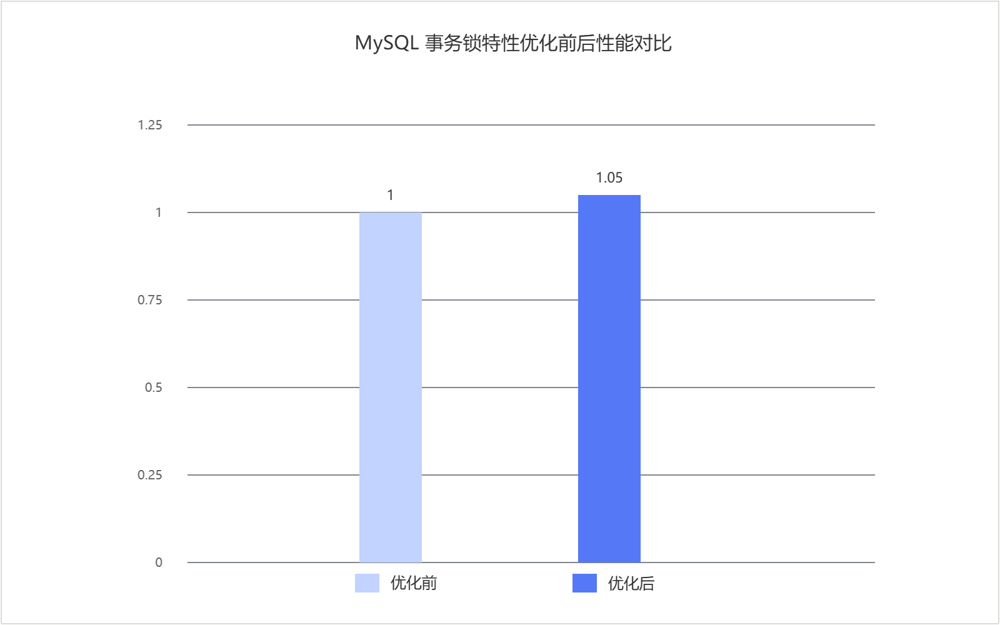

# MySQL事务锁优化 特性指南

## 特性描述<a name="ZH-CN_TOPIC_0000002602100002"></a>

### 简介<a name="ZH-CN_TOPIC_0000002602100003"></a>

本文主要介绍如何在鲲鹏服务器上安装和使用MySQL事务锁优化特性。

在MySQL OLTP场景中，高并发读写下，InnoDB事务系统中的锁管理、表锁队列检查以及Read View生命周期管理很容易成为热点，进而引发全局竞争、链表扫描开销高和MVCC视图复用不足等问题。针对这些问题，鲲鹏BoostKit提供了多个优化点来提高系统性能。本文以Percona-Server为例介绍如何在鲲鹏服务器上对InnoDB事务锁系统进行优化，以提升高并发写场景下的性能。

### 原理描述<a name="ZH-CN_TOPIC_0000002602100004"></a>

MySQL事务锁优化特性主要从锁系统分片、表锁队列检查优化和Read View版本跟踪优化三个方面进行增强。

**Lock-sys细粒度锁优化<a name="section_lock_sys_sharding"></a>**

MySQL中的每个表和行都可以看作是一种资源，事务可以请求访问资源。但是并发的事务对资源的访问可能造成冲突，因此MySQL设计了Lock-sys用于管理对表和行的访问。

Lock-sys会维持多个队列用于存储事务对资源的占用情况，每当有一个新请求需要申请某个资源时，Lock-sys会在相应队列里查询这个资源是否已被占用。不管请求的资源是否被占用，Lock-sys都会将锁请求插入到相应的队列中，分别标记为已授权或等待锁请求。为了支持并发操作，上述查询和插入过程需要对队列加锁。

在过去，所有队列的访问均由一个latch管理，这意味着即使只要访问一个队列，其他所有的队列也会被锁住。这种实现方式在高并发场景下效率低下，为了解决这个问题，本特性引入了一种更细粒度的latch锁定方法。

新的latch锁定方法是在原来全局大锁的基础上，将队列分组为固定数量的shard，每个shard由自己的mutex保护。为了能够高效地锁住所有的shard，新特性中的全局大锁（global latch）被设计为读写锁。对各个队列进行访问，需要先获取global latch的共享锁，再获取相应shard的mutex。这种实现方式类似于MySQL访问一条记录时，先对表加意向锁，再对相应记录加锁。在一些特殊场景下需要锁住所有队列，这时获取global latch的排他锁即可。

通过将原先集中在一个热点上的竞争分散到多个`shard`，该优化减少了不同事务在锁系统路径上的相互阻塞，更适合高并发OLTP负载。

**表锁队列检查优化<a name="section_table_lock_queue"></a>**

在OLTP场景中，事务在访问记录之前，通常会先申请表级意向锁。其中意向锁用于表示后续会继续申请更加细粒度的行锁。在以DML为主的负载下，这类意向锁的请求很多，但真正与其冲突的表锁（比如`LOCK_S`、`LOCK_X`）并不多。

原有实现中，意向锁进入表锁队列时，仍然需要整个队列扫描一遍做兼容性检查；释放锁后，队列中的等待关系也需要再次检查。当并发数较高时，这部分遍历开销会被放大，成为表锁路径上额外开销。

本特性在表锁队列上增加了更直接的状态判断，使系统能够先判断队列中是否存在会与意向锁冲突的表锁类型。对于不存在`LOCK_S`或`LOCK_X`的场景，可跳过不必要的队列遍历，直接完成兼容性检查。

通过减少重复扫描，该优化能够降低高并发DML场景下表锁检查、等待判断和队列唤醒的开销。同时，`AUTOINC`相关表锁状态也采用统一方式维护，使表锁队列状态管理更简洁。

**Read View版本跟踪优化<a name="section_read_view_version"></a>**

在读写混合场景中，MVCC会频繁创建、关闭和复用Read View。原有实现中，Read View管理与事务系统中的全局状态绑定较紧，视图复用条件也较为保守，因此在高并发下`trx_sys->mutex`路径上的开销较高。

该特性为Read View增加版本跟踪机制，在影响视图内容的事务系统状态发生变化时同步更新版本信息。这样在重新打开Read View时，系统可以先根据版本判断已有视图是否仍然有效；如果视图对应的状态未变化，则直接复用已有视图，无需执行额外的移除、重建和加锁操作。

该优化减少了Read View管理过程中的重复工作，适用于`READ COMMITTED`等隔离级别下频繁创建和关闭视图的读写混合负载。

## 环境要求<a name="ZH-CN_TOPIC_0000002602100005"></a>

本文基于特定环境提供指导，在正式操作前请确保软硬件环境满足要求。

**表1** 硬件要求<a id="hardware_requirements"></a>

|项目|规格|
|--|--|
|CPU|鲲鹏920系列处理器、鲲鹏950处理器|

**表2** 操作系统和软件要求<a id="software_requirements"></a>

|项目|名称|版本|获取地址|
|--|--|--|--|
|操作系统|openEuler|22.03 LTS SP4|[获取链接](https://repo.huaweicloud.com/openeuler/openEuler-22.03-LTS-SP4/ISO/aarch64/openEuler-22.03-LTS-SP4-everything-aarch64-dvd.iso)|
|Percona|Percona-Server|5.7.44-53|请参见《[BoostDB-Percona 安装指南](./boostdb-percona-install.md)》|

## 安装和使用特性<a name="ZH-CN_TOPIC_0000002602100006"></a>

BoostDB-Percona优化版本已默认集成MySQL事务锁优化特性，无需单独获取补丁并重新编译安装。

以Percona-Server 5.7.44-53为例说明如何安装和使用MySQL事务锁优化特性，具体步骤如下。

1. 请参见《[BoostDB-Percona 安装指南](./boostdb-percona-install.md)》安装BoostDB-Percona优化版本。
2. 启动数据库。启动数据库的操作请参见《MySQL移植指南》的[运行MySQL](https://www.hikunpeng.com/document/detail/zh/kunpengdbs/ecosystemEnable/MySQL/kunpengmysql8017_03_0013.html)章节。
3. （可选）通过Sysbench测试可以得到使能优化特性前后的性能提升效果，详细测试步骤请参见《[Sysbench 0.5&1.0测试指导](https://www.hikunpeng.com/document/detail/zh/kunpengdbs/testguide/tstg/kunpengsysbench_02_0001.html)》。事务锁优化特性可以使Sysbench只写场景性能提升5%，优化前后对比效果如[图1事务锁优化特性优化前后性能对比](#fig937192253919)所示。

    **图1** MySQL事务锁特性优化前后性能对比<a name="fig937192253919"></a><a id="MySQL事务锁特性优化前后性能对比"></a><br>

    

## 安全检查与加固<a name="ZH-CN_TOPIC_0000002602100008"></a>

ASLR（Address Space Layout Randomization，地址空间布局随机化）是一种针对缓冲区溢出的安全保护技术，通过对堆、栈、共享库映射等线性区布局的随机化，增加攻击者预测目的地址的难度，防止攻击者直接定位攻击代码位置，达到阻止溢出攻击的目的。

```bash
echo 2 >/proc/sys/kernel/randomize_va_space
```


