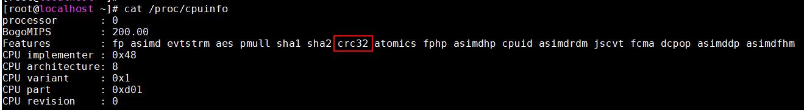
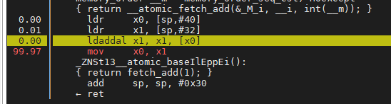
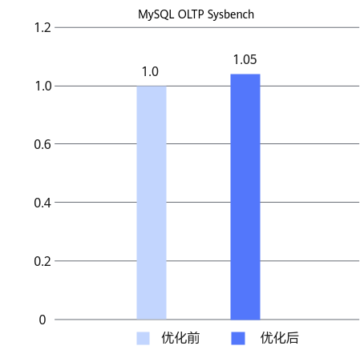

# CRC32指令优化 特性指南

## 特性描述<a name="ZH-CN_TOPIC_0000002550140085"></a>

### 简介<a name="ZH-CN_TOPIC_0000002550140083"></a>

在鲲鹏处理器内，CRC32指令优化特性使用鲲鹏CRC32硬件指令替换CRC32算法的软件实现，减小了CRC32的计算开销。本文以MySQL为例介绍如何在使用openEuler操作系统的鲲鹏服务器上使用CRC32指令优化特性，其他场景也可参考本文的方法进行适配优化。

Linux内核中虽然包含了CRC32算法的C语言实现，但是由于性能较低，可能会成为系统性能瓶颈。特别是当内核态中CRC32函数调用占比较高时，这一问题将更加明显。为解决此问题，可以采用鲲鹏CRC32硬件指令来替换CRC32算法的软件实现，从而提高系统的性能。通过CRC32指令优化特性，MySQL Sysbench写场景性能有5%的提升。

**兼容性<a name="section65704516331"></a>**

与其他特性兼容。关于MySQL特性之间的兼容性信息，请参见[特性之间的兼容性](https://www.hikunpeng.com/document/detail/zh/kunpengdbs/appAccelFeatures/compbf/kunpengdbsmysqlfeaturecompatibility_20_0001.html)。

在鲲鹏处理器内，CRC32指令优化特性使用鲲鹏CRC32硬件指令替换CRC32算法的软件实现，减小了CRC32的计算开销。本文以MySQL为例介绍如何在使用openEuler操作系统的鲲鹏服务器上使用CRC32指令优化特性，其他场景也可参考本文的方法进行适配优化。

### 原理描述<a name="ZH-CN_TOPIC_0000002550180079"></a>

#### CRC32硬件加速单元<a name="ZH-CN_TOPIC_0000002550180077"></a>

**预置条件<a name="section7271131495817"></a>**

可通过如下命令查看CPU是否支持CRC32硬件指令优化。

```shell
cat /proc/cpuinfo
```

回显结果中Features行包含crc32表示CPU支持CRC32硬件指令优化。



**编译选项<a name="section9456123913580"></a>**

GCC编译时，通过“-march”编译选项指定ARM架构版本以及扩展指令集，本特性patch中使用“-march=armv8-a+crc”编译选项，采用CRC32硬件指令来替换CRC32算法的软件实现。

#### LSE编译指令<a name="ZH-CN_TOPIC_0000002518700242"></a>

在多核、原子锁争抢严重的情况下，在GCC编译选项中添加LSE（Large System Extensions）相关选项，可以减缓锁竞争。

LL/SC（Load-link/Store-condition）原子指令需要把共享变量先load到本核所在的L1 Cache中进行修改，在锁竞争少的情况下性能较好，但在锁竞争激烈时会导致系统性能下降严重。Armv8.1规范中引入了新的原子操作指令扩展LSE，将计算操作放到L3 Cache去做，增大数据共享范围，减少Cache一致性耗时，在锁竞争激烈时可以提升锁的性能。

LL/SC指令（ldaxr&stlxr）：


LSE指令（ldaddal）：



MySQL源码文件中，CMakeLists.txt文件中使用“-march=armv8-a+lse”编译选项，使用原子操作指令扩展LSE特性，以达到性能优化的目的。

## 环境要求<a name="ZH-CN_TOPIC_0000002518540334"></a>

本文基于鲲鹏服务器和openEuler操作系统提供指导，在正式操作前请确保软硬件均满足要求。

**硬件要求<a name="section116628440251"></a>**

硬件要求如[**表 1** 硬件要求](#硬件要求)所示。

**表 1** 硬件要求<a id="硬件要求"></a>

|项目|规格|
|--|--|
|CPU|鲲鹏920处理器|

**操作系统和软件要求<a name="section1240364411598"></a>**

操作系统和软件要求如[**表 2** 操作系统和软件要求](#操作系统和软件要求)所示。

**表 2** 操作系统和软件要求<a id="操作系统和软件要求"></a>

|项目|版本|获取地址|
|--|--|--|
|操作系统|openEuler 20.03 LTS SP1<br>openEuler 22.03 LTS SP1|openEuler 20.03 LTS SP1：[获取链接](https://www.openeuler.org/zh/download/archive/detail/?version=openEuler%2020.03%20LTS%20SP1)<br>openEuler 22.03 LTS SP1：[获取链接](https://www.openeuler.org/zh/download/archive/detail/?version=openEuler%2022.03%20LTS%20SP1)|
|mysql-boost-8.0.25.tar.gz|MySQL 8.0.25|[获取链接](https://downloads.mysql.com/archives/get/p/23/file/mysql-boost-8.0.25.tar.gz)|
|0001-CRC32-AARCH64.patch|-|[获取链接](https://gitcode.com/boostkit/boostdb/releases/download/MySQL-patch-release/boostdb-patch-release-20260330.zip)|

## 安装和使用特性<a name="ZH-CN_TOPIC_0000002550180081"></a>

针对MySQL的CRC32指令优化特性以补丁文件形式提供，需在MySQL源码中应用该补丁文件后，编译安装MySQL，即可使用CRC32指令优化特性。该补丁文件针对MySQL 8.0.25版本开发。

1. 下载MySQL 8.0.25安装包mysql-boost-8.0.25.tar.gz并解压。

    获取路径请参见[**表 2** 操作系统和软件要求](#操作系统和软件要求)。

2. 获取并解压补丁文件，并将CRC32指令优化特性补丁文件0001-CRC32-AARCH64.patch上传到解压后的MySQL安装目录下。

    获取路径请参见[**表 2** 操作系统和软件要求](#操作系统和软件要求)。

3. 在源码根目录，使用git初始化命令来建立git管理信息。

    ```shell
    git init
    git add -A
    git commit -m "Initial commit"
    ```

    > **说明：** 
    >- 一般情况下，系统自带git，若需要安装git，请先参见《[MySQL 移植指南](https://www.hikunpeng.com/document/detail/zh/kunpengdbs/ecosystemEnable/MySQL/kunpengmysql8017_02_0001.html)》中配置Yum源相关内容，再执行如下命令安装git。
>
    > ```shell
    > yum install git
    >    ```
>
    >- 若未配置git的提交用户信息，git commit前需要先配置用户邮件及用户名称信息。
>
    > ```shell
    > git config user.email "123@example.com"
    > git config user.name "123"
    >    ```

4. 在MySQL安装目录下执行以下命令，合入CRC32指令优化特性补丁。

    ```shell
    # 查看补丁文件的统计信息
    git apply --stat 0001-CRC32-AARCH64.patch
    # 检查补丁文件是否能够成功应用到当前的代码库中
    git apply --check 0001-CRC32-AARCH64.patch
    # 将补丁文件应用到当前的代码库中，修改相应的文件并生成新的提交记录
    git apply 0001-CRC32-AARCH64.patch
    ```

    

5. 编译安装MySQL。请参见《[MySQL 移植指南](https://www.hikunpeng.com/document/detail/zh/kunpengdbs/ecosystemEnable/MySQL/kunpengmysql8017_02_0001.html)》。
6. 执行如下命令，返回如下crc32cb反汇编信息，表示CRC32指令优化特性已使能成功。

    ```shell
    objdump -d ./bin/mysqld | grep crc32cb
    ```

    

7. 通过Sysbench测试可以得到使用CRC32指令优化特性前后的性能提升效果，详细测试步骤请参见《[Sysbench 0.5&1.0 测试指导](https://www.hikunpeng.com/document/detail/zh/kunpengdbs/testguide/tstg/kunpengsysbench_02_0001.html)》。

    CRC32指令优化特性可以使Sysbench写场景性能提升5%，优化前后对比效果如[**图 1** CRC32指令优化特性优化前后性能对比](#CRC32指令优化特性优化前后性能对比)所示。

    **图 1** CRC32指令优化特性优化前后性能对比<a name="fig20274152011365"></a><a id="CRC32指令优化特性优化前后性能对比"></a><br>
    

## 安全管理<a name="ZH-CN_TOPIC_0000002518540336"></a>

**防病毒软件例行检查<a name="zh-cn_topic_0000001821389094_section11752161613273"></a>**

定期开展对集群的防病毒扫描，防病毒例行检查会帮助集群免受病毒、恶意代码、间谍软件以及程序侵害，降低系统瘫痪、信息泄露等风险。可以使用业界主流防病毒软件进行防病毒检查。

**漏洞修复<a name="zh-cn_topic_0000001821389094_section208601325152718"></a>**

为保证生产环境的安全，降低被攻击的风险，请定期修复以下漏洞：

- 操作系统漏洞
- OpenSSL漏洞
- 其他相关组件漏洞

## 缩略语<a name="ZH-CN_TOPIC_0000002518700244"></a>

|缩略语|英文全称|中文全称|
|--|--|--|
|CRC|Cyclic Redundancy Check|循环冗余校验|

## 修订记录<a name="ZH-CN_TOPIC_0000002518700240"></a>

|发布日期|修订记录|
|--|--|
|2024-03-30|第一次正式发布。|
