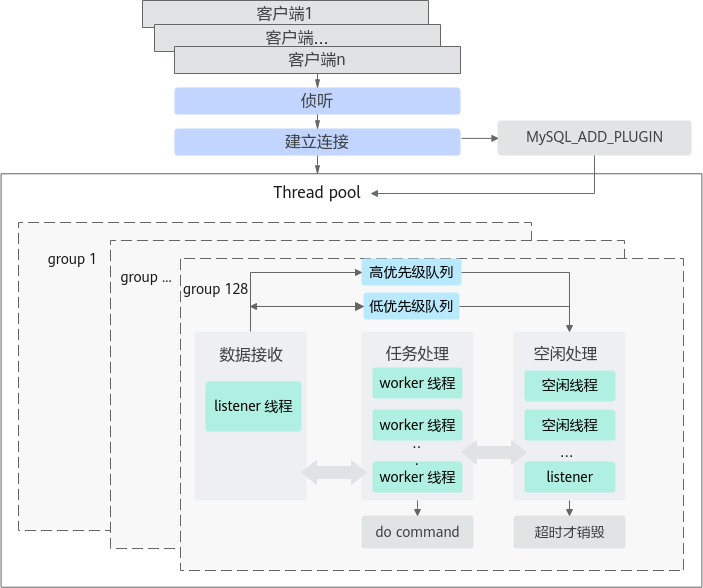

# MySQL 5.7.27 线程池 特性指南

## 特性描述<a name="ZH-CN_TOPIC_0000002518542638"></a>

### 简介<a name="ZH-CN_TOPIC_0000002518702548"></a>

在默认的MySQL连接器下，每个接入的连接都会分配一个线程，当连接数非常大时，线程的上下文切换及线程之间热锁的竞争将会占用大量CPU资源，导致服务性能下降。为了解决这个问题，鲲鹏BoostKit引入了线程池连接器模块。

### 应用场景<a name="ZH-CN_TOPIC_0000002518542650"></a>

- 对于大量连接的OLTP短查询的场景将有最大收益。
- 对于大量连接的只读短查询也有明显收益。
- 对于有较多长查询连接的场景，可配置线程池为小线程组数模式，避免长查询导致线程池性能下降问题。

本特性以patch文件的方式实现，具体使用方法请参考[安装说明](#安装说明)。

### 原理描述<a name="ZH-CN_TOPIC_0000002518702538"></a>

使用线程池连接器模块后，如[**图 1** MySQL线程池特性实现原理](#MySQL线程池特性实现原理)所示，连接的建立与调度由线程池连接器接管，通过引入可动态伸缩的、多分组的线程池，使服务器即使在有大量客户端连接的情况下，也能保持最佳性能。线程池方案通过每个分组上的listener线程进行网络任务的侦听，将触发的任务放入高优先级队列或低优先级队列，由空闲的worker线程按优先级从队列中取出任务从而进行处理。每个CPU同时处理任务个数是有限的，一般2～5个最优，从而保持稳定的业务处理能力。

**图 1** MySQL线程池特性实现原理<a name="fig11588201933612"></a><a id="MySQL线程池特性实现原理"></a><br>


**图 2** 总体原理框架<a name="fig179241351104514"></a><a id="总体原理框架"></a><br>


整个线程池分为若干个线程组和一个timer线程，线程组个数默认为服务器上CPU的核心数，也可通过配置文件或命令行启动参数调整，参见配置参数[thread\_pool\_size](#thread_pool_size)。用户连接被轮询分配到对应线程组上，连接上的所有查询请求都将由其绑定的线程组处理。当客户端连接发送来SQL语句时，线程组为该连接分配worker线程进行处理。SQL执行结束后，线程组回收worker线程。通过一定策略控制worker线程的数量，从而使得实际worker线程数保持在一个高性能的数量范围内。

线程池中，每个线程组包含：

- 一个pollfd，epoll\_create返回的poll描述符。
- 零个或一个listener线程，epoll\_wait等待网络可读事件。
- 一个普通队列，存放有网络可读事件的连接对象（包含TCP连接信息与SQL执行上下文状态信息），待被worker线程处理。
- 一个优先队列，存放有网络可读事件的、正处于事务过程中等情况的连接对象，待优先被worker线程处理。
- 零个、一个或多个worker线程，获取有可读事件的连接对象，处理连接的登录验证、SQL接收执行和结果返回，当线程组中没有listener线程时，新空闲的将进入休眠的第一个worker线程会转化为listener线程。
- 一个waiting队列，当worker线程没有任务需要处理时，就会进入条件等待休眠，放入队列，被外部信号唤醒或等待超时自动唤醒后，线程状态重新标识为active状态处理任务或退出结束多余的worker线程。
- 一个mutex锁，保护线程组中的一些资源在多线程中的操作。

所有线程组共用一个timer线程，timer线程用于检测线程组中是否出现任务停滞，即一段时间内没有新的任务产生或任务队列不为空时却没有任务被消费掉的情况。

线程池特性支持的功能：

- 线程组个数可自适应，也可支持动态修改。
- 优先队列与普通队列区分处理事务中连接、持锁连接与普通查询语句连接，优化性能，详细信息请参见[thread\_pool\_high\_prio\_mode](#thread_pool_high_prio_mode)和[thread\_pool\_high\_prio\_tickets](#thread_pool_high_prio_tickets)。
- 动态伸缩worker线程的个数，使运行中的线程数保持在一个高效的数量范围内。
- 防线程池停滞（线程池饥饿）问题。
- 本地unix socket连接使用额外连接器。
- information\_schema增加四张状态信息表，可实时监管线程池状态。

功能配置的详细说明请见[配置参数](#配置参数)。

## 安装说明<a name="ZH-CN_TOPIC_0000002550142385" id="安装说明"></a>

- 优化特性以补丁文件形式提供，需在MySQL源码应用补丁后，编译安装MySQL。
- 补丁针对MySQL 5.7.27版本开发。
- 关于patch的使用环境要求，请参见《[MySQL 移植指南](https://www.hikunpeng.com/document/detail/zh/kunpengdbs/ecosystemEnable/MySQL/kunpengmysql8017_02_0001.html)》。

1. 请参见《MySQL 移植指南》“[创建用户组和用户](https://www.hikunpeng.com/document/detail/zh/kunpengdbs/ecosystemEnable/MySQL/kunpengmysql8017_03_0006.html)”章节，创建MySQL用户。
2. 使用root用户登录服务器，下载并解压MySQL 5.7.27源码包。

    ```shell
    cd /home
    wget https://dev.mysql.com/get/Downloads/MySQL-5.7/mysql-boost-5.7.27.tar.gz --no-check-certificate
    tar -zxvf mysql-boost-5.7.27.tar.gz
    cd mysql-5.7.27
    ```

    > **说明：** 
    >您也可以通过下载[mysql-boost-5.7.27.tar.gz](https://dev.mysql.com/get/Downloads/MySQL-5.7/mysql-boost-5.7.27.tar.gz)并存放至目标路径，例如“/home”。

3. 在源码根目录，使用git初始化命令来建立git管理信息。

    ```shell
    git init
    git add -A
    git commit -m "Initial commit"
    ```

    > **说明：** 
    >- 若执行**git add -A**时报错，请根据提示执行**git config --global --add safe.directory /home/mysql-5.7.27**命令。
    >- 一般情况下，系统自带git，若需要安装git，请先参见《[MySQL 移植指南](https://www.hikunpeng.com/document/detail/zh/kunpengdbs/ecosystemEnable/MySQL/kunpengmysql8017_02_0001.html)》中配置Yum源相关内容，再执行如下命令安装git。
>
    > ```shell
    > yum install git
    >    ```
>
    >- 若未配置git的提交用户信息，git commit前需要先配置用户邮件及用户名称信息。
>
    > ```shell
    > git config user.email "123@example.com"
    > git config user.name "123"
    >    ```

4. 下载并解压patch补丁文件。

    ```shell
    wget https://gitcode.com/boostkit/boostdb/releases/download/MySQL-patch-release/boostdb-patch-release-20260330.zip --no-check-certificate
    unzip boostdb-patch-release-20260330.zip
    ```

5. 查看提交之后是否有内容修改。

    ```shell
    git status
    ```

    如下所示新增了一个包含优化补丁的boostdb-patch-release-20260330目录。

    ```txt
    # On branch master
    # Untracked files:
    #   (use "git add <file>..." to include in what will be committed)
    #
    #       boostdb-patch-release-20260330/0001-THREAD_POOL_5.patch
    nothing added to commit but untracked files present (use "git add" to track)
    ```

6. 合入线程池特性patch补丁。

    ```shell
    git apply --check boostdb-patch-release-20260330/0001-THREAD_POOL_5.patch
    git apply --whitespace=nowarn boostdb-patch-release-20260330/0001-THREAD_POOL_5.patch
    ```

7. 根据正常的编译安装MySQL源码的操作步骤进行MySQL的编译安装。详细信息请参见《[MySQL 移植指南](https://www.hikunpeng.com/document/detail/zh/kunpengdbs/ecosystemEnable/MySQL/kunpengmysql8017_02_0001.html)》。
8. 成功编译和安装MySQL后，登录MySQL查看线程池新增的information\_schema表，确认线程池patch已生效。详细信息请参见[新增information\_schema表](#新增information_schema表)。

## 配置参数<a name="ZH-CN_TOPIC_0000002550182393" id="配置参数"></a>

### 配置参数使用说明<a name="ZH-CN_TOPIC_0000002550142387"></a>

MySQL的配置参数，也称为系统变量，可以用于调整数据库服务的功能和性能，详细信息请参见官方文档《[Server System Variables](https://dev.mysql.com/doc/refman/8.0/en/server-system-variables.html)》。

使用配置参数有以下两种方式：

- 命令行参数方式，例如：

    ```shell
    mysqld --thread_handling=pool-of-threads
    ```

- 配置文件方式，在my.cnf文件中增加配置行，例如：

    ```txt
    thread_handling=pool-of-threads
    ```

### thread\_handling<a name="ZH-CN_TOPIC_0000002518542640"></a>

是否支持命令行：是

是否支持配置文件：是

是否支持动态修改：否

参数范围：Global

参数类型：String

默认值：one-thread-per-connection

允许值：one-thread-per-connection、pool-of-threads、no-threads

该参数用于设置服务器采用何种线程模式处理来自客户端的连接，有三个可选值：

- 设置为one-thread-per-connection表示为每个连接分配一个线程，各自线程处理各自连接的所有请求，适用于小规模连接数量的场景。
- 设置为pool-of-threads表示使用线程池处理所有连接的所有请求，适用于大规模连接数的短查询场景。
- 设置为no-threads表示使用主线程处理所有连接，一般用于调试。

### thread\_pool\_size<a name="ZH-CN_TOPIC_0000002550182395" id="thread_pool_size"></a>

是否支持命令行：是

是否支持配置文件：是

是否支持动态修改：是

参数范围：Global

参数类型：Numeric

默认值：CPU核数

允许值：1～1024

该参数用于设置线程池中线程组的数量，默认值时表示线程组数与CPU核数一致，也可根据场景（例如：连接数超过CPU逻辑核数，性能瓶颈不在锁争用，且CPU压不满的场景）将线程组数设置为1～3倍CPU数，以获取更佳性能。

### thread\_pool\_max\_threads<a name="ZH-CN_TOPIC_0000002550142381"></a>

是否支持命令行：是

是否支持配置文件：是

是否支持动态修改：是

参数范围：Global

参数类型：Numeric

默认值：100000

允许值：1～100000

该参数用于设置线程池中最大线程数，线程数达到该值后无法创建新线程。

### thread\_pool\_stall\_limit<a name="ZH-CN_TOPIC_0000002518702540"></a>

是否支持命令行：是

是否支持配置文件：是

是否支持动态修改：是

参数范围：Global

参数类型：Numeric

默认值：500（毫秒）

允许值：10～4294967295

该参数表示timer线程检查线程组状态的时间间隔，即判断线程组是否停滞的时间间隔。当线程组被判定为停滞时，线程组将唤醒或创建一个线程，防止例如长查询一直占用工作线程导致新查询无法被处理的问题。

### thread\_pool\_idle\_timeout<a name="ZH-CN_TOPIC_0000002550142383"></a>

是否支持命令行：是

是否支持配置文件：是

是否支持动态修改：是

参数范围：Global

参数类型：Numeric

默认值：60（秒）

允许值：1～4294967295

该参数表示工作线程进入空闲等待状态后，空闲线程等待的时间。等待该配置值的时间后，仍没有被新的任务唤醒，该空闲线程将退出。

### thread\_pool\_oversubscribe<a name="ZH-CN_TOPIC_0000002518542644"></a>

是否支持命令行：是

是否支持配置文件：是

是否支持动态修改：是

参数范围：Global

参数类型：Numeric

默认值：3

允许值：1～1000

该参数表示每个线程组的超额线程数。thread\_pool\_oversubscribe取默认值时，表示每个CPU核心的超额线程数，默认值为3，是一个能够充分利用CPU资源的经验值，如果设置为小于3的值，可能导致更多的睡眠和唤醒。当线程组中活跃工作线程数超过该参数时，则认为活跃工作线程过多，需要限制活跃工作线程数。

### thread\_pool\_toobusy<a name="ZH-CN_TOPIC_0000002550142389"></a>

是否支持命令行：是

是否支持配置文件：是

是否支持动态修改：是

参数范围：Global

参数类型：Numeric

默认值：13

允许值：1～1000

该参数是表示线程组是否过于忙碌的线程数阈值，当线程组中活跃的工作线程数+锁或IO等待中的工作线程数＞该阈值加1时，认为线程组过于忙碌，不再处理低优先级的任务，等待当前执行的任务和高优先级队列中的任务被处理，直到线程组回到非忙碌的状态。

### thread\_pool\_high\_prio\_mode<a name="ZH-CN_TOPIC_0000002518542646" id="thread_pool_high_prio_mode"></a>

是否支持命令行：是

是否支持配置文件：是

是否支持动态修改：是

参数范围：Global，Session

参数类型：String

默认值：transactions

允许值：transactions、statements、none

该变量用于对高优先级调度提供更细粒度的控制，无论是全局调度还是每个连接调度。

- transactions模式下，只有来自已启动事务的语句可以进入高优先级队列，具体取决于连接中当前可用的高优先级票据的数量。详细信息请参见[thread\_pool\_high\_prio\_tickets](#thread_pool_high_prio_tickets)。
- statements模式下，所有单独的语句进入高优先级队列，与连接的事务状态和可用的高优先级票据的数量无关。该值可以用高优先级连接的Session。

    > **须知：** 
    >若全局设置该值，等效于所有连接都是同等优先级，即没有优先级。

- none模式下，禁用连接的高优先级队列。有些连接（例如：监视）可能对执行延迟不敏感，也可能从不分配服务器资源，否则会影响其他连接的性能。这些连接并不真正需要高优先级的调度，可对这些连接设置Session范围的优先级none。

    > **须知：** 
    >若全局设置该参数为none，等效于所有连接都是同等优先级，即没有优先级。

### thread\_pool\_high\_prio\_tickets<a name="ZH-CN_TOPIC_0000002550182399" id="thread_pool_high_prio_tickets"></a>

是否支持命令行：是

是否支持配置文件：是

是否支持动态修改：是

参数范围：Global，Session

参数类型：Numeric

默认值：4294967295

允许值：0～4294967295

该变量控制高优先级队列策略。每个新连接都被预设分配thread\_pool\_high\_prio\_tickets票数以进入高优先级队列（将此变量设置为0将禁用高优先级队列），连接第一次或连续每次进入高优先级队列，该连接持有的票数将减1，若票数减为0了，将无法进入高优先级队列，而进入低优先级队列。当连接进入低优先级队列，该连接持有的票数值将重新设置为该连接Session的thread\_pool\_high\_prio\_tickets预设值。该策略的目的是避免工作线程被大量高优先级连接长时间占用而导致低优先级连接无法得到处理的问题。

### thread\_pool\_dedicated\_listener<a name="ZH-CN_TOPIC_0000002518542648"></a>

是否支持命令行：是

是否支持配置文件：是

是否支持动态修改：是

参数范围：Global

参数类型：Bool

默认值：OFF

允许值：OFF、ON

此变量可用于指定listener线程是否固定只负责epoll\_wait等待网络事件。默认为OFF，不固定listener表示当一个或多个网络事件发生时，且优先队列和普通队列都为空时（网络不繁忙），listener线程会保留第一个网络事件，剩余其他网络事件（如果一次epoll\_wait到多个网络事件时）则将被放入普通队列或高优先级队列，listener线程转为worker线程处理保留的第一个网络事件，以减少线程上下文切换的次数。

小线程组数模式时，需要将该配置值设置为ON，在获取网络事件后，listener线程将所有网络事件任务放入优先队列或普通队列，然后继续进入epoll\_wait等待网络事件，以获取更高效率的网络事件获取。

### extra\_port<a name="ZH-CN_TOPIC_0000002550142391"></a>

是否支持命令行：是

是否支持配置文件：是

是否支持动态修改：否

参数范围：Global

参数类型：Numeric

默认值：0

允许值：0～4294967295

此变量可用于指定侦听的额外端口。如果由于启用线程池特性时所有工作线程都处于忙碌状态或被锁定而无法建立新的连接，则可以使用该端口建立连接。配置为0时，表示不启用额外端口。

使用方法与port参数（默认3306）类似，例如：

```shell
mysql --port='extra-port-number' --protocol=tcp
```

> **说明：** 
>若未启用该配置（配置值为0），且由于启用线程池特性时所有工作线程都处于忙碌状态或被锁定而无法建立新的连接时，还可在MySQL服务运行所在的系统上，使用本地连接接入。
>
>```shell
>mysql -uroot -S xxxxx.sock -p
>```
>
>或
>
>```shell
>mysql -uroot -h localhost -P3306 -p
>```

### extra\_max\_connections<a name="ZH-CN_TOPIC_0000002550182403"></a>

是否支持命令行：是

是否支持配置文件：是

是否支持动态修改：是

参数范围：Global

参数类型：Numeric

默认值：1

允许值：1～100000

此变量可用于指定额外端口上允许的最大用户连接数，当达到该最大连接数时，额外端口上还能建立一个额外的SUPER用户连接。该变量与extra\_port变量一起使用，以防在启用线程池特性时，由于所有工作线程正在忙碌或被锁定而无法建立新的连接。

## 小线程组数模式配置<a name="ZH-CN_TOPIC_0000002550142379"></a>

相对于默认模式的线程池参数配置，使用小线程组数模式的线程池参数配置时，每个线程组上可以创建更多的active线程数，使长查询的连接绑定到某个线程组时，该长查询的连接对该线程组的时延影响可以更小或无明显时延差异。

使用小线程组数模式时，对于部分场景如OLTP writeonly，在该场景连接数非常大（例如8192个连接）时，仍然可以保持90%左右的曲线峰值。

小线程组数模式相对于默认模式（使用默认参数），就是参数配置的优化使用，在高并发连接数时，可以更好保持峰值性能的配置模式，相关配置说明如[**表 1** 小线程组数模式的参数配置参考](#小线程组数模式的参数配置参考)。

**表 1** 小线程组数模式的参数配置参考<a id="小线程组数模式的参数配置参考"></a>

|参数名称|默认模式配置|小线程组数模式|
|--|--|--|
|thread_pool_size|默认为CPU逻辑核数，或手动配置为1～3倍CPU逻辑核数。|配置为4倍NUMA数（TPCH场景测试经验值）。|
|thread_pool_dedicated_listener|默认为OFF，listener线程可转为worker线程。|配置为ON，listener线程只负责网络事件等待，不转为worker线程。|
|thread_pool_oversubscribe|默认为3。|配置该值 = 基线版本最优性能时的连接数 ÷ thread_pool_size的配置值。|
|thread_pool_toobusy|默认为13。|配置该值为thread_pool_oversubscribe。|

## 新增状态变量<a name="ZH-CN_TOPIC_0000002550182397"></a>

状态变量是MySQL用来显示服务器状态的变量，为MySQL的管理和优化提供了有用的信息。新增状态变量有两个：threadpool\_idle\_threads和threadpool\_threads。

关于状态变量的更多详细信息，请参见MySQL官方参考文档《[Server Status Variables](https://dev.mysql.com/doc/refman/8.0/en/server-status-variables.html)》。

新增状态变量说明如[**表 1** 新增状态变量说明](#新增状态变量说明)。状态变量查询示例如下。

```sql
show status like "%Threadpool_idle_threads%";
```

**表 1** 新增状态变量说明<a id="新增状态变量说明"></a>

|新增状态变量|变量类型|变量范围|说明|
|--|--|--|--|
|threadpool_idle_threads|Numeric|Global|此状态变量显示线程池中的总空闲线程数。|
|threadpool_threads|Numeric|Global|此状态变量显示线程池中的总线程数。|

## 新增information\_schema表<a name="ZH-CN_TOPIC_0000002518702550" id="新增information_schema表"></a>

### 概述<a name="ZH-CN_TOPIC_0000002518702542"></a>

关于INFORMATION\_SCHEMA的更多详细信息，请参见MySQL官方参考文档《[INFORMATION\_SCHEMA Tables](https://dev.mysql.com/doc/refman/8.0/en/information-schema.html)》。

INFORMATION\_SCHEMA表查询示例：

```sql
select * from information_schema.THREAD_POOL_GROUPS;
```

### THREAD\_POOL\_GROUPS表<a name="ZH-CN_TOPIC_0000002550182391"></a>

THREAD\_POOL\_GROUPS可用于查询线程组相关信息。

**表 1** THREAD\_POOL\_GROUPS<a id="THREAD\_POOL\_GROUPS"></a>

|字段|说明|
|--|--|
|GROUP_ID|线程组组号。|
|CONNECTIONS|线程组上当前的连接数，当连接建立成功时，该值加1。|
|THREADS|线程组上当前的线程数，包括活跃（active）线程、等待（waiting）线程和空闲（idle）线程。|
|ACTIVE_THREADS|线程组上当前的活跃（active）状态的线程数。活跃线程数变化的几种情况：<br>·新创建的线程的初始状态为active，每新创建一个线程，本线程组活跃线程数加1。<br>·listener线程转化为worker线程，或worker线程由idle或waiting状态转为active状态，本线程组活跃线程数加1。<br>·worker线程转化为listener线程，或者worker线程从active状态转为idle或waiting状态，本组活跃线程数减1。|
|STANDBY_THREADS|线程组上当前有等待（waiting）状态的线程数。<br>·线程由于IO、锁、条件变量、sleep等事件进入waiting状态时，本组等待线程数加1。<br>·线程结束waiting状态，该值减1。|
|QUEUE_LENGTH|线程组优先队列和普通队列的总长度，即该线程组下当前有多少任务正等待被处理。等待队列长度变化的几种情况：<br>·连接成功建立后，将登录请求任务放入普通队列，本组等待队列长度加1。<br>·线程组收到用户连接的网络事件后，将任务放入普通队列或优先队列，相应等待队列长度加1。<br>·网络事件任务被从优先队列或普通队列中获取出时，相应队列长度减1。|
|HAS_LISTENER|线程组上当前是否有listener线程。<br>listener线程状态变更的几种情况：<br>·worker线程在没有从任务队列中获取到任务时，进入idle状态前，判断当前线程组中是否存在listener线程，若不存在，则本worker线程转为listener线程。<br>·线程组关闭时，listener线程退出。<br>·listener线程epoll_wait等待到网络事件后，若优先队列和普通队列都为空，则listener线程会转为worker线程，处理本次获取到的第一个网络事件，同时listener线程状态为不存在。|
|IS_STALLED|线程组当前是否处于停滞状态。当普通队列或优先队列都不为空，一段时间内既没有新的任务放入队列也没有从队列中取出任务处理，即认为线程组处于停滞状态。<br>线程组stalled状态变化的几种情况：<br>·线程组初始化时，状态为非stalled状态。<br>·timer线程执行check_stall时判断若线程组中自从上一次check_stall之后一直没有任务出队列，且优先队列和普通队列不全为空，将线程组设置为stalled状态。<br>·worker线程从等待队列取出任务时，任务即将被执行，线程组不再为stalled状态，则将线程组设置为非stalled状态。|

### THREAD\_POOL\_QUEUES表<a name="ZH-CN_TOPIC_0000002518702546"></a>

THREAD\_POOL\_QUEUES可用于查询线程组队列中连接的信息。

**表 1** THREAD\_POOL\_QUEUES<a id="THREAD\_POOL\_QUEUES"></a>

|字段|说明|
|--|--|
|GROUP_ID|线程组组号。|
|POSITION|全局遍历所有线程组所有队列时，队列中该任务被全局遍历到时的序号。|
|PRIORITY|0代表高优先级队列，1代表普通队列。|
|CONNECTION_ID|该连接的唯一标识符，与show processlist查询结果中的ID对应。|
|QUEUEING_TIME_MICROSECONDS|任务从入队列到当前时间的时间间隔，即已等待的时间（单位为微秒）。|

### THREAD\_POOL\_STATS表<a name="ZH-CN_TOPIC_0000002550182401"></a>

THREAD\_POOL\_STATS可用于查询线程组状态信息的统计值，比如线程组由于check\_stall创建的线程数、由listener线程poll到的任务数等。

**表 1** THREAD\_POOL\_STATS<a id="THREAD\_POOL\_STATS"></a>

|字段|描述|
|--|--|
|thread_creations|线程组自初始化以来，创建线程成功的总次数。|
|thread_creations_due_to_stall|线程组自初始化以来，由于check_stall成功创建线程的总次数。|
|wakes|线程组自初始化以来，唤醒线程的操作的总次数。|
|wakes_due_to_stall|线程组自初始化以来，由timer线程操作唤醒线程的总次数。|
|throttles|线程组自初始化以来，由于超时检测成功创建的线程的总次数。timer线程在每次check_stall时会检查距离上次创建线程是否超过了throttling_interval值，如果是，则该值加1。|
|stalls|线程组自初始化以来，由timer线程检查出的停滞次数。每当timer线程check_stall判断线程组处于停滞状态时，该值加1。|
|dequeues_by_listenerdequeues_by_worker|线程组自初始化以来，任务出队列的次数。<br>·dequeues_by_worker代表dequeue的发起者是工作线程。<br>·dequeues_by_listener代表发起者是listener。|
|polls_by_listenerpolls_by_worker|线程组自初始化以来，连接上epoll网络事件的总次数。<br>·polls_by_worker代表poll的发起者是工作线程。<br>·polls_by_listener代表发起者是listener。|

### THREAD\_POOL\_WAITS表<a name="ZH-CN_TOPIC_0000002518542642"></a>

THREAD\_POOL\_WAITS提供线程组的worker线程在执行SQL语句时各类等待原因的统计数据。等待原因有：UNKNOWN、SLEEP、DISKIO、ROW\_LOCK、GLOBAL\_LOCK、META\_DATA\_LOCK、TABLE\_LOCK、USER\_LOCK、BINLOG、GROUP\_COMMIT、SYNC、NET。

**表 1** THREAD\_POOL\_WAITS<a id="THREAD\_POOL\_WAITS"></a>

|字段|说明|
|--|--|
|REASON|线程进入等待状态（waiting）的原因。wait_reasons以数组字符串的形式存储等待原因。|
|COUNT|线程组自初始化以来，在执行SQL的worker线程，进入某种原因（锁或IO等）的等待状态的总次数。|
