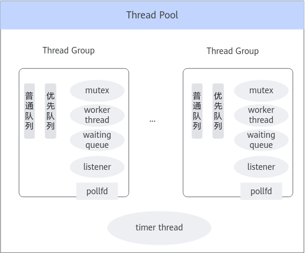
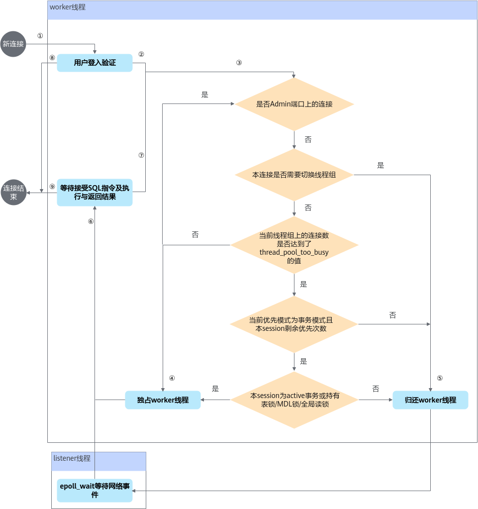
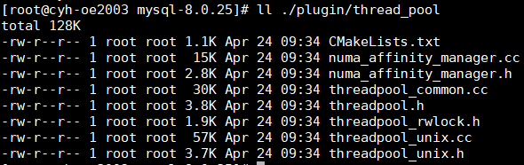
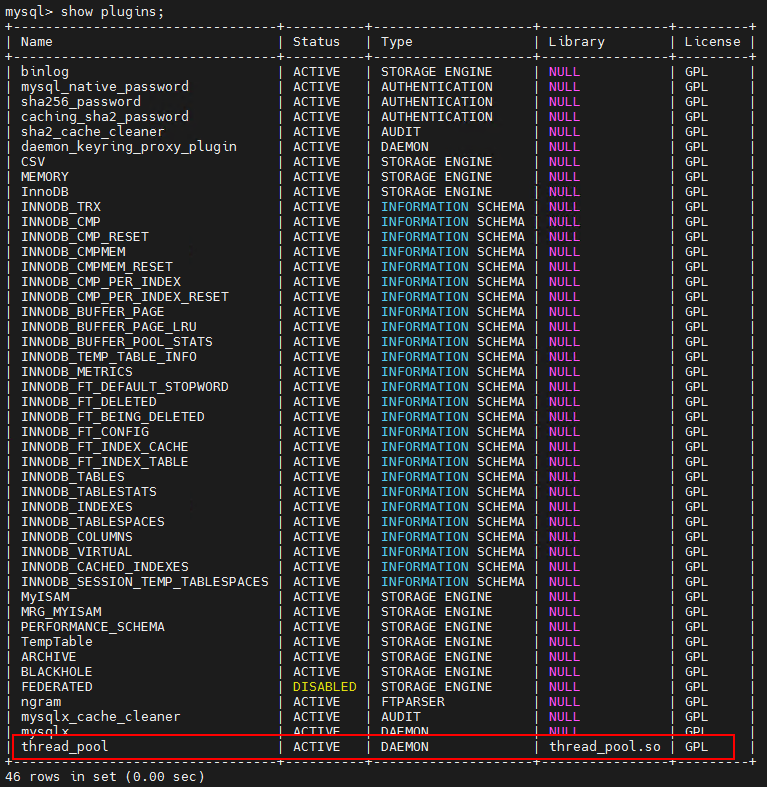
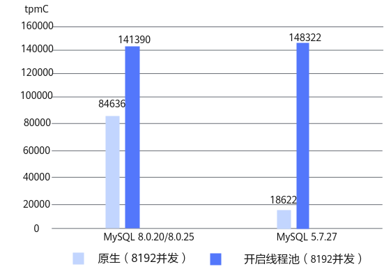
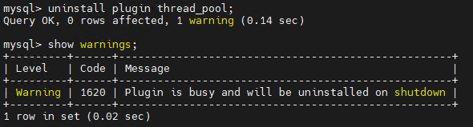

# MySQL 8.0.25&8.0.30&8.0.35 可插拔线程池 特性指南

## 特性描述<a name="ZH-CN_TOPIC_0000002518543136"></a>

### 简介<a name="ZH-CN_TOPIC_0000002550142873"></a>

在默认的MySQL连接器下，每个接入的连接都会分配一个线程，当连接数非常大时，线程的上下文切换及线程之间热锁的竞争将会占用大量CPU资源，导致服务性能下降。为了解决这个问题，鲲鹏BoostKit引入了线程池连接器模块。


### 应用场景<a name="ZH-CN_TOPIC_0000002518543140"></a>

- 对于大量连接的OLTP短查询的场景将有最大收益。
- 对于大量连接的只读短查询也有明显收益。

本特性以patch文件的方式实现，具体使用方法参考[安装说明](#安装说明)。


### 原理描述<a name="ZH-CN_TOPIC_0000002518543142"></a>

#### 线程池总体框架<a name="ZH-CN_TOPIC_0000002518543138"></a>

使用线程池连接器模块后，如[**图 1** MySQL线程池特性实现原理](#MySQL线程池特性实现原理)所示，连接的建立与调度由线程池连接器接管，通过引入可动态伸缩的、多分组的线程池，使服务器即使在有大量客户端连接的情况下，也能保持最佳性能。线程池方案通过每个分组上的listener线程进行网络任务的侦听，将触发的任务放入高优先级队列或低优先级队列，由空闲的worker线程按优先级从队列中取出任务从而进行处理。每个CPU同时处理任务个数是有限的，一般2～5个最优，从而保持稳定的业务处理能力。

**图 1** MySQL线程池特性实现原理<a name="fig11588201933612"></a><a id="MySQL线程池特性实现原理"></a><br>


**图 2** 总体原理框架<a name="zh-cn_topic_0000001153001580_fig179241351104514"></a><a id="总体原理框架"></a><br>


如[**图 2** 总体原理框架](#总体原理框架)所示，整个线程池分为若干个线程组和一个timer线程，线程组个数默认为服务器上CPU的逻辑核数，也可通过配置文件或命令行启动参数调整，参见配置参数[thread\_pool\_size](#thread_pool_size)。用户连接被轮询分配到对应线程组上，连接上的所有查询请求都将由其绑定的线程组处理。当客户端创建了一个连接，并通过此连接发来SQL语句时，线程组将为此连接分配worker进程来执行SQL语句。执行SQL语句结束后，线程组将回收worker线程。线程池通过一定策略控制worker线程的数量，从而使得实际worker线程数保持在一个高性能的数量范围内。

线程池中每个线程组包含：

- 一个pollfd，epoll\_create返回的poll描述符。
- 零个或一个listener线程，epoll\_wait等待网络可读事件。
- 一个普通队列，存放有网络可读事件的连接对象（包含TCP连接信息与SQL执行上下文状态信息），待被worker线程处理。
- 一个优先队列，存放有网络可读事件的、正处于事务过程中等情况的连接对象，待优先被worker线程处理。
- 零个、一个或多个worker线程，获取有可读事件的连接对象，处理连接的登录验证、SQL接收执行和结果返回，当线程组中没有listener线程时，新空闲的将进入休眠的第一个worker线程会转化为listener线程。
- 一个waiting队列，当worker线程没有任务需要处理时，就会进入等待休眠状态，放入队列，被外部信号唤醒或等待超时自动唤醒后，线程状态重新标识为active状态处理任务或退出结束多余的worker线程。
- 一个mutex锁，保护线程组中的一些资源在多线程中的操作。

所有线程组共有一个timer线程，timer线程用于检测线程组中是否出现任务停滞，即一段时间内没有新的任务产生或任务队列不为空时却没有任务被消费掉的情况。

线程池特性支持的功能：

- 线程组个数可自适应，也可支持动态修改。
- 优先队列与普通队列区分处理事务中连接、持锁连接与普通查询语句连接，优化性能，详细信息请参见[thread\_pool\_high\_prio\_mode](#thread_pool_high_prio_mode)与[thread\_pool\_high\_prio\_tickets](#thread_pool_high_prio_tickets)。
- 动态伸缩worker线程的个数，使运行中的线程数保持在一个高效的数量范围内。
- 防线程池停滞（线程池饥饿）问题。
- information\_schema增加四张状态信息表，可实时监管线程池状态。
- 性能稳定性提升和事务优先等优化。

功能配置的详细说明请见[配置参数](#配置参数)。


#### 优先Session的处理<a name="ZH-CN_TOPIC_0000002550182883"></a>

在连接数很大，高负载时，对于一些事务取得了锁等资源时，可优先处理，原先的处理逻辑是此类连接发生可读事件后，会被线程组加到优先队列中，等待空闲worker线程优先处理。对上述逻辑进一步优化，已经进入优先队列的Session所占用的worker线程不还给线程池，Session继续独占该worker线程，处理其业务逻辑。类似每线程每连接的模式，独占worker线程专用于处理该优先连接之后的所有语句，直到该连接释放了优先资源转为普通连接，例如该连接事务执行结束释放锁资源。优先Session连接的判断逻辑如[**图 1** 优先Session独占worker线程逻辑](#优先Session独占worker线程逻辑)所示。

**图 1** 优先Session独占worker线程逻辑<a name="fig311083021517"></a><a id="优先Session独占worker线程逻辑"></a><br>


[**图 1** 优先Session独占worker线程逻辑](#优先Session独占worker线程逻辑)上的数字标记点对应的说明如[**表 1** 优先Session独占worker线程逻辑图上的数字标记对应的说明](#优先Session独占worker线程逻辑图上的数字标记对应的说明)所示。

**表 1** 优先Session独占worker线程逻辑图上的数字标记对应的说明<a id="优先Session独占worker线程逻辑图上的数字标记对应的说明"></a>

|数字标记序号|说明|
|--|--|
|①|新连接建立时，worker线程处理登录校验的逻辑，连接生命周期开始。|
|②|新连接登录校验完成后进入是否高优先级Session的判断。|
|③|如果是Admin端口上的管理连接，则会一直独占worker线程，避免进入等待队列得不到worker线程的处理。|
|④|如果Session经过判断后为高优先级的Session，将继续占用当前worker线程，进入⑥等待下一条SQL语句并执行。|
|⑤|如果Session经过判断后为普通Session，则会将当前Session的连接标识加入到当前线程组的epoll_wait中，当前worker线程将状态置为空闲并归还本线程组。|
|⑥|epoll_wait中触发网络可读事件（有SQL语句到达）或worker独占的Session，将在worker线程等待SQL语句的到达。|
|⑦|worker线程中等待接收SQL语句并执行完成后，若执行结果正常且非结束连接，将进入③进行Session优先级判断。|
|⑧|登录校验失败，连接生命周期结束。|
|⑨|等待接收SQL语句或执行SQL语句出现异常，或Session结束退出时，连接生命周期结束。|


## 已验证环境<a name="ZH-CN_TOPIC_0000002518543132"></a>

本文基于鲲鹏服务器和openEuler操作系统提供指导，已验证的硬件、软件环境如下文所示。

**硬件环境<a name="section4467132520160"></a>**

硬件环境如[**表 1** 已验证的硬件环境](#已验证的硬件环境)所示。

**表 1** 已验证的硬件环境<a id="已验证的硬件环境"></a>

|项目|说明|
|--|--|
|服务器|鲲鹏服务器|
|处理器|鲲鹏920系列处理器|
|硬盘|进行性能测试时，数据目录需使用单独硬盘，即一个系统盘，一个数据盘，至少两块硬盘。非性能测试时，直接在系统盘上建数据目录即可。具体硬盘数量根据实际需求配置。|


**操作系统和软件版本<a name="section24945412"></a>**

- 查看环境操作系统的信息：**cat /etc/\*-release**

    查看环境处理器相关信息：**lscpu**

    查看环境内核版本：**uname -r**

    查看环境信息：**uname -a**

- 如果需要全新安装操作系统，可选择“Minimal Install”安装方式并勾选Development Tools套件，否则很多软件包需要手动安装。

已验证的操作系统与软件版本如[**表 2** 已验证的操作系统与软件版本](#已验证的操作系统与软件版本)所示。

**表 2** 已验证的操作系统与软件版本<a id="已验证的操作系统与软件版本"></a>

|项目|版本|下载链接|
|--|--|--|
|openEuler|20.03 LTS-SP1 for ARM|[获取链接](https://repo.huaweicloud.com/openeuler/openEuler-20.03-LTS-SP1/ISO/aarch64/openEuler-20.03-LTS-SP1-everything-aarch64-dvd.iso)|
|openEuler|22.03 LTS-SP1 for ARM|[获取链接](https://repo.huaweicloud.com/openeuler/openEuler-22.03-LTS-SP1/ISO/aarch64/openEuler-22.03-LTS-SP1-everything-aarch64-dvd.iso)|
|CMake|3.7.2（openEuler 20.03）|[获取链接](https://cmake.org/files/v3.7/cmake-3.7.2.tar.gz)|
|CMake|3.11.4（openEuler 22.03）|openEuler 22.03默认自带CMake 3.11.4|
|GCC|7.3.0（openEuler 20.03）|[获取链接](https://mirrors.tuna.tsinghua.edu.cn/gnu/gcc/gcc-7.3.0/gcc-7.3.0.tar.gz)|
|GCC|10.3.1（openEuler 22.03）|openEuler 22.03默认自带GCC 10.3.1|
|MySQL|8.0.25|[获取链接](https://downloads.mysql.com/archives/get/p/23/file/mysql-boost-8.0.25.tar.gz)|
|MySQL|8.0.30|[获取链接](https://downloads.mysql.com/archives/get/p/23/file/mysql-boost-8.0.30.tar.gz)|
|MySQL|8.0.35|[获取链接](https://downloads.mysql.com/archives/get/p/23/file/mysql-boost-8.0.35.tar.gz)|


## 安装说明<a name="ZH-CN_TOPIC_0000002550182889" id="安装说明"></a>

- MySQL可插拔线程池特性以补丁文件形式提供，需在MySQL源码应用补丁后，编译安装MySQL。
- 补丁针对MySQL 8.0.25、MySQL 8.0.30和MySQL 8.0.35开发。本特性与MySQL NUMA调度优化patch不冲突，但使用本线程池插件特性后会使[MySQL NUMA调度优化](https://www.hikunpeng.com/document/detail/zh/kunpengdbs/appAccelFeatures/numastf/kunpengdbsmysqlnuma_20_0001.html)中的用户连接线程的调度优化失效。
- MySQL 8.0.25、MySQL 8.0.30和MySQL 8.0.35支持可插拔、动态加载线程池插件。
- 线程池依赖要求编译环境已安装numactl库，安装numactl依赖包命令为**yum install -y numactl numactl-devel\***。若MySQL程序编译时未安装numactl依赖，将导致无numa库加载的MySQL程序在安装线程池的so文件时，提示“undefined symbol: numa\_xxxxx”的失败信息。
- MySQL可插拔线程池特性要求CMake版本高于3.7。

1. 下载目标版本的MySQL源码并上传至服务器“/home”目录下，解压源码包并进入MySQL源码的根目录。

    MySQL源码下载路径请参见[**表 2** 已验证的操作系统与软件版本](#已验证的操作系统与软件版本)。

    对于MySQL 8.0.25版本，执行以下命令：

    ```
    cd /home
    tar -zxvf mysql-boost-8.0.25.tar.gz
    cd mysql-8.0.25
    ```

    对于MySQL 8.0.30版本，执行以下命令：

    ```
    cd /home
    tar -zxvf mysql-boost-8.0.30.tar.gz
    cd mysql-8.0.30
    ```

    对于MySQL 8.0.35版本，执行以下命令：

    ```
    cd /home
    tar -zxvf mysql-boost-8.0.35.tar.gz
    cd mysql-8.0.35
    ```

    > **说明：** 
    >您也可以通过如下命令下载MySQL源码。
    >MySQL 8.0.25版本：
    >```
    >wget https://cdn.mysql.com/archives/mysql-8.0/mysql-boost-8.0.25.tar.gz --no-check-certificate
    >tar -zxvf mysql-boost-8.0.25.tar.gz
    >```
    >MySQL 8.0.30版本：
    >```
    >wget https://cdn.mysql.com/archives/mysql-8.0/mysql-boost-8.0.30.tar.gz --no-check-certificate
    >tar -zxvf mysql-boost-8.0.30.tar.gz
    >```
    >MySQL 8.0.35版本：
    >```
    >wget https://cdn.mysql.com/archives/mysql-8.0/mysql-boost-8.0.35.tar.gz --no-check-certificate
    >tar -zxvf mysql-boost-8.0.35.tar.gz
    >```

2. 在源码根目录，使用git初始化命令来建立git管理信息。

    ```
    git init
    git add -A
    git commit -m "Initial commit"
    ```

    > **说明：** 
    >-   一般情况下，系统自带git，若需要安装git，请先参见《[MySQL 移植指南](https://www.hikunpeng.com/document/detail/zh/kunpengdbs/ecosystemEnable/MySQL/kunpengmysql8017_02_0001.html)》中配置Yum源相关内容，再执行如下命令安装git。
    >    ```
    >    yum install git
    >    ```
    >-   若未配置git的提交用户信息，git commit前需要先配置用户邮件及用户名称信息。
    >    ```
    >    git config user.email "123@example.com"
    >    git config user.name "123"
    >    ```

3. 下载[MySQL线程池特性patch](https://gitcode.com/boostkit/boostdb/releases/download/MySQL-patch-release/boostdb-patch-release-20260330.zip)，解压后将code-threadpool-for-MySQL-8.0.patch上传至MySQL源码的根目录。该patch同时适用于MySQL 8.0.25、MySQL 8.0.30和MySQL 8.0.35版本。

    > **说明：** 
    >您也可以通过如下命令下载MySQL线程池特性patch。
    >```
    >wget https://gitcode.com/boostkit/boostdb/releases/download/MySQL-patch-release/boostdb-patch-release-20260330.zip --no-check-certificate
    >unzip boostdb-patch-release-20260330.zip
    >```

4. 查看提交之后是否有内容修改。

    ```
    git status
    ```

    如下所示新增了一个包含补丁文件的boostdb-patch-release-20260330目录。

    ```
    [root@localhost mysql-8.0.25]# git status
    On branch master
    Untracked files:
      (use "git add <file>..." to include in what will be committed)
            boostdb-patch-release-20260330/code-threadpool-for-MySQL-8.0.patch
    
    nothing added to commit but untracked files present (use "git add" to track)
    ```

5. 合入线程池特性patch补丁。

    ```
    git apply --check boostdb-patch-release-20260330/code-threadpool-for-MySQL-8.0.patch
    git apply --whitespace=nowarn boostdb-patch-release-20260330/code-threadpool-for-MySQL-8.0.patch
    ```

6. 合入补丁成功后，在mysql-8.0.25或mysql-8.0.30或mysql-8.0.35目录下可查看到新增的thread\_pool目录及目录下新增的源码文件。

    ```
    ll ./plugin/thread_pool/
    ```

    预期结果：

    

7. 根据正常的编译安装MySQL源码的操作步骤进行MySQL的编译安装。详细信息请参见《[MySQL 移植指南](https://www.hikunpeng.com/document/detail/zh/kunpengdbs/ecosystemEnable/MySQL/kunpengmysql8017_02_0001.html)》。


## 使用说明<a name="ZH-CN_TOPIC_0000002550182887"></a>

### 配置说明<a name="ZH-CN_TOPIC_0000002518703038"></a>

默认情况下，MySQL使用每线程每连接的连接器，要使用本特性的线程池连接器，需要安装线程池插件。插件可通过配置文件设置生效，或MySQL命令安装生效，详细信息请参见[线程池插件使用示例](#线程池插件使用示例)。当配置为线程池连接器后，对于OLTP场景，[配置参数](#配置参数)中的配置参数推荐使用默认配置，可通过调整thread\_pool\_size的值来优化峰值性能，详细信息请参见[thread\_pool\_size](#thread_pool_size)。

MySQL的配置参数，也称为系统变量，可以用于调整数据库服务的功能和性能，详细信息请参见官方文档《[Server System Variables](https://dev.mysql.com/doc/refman/8.0/en/server-system-variables.html)》。


### 配置参数<a name="ZH-CN_TOPIC_0000002518703042" id="配置参数"></a>

#### 线程池插件使用示例<a name="ZH-CN_TOPIC_0000002518543146" id="线程池插件使用示例"></a>

**使用线程池插件<a name="section1214343873111"></a>**

> **说明：** 
>安装线程池插件成功后，将产生一个新的连接器，线程池插件连接器。原始默认的连接器仍然保留并用于处理安装线程池插件前的连接的查询请求，线程池插件连接器则用于处理新的连接的查询请求。

1. 线程池插件可以在补丁应用成功后直接编译安装使用，也可以编译成功后从编译路径下的plugin\_output\_directory/目录中拷贝文件thread\_pool.so到目标MySQL服务的plugin\_dir变量所指定的目录下，进行安装使用。

    安装方式如下：

    - 方式一：执行以下SQL语句，安装线程池插件。

        > **须知：** 
        >当前方式安装线程池插件后，将立即生效。

        ```
        INSTALL PLUGIN thread_pool SONAME "thread_pool.so";
        INSTALL PLUGIN THREAD_POOL_GROUPS SONAME "thread_pool.so";
        INSTALL PLUGIN THREAD_POOL_QUEUES SONAME "thread_pool.so";
        INSTALL PLUGIN THREAD_POOL_STATS SONAME "thread_pool.so";
        INSTALL PLUGIN THREAD_POOL_WAITS SONAME "thread_pool.so";
        ```

        thread\_pool.so中包含如上命令中的5个插件，thread\_pool是线程池连接器插件，THREAD\_POOL\_GROUPS、THREAD\_POOL\_QUEUES、THREAD\_POOL\_STATS、THREAD\_POOL\_WAITS是线程池插件状态监管表，安装成功后可在MySQL的INFORMATION\_SCHEMA中看到，详见[新增information\_schema表](#新增information_schema表)。

    - 方式二：在MySQL配置文件中添加线程池插件配置信息。

        > **须知：** 
        >当前方式安装线程池插件后，需要重启数据库才能生效。

        ```
        plugin-load-add=thread_pool.so
        ```

        安装完成后，可以通过如下SQL语句查看线程池插件是否安装成功。

        ```
        show plugins;
        ```

        回显信息中状态为“ACTIVE”时，表示插件已安装成功。

        

2. 参考以下参数调优建议对MySQL线程池进行调整和优化。

    > **说明：** 
    >数据库的配置文件默认路径为“/etc/my.cnf”。如果想要使用自定义的其他路径下的配置文件，可以通过--defaults-file选项指定，例如指定“/tmp/myconfig.txt”文件。
    >```
    >mysqld --defaults-file=/tmp/myconfig.txt
    >```

|**参数名称**|**参数含义**|**配置建议**|
|--|--|--|
|thread_pool_size|该参数用于设置线程池中线程组的数量。|采用默认值时表示线程组数与CPU核数一致，也可根据实际场景（例如连接数超过CPU逻辑核数，性能瓶颈不在锁争用，且CPU压不满的场景）将线程组数设置为1～3倍CPU数或者最优并发数，以获取更佳性能。|
|thread_pool_oversubscribe|该参数表示每个线程组的超额线程数。<br>thread_pool_oversubscribe取默认值时，表示每个CPU核心的超额线程数，默认值为3，是一个能够充分利用CPU资源的经验值，如果设置为小于3的值，可能导致更多的睡眠和唤醒。|当线程组中活跃工作线程数超过该参数时，认为活跃工作线程过多，需要限制活跃工作线程数，建议配置最优性能时的并发数/thread_pool_size的配置值。|
|thread_pool_toobusy|该参数表示线程组是否过于忙碌的线程数阈值。|当线程组中活跃的工作线程数+锁或IO等待中的工作线程数＞该阈值加1时，认为线程组过于忙碌，不再处理低优先级的任务，等待当前执行的任务和高优先级队列中的任务被处理，直到线程组回到非忙碌的状态，建议与thread_pool_oversubscribe配置相同的值。|
|thread_pool_dedicated_listener|该参数用于指定listener线程是否固定只负责epoll_wait等待网络事件。|建议设置为ON，在获取网络事件后，listener线程将所有网络事件任务放入优先队列或普通队列，然后继续进入epoll_wait等待网络事件，以获取更高效率的网络事件。|


3. 通过TPC-C测试可以得到使用MySQL线程池特性前后的性能提升效果，详细测试步骤请参见《[BenchMarkSQL 测试指导](https://www.hikunpeng.com/document/detail/zh/kunpengdbs/testguide/tstg/kunpengbenchmarksql_06_0001.html)》。

    线程池连接器对于大量连接的OLTP短查询的场景将有最大帮助。在OLTP TPC-C场景下，启用线程池之前，MySQL运行10000个并发任务的性能只有原来的10%左右。启用线程池功能后，性能可维持在85%，对比效果如[**图 1** 开启MySQL线程池前后的性能对比](#开启MySQL线程池前后的性能对比)所示。

    **图 1** 开启MySQL线程池前后的性能对比<a name="fig317431114341"></a><a id="开启MySQL线程池前后的性能对比"></a><br>
    

**卸载线程池插件<a name="section739416010357"></a>**

> **说明：** 
>执行uninstall plugin thread\_pool语句卸载线程池插件后，MySQL的连接器将切换回安装线程池之前的连接器，原先在线程池中的连接仍运行在线程池中，之后新建立的连接将运行在MySQL配置的连接器中，若卸载线程池时，线程池上仍有用户连接，线程池插件的状态将由ACTIVE状态变为DELETE状态（线程池插件卸载的过程状态），待线程池上的所有连接断开后，再执行uninstall plugin thread\_pool命令可立即完成线程池卸载，否则将在MySQL服务shutdown时才会完成卸载。

1. 线程池插件的卸载方式如下：
    - 方式一：卸载线程池插件必须执行**UNINSTALL**命令：

        ```
        UNINSTALL PLUGIN THREAD_POOL_GROUPS;
        UNINSTALL PLUGIN THREAD_POOL_QUEUES;
        UNINSTALL PLUGIN THREAD_POOL_STATS;
        UNINSTALL PLUGIN THREAD_POOL_WAITS;
        UNINSTALL PLUGIN thread_pool;
        ```

        执行以上卸载指令时，若线程池连接器上存在用户连接，则会提示"plugin is busy and will be installed on shutdown"的warning信息，线程池插件的状态将由ACTIVE状态变为DELETE状态（线程池插件卸载的过程状态），待线程池上的所有连接断开后，再执行uninstall plugin thread\_pool命令可立即完成线程池卸载，否则将在MySQL服务shutdown时才会完成卸载。

        

    - 方式二：若在配置文件中有设置加载线程池插件的配置行，可在执行**UNINSTALL**命令后删除该配置行。

        > **须知：** 
        >当前方式卸载线程池插件后，需要重启数据库才能生效。

        ```
        plugin-load-add=thread_pool.so
        ```

2. 卸载后可通过如下语句检查线程池插件是否卸载成功。

    ```
    show plugins;
    ```


#### thread\_pool\_size<a name="ZH-CN_TOPIC_0000002518703048" id="thread_pool_size"></a>

是否支持命令行：是

是否支持配置文件：是

是否支持动态修改：是

参数范围：Global

参数类型：Numeric

默认值：CPU核数

允许值：1～1024

该参数用于设置线程池中线程组的数量，默认值时表示线程组数与CPU核数一致，也可根据场景（例如：连接数超过CPU逻辑核数，性能瓶颈不在锁争用，且CPU压不满的场景）将线程组数设置为1～3倍CPU数，以获取更佳性能。


#### thread\_pool\_max\_threads<a name="ZH-CN_TOPIC_0000002518703040"></a>

是否支持命令行：是

是否支持配置文件：是

是否支持动态修改：是

参数范围：Global

参数类型：Numeric

默认值：100000

允许值：1～100000

该参数用于设置线程池中最大线程数，线程数达到该值后无法创建新线程。


#### thread\_pool\_stall\_limit<a name="ZH-CN_TOPIC_0000002550182879"></a>

是否支持命令行：是

是否支持配置文件：是

是否支持动态修改：是

参数范围：Global

参数类型：Numeric

默认值：500（毫秒）

允许值：10～4294967295

该参数表示timer线程检查线程组状态的时间间隔，即判断线程组是否停滞的时间间隔。当线程组被判定为停滞时，线程组将唤醒或创建一个线程，防止例如长查询一直占用工作线程导致新查询无法被处理的问题。


#### thread\_pool\_idle\_timeout<a name="ZH-CN_TOPIC_0000002550142887"></a>

是否支持命令行：是

是否支持配置文件：是

是否支持动态修改：是

参数范围：Global

参数类型：Numeric

默认值：60（秒）

允许值：1～4294967295

该参数表示工作线程进入空闲等待状态后，空闲线程等待的时间。等待该配置值的时间后，如果仍没有被新的任务唤醒，该空闲线程将退出。


#### thread\_pool\_oversubscribe<a name="ZH-CN_TOPIC_0000002550142883"></a>

是否支持命令行：是

是否支持配置文件：是

是否支持动态修改：是

参数范围：Global

参数类型：Numeric

默认值：3

允许值：1～1000

该参数表示每个线程组的超额线程数。thread\_pool\_oversubscribe取默认值时，表示每个CPU核心的超额线程数，默认值为3，是一个能够充分利用CPU资源的经验值，如果设置为小于3的值，可能导致更多的睡眠和唤醒。当线程组中活跃工作线程数超过该参数时，则认为活跃工作线程过多，需要限制活跃工作线程数。


#### thread\_pool\_toobusy<a name="ZH-CN_TOPIC_0000002518543134"></a>

是否支持命令行：是

是否支持配置文件：是

是否支持动态修改：是

参数范围：Global

参数类型：Numeric

默认值：13

允许值：1～1000

该参数是表示线程组是否过于忙碌的线程数阈值，当线程组中活跃的工作线程数+锁或IO等待中的工作线程数＞该阈值加1时，认为线程组过于忙碌，不再处理低优先级的任务，等待当前执行的任务和高优先级队列中的任务被处理，直到线程组回到非忙碌的状态。


#### thread\_pool\_high\_prio\_mode<a name="ZH-CN_TOPIC_0000002550142869" id="thread_pool_high_prio_mode"></a>

是否支持命令行：是

是否支持配置文件：是

是否支持动态修改：是

参数范围：Global，Session

参数类型：String

默认值：transactions

允许值：transactions、statements、none

该变量用于对高优先级调度提供更细粒度的控制，无论是全局调度还是每个连接调度。

- transactions模式下，只有已经启动事务的其他语句可以进入高优先级队列，具体取决于连接中当前可用的高优先级票据的数量。详细信息请参见[thread\_pool\_high\_prio\_tickets](#thread_pool_high_prio_tickets)。
- statements模式下，所有单独的语句进入高优先级队列，与连接的事务状态和可用的高优先级票据的数量无关。该值可以用高优先级连接的Session。

    > **须知：** 
    >若全局设置该值，等效于所有连接都是同等优先级，即没有优先级。

- none模式下，禁用连接的高优先级队列。有些连接（例如：监视）可能对执行延迟不敏感，也可能从不分配服务器资源，否则会影响其他连接的性能。这些连接并不真正需要高优先级的调度，可对这些连接设置Session范围的优先级none。

    > **须知：** 
    >若全局设置该参数为none，等效于所有连接都是同等优先级，即没有优先级。


#### thread\_pool\_high\_prio\_tickets<a name="ZH-CN_TOPIC_0000002550142871" id="thread_pool_high_prio_tickets"></a>

是否支持命令行：是

是否支持配置文件：是

是否支持动态修改：是

参数范围：Global，Session

参数类型：Numeric

默认值：4294967295

允许值：0～4294967295

该参数控制高优先级队列策略。每个新连接都被预设分配thread\_pool\_high\_prio\_tickets票数以进入高优先级队列（将此变量设置为0将禁用高优先级队列），连接第一次或连续每次进入高优先级队列，该连接持有的票数将减1，若票数减为0了，将无法进入高优先级队列，而进入低优先级队列。当连接进入低优先级队列，该连接持有的票数值将重新设置为该连接Session的thread\_pool\_high\_prio\_tickets预设值。该策略的目的是避免工作线程被大量高优先级连接长时间占用而导致低优先级连接无法得到处理的问题。


#### thread\_pool\_dedicated\_listener<a name="ZH-CN_TOPIC_0000002518543130"></a>

是否支持命令行：是

是否支持配置文件：是

是否支持动态修改：是

参数范围：Global

参数类型：Bool

默认值：OFF

允许值：OFF、ON

此参数可用于指定listener线程是否固定只负责epoll\_wait等待网络事件。默认为OFF，不固定listener表示当一个或多个网络事件发生时，且优先队列和普通队列都为空时（网络不繁忙），listener线程会保留第一个网络事件，剩余其他网络事件（如果一次epoll\_wait到多个网络事件时）则将被放入普通队列或高优先级队列，listener线程转为worker线程处理保留的第一个网络事件，以减少线程上下文切换的次数。

小线程组数模式时，需要将该配置值设置为ON，在获取网络事件后，listener线程将所有网络事件任务放入优先队列或普通队列，然后继续进入epoll\_wait等待网络事件，以获取更高效率的网络事件获取。


#### thread\_pool\_sched\_affinity<a name="ZH-CN_TOPIC_0000002550182881"></a>

是否支持命令行：是

是否支持配置文件：是

是否支持动态修改：是

参数范围：Global

参数类型：Bool

默认值：OFF

允许值：OFF、ON

线程池插件默认关闭线程组与NUMA亲和功能。使用thread\_pool\_sched\_affinity参数的限制条件为mysqld进程可使用整机所有NUMA，未使用numactl等方式限制mysqld进程的可使用CPU范围。

- 开启thread\_pool\_sched\_affinity参数且未配置[thread\_pool\_sched\_affinity\_foreground\_thread](#thread_pool_sched_affinity_foreground_thread)～[thread\_pool\_sched\_affinity\_purge\_coordinator](#thread_pool_sched_affinity_purge_coordinator)参数时：

    线程组（数量由thread\_pool\_size配置）将与服务器上的NUMA轮询亲和。例如整机NUMA数为a，NUMA编号为0～a-1，则第n个线程组将会与第n%a（n对a的余数）个NUMA进行绑定。与NUMA亲和的线程组上创建的线程都会与该NUMA亲和。

- 开启thread\_pool\_sched\_affinity参数且已配置[thread\_pool\_sched\_affinity\_foreground\_thread](#thread_pool_sched_affinity_foreground_thread)～[thread\_pool\_sched\_affinity\_purge\_coordinator](#thread_pool_sched_affinity_purge_coordinator)参数时：

    线程组以轮询的方式与[thread\_pool\_sched\_affinity\_foreground\_thread](#thread_pool_sched_affinity_foreground_thread)参数指定的CPU cores亲和，即在新连接建立以及连接迁移线程组时，将当前线程按照线程组号轮询的方式绑定至指定的CPU cores运行；将MySQL启动的6个关键后台线程绑定至[thread\_pool\_sched\_affinity\_foreground\_thread](#thread_pool_sched_affinity_foreground_thread)～[thread\_pool\_sched\_affinity\_purge\_coordinator](#thread_pool_sched_affinity_purge_coordinator)参数指定的CPU cores运行。

通过线程与NUMA亲和，使数据与Session关联性大的类型的业务的跨NUMA内存访问概率降低，从而提升性能。


#### thread\_pool\_connection\_balance<a name="ZH-CN_TOPIC_0000002550142885"></a>

是否支持命令行：是

是否支持配置文件：是

是否支持动态修改：是

参数范围：Global

参数类型：Bool

默认值：OFF

允许值：OFF或ON

此参数控制连接数均衡功能的开启或关闭。连接数均衡功能关闭时，连接所在线程组group\_id按照轮询方法确定。连接数均衡功能开启时，将在执行完SQL后，检查连接数均衡情况，若当前连接所在线程组的连接数超过平均线程组连接数，将向连接数小于平均值的线程组迁移，保证各线程组的连接数差距不超过1，以充分发挥线程组的性能。


#### thread\_pool\_sched\_affinity\_foreground\_thread<a name="ZH-CN_TOPIC_0000002550182895" id="thread_pool_sched_affinity_foreground_thread"></a>

是否支持命令行：是

是否支持配置文件：是

是否支持动态修改：是

参数范围：Global

参数类型：String

默认值：空值，表示此类线程由操作系统调度，相当于未启用本参数。

允许值：空值及由代表core编号的数字组合成的字符串。core编号可通过逗号（,）分隔，可通过减号（-）表示范围。

以下均为合法的CPU core\(s\)取值：

- 空值
- 5
- 0,5,7
- 0,2-5,7

此参数用于设置MySQL前台线程允许运行的CPU core\(s\)。建议前台线程和后台线程绑在不同的core上。


#### thread\_pool\_sched\_affinity\_log\_checkpointer<a name="ZH-CN_TOPIC_0000002518543144"></a>

是否支持命令行：是

是否支持配置文件：是

是否支持动态修改：是

参数范围：Global

参数类型：String

默认值：空值，表示此类线程由操作系统调度，相当于未启用本参数。

允许值：空值及由代表core编号的数字组合成的字符串。core编号可通过逗号（,）分隔，可通过减号（-）表示范围。

以下均为合法的CPU core\(s\)取值：

- 空值
- 5
- 0,5,7
- 0,2-5,7

此参数用于设置MySQL log\_checkpointer线程允许运行的CPU core\(s\)。建议后台线程绑在同一个NUMA node的core上。


#### thread\_pool\_sched\_affinity\_log\_flush\_notifier<a name="ZH-CN_TOPIC_0000002550182885"></a>

是否支持命令行：是

是否支持配置文件：是

是否支持动态修改：是

参数范围：Global

参数类型：String

默认值：空值，表示此类线程由操作系统调度，相当于未启用本参数。

允许值：空值及由代表core编号的数字组合成的字符串。core编号可通过逗号（,）分隔，可通过减号（-）表示范围。

以下均为合法的CPU core\(s\)取值：

- 空值
- 5
- 0,5,7
- 0,2-5,7

此参数用于设置MySQL log\_flush\_notifier线程允许运行的CPU core\(s\)。建议后台线程绑在同一个NUMA node的core上。


#### thread\_pool\_sched\_affinity\_log\_flusher<a name="ZH-CN_TOPIC_0000002518703050"></a>

是否支持命令行：是

是否支持配置文件：是

是否支持动态修改：是

参数范围：Global

参数类型：String

默认值：空值，表示此类线程由操作系统调度，相当于未启用本参数。

允许值：空值及由代表core编号的数字组合成的字符串。core编号可通过逗号（,）分隔，可通过减号（-）表示范围。

以下均为合法的CPU core\(s\)取值：

- 空值
- 5
- 0,5,7
- 0,2-5,7

此参数用于设置MySQL log\_flusher线程允许运行的CPU core\(s\)。建议后台线程绑在同一个NUMA node的core上。


#### thread\_pool\_sched\_affinity\_log\_write\_notifier<a name="ZH-CN_TOPIC_0000002518703036"></a>

是否支持命令行：是

是否支持配置文件：是

是否支持动态修改：是

参数范围：Global

参数类型：String

默认值：空值，表示此类线程由操作系统调度，相当于未启用本参数。

允许值：空值及由代表core编号的数字组合成的字符串。core编号可通过逗号（,）分隔，可通过减号（-）表示范围。

以下均为合法的CPU core\(s\)取值：

- 空值
- 5
- 0,5,7
- 0,2-5,7

此参数用于设置MySQL log\_write\_notifier线程允许运行的CPU core\(s\)。建议后台线程绑在同一个NUMA node的core上。


#### thread\_pool\_sched\_affinity\_log\_writer<a name="ZH-CN_TOPIC_0000002550182893"></a>

是否支持命令行：是

是否支持配置文件：是

是否支持动态修改：是

参数范围：Global

参数类型：String

默认值：空值，表示此类线程由操作系统调度，相当于未启用本参数。

允许值：空值及由代表core编号的数字组合成的字符串。core编号可通过逗号（,）分隔，可通过减号（-）表示范围。

以下均为合法的CPU core\(s\)取值：

- 空值
- 5
- 0,5,7
- 0,2-5,7

此参数用于设置MySQL log\_writer线程允许运行的CPU core\(s\)。建议后台线程绑在同一个NUMA node的core上。


#### thread\_pool\_sched\_affinity\_purge\_coordinator<a name="ZH-CN_TOPIC_0000002518703044" id="thread_pool_sched_affinity_purge_coordinator"></a>

是否支持命令行：是

是否支持配置文件：是

是否支持动态修改：是

参数范围：Global

参数类型：String

默认值：空值，表示此类线程由操作系统调度，相当于未启用本参数。

允许值：空值及由代表core编号的数字组合成的字符串。core编号可通过逗号（,）分隔，可通过减号（-）表示范围。

以下均为合法的CPU core\(s\)取值：

- 空值
- 5
- 0,5,7
- 0,2-5,7

此参数用于设置MySQL purge\_coordinator线程允许运行的CPU core\(s\)。建议后台线程绑在同一个NUMA node的core上。


### 小线程组数模式配置<a name="ZH-CN_TOPIC_0000002550142875"></a>

相对于默认模式的线程池参数配置，使用小线程组数模式的线程池参数配置时，每个线程组上可以创建更多的active线程数，使长查询的连接绑定到某个线程组时，该长查询的连接对该线程组的时延影响可以更小或无明显时延差异。同时使用小线程组数模式时，对于部分场景（例如OLTP writeonly）在连接数非常大（例如8192个连接）时，仍然可以保持90%左右的曲线峰值。

小线程组数模式相对于默认模式（使用默认参数），就是参数配置的优化使用，在高并发连接数时，可以更好保持峰值性能的配置模式，相关配置说明如[**表 1** 小线程组数模式的参数配置参考](#小线程组数模式的参数配置参考)所示。

**表 1** 小线程组数模式的参数配置参考<a id="小线程组数模式的参数配置参考"></a>

|参数名称|默认模式配置|小线程组数模式|
|--|--|--|
|thread_pool_size|默认为CPU逻辑核数，或手动配置为1～3倍CPU逻辑核数|配置为4倍NUMA数（TPC-H场景测试经验值）|
|thread_pool_dedicated_listener|默认为OFF，listener线程可转为worker线程|配置为ON，listener线程只负责网络事件等待，不转为worker线程|
|thread_pool_oversubscribe|默认为3|配置该值 = 基线版本最优性能时的连接数 ÷ thread_pool_size的配置值|
|thread_pool_toobusy|默认为13|配置该值=thread_pool_oversubscribe|


### 新增information\_schema表<a name="ZH-CN_TOPIC_0000002550182897" id="新增information_schema表"></a>

#### 概述<a name="ZH-CN_TOPIC_0000002550142881"></a>

关于INFORMATION\_SCHEMA的更多详细信息，请参见MySQL官方参考文档《[INFORMATION\_SCHEMA Tables](https://dev.mysql.com/doc/refman/8.0/en/information-schema.html)》。

INFORMATION\_SCHEMA表查询示例：

```
select * from information_schema.THREAD_POOL_GROUPS;
```


#### THREAD\_POOL\_GROUPS表<a name="ZH-CN_TOPIC_0000002550182891"></a>

THREAD\_POOL\_GROUPS可用于查询线程组相关信息。

**表 1** THREAD\_POOL\_GROUPS<a id="THREAD\_POOL\_GROUPS"></a>

|字段|说明|
|--|--|
|GROUP_ID|线程组组号。|
|CONNECTIONS|线程组上当前的连接数，当连接建立成功时，该值加1。|
|THREADS|线程组上当前的线程数，包括活跃（active）线程、等待（waiting）线程和空闲（idle）线程。|
|ACTIVE_THREADS|线程组上当前的活跃（active）状态的线程数。活跃线程数变化的几种情况：<br>·新创建的线程的初始状态为active，每新创建一个线程，本线程组活跃线程数加1。<br>·listener线程转化为worker线程，或worker线程由idle或waiting状态转为active状态，本线程组活跃线程数加1。<br>·worker线程转化为listener线程，或者worker线程从active状态转为idle或waiting状态，本组活跃线程数减1。|
|STANDBY_THREADS|线程组上当前有等待（waiting）状态的线程数。<br>·线程由于IO、锁、条件变量、sleep等事件进入waiting状态时，本组等待线程数加1。<br>·线程结束waiting状态，该值减1。|
|QUEUE_LENGTH|线程组优先队列和普通队列的总长度，即该线程组下当前有多少任务正等待被处理。等待队列长度变化的几种情况：<br>·连接成功建立后，将登录请求任务放入普通队列，本组等待队列长度加1。<br>·线程组收到用户连接的网络事件后，将任务放入普通队列或优先队列，相应等待队列长度加1。<br>·网络事件任务被从优先队列或普通队列中获取出时，相应队列长度减1。|
|HAS_LISTENER|线程组上当前是否有listener线程。listener线程状态变更的几种情况：<br>·worker线程在没有从任务队列中获取到任务时，进入idle状态前，判断当前线程组中是否存在listener线程，若不存在，则本worker线程转为listener线程。<br>·线程组关闭时，listener线程退出。<br>·listener线程epoll_wait等待到网络事件后，若优先队列和普通队列都为空，则listener线程会转为worker线程，处理本次获取到的第一个网络事件，同时listener线程状态为不存在。|
|IS_STALLED|线程组当前是否处于停滞状态。当普通队列或优先队列都不为空，一段时间内既没有新的任务放入队列也没有从队列中取出任务处理，即认为线程组处于停滞状态。线程组stalled状态变化的几种情况：<br>·线程组初始化时，状态为非stalled状态。<br>·timer线程执行check_stall时判断若线程组中自从上一次check_stall之后一直没有任务出队列，且优先队列和普通队列不全为空，将线程组设置为stalled状态。<br>·worker线程从等待队列取出任务时，任务即将被执行，线程组不再为stalled状态，则将线程组设置为非stalled状态。|


#### THREAD\_POOL\_QUEUES表<a name="ZH-CN_TOPIC_0000002550142877"></a>

THREAD\_POOL\_QUEUES可用于查询线程组队列中连接的信息。

**表 1** THREAD\_POOL\_QUEUES<a id="THREAD\_POOL\_QUEUES"></a>

|字段|说明|
|--|--|
|GROUP_ID|线程组组号。|
|POSITION|全局遍历所有线程组所有队列时，队列中该任务被全局遍历到时的序号。|
|PRIORITY|0代表高优先级队列，1代表普通队列。|
|CONNECTION_ID|该连接的唯一标识符，与show processlist查询结果中的ID对应。|
|QUEUEING_TIME_MICROSECONDS|任务从入队列到当前时间的时间间隔，即已等待的时间（单位为微秒）。|


#### THREAD\_POOL\_STATS表<a name="ZH-CN_TOPIC_0000002518703046"></a>

THREAD\_POOL\_STATS可用于查询线程组状态信息的统计值，比如线程组由于check\_stall创建的线程数、由listener线程poll到的任务数等。

**表 1** THREAD\_POOL\_STATS<a id="THREAD\_POOL\_STATS"></a>

|字段|描述|
|--|--|
|GROUP_ID|线程组组号。|
|THREAD_CREATIONS|线程组自初始化以来，创建线程成功的总次数。|
|THREAD_CREATIONS_DUE_TO_STALL|线程组自初始化以来，由于check_stall成功创建线程的总次数。|
|WAKES|线程组自初始化以来，唤醒线程的操作的总次数。|
|WAKES_DUE_TO_STALL|线程组自初始化以来，由timer线程操作唤醒线程的总次数。|
|THROTTLES|线程组自初始化以来，由于超时检测成功创建的线程的总次数。timer线程在每次check_stall时会检查距离上次创建线程是否超过了throttling_interval值，如果是，则该值加1。|
|STALLS|线程组自初始化以来，由timer线程检查出的停滞次数。每当timer线程check_stall判断线程组处于停滞状态时，该值加1。|
|POLLS_BY_LISTENERPOLLS_BY_WORKER|线程组自初始化以来，连接上epoll网络事件的总次数。<br>·POLLS_BY_WORKER代表poll的发起者是工作线程。<br>·POLLS_BY_LISTENER代表发起者是listener线程。|
|DEQUEUES_BY_LISTENERDEQUEUES_BY_WORKER|线程组自初始化以来，任务出队列的次数。<br>·DEQUEUES_BY_WORKER代表dequeue的发起者是工作线程。<br>·DEQUEUES_BY_LISTENER表示发起者是listener线程。|


#### THREAD\_POOL\_WAITS表<a name="ZH-CN_TOPIC_0000002550142879"></a>

THREAD\_POOL\_WAITS提供线程组的worker线程在执行SQL语句时各类等待原因的统计数据。等待原因有：UNKNOWN、SLEEP、DISKIO、ROW\_LOCK、GLOBAL\_LOCK、META\_DATA\_LOCK、TABLE\_LOCK、USER\_LOCK、BINLOG、GROUP\_COMMIT、SYNC。

**表 1** THREAD\_POOL\_WAITS<a id="THREAD\_POOL\_WAITS"></a>

|字段|说明|
|--|--|
|REASON|线程进入等待状态（waiting）的原因。wait_reasons以数组字符串的形式存储等待原因。|
|COUNT|线程组自初始化以来，在执行SQL的worker线程，进入某种原因（锁或IO等）的等待状态的总次数。|


## 缩略语<a name="ZH-CN_TOPIC_0000002518703052"></a>

|缩略语|英文全称|中文全称|
|--|--|--|
|OLTP|Online Transaction Processing|在线交易处理|
|NUMA|Non-Uniform Memory Access|非一致性内存访问|
|SQL|Structured Query Language|结构化查询语言|
|TPC|Transmit Power Control|传输功率控制|


