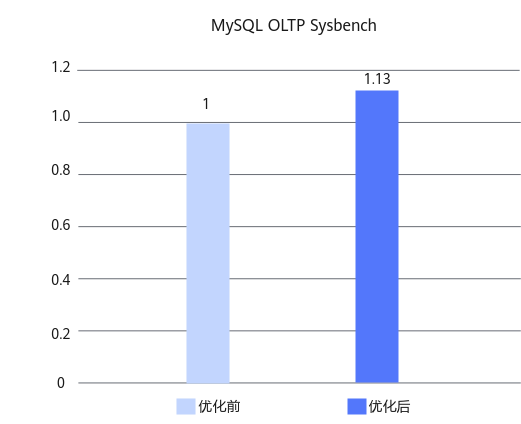

# MySQL Binlog writeset_history数据结构优化 特性指南

## 特性描述<a name="ZH-CN_TOPIC_0000002518537838"></a>

### 简介<a name="ZH-CN_TOPIC_0000002518537840"></a>

本文主要介绍如何在鲲鹏服务器上安装和使能Binlog writeset_history数据结构优化特性。

MySQL的二进制日志（Binlog）是记录所有数据库数据变更操作（如INSERT、UPDATE、DELETE）的日志文件，主要用于数据复制和恢复。开启Binlog后，为了保证Redo log和Binlog的数据一致性，MySQL使用了二阶段提交，由Binlog作为事务的协调者。而引入"二阶段提交"使得Binlog成为了性能瓶颈，针对此问题鲲鹏BoostKit提供了Binlog预分配、Binlog拆锁优化和Binlog writeset_history数据结构优化三个特性来提高系统性能。通过以上三个特性叠加，，Percona-Server 5.7.44-53在8C16G容器规格下Sysbench只写场景测试可获得13%的性能提升。本文以Percona-Server为例介绍如何在鲲鹏服务器上使用Binlog writeset_history数据结构优化特性。

### 原理描述<a name="ZH-CN_TOPIC_0000002518697750"></a>

**Binlog writeset_history数据结构优化<a name="section199911550174819"></a>**

事务组提交时在FLUSH阶段的leader线程会调用Writeset_trx_dependency_tracker::get_dependency获取事务的依赖关系，其中不同事务的sequence_number信息保存在m_writeset_history变量中，此变量使用的数据结构为std::map。std::map使用红黑树的形式存储元素，其插入和查找的时间复杂度为O(log N)，因此可以使用hash map数据结构进行替换，将插入和查找的时间复杂度降为O(1)，以提高效率。

## 环境要求<a name="ZH-CN_TOPIC_0000002518697748"></a>

本文基于特定环境提供指导，在正式操作前请确保软硬件均满足要求。

**表 1** 硬件要求<a id="硬件要求"></a>

|项目|规格|
|--|--|
|CPU|鲲鹏920新型号处理器、鲲鹏950处理器|

**表 2** 操作系统和软件要求<a id="操作系统和软件要求"></a>

|项目|版本|获取地址|
|--|--|--|
|操作系统|openEuler 22.03 LTS SP4|[获取链接](https://repo.huaweicloud.com/openeuler/openEuler-22.03-LTS-SP4/ISO/aarch64/openEuler-22.03-LTS-SP4-everything-aarch64-dvd.iso)|
|Percona|Percona-Server 5.7.44-53|[获取链接](https://gitcode.com/boostkit/boostdb/releases/download/MySQL-Percona-Server-5.7.44-53-v4/BoostDB-Percona-5.7.44-53.aarch64.rpm)|
|Percona|Percona-Server 8.0.43-34|[获取链接](https://gitcode.com/boostkit/boostdb/releases/download/MySQL-Percona-Server-8.0.43-34-v3/BoostDB-Percona-8.0.43-34.aarch64.rpm)|

## 安装和使能特性<a name="ZH-CN_TOPIC_0000002550137589"></a>

以Percona-Server 5.7.44-53为例说明如何进行特性安装与使能，具体操作步骤如下。

1. 请参见《Percona移植指南》中的[配置编译环境](https://www.hikunpeng.com/document/detail/zh/kunpengdbs/ecosystemEnable/Percona/kunpengpercona_02_0014.html)章节安装依赖。
2. 请参见[**表 2** 操作系统和软件要求](#操作系统和软件要求)下载Percona-Server 5.7.44-53对应的rpm包并存放至目标路径，例如"/home"。
3. 执行如下命令安装rpm包。安装完成后，默认安装目录位于"/usr/local/mysql"。

    ```
    cd /home
    rpm -ivh BoostDB-Percona-5.7.44-53.aarch64.rpm
    ```

    > **说明：** 
    >安装过程中，如果存在已安装依赖包但rpm相关检验不通过的情况，使用--nodeps跳过依赖检查，即执行如下命令。
    >```
    >rpm -ivh BoostDB-Percona-5.7.44-53.aarch64.rpm --nodeps
    >```

4. 启动数据库。启动数据库的操作请参见《MySQL移植指南》的[运行MySQL](https://www.hikunpeng.com/document/detail/zh/kunpengdbs/ecosystemEnable/MySQL/kunpengmysql8017_03_0013.html)章节。
5. （可选）通过Sysbench测试可以得到使能Binlog writeset_history数据结构优化特性前后的性能提升效果，详细测试步骤请参见《[Sysbench 0.5&1.0 测试指导](https://www.hikunpeng.com/document/detail/zh/kunpengdbs/testguide/tstg/kunpengsysbench_02_0001.html)》。<br>Binlog优化特性（三特性叠加）可以使Sysbench写场景性能提升13%，优化前后对比效果如[**图 1** Binlog优化特性（三特性叠加）优化前后性能对比](#Binlog优化特性优化前后性能对比)所示。

    **图 1** Binlog优化特性（三特性叠加）优化前后性能对比<a name="fig937192253919"></a><a id="Binlog优化特性优化前后性能对比"></a><br>
    

## 故障排除<a name="ZH-CN_TOPIC_0000002550177591"></a>

### 启动MySQL时报version `GLIBCXX_3.4.29' not found的解决方法<a name="ZH-CN_TOPIC_0000002518537836"></a>

**问题现象描述<a name="zh-cn_topic_0000002533421305_section642124153116"></a>**

启动MySQL时报错：/usr/local/mysql/bin/mysqld: /usr/local/mysql/bin/mysqld: /usr/lib64/libstdc++.so.6: version `GLIBCXX_3.4.29' not found (required by /usr/local/mysql/bin/mysqld)。

**关键过程、根本原因分析<a name="zh-cn_topic_0000002533421305_section145813300553"></a>**

系统libstdc++.so.6版本低，缺少GLIBCXX_3.4.29。

**结论、解决方案及效果<a name="zh-cn_topic_0000002533421305_section164566494716"></a>**

1. 下载gcc 12.3.1（GCC for openEuler 3.0.3）。

    ```
    cd /home
    wget https://mirrors.huaweicloud.com/kunpeng/archive/compiler/kunpeng_gcc/gcc-12.3.1-2024.12-aarch64-linux.tar.gz
    ```

2. 执行以下命令解压。

    ```
    tar zxvf gcc-12.3.1-2024.12-aarch64-linux.tar.gz
    ```

3. 备份当前系统的libstdc++.so.6，创建高版本libstdc++.so.6软链接。

    ```
    mv /usr/lib64/libstdc++.so.6 /usr/lib64/libstdc++.so.6.bak
    ln -s /home/gcc-12.3.1-2024.12-aarch64-linux/lib64/libstdc++.so.6 /usr/lib64/libstdc++.so.6
    ```

4. 检查当前库版本，若有输出，则说明已满足需求。

    ```
    strings /usr/lib64/libstdc++.so.6 | grep GLIBCXX_3.4.29
    ```

5. 重新启动MySQL。

## 安全检查与加固<a name="ZH-CN_TOPIC_0000002550177593"></a>

ASLR（Address Space Layout Randomization，地址空间布局随机化）是一种针对缓冲区溢出的安全保护技术，通过对堆、栈、共享库映射等线性区布局的随机化，增加攻击者预测目的地址的难度，防止攻击者直接定位攻击代码位置，达到阻止溢出攻击的目的。

```
echo 2 >/proc/sys/kernel/randomize_va_space
```

