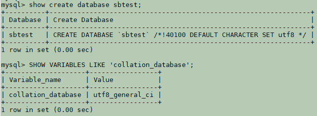
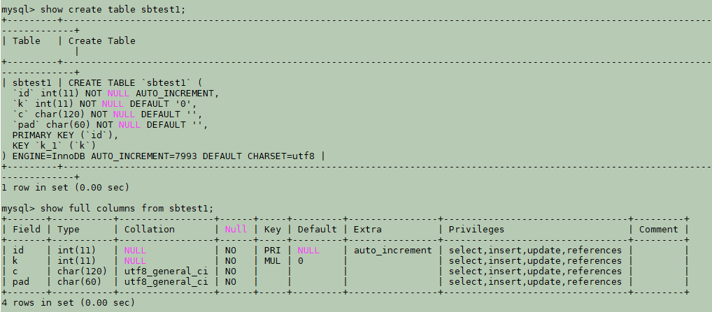
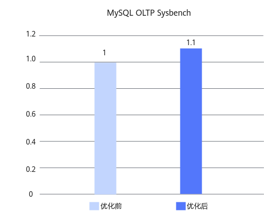

# MySQL字符集处理SIMD优化 特性指南

## 特性描述<a name="ZH-CN_TOPIC_0000002518697734"></a>

### 简介<a name="ZH-CN_TOPIC_0000002518537818"></a>

本文主要介绍如何在鲲鹏服务器上安装和使能字符集处理SIMD优化特性。

在MySQL OLTP场景中，使用Sysbench工具进行只读模型测试时，性能监控显示的主要热点函数包括字符集处理相关的函数（如my_strnxfrm_unicode、my_ismbchar_utf8、my_charpos_mb、my_hash_sort_utf8、my_lengthsp_8bit）。针对这些热点函数，鲲鹏BoostKit利用SIMD指令进行了向量化加速优化，显著提升了执行效率。

通过记录匹配优化、字符集处理的SIMD和非对齐内存访问优化三特性叠加，在Percona-Server 5.7.44-53版本8C16G容器规格中，Sysbench只读测试场景下的性能获得了约10%的提升。

### 原理描述<a name="ZH-CN_TOPIC_0000002550177569"></a>

**字符集处理SIMD优化<a name="section695124719482"></a>**

本优化利用SIMD指令对utf8/utf8mb4字符集处理过程进行向量化加速，提升相关运算效率。

由于utf8/utf8mb4为变长编码，处理时常需预先计算字符长度或将其转换为定长Unicode格式（2字节），再进行后续操作。考虑到其中ASCII字符（范围0–127）为单字节定长，且其Unicode表示仍为原值（高字节补零），可针对该部分字符实施SIMD并行处理，以提高处理吞吐量。

在代码实现层面，主要对以下函数进行优化：

- 在my_collation_utf8_general_ci_handler中，优化my_strnxfrm_unicode、my_hash_sort_utf8及my_hash_sort_utf8mb4。
- 在my_charset_utf8_handler中，优化my_numchars_mb和my_charpos_mb。

## 环境要求<a name="ZH-CN_TOPIC_0000002518697732"></a>

本文基于特定环境提供指导，在正式操作前请确保软硬件均满足要求。

**表 1** 硬件要求<a id="硬件要求"></a>

|项目|规格|
|--|--|
|CPU|鲲鹏920新型号处理器、鲲鹏950处理器|

**表 2** 操作系统和软件要求<a id="操作系统和软件要求"></a>

|项目|版本|获取地址|
|--|--|--|
|操作系统|openEuler 22.03 LTS SP4|[获取链接](https://repo.huaweicloud.com/openeuler/openEuler-22.03-LTS-SP4/ISO/aarch64/openEuler-22.03-LTS-SP4-everything-aarch64-dvd.iso)|
|Percona|Percona-Server 5.7.44-53|[获取链接](https://gitcode.com/boostkit/boostdb/releases/download/MySQL-Percona-Server-5.7.44-53-v3/BoostDB-Percona-5.7.44-53.aarch64.rpm)|
|Percona|Percona-Server 8.0.43-34|[获取链接](https://gitcode.com/boostkit/boostdb/releases/download/MySQL-Percona-Server-8.0.43-34-v2/BoostDB-Percona-8.0.43-34.aarch64.rpm)|

## 安装和使能特性<a name="ZH-CN_TOPIC_0000002550177571"></a>

以Percona-Server 5.7.44-53为例介绍如何安装和使能字符集处理SIMD优化特性，具体操作步骤如下。

1. 请参见《Percona移植指南》中的[配置编译环境](https://www.hikunpeng.com/document/detail/zh/kunpengdbs/ecosystemEnable/Percona/kunpengpercona_02_0014.html)章节安装依赖。
2. 请参见[**表 2** 操作系统和软件要求](#操作系统和软件要求)下载Percona-Server 5.7.44-53对应的rpm包并存放至目标路径，例如"/home"。
3. 执行如下命令安装rpm包。安装完成后，默认安装目录位于"/usr/local/mysql"。

    ```
    cd /home
    rpm -ivh BoostDB-Percona-5.7.44-53.aarch64.rpm
    ```

    > **说明：**
    >安装过程中，如果存在已安装依赖包但rpm相关检验不通过的情况，使用--nodeps跳过依赖检查，即执行如下命令。
    >```
    >rpm -ivh BoostDB-Percona-5.7.44-53.aarch64.rpm --nodeps
    >```

4. 在MySQL配置文件"/etc/my.cnf"中增加字符序配置。
    1. 打开MySQL配置文件"/etc/my.cnf"。

        ```
        vi /etc/my.cnf
        ```

    2. 按"i"进入编辑模式。
        - 字符集为utf8时，在"[mysqld]"下增加以下配置。

            ```
            character_set_server = utf8
            collation_server = utf8_general_ci
            ```

        - 字符集为utf8mb4时，在"[mysqld]"下增加以下配置。

            ```
            character_set_server = utf8mb4
            collation_server = utf8mb4_general_ci
            ```

    3. 按"Esc"键退出编辑模式，输入 **:wq!**，按"Enter"键保存并退出文件。

5. 启动数据库。启动数据库的操作请参见《MySQL移植指南》的[运行MySQL](https://www.hikunpeng.com/document/detail/zh/kunpengdbs/ecosystemEnable/MySQL/kunpengmysql8017_03_0013.html)章节。

6. 以数据库sbtest中的表sbtest1为例说明如何查询数据库和表的字符集、字符序配置。

    ```
    show create database sbtest;
    SHOW VARIABLES LIKE 'collation_database';
    show create table sbtest1;
    show full columns from sbtest1;
    show table status from sbtest like 'sbtest%';
    ```

    > **说明：**
    >进入客户端的操作请参见《MySQL移植指南》的[运行MySQL](https://www.hikunpeng.com/document/detail/zh/kunpengdbs/ecosystemEnable/MySQL/kunpengmysql8017_03_0013.html)章节。

    **图 1** 查询数据库字符集、字符序<a name="fig1447410214484"></a><a id="查询数据库字符集、字符序"></a><br>
    

    **图 2** 查询表的字符集、字符序<a name="fig13338178174811"></a><a id="查询表的字符集、字符序"></a><br>
    

    **图 3** 获取数据库的表信息，collation列即为字符序<a name="fig762681216487"></a><a id="获取数据库的表信息，collation列即为字符序"></a><br>
    

7. （可选）通过Sysbench测试可以得到使能字符集处理SIMD优化特性前后的性能提升效果，详细测试步骤请参见《[Sysbench 0.5&1.0 测试指导](https://www.hikunpeng.com/document/detail/zh/kunpengdbs/testguide/tstg/kunpengsysbench_02_0001.html)》。<br>通过记录匹配优化、字符集处理的SIMD和非对齐内存访问优化三特性叠加，可以使Sysbench只读场景性能提升10%，优化前后对比效果如[图 三特性叠加优化前后性能对比](#计算路径优化特性优化前后性能对比)所示。

    **图 4** 三特性叠加优化前后性能对比<a name="fig937192253919"></a><a id="计算路径优化特性优化前后性能对比"></a><br>
    

## 故障排除<a name="ZH-CN_TOPIC_0000002550137571"></a>

### 启动MySQL时报version `GLIBCXX_3.4.29' not found的解决方法<a name="ZH-CN_TOPIC_0000002550137567"></a>

**问题现象描述<a name="section642124153116"></a>**

启动MySQL时报错：/usr/local/mysql/bin/mysqld: /usr/local/mysql/bin/mysqld: /usr/lib64/libstdc++.so.6: version `GLIBCXX_3.4.29' not found (required by /usr/local/mysql/bin/mysqld)。

**关键过程、根本原因分析<a name="section145813300553"></a>**

系统libstdc++.so.6版本低，缺少GLIBCXX_3.4.29。

**结论、解决方案及效果<a name="section164566494716"></a>**

1. 下载gcc 12.3.1（GCC for openEuler 3.0.3）。

    ```
    cd /home
    wget https://mirrors.huaweicloud.com/kunpeng/archive/compiler/kunpeng_gcc/gcc-12.3.1-2024.12-aarch64-linux.tar.gz
    ```

2. 执行以下命令解压。

    ```
    tar zxvf gcc-12.3.1-2024.12-aarch64-linux.tar.gz
    ```

3. 备份当前系统的libstdc++.so.6，创建高版本libstdc++.so.6软链接。

    ```
    mv /usr/lib64/libstdc++.so.6 /usr/lib64/libstdc++.so.6.bak
    ln -s /home/gcc-12.3.1-2024.12-aarch64-linux/lib64/libstdc++.so.6 /usr/lib64/libstdc++.so.6
    ```

4. 检查当前库版本，若有输出，则说明已满足需求。

    ```
    strings /usr/lib64/libstdc++.so.6 | grep GLIBCXX_3.4.29
    ```

5. 重新启动MySQL。

## 安全检查与加固<a name="ZH-CN_TOPIC_0000002518537816"></a>

ASLR（Address Space Layout Randomization，地址空间布局随机化）是一种针对缓冲区溢出的安全保护技术，通过对堆、栈、共享库映射等线性区布局的随机化，增加攻击者预测目的地址的难度，防止攻击者直接定位攻击代码位置，达到阻止溢出攻击的目的。

```
echo 2 >/proc/sys/kernel/randomize_va_space
```

