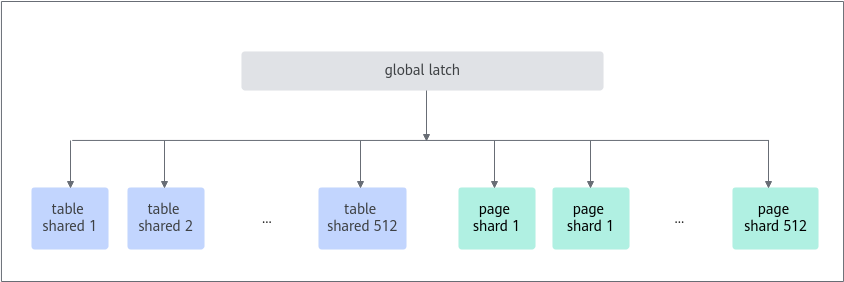
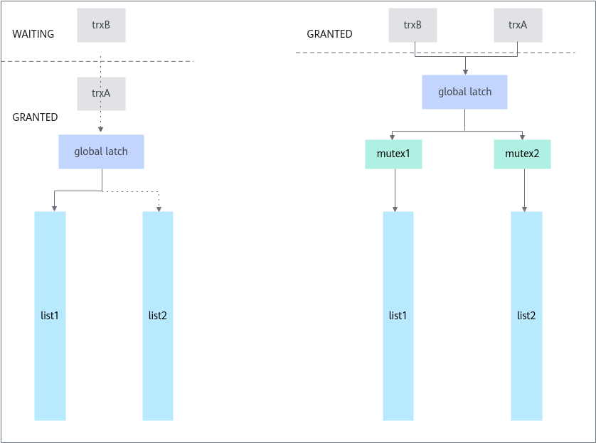

# MySQL细粒度锁优化 特性指南

## 原理介绍<a name="ZH-CN_TOPIC_0000002550144937"></a>

在MySQL OLTP场景下，大量并发的DML语句（Insert, Update, Delete）会访问lock\_sys-\>mutex全局锁保护的关键数据结构，导致锁竞争激烈，性能下降。为了解决这个问题，鲲鹏BoostKit提供了采用细粒度hash桶锁来替换全局锁的优化特性，能够减少锁冲突，提高并发度。

MySQL中的每个表和行都可以看作是一种资源，事务可以请求访问资源。但是并发的事务对资源的访问可能造成冲突，因此MySQL设计了Lock-sys用于管理对表和行的访问。

Lock-sys会维持多个队列用于存储事务对资源的占用情况，每当有一个新请求需要申请某个资源时，Lock-sys会在相应队列里查询这个资源是否已被占用。不管请求的资源是否被占用，Lock-sys都会将锁请求插入到相应的队列中，分别标记为已授权或等待锁请求。为了支持并发操作，上述查询和插入过程需要对队列加锁。

数据库中，lock和latch有时都被称为锁，但意义不同：

- lock是用于锁定数据库对象，如表、行。
- latch是用于保护内存数据结构。

在过去，所有队列的访问均由一个latch管理，这意味着即使只要访问一个队列，其他所有的队列也会被锁住。这种实现方式在高并发场景下效率低下，为了解决这个问题，本特性引入了一种更细粒度的latch锁定方法。

新的latch锁定方法是在原来全局大锁的基础上，将队列分组为固定数量的shard，每个shard由自己的mutex保护。为了能够高效地锁住所有的shard，新特性中的全局大锁（global latch）被设计为读写锁。对各个队列进行访问，需要先获取global latch的共享锁，再获取相应shard的mutex。这种实现方式类似于MySQL访问一条记录时，先对表加意向锁，再对相应记录加锁。在一些特殊场景下需要锁住所有队列，这时获取global latch的排他锁即可。这种实现方式的大体思路基于：大多数操作涉及一个或两个Lock-sys队列，并且独立于对其他队列进行的操作。global latch与其管理对象的关系如下图所示。



新的锁定方式的效率提升如下图所示。在过去，如果事务A和事务B分别要访问队列1和队列2，由于都需要对全局大锁上锁，这时事务B就会被阻塞；而在新特性中，事务A和事务B可以同时申请global latch的共享锁，再分别申请mutex1和mutex2，也就是说事务A和事务B可以同时进行，并发度提升。



访问两个队列以获取两条记录涉及以下步骤：

1. 对global\_latch执行s-latch
2. 标识记录所属的2个页
3. 标识包含给定页的队列的2个哈希桶
4. 标识包含这两个桶的2个shard id
5. 按地址顺序对两个分片的mutex上锁

以上所有步骤（除步骤2外，因为我们通常已经知道这些页）都是借助一行代码实现的：

```
locksys::Shard_latches_guard guard{*block_a, *block_b};
```

如果要“stop-the-world”，只需通过以下代码对global latch上x-latch：

```
locksys::Exclusive_global_latch_guard guard{};
```

为了使用友元保护器类，如Shard\_latches\_guard，该类不会公开太多的公共函数。


## 代码实现<a name="ZH-CN_TOPIC_0000002518705092"></a>

- **Latch guards的变更：**

    本特性新增类如下表所示。在Exclusive\_global\_latch\_guard仅用于死锁解析等罕见事件的情况下，Shard\_latch\_guard，Shard\_latches\_guard，Exclusive\_global\_latch\_guard已可以处理大多数用例，但在我们的代码中有一些特殊情况需要表中其他更细粒度的工具。

|**类名**|**说明**|
|--|--|
|Shard_latch_guard|对global_latch执行s-latch并在其生命周期内锁住shard mutex。|
|Shard_latches_guard|对global_latch执行s-latch并在其生存期内按序锁住两个shard mutex。|
|Exclusive_global_latch_guard|在其生命周期内对global_latch执行x-latch。|
|Shared_global_latch_guard|仅对global_latch执行s-latch，但不锁任何shard。以后在事务锁释放阶段可以在有效地遍历事务锁列表时单独锁住shard。|
|Naked_shard_latch_guard|只锁一个shard，但不锁global_latch。该类与Shared_global_latch_guard结合使用。|
|Try_exclusive_global_latch|试图在其生命周期内对global_latch执行x-latch。该类唯一用例在srv_printf_innodb_monitor()中，其作用是试图避免在报告InnoDB监视器输出时干扰工作负载。|
|Unsafe_global_latch_manipulator|允许以非结构化的方式按需手动锁定和解锁独占global_latch。在如下代码实现路径下需要使用该类：srv_printf_innodb_monitor() =>srv_printf_locks_and_transactions() =>lock_print_info_all_transactions() =>lock_trx_print_locks() =>lock_rec_fetch_page()|


- **trx-\>mutex的变更：**

    Lock-sys和trx-\>mutex-es的交互比较复杂。我们特别允许执行Lock-sys操作的线程请求另一个trx-\>mutex，即使它已经有一个trx的mutex。因此，必须证明在设想的等待图中不可能形成死锁循环，其中边缘从试图获取trx-\>mutex的线程到当前拥有trx-\>mutex的线程。

    在过去这很简单，因为Lock-sys受global mutex保护，这意味着最多有一个线程可以尝试拥有多个trx-\>mutex，在只有一个节点可以同时拥有入边和出边的图中，一个trx-\>mutex不能形成循环。

    只要多个线程发生在不同的分片中，这些线程就可以并行执行Lock-sys操作，因此我们可以拆分Lock-sys mutex。

- **dict\_table\_t::autoinc\_trx的变更：**

    该字段用于存储指向trx的指针，指向当前拥AUTO\_INC锁的trx。由于AUTO\_INC锁互斥，因此最多只能有一个事务持有AUTO\_INC锁。函数row\_lock\_table\_autoinc\_for\_mysql \(\)通过查看该字段检查当前事务是否持有AUTO\_INC。如果是，它可以遵循快速路径。此类检查是一种不带锁的比较，为了保证结果正确，需要将类型更改为atomic<\>，并且保证对该字段的修改只在授权和释放期间进行，另外，在线程运行事务期间不能进行锁的释放。为了更好地解释工作原理，一些关于该代码的注释、断言和字段类型也做了相应的修改。

- **dict\_table\_t::n\_rec\_locks的变更：**

    该字段统计当前与给定表关联的记录锁（已授权或等待中）的数量。在新特性中，只要记录锁位于不同的分片中，就可以并行创建和销毁，这意味着对该字段的修改是并发性的，因此我们将该字段声明为atomic<\>类型。事务如果要读取该字段的值，须获得独占的全局latch，否则，在处理结果之前，这个值可能会被修改。该字段相关的一些注释也做了相应的修改。

- **hit list的变更：**

    为了避免高优先级事务等待记录锁，新特性引入一个中止低优先级冲突事务的机制。由于冲突事务可能处于其他Lock-sys队列，识别和中止冲突事务的过程需要独占global latch。为了避免高优先级事务可能根本不处于等待状态而独占全局latch，我们需要一种可靠的、对线程安全的方法来检查事务是否正在等待。hp\_trx-\>lock.que\_state == TRX\_QUE\_LOCK\_WAIT即可简单地完成该操作，但其合理程度还需后续确定。

    代码中有些地方修改该字段之前未获取latch，这并不安全。另一种正确的方法是使用hp\_trx-\>lock.blocking\_trx.load\(\) != nullptr来代替，这只需要在注释中稍作改动，以声明需要在等待结束时清除该字段（已经在代码中完成，但注释未做相应说明，可能造成迷惑）。修复que\_state处理不在此特性的范围内。

- **lock\_release\(\)的变更：**

    释放事务占有的所有锁，需要对事务的锁列表进行遍历，并对每个锁在相应的锁队列中执行一些操作。获取独占的全局latch是一种简单的实现方式，但是效率比较低下。

    为了获得更好的并发性，最好是只获取一个共享的全局latch，然后在遍历时逐个锁住包含特定锁的shard。这种实现方法的困难在于，锁定顺序规则要求在trx latch之前获取Lock-sys latch，而trx-\>mutex保护事务的锁列表。此规则能防止并发的B树修改所导致的锁在页之间（进而在分片之间）重新定位。所以，这是一个先有鸡还是现有蛋的问题：我们要知道要锁哪个shard，需要知道下一个锁是什么，但是要遍历列表，我们需要trx-\>latch，这只能在锁定shard之后才能得到。对于该问题，我们的解决方法是：首先锁住trx-\>mutex，记下列表中最后一个锁的shard id，释放trx-\>mutex，锁住特定shard，再锁trx-\>mutex。只有之前所记录的锁仍位于列表的尾部，才能继续。这可能看起来很复杂，但实际上比“stop-the-world”的方法要快得多。

- **lock\_trx\_release\_read\_locks\(\)的变更：**

    lock\_trx\_release\_read\_locks \(\)主要用于组复制应用中释放读间隙锁。如果使用独占全局latch来遍历事务的锁，该函数会成为瓶颈。与lock\_release \(\)函数类似，我们应该获取一个共享的global latch并在遍历中逐个获取latch shard。问题在于其他线程可以并发修改锁列表（例如，由于隐式到显式转换，或B树重组），而且我们不能简单地将当前锁与尾部进行比较，因为我们并不删除所有锁，只是删除它们的子集，所以lock\_release \(\)的解决方法在这里是不够的。对此，我们引入uint64\_t trx-\>lock.trx\_locks\_version，此变量在每次trx锁列表添加或删除锁时递增。在几次重启失败之后，可以切换回旧的lock\_trx\_release\_read\_locks\_in\_x\_mode\(\)。

- **其他变更：**
    - 将整个latch锁定逻辑分离到专门的类locksys::Latches，并在其头文件中广泛记录设计。

    - 所有新函数都将在locksys命名空间中。

    - lock\_mutex\_enter\(\)/lock\_mutex\_exit\(\)的所有用法将被适当的latch guard替换，最好是locksys:Shard\_latch\_guard。

    - table-\>n\_rec\_locks必须成为atomic类型，因为它现在为给定表创建/销毁记录锁期间，可以并行递增/递减。

    - dict/mem.cc在为UNIV\_LIBRARY编译时并不需要包括lock0lock.h。

    - 从PSI中移除lock\_mutex。

    - 在PSI中添加lock\_sys\_global\_latch\_rw\_lock。

    - 在PSI中添加lock\_sys\_page\_mutex。

    - 在PSI中添加lock\_sys\_table\_mutex。

    - 将所有使用exclusive global latch的地方记录下来，以说明我们必须采用如此强同步的其余原因。
    - table-\>autoinc\_trx字段应该是atomic类型的，因为它在未使用latch的情况下被“窥视”。并且必须清理周围的混淆/错误的注释和断言，以声明其正确性。
    - lock\_rec\_expl\_exist\_on\_page\(\)应返回bool，而不是可能指向lock\_t的悬垂指针。
    - lock\_print\_info\_summary和srv\_printf\_innodb\_monitor\(\)的内部逻辑通常至少需要进行小的重构，以便可以使用latch guard。
    - lock\_mutex\_own\(\)调试谓词必须替换为更具体的owns\_exclusive\_global\_latch\(\)、owns\_shared\_global\_latch\(\)、owners\_page\_shard\(page\)、owners\_page\_shard\(table\)等等。
    - 需要实现bool Sharded\_rw\_lock::try\_x\_lock。
    - lock\_rec\_insert\_check\_and\_lock\(\)（及其副本lock\_prdt\_insert\_check\_and\_lock）的控制流可以通过移除重复代码来简化，以便能够使用latch guard。
    - 可以通过删除重复代码，并使用更结构化的latch锁定来简化lock\_rec\_queue\_validate\(\)的代码。
    - 更新sync0debug，使其有适当的latch锁定顺序规则。


## 使用说明<a name="ZH-CN_TOPIC_0000002518545196"></a>

建议关注[MySQL官网](https://www.mysql.com/)MySQL 8.0.20版本的CVE漏洞，按照要求及时进行漏洞修复。

**版本说明<a name="section1167448114718"></a>**

MySQL细粒度锁优化特性随Kunpeng Computing DC Solution 20.0.3版本发布。

**应用场景<a name="section1223118489461"></a>**

当OLTP负载中，存在较多写类型操作时（update/insert/delete），MySQL中的全局latch可能成为影响吞吐量的主因。如果通过Performance Schema观测到lock\_mutex热点（此时CPU利用率通常不高），可通过本特性缓解此处竞争，提升系统吞吐量。

MySQL细粒度锁优化特性在补丁应用后重新编译MySQL即生效，无需额外配置系统变量。

**编译安装方法<a name="section14445125111461"></a>**

MySQL细粒度锁优化特性以Patch补丁文件形式提供，该补丁基于MySQL 8.0.20版本开发，并在Gitee社区开源，使用该特性前，需要先将Patch应用到MySQL源码中，再编译和安装MySQL。具体操作步骤如下：

1. 下载[MySQL 8.0.20源码](https://downloads.mysql.com/archives/get/p/23/file/mysql-boost-8.0.20.tar.gz)，上传源码至服务器“/home”目录下后，解压源码包并进入MySQL源码的根目录。

    ```
    cd /home
    tar -zxvf mysql-boost-8.0.20.tar.gz
    cd mysql-8.0.20
    ```

2. 下载[MySQL细粒度锁优化特性Patch](https://gitcode.com/boostkit/boostdb/releases/download/MySQL-patch-release/boostdb-patch-release-20260330.zip)，解压后将0001-SHARDED-LOCK-SYS.patch上传至MySQL源码的根目录。
3. 解压源码包并进入MySQL源码目录。

    ```
    tar -zxvf mysql-boost-8.0.20.tar.gz
    cd mysql-8.0.20
    ```

4. 在源码根目录，使用git初始化命令来建立git管理信息。

    ```
    git init
    git add -A
    git commit -m "Initial commit"
    ```

    > **说明：**
    >-   一般情况下，系统自带git，若需要安装git，请先参见《[MySQL 移植指南](https://www.hikunpeng.com/document/detail/zh/kunpengdbs/ecosystemEnable/MySQL/kunpengmysql8017_02_0001.html)》中配置Yum源相关内容，再执行如下命令安装git。
    >    ```
    >    yum install git
    >    ```
    >-   若未配置git的提交用户信息，git commit前需要先配置用户邮件及用户名称信息。
    >    ```
    >    git config user.email "123@example.com"
    >    git config user.name "123"
    >    ```

5. （可选）如果没有配置Yum源，请配置Yum源，详细信息请参见[配置Yum源](https://www.hikunpeng.com/document/detail/zh/kunpengdbs/ecosystemEnable/MySQL/kunpengmysql8017_02_0013.html)。
6. （可选）如果没有安装dos2unix，请执行如下命令安装dos2unix。

    ```
    yum install dos2unix
    ```

7. 合入MySQL细粒度锁优化特性补丁。

    ```
    dos2unix 0001-SHARDED-LOCK-SYS.patch
    git apply --check 0001-SHARDED-LOCK-SYS.patch
    git apply --whitespace=nowarn 0001-SHARDED-LOCK-SYS.patch
    ```

    如果没有回显报错信息，则补丁应用成功。

8. 根据正常的编译安装MySQL源码的操作步骤进行MySQL的编译安装。详细信息请参见《[MySQL 移植指南](https://www.hikunpeng.com/document/detail/zh/kunpengdbs/ecosystemEnable/MySQL/kunpengmysql8017_02_0001.html)》。
9. （可选）通过TPC-C测试可以得到使用MySQL细粒度锁优化特性前后的性能提升效果，详细测试步骤请参见《[BenchMarkSQL 测试指导](https://www.hikunpeng.com/document/detail/zh/kunpengdbs/testguide/tstg/kunpengbenchmarksql_06_0001.html)》。

    MySQL细粒度锁优化特性可以使TPC-C综合性能提升10%。

    **图 1** MySQL细粒度锁优化特性优化前后性能对比<a name="fig20903163123514"></a><a id="MySQL细粒度锁优化特性优化前后性能对比"></a><br>
    


## 修订记录<a name="ZH-CN_TOPIC_0000002550184931"></a>

|发布日期|修订记录|
|--|--|
|2023-07-25|第二次正式发布。更新MySQL细粒度锁优化特性的“使用说明”章节中合入补丁操作步骤的命令。|
|2020-07-13|第一次正式发布。|


