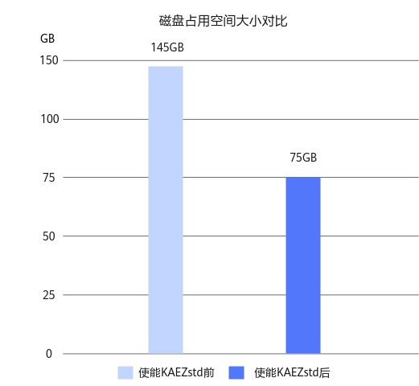
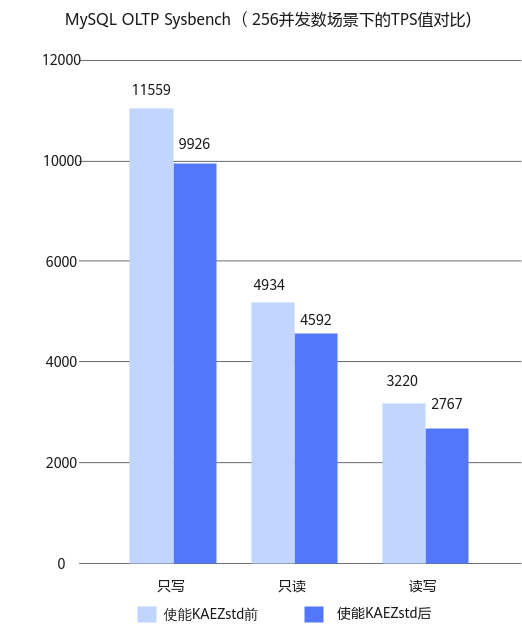

# MySQL KAEzstd页压缩解压缩优化 特性指南

## 简介<a name="ZH-CN_TOPIC_0000002092944173"></a>

本文主要介绍如何在使用openEuler操作系统的鲲鹏服务器上安装MySQL并合入MySQL KAEZstd页压缩解压缩优化特性Patch包、安装KAEZstd以及使能KAEZstd。

MySQL是一个关系型数据库管理系统，由瑞典MySQL AB公司开发，是业界最流行的RDBMS（Relational Database Management System）之一，尤其在Web应用方面。关系型数据库是将数据保存在不同的表中，而非将所有数据放在一个大仓库内，这样就加快了速度并提高了灵活性。由于其体积小、速度快、总体拥有成本低，尤其是开放源码这一特点，一般中小型网站的开发都选择MySQL作为网站数据库。MySQL所使用的SQL语言是用于访问数据库的最常用标准化语言。MySQL软件采用了双授权模式，分为社区版和商业版。关于MySQL的更多信息请访问[<u>MySQL官网</u>](https://www.mysql.com/)。

KAEZstd是鲲鹏加速引擎KAE（Kunpeng Accelerator Engine）的压缩模块，使用鲲鹏硬加速模块实现lz77\_zstd算法，提供ZSTD库标准接口。通过加速引擎可以实现不同场景下应用性能的提升，压缩效率有显著提升。关于KAEZstd的更多详细信息，请参见《[<u>鲲鹏加速引擎 开发指南（KAEzip）</u>](https://support.huawei.com/enterprise/zh/doc/EDOC1100433052)》。

MySQL透明页压缩是MySQL InnoDB存储引擎提供的一种数据压缩技术，它能够在页面级别对数据进行压缩，从而节省磁盘空间。在MySQL KAEZstd页压缩解压缩优化特性中，MySQL透明页压缩利用鲲鹏加速引擎中的KAEZstd来压缩数据页，从而有效节省磁盘空间。以Sysbench测试场景下测试64张1000万行表为例，使用MySQL KAEZstd页压缩解压缩优化特性方案后，减少大约一半的磁盘占用空间，并且在高负载并发的情况下，TPS（Transactions Per Second）劣化程度不超过15%。


## 环境要求<a name="ZH-CN_TOPIC_0000002056943832"></a>

本文基于鲲鹏服务器和openEuler操作系统提供指导，在正式操作前请确保软硬件均满足要求。

**硬件要求<a name="section155601083715"></a>**

硬件要求如[**表 1** 硬件要求](#硬件要求)所示。

**表 1** 硬件要求<a id="硬件要求"></a>

|项目|规格|
|--|--|
|服务器|鲲鹏服务器|
|CPU|鲲鹏920新型号处理器|
|硬盘|进行性能测试时，数据目录需使用单独硬盘，即一个系统盘，一个数据盘（数据盘可选用性能较好的SSD盘或NVMe盘等），至少两块硬盘。非性能测试时，直接在系统盘上建数据目录即可。具体硬盘数量根据实际需求配置。|


**操作系统和软件要求<a name="section8546756417"></a>**

操作系统和软件要求如[**表 2** 操作系统和软件要求](#操作系统和软件要求)所示。

**表 2** 操作系统和软件要求<a id="操作系统和软件要求"></a>

|项目|版本|下载地址|
|--|--|--|
|OS|openEuler 22.03 LTS SP4 for ARM|[获取链接](https://repo.huaweicloud.com/openeuler/openEuler-22.03-LTS-SP4/ISO/aarch64/openEuler-22.03-LTS-SP4-everything-aarch64-dvd.iso)|
|MySQL|8.0.25|[获取链接](https://cdn.mysql.com/archives/mysql-8.0/mysql-boost-8.0.25.tar.gz)|
|KAE|KAE2.0|[获取链接](https://gitee.com/kunpengcompute/KAE/tree/kae2/)|
|0001-support-transparent-page-compression-for-zstd.patch|-|[获取链接](https://gitcode.com/boostkit/boostdb/releases/download/MySQL-patch-release/boostdb-patch-release-20260330.zip)|


## 安装MySQL并合入Patch包<a name="ZH-CN_TOPIC_0000002056785492"></a>

获取MySQL源码并合入MySQL KAEZstd页压缩解压缩优化特性Patch包，最后配置编译参数并完成MySQL的编译安装。

1. 获取MySQL源码。

    MySQL源码获取路径请参见[**表 2** 操作系统和软件要求](#操作系统和软件要求)。

2. 解压MySQL源码包并进入MySQL源码目录。

    ```
    tar -xzvf mysql-boost-8.0.25.tar.gz
    cd mysql-8.0.25
    ```

3. 下载MySQL KAEZstd页压缩解压缩优化特性Patch包并存放至服务器的任意路径，例如“/home“目录下。

    Patch包获取路径请参见[**表 2** 操作系统和软件要求](#操作系统和软件要求)。

4. 在MySQL源码根目录，使用Git建立管理信息。

    ```
    git init
    git add -A
    git commit -m "Initial commit"
    ```

5. 合入MySQL KAEZstd页压缩解压缩优化特性Patch包。

    ```
    dos2unix /home/0001-support-transparent-page-compression-for-zstd.patch
    git apply --check -p1 < /home/0001-support-transparent-page-compression-for-zstd.patch
    git apply  --whitespace=nowarn -p1 < /home/0001-support-transparent-page-compression-for-zstd.patch
    ```

    如果回显中没有报错信息，则表示Patch包已成功应用。

6. 编译安装MySQL。

    请根据《[MySQL 移植指南](https://www.hikunpeng.com/document/detail/zh/kunpengdbs/ecosystemEnable/MySQL/kunpengmysql8017_02_0003.html)》编译安装MySQL，操作过程中，需要将“[编译和安装](https://www.hikunpeng.com/document/detail/zh/kunpengdbs/ecosystemEnable/MySQL/kunpengmysql8017_02_0008.html)”中的如下命令添加“-DWITH\_ZSTD=system“参数。

    ```
    cd build
    cmake .. -DBUILD_CONFIG=mysql_release -DCMAKE_INSTALL_PREFIX=/usr/local/mysql -DMYSQL_DATADIR=/data/mysql/data -DWITH_BOOST=/home/mysql-8.0.25/boost/boost_1_73_0
    ```

    即，将上述命令修改为：

    ```
    cd build
    cmake .. -DBUILD_CONFIG=mysql_release -DWITH_ZSTD=system -DCMAKE_INSTALL_PREFIX=/usr/local/mysql -DMYSQL_DATADIR=/data/mysql/data -DWITH_BOOST=/home/mysql-8.0.25/boost/boost_1_73_0
    ```

    > **说明：** 
    >如果执行**cmake**命令后提示“Cannot find system zstd libraries”，请参见[合入MySQL KAEZstd页压缩解压缩优化Patch包时提示找不到zstd库的解决方法](合入MySQL-KAEZstd页压缩解压缩优化Patch包时提示找不到zstd库的解决方法.md)。

    按照《MySQL 移植指南》中的后续步骤，完成MySQL的编译和安装为止。


## 安装和使能KAEZstd<a name="ZH-CN_TOPIC_0000002092944181"></a>

安装、使能并验证KAEZstd在MySQL中的使用，以及通过Sysbench测试评估使能KAEZstd前后的存储优化效果和性能影响。

1. 安装KAEZstd。详细操作步骤请参见《[鲲鹏加速引擎开发指南（KAEzip）](https://support.huawei.com/enterprise/zh/doc/EDOC1100433052)》，请严格按照该文档的操作指导，先完成安装前准备（准备安装环境和获取KAE的License），再安装KAEZstd。
2. 使能KAEZstd。
    1. 执行如下命令设置环境变量**LD\_LIBRARY\_PATH**，以便MySQL数据库在运行时能够找到并使用KAEZstd库。

        ```
        export LD_LIBRARY_PATH=/usr/local/kaezstd/lib:$LD_LIBRARY_PATH
        ```

    2. 如果需要修改压缩等级和窗口长度这两个参数，可以通过设置环境变量的方式添加。

        设置压缩等级的参数为**KAE\_ZSTD\_COMP\_TYPE**，可设置的值为**8**和**9**，默认为**8**。

        ```
        export KAE_ZSTD_COMP_TYPE=9
        ```

        设置窗口长度的参数为**KAE\_ZSTD\_WINTYPE**，可设置的值为**4**、**8**、**16**和**32**，默认为**32**。

        ```
        export KAE_ZSTD_WINTYPE=8
        ```

3. 验证KAEZstd是否被使用。

    可通过监控实例队列数来验证KAEZstd是否被使用。

    ```
    watch -n 0.2 cat /sys/class/uacce/hisi_zip*/available_instances
    ```

    如果实例队列数减少，说明使能KAEZstd成功。

4. 通过Sysbench测试可以得到使用MySQL KAEZstd页压缩解压缩优化特性前后的存储空间节约程度和TPS劣化程度，详细测试步骤请参见《[Sysbench 0.5&1.0 测试指导](https://www.hikunpeng.com/document/detail/zh/kunpengdbs/testguide/tstg/kunpengsysbench_02_0001.html)》。

    > **须知：** 
    >使用Sysbench导入数据时，需要在Sysbench工具的oltp\_common.lua脚本的建表语句中加上如下内容。
    >```
    >COMPRESSION = 'zstd'
    >```

    MySQL透明页压缩在使能KAEZstd后，可以减少大约一半的磁盘占用空间，如[**图 1** 使能KAEZstd前后的磁盘占用空间大小对比](#使能KAEZstd前后的磁盘占用空间大小对比)所示。

    **图 1** 使能KAEZstd前后的磁盘占用空间大小对比<a name="fig17358537141717"></a><a id="使能KAEZstd前后的磁盘占用空间大小对比"></a>
    

    同时，MySQL透明页压缩在使能KAEZstd后，TPS劣化程度不超过15%，如[**图 2** 使能KAEZstd前后的TPS值对比](#使能KAEZstd前后的TPS值对比)所示。

    **图 2** 使能KAEZstd前后的TPS值对比<a name="fig197530542544"></a><a id="使能KAEZstd前后的TPS值对比"></a>
    


## 故障排除<a name="ZH-CN_TOPIC_0000002133846477"></a>

### 合入MySQL KAEZstd页压缩解压缩优化Patch包时提示找不到zstd库的解决方法<a name="ZH-CN_TOPIC_0000002133806097"></a>

**问题现象描述<a name="section99584372123"></a>**

合入MySQL KAEZstd页压缩解压缩优化Patch包时提示找不到zstd库，提示“Cannot find system zstd libraries”。

**关键过程、根本原因分析<a name="section16784917181413"></a>**

由于安装MySQL时未安装zstd-devel依赖。

**结论、解决方案及效果<a name="section199982525918"></a>**

1. 安装zstd-devel依赖。

    ```
    yum install zstd-devel
    ```

2. 重新执行CMake命令。

    ```
    cmake .. -DBUILD_CONFIG=mysql_release -DWITH_ZSTD=system -DCMAKE_INSTALL_PREFIX=/usr/local/mysql -DMYSQL_DATADIR=/data/mysql/data -DWITH_BOOST=/home/mysql-8.0.25/boost/boost_1_73_0
    ```


## 缩略语<a name="ZH-CN_TOPIC_0000002091501157"></a>

|**缩略语**|**英文全称**|**中文全称**|
|--|--|--|
|KAE|Kunpeng Acceleration Engine|鲲鹏加速引擎|
|ZSTD|Zstandard|高效无损压缩算法|
|TPS|Transactions Per Second|每秒处理的事务数|


