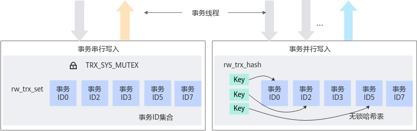
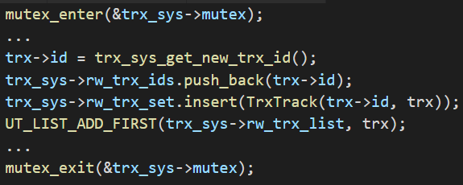
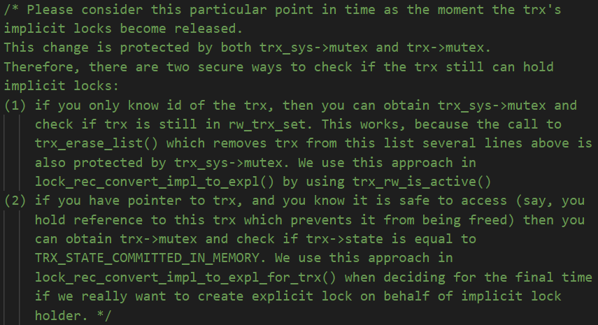
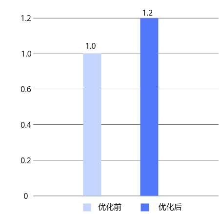

# MySQL无锁优化 特性指南

## 原理介绍<a name="ZH-CN_TOPIC_0000002518545282"></a>

在MySQL OLTP场景下，大量并发的DML语句（Insert, Update, Delete）会访问Trx-sys全局结构体中的关键数据结构，导致出现临界区竞争和同步瓶颈。为了解决这个问题，鲲鹏BoostKit对MySQL事务管理器进行了改造，如[**图 1** MySQL无锁优化特性实现原理](#MySQL无锁优化特性实现原理)所示，使用无锁哈希表来维护事务单元，读写场景下使用同步锁机制实现事务隔离级别和多版本控制，从而减少锁冲突，提高并发度。

**图 1** MySQL无锁优化特性实现原理<a name="fig1889142703912"></a><a id="MySQL无锁优化特性实现原理"></a><br>


由于MySQL的事务管理器使用链表、数组等数据结构维持全局的事务记录。Trx-sys是MySQL中的一个全局实例，维护事务系统的各种信息，例如几种事务对象的容器。

- rw\_trx\_list：包含读写事务实例，用链表实现。
- mysql\_trx\_list：包含所有用户线程事务实例，用链表实现。
- rw\_trx\_ids：包含读写事务id，用于快速拷贝一个快照，用std::vector实现。
- rw\_trx\_set：事务id到事务对象的映射，用于通过trx\_id快速找到事务实例，用std::set实现。

这些容器本身并不是线程安全的，并且有时需要对Trx-sys里多个数据（包括这些容器和其他数据）进行同步操作。原始代码中使用Trx-sys-\>mutex实现这一目的。例如trx\_set\_rw\_mode要将一个事务设置为读写事务时：



在高并发写的场景下，系统中存在大量读写事务相关操作，对Trx-sys-\>mutex的竞争开始形成吞吐量瓶颈。

在Trx-sys-\>mutex保护的临界区中各类操作中，我们通过profiling识别出两个主要耗时操作：rw\_trx\_set.insert和rw\_trx\_set.erase。rw\_trx\_set是std::set，底层实现通常是某类平衡树，通过原始代码中的注释可以看出原作者也尝试过std::unordered\_set。我们的测试也显示std::unordered\_set在这里并没有性能优势。

在本特性中，我们采用无锁哈希对象rw\_trx\_hash来替代rw\_trx\_set的功能，从而显著减小Trx-sys-\>mutex临界区耗时，缓解Trx-sys-\>mutex竞争，提升系统吞吐量。MySQL本身已经在performance schema和MDL中使用过无锁哈希，原始代码中有LF\_HASH实现，可以复用。需要注意的是，虽然访问rw\_trx\_hash是线程安全的，但由于已经将其相关操作移出临界区，rw\_trx\_hash与临界区内的数据对象不再同步，需要在代码实现时保证逻辑正确。


## 代码实现<a name="ZH-CN_TOPIC_0000002518705186"></a>

MySQL无锁优化特性新增类如[**表 1** 新增类名称及其说明](#新增类名称及其说明)所示。

**表 1** 新增类名称及其说明<a id="新增类名称及其说明"></a>

|类名|说明|
|--|--|
|rw_trx_hash_t|无锁哈希容器，封装了MySQL的LF_HASH|
|rw_trx_hash_element_t|rw_trx_hash_t的元素|


**trx\_lists\_init\_at\_db\_start的变化：** 在数据库启动期间，用生命周期为trx\_lists\_init\_at\_db\_start的TrxIdSet，实现原本的全局TrxIdSet的功能，主要是trx\_resurrect中“Resurrect transactions that were doing updates”时根据trxid避免重复创建trx实例。

**trx\_reference的变化：** 使用原子操作，替代原本的mutex保护。

**trx\_erase\_lists的变化：** 将trx\_sys-\>mutex临界区里的rw\_trx\_set.erase操作从临界区移除。

**trx\_release\_impl\_and\_expl\_locks的变化：**

- 在trx\_sys-\>mutex临界区外，增加trx\_sys-\>rw\_trx\_hash.erase，替代原本trx\_erase\_lists中的rw\_trx\_set.erase。
- 同时为保证 rw\_trx\_hash 仅包含PREPARED或ACTIVE状态的事务，将trx\_release\_impl\_and\_expl\_locks中的trx-\>state = TRX\_STATE\_COMMITTED\_IN\_MEMORY移出trx\_sys-\>mutex临界区。
- 原始代码包含如下注释说明：

    

    由于已将trx-\>state = TRX\_STATE\_COMMITTED\_IN\_MEMORY移出trx\_sys-\>mutex临界区，方法（1）不再成立。因此，方法（1）的使用者lock\_rec\_convert\_impl\_to\_expl可能会看到trx已被移出rw\_trx\_hash，但状态还未设成TRX\_STATE\_COMMITTED\_IN\_MEMORY。此时lock\_rec\_convert\_impl\_to\_expl的正确性由如下保证：

    1. 在lock\_rec\_convert\_impl\_to\_expl的上下文中，trx不存在于rw\_trx\_hash，等同于原逻辑的!trx\_rw\_is\_active\(\)。
    2. lock\_rec\_convert\_impl\_to\_expl最终会通过lock\_rec\_convert\_impl\_to\_expl\_for\_trx再次确认事务状态，即注释中的“deciding for the final time if we really want to create explicit lock on behalf of implicit lock holder”。

**trx\_rw\_is\_active和trx\_rw\_is\_active\_low的变化：** 删除接口，使用rw\_trx\_hash.find替代。

**trx\_get\_rw\_trx\_by\_id的变化：** 删除接口，使用rw\_trx\_hash.find替代。

**trx\_assert\_recovered的变化：** 未被使用的接口，删除。

**trx\_sys\_rw\_trx\_add的变化：** 语义有误的接口，删除。使用rw\_trx\_hash.insert替代。

**rec\_queue\_validate\_latched的变化：** 由于trx\_release\_impl\_and\_expl\_locks的变化，采用类似lock\_rec\_convert\_impl\_to\_expl\_for\_trx的方式确认事务状态。


## 使用说明<a name="ZH-CN_TOPIC_0000002550185029"></a>

建议关注官网MySQL 8.0.20版本的CVE漏洞，按照要求及时进行漏洞修复。

**版本说明<a name="section672118517482"></a>**

MySQL无锁优化特性随Kunpeng Computing DC Solution 20.0.3版本发布。

**应用场景<a name="section8748937134614"></a>**

在MySQL OLTP场景下，存在较多写类型操作时（update/insert/delete），MySQL中的全局latch可能成为影响吞吐量的主因。在已经应用[MySQL细粒度锁优化](https://www.hikunpeng.com/document/detail/zh/kunpengdbs/appAccelFeatures/fglocktf/kunpengdbsmysqlfglock_20_0001.html)特性后，如果通过Performance Schema观测到trx\_sys\_mutex热点（此时CPU利用率通常不高），可通过本特性缓解这处竞争，提升系统吞吐量。

MySQL无锁优化特性在补丁应用后重新编译MySQL即生效，无需额外配置系统变量。

**编译安装方法<a name="section496843417465"></a>**

MySQL无锁优化特性以Patch补丁文件形式提供，该补丁基于MySQL 8.0.20版本开发，并在Gitee社区开源，使用该特性前，需要先将Patch应用到MySQL源码中，再编译和安装MySQL。

1. 下载[MySQL 8.0.20源码](https://github.com/mysql/mysql-server/archive/mysql-8.0.20.tar.gz)，上传源码至服务器“/home”目录下后，解压源码包并进入MySQL源码的根目录。

    ```
    cd /home
    tar -zxvf mysql-boost-8.0.20.tar.gz
    cd mysql-8.0.20
    ```

2. 下载[细粒度锁优化特性补丁文件和无锁优化特性补丁文件](https://gitcode.com/boostkit/boostdb/releases/download/MySQL-patch-release/boostdb-patch-release-20260330.zip)，解压后将0001-SHARDED-LOCK-SYS.patch和0002-LOCK-FREE-TRX-SYS.patch上传至MySQL源码的根目录。
3. 在源码根目录，使用git初始化命令来建立git管理信息。

    ```
    git init
    git add -A
    git commit -m "Initial commit"
    ```

    > **说明：**
    >-   一般情况下，系统自带git，若需要安装git，请先参见《[MySQL 移植指南](https://www.hikunpeng.com/document/detail/zh/kunpengdbs/ecosystemEnable/MySQL/kunpengmysql8017_02_0001.html)》中配置Yum源相关内容，再执行如下命令安装git。
    >    ```
    >    yum install git
    >    ```
    >-   若未配置git的提交用户信息，git commit前需要先配置用户邮件及用户名称信息。
    >    ```
    >    git config user.email "123@example.com"
    >    git config user.name "123"
    >    ```

4. 如果没有配置Yum源，请配置Yum源，详细信息请参见[配置Yum源](https://www.hikunpeng.com/document/detail/zh/kunpengdbs/ecosystemEnable/MySQL/kunpengmysql8017_02_0013.html)。
5. 如果没有安装dos2unix，请执行如下命令安装dos2unix。

    ```
    yum install dos2unix
    ```

6. 先合入[MySQL细粒度锁优化](https://www.hikunpeng.com/document/detail/zh/kunpengdbs/appAccelFeatures/fglocktf/kunpengdbsmysqlfglock_20_0001.html)特性Patch补丁，再合入MySQL无锁优化特性Patch补丁。

    本特性的前置特性为MySQL细粒度锁优化特性，所以需要先合入MySQL细粒度锁优化特性，再合入本特性。

    执行以下命令使细粒度锁优化特性补丁和无锁优化特性补丁生效。

    ```
    dos2unix 0001-SHARDED-LOCK-SYS.patch
    git apply --check 0001-SHARDED-LOCK-SYS.patch
    git apply --whitespace=nowarn 0001-SHARDED-LOCK-SYS.patch
    dos2unix 0002-LOCK-FREE-TRX-SYS.patch
    git apply --check 0002-LOCK-FREE-TRX-SYS.patch
    git apply --whitespace=nowarn 0002-LOCK-FREE-TRX-SYS.patch
    ```

    如果没有回显报错信息，则补丁应用成功。

7. 根据正常的编译安装MySQL源码的操作步骤进行MySQL的编译安装。详细信息请参见《[MySQL 移植指南](https://www.hikunpeng.com/document/detail/zh/kunpengdbs/ecosystemEnable/MySQL/kunpengmysql8017_02_0001.html)》。
8. 通过TPC-C测试可以得到使用MySQL无锁优化特性前后的性能提升效果，详细测试步骤请参见《[BenchMarkSQL 测试指导](https://www.hikunpeng.com/document/detail/zh/kunpengdbs/testguide/tstg/kunpengbenchmarksql_06_0001.html)》。

    MySQL无锁优化特性可以使Sysbench写场景性能提升20%。

    **图 1** MySQL无锁优化特性Sysbench写场景优化前后性能对比<a name="fig289014232378"></a><a id="MySQL无锁优化特性Sysbench写场景优化前后性能对比"></a><br>
    


## 修订记录<a name="ZH-CN_TOPIC_0000002550145029"></a>

|发布日期|修订记录|
|--|--|
|2023-07-25|第二次正式发布。更新MySQL无锁优化特性的“使用说明”章节中合入补丁操作步骤的命令。|
|2020-07-13|第一次正式发布。|


