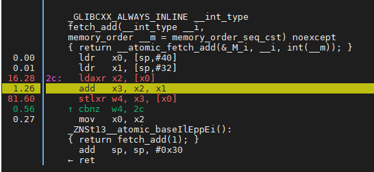
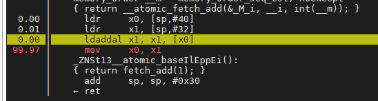
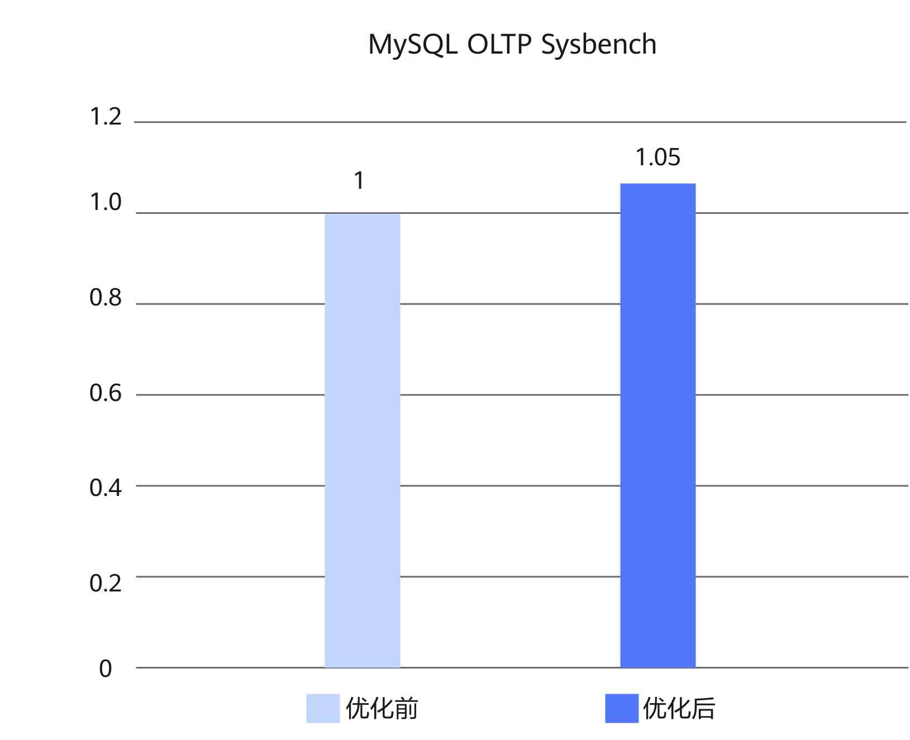

# MySQL LSE优化 特性指南

## 特性描述<a name="ZH-CN_TOPIC_0000002511086264"></a>

### 简介<a name="ZH-CN_TOPIC_0000002542566231"></a>

本文主要介绍如何在鲲鹏服务器上安装和使能MySQL LSE（Large System Extensions）优化特性。

在MySQL OLTP场景中，高并发读写下，出现锁竞争激烈导致性能呈现线性劣化的情况。LSE是专为现代多核、高并发环境设计的原子操作硬件加速方案。它通过单指令原子操作，解决了传统LL/SC（Load-Link/Store-Conditional）指令在扩展性上的瓶颈。

### 原理描述<a name="ZH-CN_TOPIC_0000002511086262"></a>

本特性通过引入LSE硬件加速，来有效缓解高并发下的性能劣化问题，提升MySQL在鲲鹏服务器中的整体性能表现与系统稳定性。

**LSE<a name="section479993815484"></a>**

在多核、原子锁争抢严重的情况下，在GCC编译选项中添加LSE相关选项，可以减缓锁竞争。

LL/SC原子指令需要把共享变量先load到本核所在的L1 Cache中进行修改，在锁竞争少的情况下性能较好，但在锁竞争激烈时会导致系统性能下降严重。Armv8.1规范中引入了新的原子操作指令扩展LSE，将计算操作放到L3 Cache去做，增大数据共享范围，减少Cache一致性耗时，在锁竞争激烈时可以提升操作效率。

**图 1** LL/SC指令（ldaxr&stlxr）<a name="fig1834732512417"></a><a id="LL/SC指令（ldaxr&stlxr）"></a>


**图 2** LSE指令（ldaddal）<a name="fig12283173611418"></a><a id="LSE指令（ldaddal）"></a>


## 环境要求<a name="ZH-CN_TOPIC_0000002542686221"></a>

本文基于特定环境提供指导，在正式操作前请确保软硬件均满足要求。

**表 1** 硬件要求<a id="硬件要求"></a>

| 项目  | 规格                   |
| --- | -------------------- |
| CPU | 鲲鹏920新型号处理器、鲲鹏950处理器 |

**表 2** 操作系统和软件要求<a id="操作系统和软件要求"></a>

| 项目      | 版本                       | 获取地址                                                                                                                                   |
| ------- | ------------------------ | -------------------------------------------------------------------------------------------------------------------------------------- |
| 操作系统    | openEuler 22.03 LTS SP4  | [获取链接](https://repo.huaweicloud.com/openeuler/openEuler-22.03-LTS-SP4/ISO/aarch64/openEuler-22.03-LTS-SP4-everything-aarch64-dvd.iso)  |
| 操作系统    | openEuler 24.03 LTS SP3  | [获取链接](https://repo.huaweicloud.com/openeuler/openEuler-24.03-LTS-SP3/ISO/aarch64/openEuler-24.03-LTS-SP3-everything-aarch64-dvd.iso)  |
| Percona | Percona-Server 5.7.44-53 | [获取链接](https://gitcode.com/boostkit/boostdb/releases/download/MySQL-Percona-Server-5.7.44-53-v4/BoostDB-Percona-5.7.44-53.aarch64.rpm) |
| Percona | Percona-Server 8.0.43-34 | [获取链接](https://gitcode.com/boostkit/boostdb/releases/download/MySQL-Percona-Server-8.0.43-34-v3/BoostDB-Percona-8.0.43-34.aarch64.rpm) |

## 安装和使能特性<a name="ZH-CN_TOPIC_0000002542566233"></a>

以Percona-Server 5.7.44-53为例介绍如何安装和使能MySQL LSE优化特性，具体操作步骤如下。

1. 请参见《Percona 移植指南》中的[配置编译环境](https://www.hikunpeng.com/document/detail/zh/kunpengdbs/ecosystemEnable/Percona/kunpengpercona_02_0014.html)章节安装依赖。
2. 请参见**[表 2](#操作系统和软件要求)** [操作系统和软件要求](#操作系统和软件要求)下载Percona-Server 5.7.44-53对应的rpm包并存放至目标路径，例如“/home”。
3. 执行如下命令安装rpm包。安装完成后，默认安装目录位于“/usr/local/mysql”。

   ```shell
   cd /home
   rpm -ivh BoostDB-Percona-5.7.44-53.aarch64.rpm
   ```

   >  **说明：**
   > 安装过程中，如果存在已安装依赖包但rpm相关检验不通过的情况，使用--nodeps跳过依赖检查，即执行如下命令。
   >
   > ```shell
   > rpm -ivh BoostDB-Percona-5.7.44-53.aarch64.rpm --nodeps
   > ```
   >
4. 启动数据库。启动数据库的操作请参见《MySQL 移植指南》的[运行MySQL](https://www.hikunpeng.com/document/detail/zh/kunpengdbs/ecosystemEnable/MySQL/kunpengmysql8017_03_0013.html)章节。

5. （可选）通过Sysbench测试可以得到使能本特性前后的性能提升效果，详细测试步骤请参见《[Sysbench 0.5&1.0 测试指导](https://www.hikunpeng.com/document/detail/zh/kunpengdbs/testguide/tstg/kunpengsysbench_02_0001.html)》。MySQL LSE及rec\_get\_offsets优化特性可以使Sysbench 8U16G规格下256并发综合性能（只读、读写、只写）提升5%，优化前后对比效果如**[图 3](#mysql-lse-rec-get-offsets-perf-compare)** [MySQL LSE及rec_get_offsets优化特性优化前后性能对比](#mysql-lse-rec-get-offsets-perf-compare)所示。

   **图 3** MySQL LSE优化特性优化前后性能对比<a name="fig937192253919"></a><a id="mysql-lse-rec-get-offsets-perf-compare"></a>
   

## 安全检查与加固<a name="ZH-CN_TOPIC_0000002543538365"></a>

ASLR（Address Space Layout Randomization，地址空间布局随机化）是一种针对缓冲区溢出的安全保护技术，通过对堆、栈、共享库映射等线性区布局的随机化，增加攻击者预测目的地址的难度，防止攻击者直接定位攻击代码位置，达到阻止溢出攻击的目的。

```shell
echo 2 >/proc/sys/kernel/randomize_va_space
```


