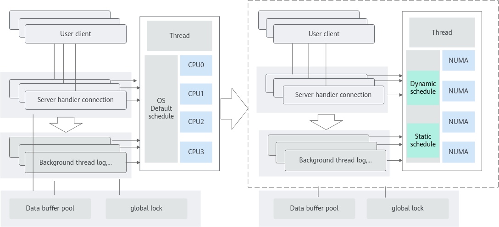
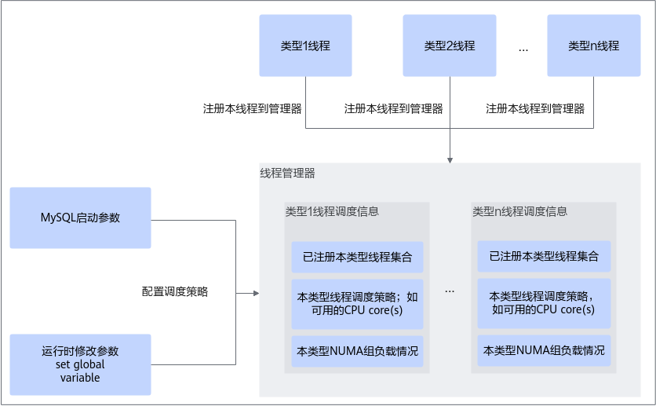
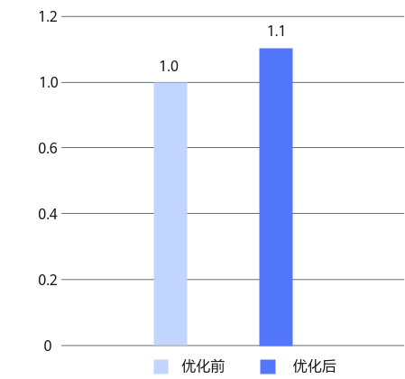

# MySQL NUMA调度优化 特性指南

## 特性描述<a name="ZH-CN_TOPIC_0000002550140085"></a>

### 简介<a name="ZH-CN_TOPIC_0000002550140083"></a>

在MySQL OLTP场景下，高并发情况下系统会默认将MySQL的线程在OS的CPU上进行调度，如[图1](#MySQL_NUMA调度优化框架)左侧区域所示，这会导致线程频繁跨越NUMA节点进行访问，这种情况会增加CPU的开销，从而限制性能的提升。因此，需要对线程调度进行优化，以减少NUMA节点之间访问的开销，从而提高系统的性能，如[图1](#MySQL_NUMA调度优化框架)右侧区域所示。

采用MySQL NUMA调度优化特性后可以对MySQL前台线程和后台线程进行精细化调度，从而提高关键线程的处理效率，减少远程访问存储的次数，从而提升整个系统的性能。请参见[图2](#运行流程)。

- 后台线程：本特性涉及7类影响系统性能的关键后台线程，主要与redo log和purge逻辑相关。这类线程数量固定，每一类线程有且只有一个线程实例，在MySQL实例启动时启动。本特性允许用户指定某类线程仅运行在指定的CPU core(s)。因此，通过合理参数设置，可以使各类线程的CPU core(s)相互隔离，使其均能得到充分调度，避免成为系统瓶颈。
- 前台线程：MySQL是thread per connection，故前台线程数量随会话数量变化而变化。类似后台线程调度，本特性同样允许控制前台线程运行在指定的CPU core(s)。此外，本特性支持根据NUMA信息将CPU core(s)分组。前台线程在当前会话的生命周期内，只会在同一个组内的CPU core(s)上迁移，而不会跨NUMA迁移，因此从data locality获益。为了实现组间的负载均衡，新增的前台线程将被调度到负载较小的组上。负载程度通过本组内的会话数反映。

### 原理描述<a name="ZH-CN_TOPIC_0000002550180079"></a>

#### MySQL NUMA调度优化框架<a name="ZH-CN_TOPIC_0000002550180077"></a>

**图 1** MySQL NUMA调度优化框架<a id="MySQL_NUMA调度优化框架"></a><br>


#### 运行流程<a name="ZH-CN_TOPIC_0000002518700242"></a>

**图 2** 运行流程<a id="运行流程"></a><br>



## 环境要求<a name="ZH-CN_TOPIC_0000002518540334"></a>

建议关注[MySQL官网](https://www.mysql.com/)MySQL 8.0.20版本的CVE漏洞，按照要求及时进行漏洞修复。

本文基于鲲鹏服务器和openEuler操作系统提供指导，在正式操作前请确保软硬件均满足要求。

**硬件要求<a name="section116628440251"></a>**

硬件要求如[**表 1** 硬件要求](#硬件要求)所示。

**表 1** 硬件要求<a id="硬件要求"></a>

|项目|规格|
|--|--|
|CPU|鲲鹏服务器|

**操作系统和软件要求<a name="section1240364411598"></a>**

操作系统和软件要求如[**表 2** 操作系统和软件要求](#操作系统和软件要求)所示。

**表 2** 操作系统和软件要求<a id="操作系统和软件要求"></a>

|项目|版本|获取地址|
|--|--|--|
|操作系统|openEuler / CentOS|请根据实际环境准备|
|MySQL源码|MySQL 8.0.20<br>MySQL 8.0.25|MySQL 8.0.20：[获取链接](https://downloads.mysql.com/archives/get/p/23/file/mysql-boost-8.0.20.tar.gz)<br>MySQL 8.0.25：[获取链接](https://downloads.mysql.com/archives/get/p/23/file/mysql-boost-8.0.25.tar.gz)|
|NUMA调度优化Patch|对应MySQL 8.0.20和8.0.25版本的Patch|[获取链接](https://gitcode.com/boostkit/boostdb/releases/download/MySQL-patch-release/boostdb-patch-release-20260330.zip)|


## 安装和使用特性<a name="ZH-CN_TOPIC_0000002550180081"></a>

MySQL NUMA调度优化特性以Patch补丁文件形式提供，该补丁基于MySQL 8.0.20和MySQL 8.0.25版本开发，并在Gitee社区开源，使用该特性前，需要先将Patch应用到MySQL源码中，再编译和安装MySQL。

1. 参考[**表 2** 操作系统和软件要求](#操作系统和软件要求)下载MySQL源码，并上传至服务器“/home”目录。


2. 参考[**表 2** 操作系统和软件要求](#操作系统和软件要求)下载MySQL NUMA调度优化特性Patch，并上传至MySQL源码的根目录。


3. 可选：如果没有配置Yum源，请配置Yum源，详细信息请参见《[MySQL 移植指南](https://www.hikunpeng.com/document/detail/zh/kunpengdbs/ecosystemEnable/MySQL/kunpengmysql8017_02_0013.html)》。
4. 该特性实现依赖libnuma，以CentOS为例，编译MySQL前，需安装如下依赖。

    ```shell
    yum install -y numactl numactl-devel numactl-libs
    ```

    > **说明：**
    如果编译时未找到libnuma相关依赖，MySQL仍会正常编译，但本特性将无法生效。

5. 以基于MySQL 8.0.20版本应用该特性为例，上传MySQL源码至“/home”目录下后，解压MySQL源码包并进入MySQL源码根目录。

    ```shell
    cd /home
    tar -zxvf mysql-boost-8.0.20.tar.gz
    cd mysql-8.0.20
    ```

6. 在源码根目录，使用git初始化命令来建立git管理信息。

    ```shell
    git init
    git add -A
    git commit -m "Initial commit"
    ```

    > **说明：**
    >- 一般情况下，系统自带git，若需要安装git，请先参见《[MySQL 移植指南](https://www.hikunpeng.com/document/detail/zh/kunpengdbs/ecosystemEnable/MySQL/kunpengmysql8017_02_0001.html)》中配置Yum源相关内容，再执行如下命令安装git。
     >  ```shell
     >  yum install git
     >  ```
    >- 若未配置git的提交用户信息，git commit前需要先配置用户邮件及用户名称信息。
    >  ```shell
    >  git config user.email "123@example.com"
    >  git config user.name "123"
    >  ```

7. 可选：如果没有安装dos2unix，请执行如下命令安装dos2unix。

    ```shell
    yum install dos2unix
    ```

8. 合入NUMA调度优化特性补丁。

    ```shell
    dos2unix 0001-SCHED-AFFINITY.patch
    git apply --check 0001-SCHED-AFFINITY.patch
    git apply --whitespace=nowarn 0001-SCHED-AFFINITY.patch
    ```

   > **说明：**
   > 本步骤以基于MySQL 8.0.20版本应用该特性为例，如需基于其他版本应用特性，请按照实际补丁的名称修改以上命令。

    如果没有回显报错信息，则补丁应用成功。

9. 根据正常的编译安装MySQL源码的操作步骤进行MySQL的编译安装。详细信息请参见《[MySQL 移植指南](https://www.hikunpeng.com/document/detail/zh/kunpengdbs/ecosystemEnable/MySQL/kunpengmysql8017_02_0001.html)》。
10. 在重新编译MySQL之后，还需额外在配置文件、启动参数或运行时配置系统变量才能生效。

    本特性增加如[**表 5** MySQL NUMA调度特性参数说明以及配置建议](#MySQL_NUMA调度特性参数说明以及配置建议)所示MySQL系统变量，可在配置文件、启动参数或运行时设置，请按需选择其中一种方式进行操作。

    **表 5** MySQL NUMA调度特性参数说明以及配置建议<a id="MySQL_NUMA调度特性参数说明以及配置建议"></a>

    |参数|参数说明|配置建议|
    |--|--|--|
    |sched_affinity_numa_aware|global级别参数，布尔类型，如果设置为ON且sched_affinity_foreground_thread不为空值，则sched_affinity_foreground_thread设置的CPU core(s)会根据numa node进行分组，而一个会话所在的线程只会在其中特定组中的core(s)间迁移。<br><br>本参数运行时可更改，默认值是OFF。|设置是否开启前台进程绑核。sched_affinity_foreground_thread不为空值时，则sched_affinity_foreground_thread设置的CPU core(s)会根据numa node进行分组，而一个会话所在的线程只会在其中特定组中的core(s)间迁移。建议配置为ON。|
    |sched_affinity_foreground_thread|global级别参数，字符串类型，用于设置MySQL前台线程允许运行的CPU core(s)。<br>有效取值由代表core编号的数字组合成的字符串。core编号可通过逗号（,）分隔，可通过减号（-）表示范围。以下均为合法的CPU core(s)取值：<br>- 空值<br>- 5<br>- 0,5,7<br>- 0,2-5,7<br><br>本参数在数据库运行时可更改，默认值是空值。当取值为空值，表示本类线程由操作系统调度，相当于未启用本参数。|指定MySQL前台线程（用户线程）运行的CPU core。建议前台线程和后台线程绑在不同的core上。|
    |sched_affinity_log_writer|global级别参数，字符串类型，用于设置MySQL log_writer线程允许运行的CPU core(s)。<br>有效取值由代表core编号的数字组合成的字符串。core编号可通过逗号（,）分隔，可通过减号（-）表示范围。以下均为合法的CPU core(s)取值：<br>- 空值<br>- 5<br>- 0,5,7<br>- 0,2-5,7<br><br>本参数在数据库运行时可更改，默认值是空值。当取值为空值，log_writer线程将恢复为由操作系统调度。|设置MySQL log_writer线程允许运行的CPU core(s)。建议后台线程绑在同一个numa node的core上。|
    |sched_affinity_log_flusher|global级别参数，字符串类型，用于设置MySQL log_flusher线程允许运行的CPU core(s)。<br>有效取值由代表core编号的数字组合成的字符串。core编号可通过逗号（,）分隔，可通过减号（-）表示范围。以下均为合法的CPU core(s)取值：<br>- 空值<br>- 5<br>- 0,5,7<br>- 0,2-5,7<br><br>本参数在数据库运行时可更改，默认值是空值。当取值为空值，log_flusher线程将恢复为由操作系统调度。|设置MySQL log_flusher线程允许运行的CPU core(s)。建议后台线程绑在同一个numa node的core上。|
    |sched_affinity_log_write_notifier|global级别参数，字符串类型，用于设置MySQL log_write_notifier线程允许运行的CPU core(s)。<br>有效取值由代表core编号的数字组合成的字符串。core编号可通过逗号（,）分隔，可通过减号（-）表示范围。以下均为合法的CPU core(s)取值：<br>- 空值<br>- 5<br>- 0,5,7<br>- 0,2-5,7<br><br>本参数运行时可更改，默认值是空值。当取值为空值，log_write_notifier线程将恢复为由操作系统调度。|设置MySQL log_write_notifier线程允许运行的CPU core(s)。建议后台线程绑在同一个numa node的core上。|
    |sched_affinity_log_flush_notifier|global级别参数，字符串类型，设置MySQL log_flush_notifier线程允许运行的CPU core(s)。<br>有效取值由代表core编号的数字组合成的字符串。core编号可通过逗号（,）分隔，可通过减号（-）表示范围。以下均为合法的CPU core(s)取值：<br>- 空值<br>- 5<br>- 0,5,7<br>- 0,2-5,7<br><br>本参数运行时可更改，默认值是空值。当取值为空值，log_flush_notifier线程将恢复为由操作系统调度。|设置MySQL log_flush_notifier线程允许运行的CPU core(s)。建议后台线程绑在同一个numa node的core上。|
    |sched_affinity_log_checkpointer|global级别参数，字符串类型，设置MySQL log_checkpointer线程允许运行的CPU core(s)。<br>有效取值由代表core编号的数字组合成的字符串。core编号可通过逗号（,）分隔，可通过减号（-）表示范围。以下均为合法的CPU core(s)取值：<br>- 空值<br>- 5<br>- 0,5,7<br>- 0,2-5,7<br><br>本参数运行时可更改，默认值是空值。当取值为空值，log_checkpointer线程将恢复为由操作系统调度。|设置MySQL log_checkpointer线程允许运行的CPU core(s)。建议后台线程绑在同一个numa node的core上。|
    |sched_affinity_purge_coordinator|global级别参数，字符串类型，设置MySQL purge_coordinator线程允许运行的CPU core(s)。<br>有效取值由代表core编号的数字组合成的字符串。core编号可通过逗号（,）分隔，可通过减号（-）表示范围。以下均为合法的CPU core(s)取值：<br>- 空值<br>- 5<br>- 0,5,7<br>- 0,2-5,7<br><br>本参数运行时可更改，默认值是空值。当取值为空值，purge_coordinator线程将恢复为由操作系统调度。|设置MySQL purge_coordinator线程允许运行的CPU core(s)。建议后台线程绑在同一个numa node的core上。|
    |sched_affinity_log_closer|global级别参数，字符串类型，设置MySQL log_closer线程允许运行的CPU core(s)。<br>有效取值由代表core编号的数字组合成的字符串。core编号可通过逗号（,）分隔，可通过减号（-）表示范围。以下均为合法的CPU core(s)取值：<br>- 空值<br>- 5<br>- 0,5,7<br>- 0,2-5,7<br><br>本参数运行时可更改，默认值是空值。当取值为空值，log_closer线程将恢复为由操作系统调度。<br><br>**须知：**<br>MySQL 8.0.25中删除了log_closer线程，因此相应版本补丁中不提供该参数。|设置MySQL log_closer线程允许运行的CPU core(s)。建议后台线程绑在同一个numa node的core上。|

    - **方式一：修改配置文件。** 此种方法需要重启数据库方可生效。
      1. 在配置文件中配置系统变量。示例：

         ```ini
         sched_affinity_numa_aware=ON
         sched_affinity_foreground_thread=0-29
         sched_affinity_log_writer=30
         sched_affinity_log_flusher=30
         sched_affinity_log_write_notifier=31
         sched_affinity_log_flush_notifier=31
         sched_affinity_log_checkpointer=31
         sched_affinity_purge_coordinator=31
         ```

        

         > **说明：**
         > 数据库的配置文件默认路径为“/etc/my.cnf”。也可以通过以下命令行指定defaults-file选项，其中“/tmp/myconfig.txt”表示指定配置文件的路径。
         > ```shell
         > mysqld --defaults-file=/tmp/myconfig.txt
         > ```

      2. 重启数据库。

    - **方式二：修改数据库的启动参数。**
      1. 启动数据库时，在启动命令中增加系统变量的配置。此种方法需要重启数据库方可生效。示例：

         ```shell
         mysqld --defaults-file=/etc/my.cnf \
         --sched_affinity_numa_aware=ON \
         --sched_affinity_foreground_thread=0-29 \
         --sched_affinity_log_writer=30 \
         --sched_affinity_log_flusher=30 \
         --sched_affinity_log_write_notifier=31 \
         --sched_affinity_log_flush_notifier=31 \
         --sched_affinity_log_checkpointer=31 \
         --sched_affinity_purge_coordinator=31
         ```

      2. 重启数据库。

    - **方式三：运行时连接数据库，通过SQL语句配置系统变量。** 此种方法不需要重启数据库即可生效。示例：

      ```sql
      set global sched_affinity_numa_aware=ON;
      set global sched_affinity_foreground_thread="0-29";
      set global sched_affinity_log_writer="30";
      set global sched_affinity_log_flusher="30";
      set global sched_affinity_log_write_notifier="31";
      set global sched_affinity_log_flush_notifier="31";
      set global sched_affinity_log_checkpointer="31";
      set global sched_affinity_purge_coordinator="31";
      ```

11. 可选：查看MySQL状态变量。

    为支持查询调度管理器内部状态，本特性增加新增如[**表 6** MySQL状态变量名称和说明](#MySQL状态变量名称和说明)所示的MySQL状态变量。

    **表 6** MySQL状态变量名称和说明<a id="MySQL状态变量名称和说明"></a>

    |状态变量名称|说明|
    |--|--|
    |Sched_affinity_status|返回调度管理器中各个分组的负载情况。|
    |Sched_affinity_group_number|返回系统NUMA node总数。|
    |Sched_affinity_group_capacity|返回系统每个NUMA node中的Core数量。|

    开启MySQL NUMA调度优化特性后，执行如下SQL语句即可查看MySQL状态变量的信息。

    ```sql
    show status like "%状态变量名%";
    ```

12. 可选：通过TPC-C测试可以得到使用MySQL NUMA调度优化特性前后的性能提升效果，详细测试步骤请参见《[BenchMarkSQL 测试指导](https://www.hikunpeng.com/document/detail/zh/kunpengdbs/testguide/tstg/kunpengbenchmarksql_06_0001.html)》。

    MySQL NUMA调度优化特性可以使TPC-C综合性能提升10%，优化前后对比效果如[**图 3** MySQL NUMA调度优化特性优化前后性能对比](#MySQL_NUMA调度优化特性优化前后性能对比)所示。

    **图 3** MySQL NUMA调度优化特性优化前后性能对比<a name="fig_mysql_numa_perf"></a><a id="MySQL_NUMA调度优化特性优化前后性能对比"></a><br>
    


## 代码实现<a name="ZH-CN_TOPIC_0000002518700244"></a>

本特性主要新增类如[**表 7** 新增类的名称及其说明](#新增类的名称及其说明)所示。

**表 7** 新增类的名称及其说明<a id="新增类的名称及其说明"></a>

|类名|说明|
|--|--|
|Sched_affinity_manager|调度管理器接口。<br><br>- 方法register_thread用于线程启动时向调度管理器注册自身，之后其调度由后者管理。<br>- 方法unregister_thread用于线程销毁前向调度管理器注销自身。<br>- 方法rebalance_group用于CPU core(s)相关参数变更时，更新调度管理器内部状态，以及存量线程的调度状态。<br>- 方法update_numa_aware用于sched_affinity_numa_aware参数变更时，更新调度管理器内部状态，以及存量线程的调度状态。<br>- 方法take_group_snapshot用于返回调度管理器内部状态的快照，字符串形式，由用户查询。<br>- 方法get_total_node_number用于返回系统NUMA node总数。<br>- 方法get_cpu_number_per_node用于返回系统每个NUMA node中的core数量。<br>- 方法check_cpu_string用于检查用户传入的CPU core(s)参数的合法性。|
|Sched_affinity_manager_numa|调度管理器的实现。|
|Sched_affinity_manager_dummy|备份管理器的实现，所有接口的实现仅为返回符合调用者预期的值。<br><br>当Sched_affinity_manager_numa不可用时（如libnuma依赖不满足），启用Sched_affinity_manager_dummy。|


## 安全管理<a name="ZH-CN_TOPIC_0000002518540336"></a>

**防病毒软件例行检查<a name="zh-cn_topic_0000001821389094_section11752161613273"></a>**

定期开展对集群的防病毒扫描，防病毒例行检查会帮助集群免受病毒、恶意代码、间谍软件以及程序侵害，降低系统瘫痪、信息泄露等风险。可以使用业界主流防病毒软件进行防病毒检查。

**漏洞修复<a name="zh-cn_topic_0000001821389094_section208601325152718"></a>**

为保证生产环境的安全，降低被攻击的风险，请定期修复以下漏洞：

- 操作系统漏洞
- OpenSSL漏洞
- 其他相关组件漏洞


## 缩略语<a name="ZH-CN_TOPIC_0000002518700246"></a>

|缩略语|英文全称|中文全称|
|--|--|--|
|NUMA|Non-Uniform Memory Access|非一致性内存访问|
|OLTP|Online Transaction Processing|联机事务处理|
|TPC-C|Transaction Processing Performance Council Benchmark C|事务处理性能委员会基准测试C|


## 修订记录<a name="ZH-CN_TOPIC_0000002518700240"></a>

|发布日期|修订记录|
|--|--|
|2023-07-25|第二次正式发布。<br>更新MySQL NUMA调度优化特性的“使用说明”章节中合入补丁操作步骤的命令。|
|2021-06-30|第一次正式发布。|
