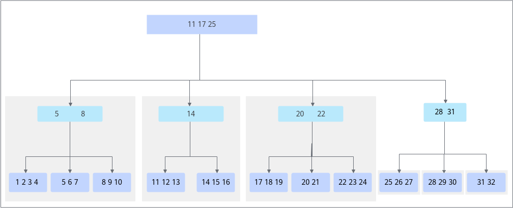
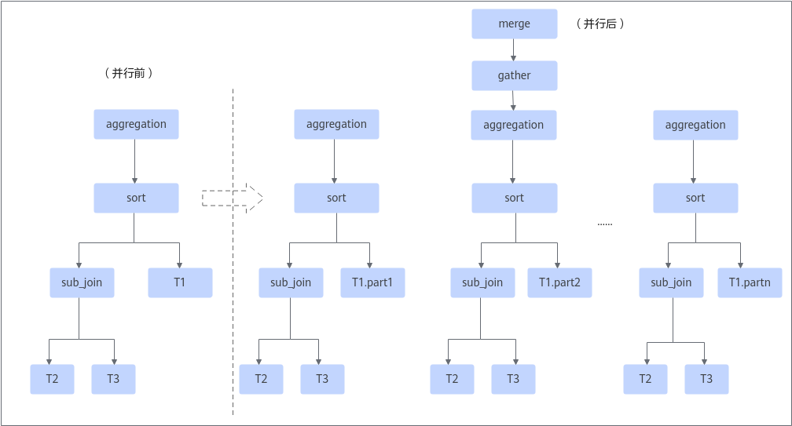
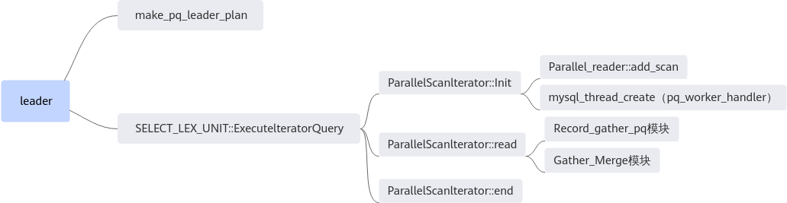
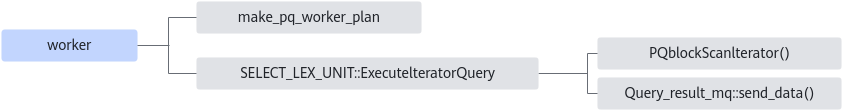
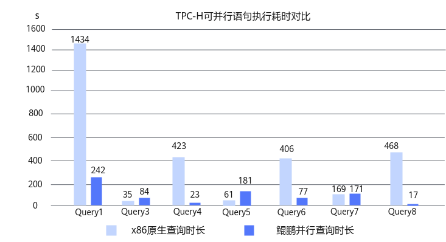

# MySQL并行查询优化 特性指南

## 介绍<a name="ZH-CN_TOPIC_0000002518704730"></a>

### 应用场景<a name="ZH-CN_TOPIC_0000002518544830"></a>

MySQL并行查询优化方案，主要针对数据库的OLAP场景。OLAP场景是指对大规模数据进行多维度分析和查询的场景，通常需要可扩展性、数据一致性、高性能和高安全性。在这种场景下，数据库的查询响应时间和吞吐量对保证应用程序的正常运行至关重要。鲲鹏BoostKit针对数据库在OLAP在线分析处理能力方面提供了深度优化的加速特性，并通过Patch补丁包形式开源到Gitee社区，开发者需要先将Patch应用到MySQL源码中，再编译和安装MySQL。具体使用方法请参见参考[Patch使用说明](#Patch使用说明)。

通过MySQL并行查询优化方案，实现了并行读取数据，使用多核多线程执行该SQL语句的功能，加速了查询语句的执行速度。MySQL并行查询优化主要用于数据分析、BI报表及决策支持等业务场景。目前支持单表的4种扫描的查询并行：

- JT\_ALL
- JT\_INDEX\_SCAN
- JT\_REF
- JT\_RANGE

在满足单表条件基础上，支持简单多表并行的并行查询，不支持子查询，支持部分semi join查询。方案以白名单的方式支持。具体如下：

- 单表白名单：

    ```shell
    select {列名| Aggregate } from table where {=|>| < |>= |<= |like |between…and| in} group by {列名} having {列名}order by {列名| Aggregate } limit x
    ```

    > **说明：**
    >- 白名单格式中，**select**和**from**是必选项，**where**、**group by**、**having**、**order by**和**limit**都是可选项。
    >- Aggregate代表：sum min max avg count

- 多表白名单：

    ```shell
    select {列名| Aggregate } from table1 table2 …  where {=|>| < |>= |<= |like |between…and| in} group by {列名} having {列名}order by {列名} limit x
    ```

    > **说明：**
    >- 白名单格式中，**select**和**from**是必选项，**where**、**group by**、**having**、**order by**和**limit**都是可选项。
    >- 如果查询是系统表、临时表、非innodb表、存储过程、串行化隔离级别，并行功能也不生效。

- semi join查询：

    部分semi join查询可以经过MySQL的优化器后，会变为普通的简单查询。如果执行计划最里层的表是一张外表，那么这类的SQL也可以支持并行查询。

- 聚合的四则运算：

    支持聚合操作的四则运算，例如：sum\(\)/sum\(\)，a\*sum\(\)，a为一个常数。

**安全加固声明<a name="section1867017506565"></a>**

MySQL并行查询优化支持MySQL 8.0.20版本和MySQL 8.0.25版本，建议关注MySQL官网相应版本的CVE漏洞，按照要求及时进行漏洞修复。

### 并行查询特性介绍<a name="ZH-CN_TOPIC_0000002518544828"></a>

#### 实现原理<a name="ZH-CN_TOPIC_0000002550144559"></a>

在并行查询中涉及到2个关键事件：表的切分和执行计划的改造。

- 表的切分

    将扫描的数据划分成多份，让多个线程并行扫描。InnoDB引擎是索引组织表，数据以B+tree的形式存储在磁盘上。分区的逻辑为，从根节点页面出发，逐层往下扫描，当判断某一层的分支数超过了配置的线程数，则停止拆分。在实现时，实际上总共会进行两次分区。第一次是按根节点页的分支数划分分区，每个分支的最左叶子节点的记录为左下界，并将这个记录记为相邻上一个分支的右上界。通过这种方式，将B+tree划分成若干子树，每个子树就是一个扫描分区。经过第一次分区后，可能出现分区数不能充分利用多核问题，比如配置了并行扫描线程为3，第一次分区后，产生了4个分区，那么前3个分区并行做完后，第4个分区至多只有一个线程扫描，最终效果就是不能充分利用多核资源。

    为解决第一次分区的负载不均衡问题，将对第4个分区进行第二次分区。第二次分区后，可以获得多个更小数据量的块，这样可以使每个线程的扫描数据更加均衡。

    **图 1** 表的切分逻辑<a name="fig14723134494516"></a><a id="表的切分逻辑"></a><br>
    

- 执行计划改造

    MySQL的执行计划是一棵左深树，在并行执行之前，MySQL使用一个线程递归来执行这棵左深树，然后将join结果进行sort或者aggregation。并行的目标就是使用多个线程来并行执行这棵执行计划树。将第一张non-const primary表进行拆分，每个线程的执行计划与原执行计划完全相同，只是第一张表只是该表的一部分，这样一来，每个线程就执行了一部分的执行计划，这些线程称为worker线程。执行完后，将结果交给leader汇总，然后再执行sort、aggregation或者直接发给客户端。

    **图 2** 执行计划改造<a name="fig17701652134517"></a><a id="执行计划改造"></a><br>
    

#### 关键函数流程<a name="ZH-CN_TOPIC_0000002518544826"></a>

在并行框架中，分为leader线程和worker线程。



leader线程的make\_pq\_leader\_plan函数负责判断语句是否可以并行、根据原始的执行计划生成leader自己的执行计划，然后调用ParallelScanIterator这个迭代器去执行。

- Init

    在init过程，leader线程会先调用add\_scan那些可以并行的表进行切分，划分成多个数据分片，把所有分片都放在一个队列中。然后调用mysql\_thread\_create去创建若干个worker线程，worker线程循环从队列里面会拿一个分片去执行。直到所有的分片都被执行完毕。

- Read

    在Read过程，leader线程会调用gather模块，从消息队列中拿数据。如果需要，还可以做一些额外的操作，比如count计数、sum操作等aggregate操作。最后将数据向上层传递到客户端。

- End

    End操作是迭代器的最后收尾操作，比如释放内存、返回读取数据的状态等。



worker线程是由leader线程来启动创建的，根据并行度参数来控制启动多少个worker线程，worker线程会先调用make\_pq\_worker\_plan生成自己的执行计划，在这个过程中，会把原来执行计划中可以替换的一个迭代器替换为并行的迭代器PQblockScanlterator。然后调用PQblockScanIterator的read函数，该函数调用与innodb存储引擎的交互接口，从innodb中获取数据，最后调用send\_data函数，把数据发送到消息队列中，供给leader线程取用。

## Patch使用说明<a name="ZH-CN_TOPIC_0000002550144563" id="Patch使用说明"></a>

具体操作步骤如下：

1. 参考[**表 1** MySQL不同版本源码下载地址](#MySQL不同版本源码下载地址)下载MySQL源码并存放至目标路径，例如“/home”。

    **表 1** MySQL不同版本源码下载地址<a id="MySQL不同版本源码下载地址"></a>

    |版本|下载地址|
    |--|--|
    |MySQL 8.0.20|[获取链接](https://github.com/mysql/mysql-server/archive/mysql-8.0.20.tar.gz)|
    |MySQL 8.0.25|[获取链接](https://github.com/mysql/mysql-server/archive/mysql-8.0.25.tar.gz)|

     **须知：**
    从Github下载的代码没有包含boost文件夹，您可以从MySQL官网下载含有boost的源码并从中获取boost文件夹。在编译时需要用到该boost文件夹的路径。

2. 参考[**表 2** MySQL不同版本Patch包说明](#MySQL不同版本Patch包说明)下载MySQL并行查询优化特性Patch包。

    **表 2** MySQL不同版本Patch包说明<a id="MySQL不同版本Patch包说明"></a>

    |支持版本|Patch包|说明|
    |--|--|--|
    |MySQL 8.0.20|[boostdb-patch-release-20260330](https://gitcode.com/boostkit/boostdb/releases/download/MySQL-patch-release/boostdb-patch-release-20260330.zip)/code-pq.patch|源代码的Patch，包含了所有并行查询功能需要的代码。|
    |MySQL 8.0.20|[boostdb-patch-release-20260330](https://gitcode.com/boostkit/boostdb/releases/download/MySQL-patch-release/boostdb-patch-release-20260330.zip)/mtr-pq.patch|mysql-test中mtr测试的Patch，保证所有mtr测试都通过。|
    |MySQL 8.0.25|[boostdb-patch-release-20260330](https://gitcode.com/boostkit/boostdb/releases/download/MySQL-patch-release/boostdb-patch-release-20260330.zip)/code-pq-for-MySQL-8.0.25.patch|源代码的Patch，包含了所有并行查询功能需要的代码。|
    |MySQL 8.0.25|[boostdb-patch-release-20260330](https://gitcode.com/boostkit/boostdb/releases/download/MySQL-patch-release/boostdb-patch-release-20260330.zip)/mtr-pq-for-MySQL-8.0.25.patch|mysql-test中mtr测试的Patch，保证所有mtr测试都通过。|

    - 当前Patch包是基于Gitee社区的MySQL 8.0.20版本和8.0.25版本生成的。
    - 当前Patch包已在Aarch64 Linux平台完成功能验证。
    - 当前Patch包不支持x86硬件平台。

3. 解压源码包并进入MySQL源码目录。

    ```shell
    tar -zxvf mysql-boost-8.0.20.tar.gz
    cd mysql-8.0.20
    ```

4. 在源码根目录，使用git初始化命令来建立git管理信息。

    ```shell
    git init
    git add -A
    git commit -m "Initial commit"
    ```

    > **说明：**
    >- 一般情况下，系统自带git，若需要安装git，请先参见《[MySQL 移植指南](https://www.hikunpeng.com/document/detail/zh/kunpengdbs/ecosystemEnable/MySQL/kunpengdbs_02_0002.html)》中配置Yum源相关内容，再执行如下命令安装git。
>
    > ```shell
    > yum install git
    >    ```
>
    >- 若未配置git的提交用户信息，git commit前需要先配置用户邮件及用户名称信息。
>
    > ```shell
    > git config user.email "123@example.com"
    > git config user.name "123"
    >    ```

5. 合入MySQL并行查询优化特性补丁。

    ```shell
    git apply --whitespace=nowarn -p1 < mtr-pq.patch
    git apply  --whitespace=nowarn -p1 < code-pq.patch
    ```

    如果没有回显报错信息，则补丁应用成功。

6. 根据正常的编译安装MySQL源码的操作步骤进行MySQL的编译安装。详细信息请参见《[MySQL 移植指南](https://www.hikunpeng.com/document/detail/zh/kunpengdbs/ecosystemEnable/MySQL/kunpengdbs_02_0002.html)》。

## 并行查询参数说明<a name="ZH-CN_TOPIC_0000002550184565"></a>

增加了如[**表 1** 并行相关的参数及其说明](#并行相关的参数及其说明)所示6个并行相关的参数。

**表 1** 并行相关的参数及其说明<a id="并行相关的参数及其说明"></a>

|参数|说明|取值|
|--|--|--|
|parallel_cost_threshold|global、session级别的参数，用于设置SQL语句执行并行查询的阈值。<br>只有当查询的估计代价高于这个阈值时才会执行并行查询，SQL语句的估计代价低于这个阈值时则执行MySQL开源版本对应的查询过程。|取值范围：0～ULONG_MAX<br>默认值：1000|
|parallel_default_dop|global、session级别参数，用于设置每个SQL语句的并行查询的最大并发度。<br>SQL语句的查询并发度会根据表的大小来动态调整，如果表的二叉树太小（表的切片划分数小于并行度），则会根据表的切片划分数来设置该查询的并发度。每一个查询的最大并行度都不会超过parallel_default_dop参数设置的值。该参数设置的值不能大于parallel_max_threads，否则将不能启用SQL语句的并行查询。|取值范围：0～1024<br>默认值：4|
|parallel_max_threads|global级别，用于设置系统中总的并行查询线程数。|取值范围：0～ULONG_MAX<br>默认值：64|
|parallel_memory_limit|global级别，用于设置并行执行时leader线程和worker线程使用的总内存大小上限。|取值范围：0～ULONG_MAX<br>默认值：100*1024*1024|
|parallel_queue_timeout|global、session级别，用于设置系统中并行查询的等待的超时时间。<br>如果系统的资源不够，例如运行的并行查询线程已达到parallel_max_threads的值，并行查询语句将会等待，如果超时后还未获取资源，将会执行MySQL开源版本对应的查询过程。|取值范围：0～ULONG_MAX，单位为ms<br>默认值：0|
|force_parallel_execute|global、session级别，用于设置并行查询的开关。|bool值可设置为on或off。<br>on表示开启并行查询特性，off表示关闭并行查询特性。<br>默认值：off|

同时增加了如[**表 2** 状态变量及其说明](#状态变量及其说明)所示的4个状态变量：

**表 2** 状态变量及其说明<a id="状态变量及其说明"></a>

|状态变量|说明|
|--|--|
|PQ_threads_running|Global级别，当前正在运行的并行执行的总线程数。|
|PQ_memory_used|Global级别，当前并行执行使用的总内存量。|
|PQ_threads_refused|Global级别，由于总线程数限制，导致未能执行并行执行的查询总数。|
|PQ_memory_refused|Global级别，由于总内存限制，导致未能执行并行执行的查询总数。|

## 并行查询使用说明<a name="ZH-CN_TOPIC_0000002550184561"></a>

介绍使用并行查询优化特性的方式，包括设置系统参数方式和使用Hint语法方式以及使用并行查询优化特性可能带来的性能提升效果。

您可以通过以下两种方式中的任意一种来使用并行查询优化特性：

- 方式一：设置系统参数。

    通过设置全局参数force\_parallel\_execute来控制是否启用并行查询；通过设置全局参数parallel\_default\_dop来控制使用多少线程进行并行查询。上述参数在使用过程中可以随时修改，无需重启数据库。

    例如，若开启并行执行，并且并发度为4：

    ```text
    force_parallel_execute=on;
    parallel_default_dop=4;
    ```

    可以根据实际情况调整parallel\_cost\_threshold参数的值，如果设置为0，则所有查询都会使用并行；如果设置为非0，则只有查询语句的代价估值大于该值的查询才会使用并行。

    > **说明：**
    >如果启用MySQL并行查询优化特性后，发现没有生效，请参见[启用MySQL并行查询优化特性后发现没有生效的解决方法](https://www.hikunpeng.com/document/detail/zh/kunpengdbs/troubleshooting/trouble/boostkit_database_troublecase_029.html)解决。

- 方式二：使用**Hint**语法。

    使用Hint语法可以控制单个语句是否进行并行执行。在系统默认关闭并行执行的情况下，可以使用Hint对特定的SQL进行加速，Hint指定的并行度不能大于parallel\_max\_threads，否则将不能启用SQL语句的并行查询。相反地，也可以限制某类SQL进入并行执行。

    - SELECT  **/\*+ PQ \*/**  … FROM … 表示使用默认的并发度4进行并行查询。
    - SELECT  **/\*+ PQ\(8\) \*/**  … FROM … 表示使用并发度为8进行并行查询。
    - SELECT  **/\*+ NO\_PQ \*/**  … FROM … 表示这条语句不使用并行查询。

通过TPC-H测试可以得到使用MySQL并行查询优化特性前后的性能提升效果，详细测试步骤请参见《[TPC-H 测试指导（for MySQL）](https://www.hikunpeng.com/document/detail/zh/kunpengdbs/testguide/tstg/kunpengtpch_02_0001.html)》。

从测试数据来看，采用MySQL并行查询优化特性后可以提高并行度，查询性能可以提升1倍以上（性能提升与并行度有关）。



## 与串行结果可能不兼容说明<a name="ZH-CN_TOPIC_0000002518704732"></a>

并行执行的执行结果可能存在与串行执行不兼容的情况，主要表现在：

- 错误或者告警提示次数可能会增多。

    对于在串行执行中出现错误/告警提示的查询，在并行执行情况下，每个工作线程可能都会提示错误/告警，导致总体错误/告警提示数增多。

- 精度问题。

    并行执行过程中，可能会出现比串行执行多出中间结果的存储，如果中间结果是浮点型，可能会导致浮点部分精度误差，导致最终结果有细微的差别。

- 结果集顺序差别。

    多个工作线程执行查询时，返回的结果集顺序可能与串行执行顺序不一致。如果使用了group by语句查询，可能会出现分组后组内的顺序和串行执行顺序不同的情况。如果使用了LIMIT查询，则更容易出现与串行结果顺序不同的情况。

## 使用约束<a id="ZH-CN_TOPIC_0000002550184563"></a>

不支持并行执行的查询语句及其说明如[**表 1** 不支持并行执行的查询语句及其说明](#不支持并行执行的查询语句及其说明)所示。

**表 1** 不支持并行执行的查询语句及其说明<a id="不支持并行执行的查询语句及其说明"></a>

|语句类型|说明|
|--|--|
|表|系统表<br>临时表<br>非InnoDB表<br>分区表<br>const表|
|数据类型|BLOB<br>TEXT<br>JSON<br>GEOMETRY|
|索引|空间索引<br>全文索引<br>使用了索引归并Index merge|
|函数|窗口函数<br>with rollup<br>spatial相关函数（如SP_WITHIN_FUNC等）<br>distinct<br>用户自定义函数<br>GROUP_CONCAT<br>JSON相关函数<br>XML相关函数<br>STD/STDDEV/STDDEV_POP<br>VARIANCE/VAR_POP/VAR_SAMP<br>BIT_AND，BIT_OR，BIT_XOR<br>randst_distance<br>get_lock<br>is_free_lock，is_used_lock，release_lock，release_all_locks<br>sleep<br>weight_string<br>SHA，SHA1，SHA2，MD5<br>row_count<br>round<br>VARIANCE|
|其他场景|子查询<br>union<br>存储过程<br>触发器<br>加锁查询，如serializable隔离级别，for update/share lock<br>Prepared Statements<br>generated column<br>不满足only_full_group_by<br>执行结果返回0行数据（执行计划显示：Zero limit、Impossible WHERE、Impossible HAVING、No matching min/max row、Select tables optimized away、Impossible HAVING noticed after reading const tables、no matching row in const table等）|

## FAQ<a id="ZH-CN_TOPIC_0000002518704728"></a>

MySQL并行查询优化应用场景常见问题如[**表 1** MySQL并行查询优化应用场景常见问题](#MySQL并行查询优化应用场景常见问题)所示。

**表 1** MySQL并行查询优化应用场景常见问题<a id="MySQL并行查询优化应用场景常见问题"></a>

|序号|问题|答案|
|--|--|--|
|1|MySQL并行查询优化的应用场景的白名单格式中，**where**和**limit**是必选项吗？|不是。MySQL并行查询优化的应用场景的白名单格式中，**select**和**from**是必选项，**where**、**group by**、**having**、**order by**和**limit**都是可选项。|
|2|MySQL并行查询优化的触发条件一定要满足白名单的格式吗？|是。|
|3|部分semi join查询不支持并行查询，可以举例吗？|semi join查询中涉及复杂子查询或特殊连接操作的场景，可能不支持并行查询。例如：多级嵌套的子查询，以及涉及不常见的连接操作，例如anti join（not exists的变体）。|
|4|使用Hint语法进行并行查询，还需要满足白名单吗？|需要。并行查询的触发条件一定要满足白名单的格式。|
|5|在系统参数满足条件情况下，满足白名单格式是一定会触发并行查询吗？|会触发。|
|6|如何判断查询有没有触发并行查询？|查看执行计划，执行计划中会出现**parallel**关键字。|
|7|并行查询的四个状态变量**PQ_threads_running**、**PQ_memory_used**、**PQ_threads_refused**或**PQ_memory_refused**是否能作为并行查询触发的观察点？|四个状态变量中的**PQ_threads_running**可作为并行查询触发的观察点。如果执行并行查询，**PQ_threads_running**的值会变大；查询结束后，**PQ_threads_running**的值将恢复。|
|8|满足白名单、并行查询的开关打开且阈值为0的情况下，如果t1中只有一条数据（例如：**select * from t1;**），会触发并行查询吗？|只有一条数据会被认为是const表，不会触发并行查询。超过一条数据则会触发并行查询。但是，如果数据太少，触发了并行查询没有意义，性能反而会更差。|
|9|并行查询的应用场景，多表白名单中，多表的联合方式，写法只能是t1,t2;吗，是否有其他写法？|写法不限于t1,t2;。具体支持哪些联合方式取决于数据库的查询优化器和执行计划生成策略。<br>例如SELECT t1.a, t2.b FROM t1 INNER JOIN t2 ON t1.id = t2.id;，如果t1和t2满足并行查询的单表条件，那么这条查询可能会触发并行查询。|
|10|如果关联的字段在两个表上分别有索引，或者条件里分别用了两个表上的索引，这种情况会发生索引归并而不能触发并行查询吗？|这种情况下，如果满足索引归并的条件，会触发索引归并。索引归并优化是针对单表的优化，当一个表同时使用多个索引进行条件扫描时，可能会触发索引归并优化。可以通过查询执行计划确认是否触发了索引归并。当触发了索引归并时，则不会触发并行查询。|

## 修订记录<a name="ZH-CN_TOPIC_0000002550144561"></a>

|发布日期|修订记录|
|--|--|
|2024-11-28|第四次正式发布。新增[FAQ](#ZH-CN_TOPIC_0000002518704728)，新增MySQL并行查询优化应用场景常见问题。|
|2023-07-04|第三次正式发布。新增[使用约束](#ZH-CN_TOPIC_0000002550184563)。|
|2022-07-07|第二次正式发布。新增适配MySQL 8.0.25版本。|
|2021-03-30|第一次正式发布。|
