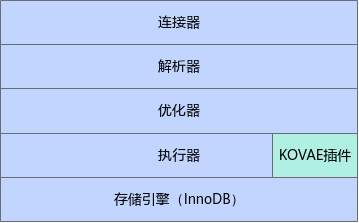
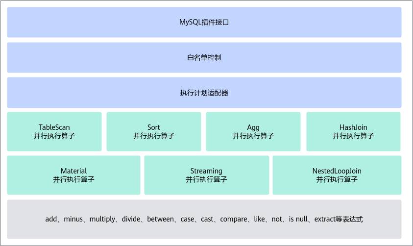
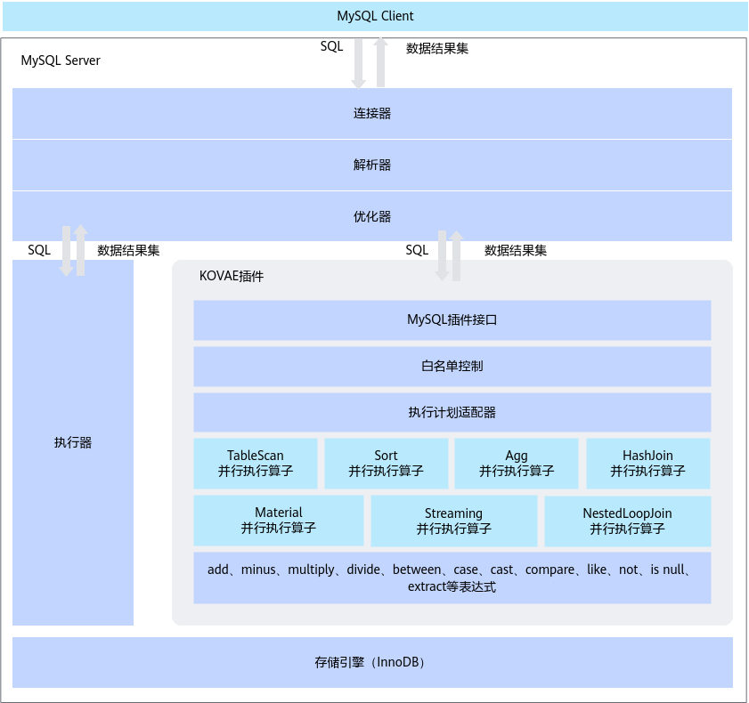
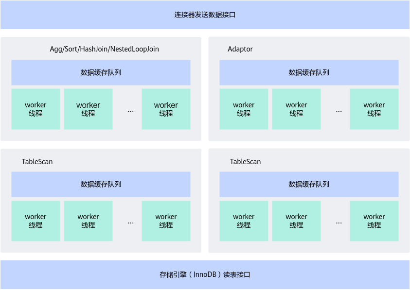
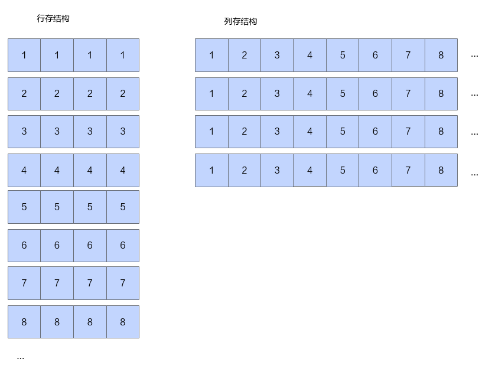

# MySQL可插拔在线向量化分析引擎 特性指南

## 特性描述<a name="ZH-CN_TOPIC_0000002550183953"></a>

### 简介<a name="ZH-CN_TOPIC_0000001805304434"></a>

本文主要介绍如何在使用openEuler操作系统的鲲鹏服务器上部署并使用MySQL可插拔在线向量化分析引擎（以下简称KOVAE）提供的相关特性，并提供了使用KOVAE（Kunpeng Online Vectorized Analysis Engine）过程中遇到故障的解决方法。

为提升OLAP（Online Analytical Processing）场景的性能，MySQL提供了第二执行引擎（Secondary Engine）预留接口。KOVAE是Secondary Engine的一种轻量实现，使用形式和MySQL标准插件的使用形式一致。

KOVAE以插件形式提供第二执行引擎特性的优点如下：

- 不侵入修改MySQL源码。
- 可热安装或热卸载插件，不需要重启服务或者中断在线业务。
- 将符合条件的SQL语句卸载到第二引擎上执行，可以通过并行执行显著缩短SQL语句的执行时间。
- 落盘算子采用鲲鹏加速引擎（以下简称KAE）中的KAEzip来压缩落盘文件，节省磁盘空间。

采用MySQL可插拔在线向量化分析引擎提供的并行加速技术，可以将OLAP查询性能提升到3倍以上。

**相关概念<a name="section184141303214"></a>**

KAE（Kunpeng Accelerator Engine）是基于鲲鹏920处理器提供的硬件加速解决方案，包含了KAE加解密和KAEzip。KAEzip是KAE的压缩模块，使用鲲鹏硬加速模块实现deflate算法，结合无损用户态驱动框架，提供高性能Gzip/zlib格式压缩接口。关于KAEzip的更多详细信息，请参见《[鲲鹏加速引擎 用户指南](https://www.hikunpeng.com/document/detail/zh/kunpengaccel/kae/kae/README.md)》。

**兼容性<a name="section65704516331"></a>**

与其他特性兼容。关于MySQL特性之间的兼容性信息，请参见[特性之间的兼容性](https://www.hikunpeng.com/document/detail/zh/kunpengdbs/appAccelFeatures/compbf/kunpengdbsmysqlfeaturecompatibility_20_0001.html)。

### 软件架构<a name="ZH-CN_TOPIC_0000002550183951"></a>

KOVAE是MySQL执行层的一个引擎，位于优化器层下方。KOVAE引擎使用MySQL插件接口，将符合并行条件的SQL过滤到KOVAE执行引擎中并行执行，更好地利用了鲲鹏服务器的多核优势，提高了SQL语句的执行性能。

KOVAE在MySQL中的位置如[**图 1** KOVAE在MySQL中的位置](#KOVAE在MySQL中的位置)所示。当优化器层制定执行计划后，KOVAE会判断是否需要交由MySQL执行器执行，或者由KOVAE自身执行。在某些情况下，KOVAE还可以将执行计划转回到MySQL执行器执行。

**图 1** KOVAE在MySQL中的位置<a name="fig20233125111417"></a><a id="KOVAE在MySQL中的位置"></a><br>


KOVAE的框架结构如[**图 2** KOVAE框架结构](#KOVAE框架结构)所示。

- MySQL插件接口：为MySQL第二引擎的标准接口，用于支持KOVAE的热安装、热卸载。
- 白名单控制：用于保证受支持的、有性能提升的执行计划才进入KOVAE执行。
- 执行计划适配器：用于将MySQL的执行计划转化为列存、批处理、可多线程并行执行的执行计划。
- TableScan、Sort等各种并行执行算子：使算子可并行处理数据，详见[**表 1** select语句的支持情况](#select语句的支持情况)，提升多核CPU的利用率，提升SQL语句的执行性能。
- add、minus等各种表达式：实现了列存数据的批量处理，便于利用Arm服务器向量化的特性来提升SQL语句的执行性能。

**图 2** KOVAE框架结构<a name="fig666215371344"></a><a id="KOVAE框架结构"></a><br>


### KOVAE支持的SQL语句规格<a name="ZH-CN_TOPIC_0000002550143937" id="KOVAE支持的SQL语句规格"></a>

#### select语句元素的支持<a name="ZH-CN_TOPIC_0000002550183943"></a>

一个完整的select语句的元素的集合如下所示。select语句语法的详细信息请参见[MySQL官网](https://dev.mysql.com/doc/refman/8.0/en/select.html)。

```sql
SELECT
[ALL | DISTINCT | DISTINCTROW ]
[HIGH_PRIORITY]
[STRAIGHT_JOIN]
[SQL_SMALL_RESULT] [SQL_BIG_RESULT] [SQL_BUFFER_RESULT]
[SQL_NO_CACHE] [SQL_CALC_FOUND_ROWS]
select_expr [, select_expr] ...
[into_option]
[FROM table_references
[PARTITION partition_list]]
[WHERE where_condition]
[GROUP BY {col_name | expr | position}, ... [WITH ROLLUP]]
[HAVING where_condition]
[WINDOW window_name AS (window_spec)
[, window_name AS (window_spec)] ...]
[ORDER BY {col_name | expr | position}
[ASC | DESC], ... [WITH ROLLUP]]
[LIMIT {[offset,] row_count | row_count OFFSET offset}]
[into_option]
[FOR {UPDATE | SHARE}
[OF tbl_name [, tbl_name] ...]
[NOWAIT | SKIP LOCKED]
| LOCK IN SHARE MODE]
[into_option]

into_option: {
INTO OUTFILE 'file_name'
[CHARACTER SET charset_name]
export_options
| INTO DUMPFILE 'file_name'
| INTO var_name [, var_name] ...
}
```

select语句每个元素项的支持情况如[**表 1** select语句的支持情况](#select语句的支持情况)所示。

**表 1** select语句的支持情况<a id="select语句的支持情况"></a>

|select语句元素|说明|支持情况|
|--|--|--|
|[ALL \| DISTINCT \| DISTINCTROW]|**DISTINCT**和**DISTINCTROW**表示返回重复列。**ALL**或者不加**ALL**、**DISTINCT**、**DISTINCTROW**这三个关键字，表示返回所有记录。|仅支持ALL情况。<br>不支持带DISTINCT或DISTINCTROW的情况。|
|[HIGH_PRIORITY]|优化器使用，不影响执行结果集。|该关键字作用于MySQL优化器，不影响KOVAE执行或判断。|
|[STRAIGHT_JOIN]|优化器使用，不影响执行结果集。|该关键字作用于MySQL优化器，不影响KOVAE执行或判断。|
|[SQL_SMALL_RESULT] [SQL_BIG_RESULT] [SQL_BUFFER_RESULT]|优化器使用，不影响执行结果集。|该关键字作用于MySQL优化器，不影响KOVAE执行或判断。|
|[SQL_NO_CACHE] [SQL_CALC_FOUND_ROWS]|优化器使用，不影响执行结果集。|该关键字作用于MySQL优化器，不影响KOVAE执行或判断。|
|select_expr [, select_expr] …|表示select列表的表达式。KOVAE会对其判断每个item的类型，及其参数的类型，并对其每个参数进行递归判断。|部分支持，详细信息请参见[item类型的支持](https://www.hikunpeng.com/document/detail/zh/kunpengdbs/appAccelFeatures/kovae/kunpengkovae_20_008.html)。|
|[into_option]|表示将结果集写入到服务端文件中。|不支持，不是常用场景。|
|[FROM table_references[PARTITION partition_list]]|表示SQL相关的表和JOIN的关系。|支持部分表访问类型，详细信息请参见[**表 3** 表访问类型的支持情况](#表访问类型的支持情况)。仅支持非临时表。仅支持InnoDB表。不支持全文索引。不支持分区表。|
|[WHERE where_condition]|表示where条件的表达式。KOVAE会对其判断每个item的类型，及其参数的类型，并对其每个参数进行递归判断。|部分支持，详细信息请参见[item类型的支持](https://www.hikunpeng.com/document/detail/zh/kunpengdbs/appAccelFeatures/kovae/kunpengkovae_20_008.html)。|
|[GROUP BY {col_name \| expr \| position}, ... [WITH ROLLUP]]|表示group by子句。KOVAE会对其判断每个item的类型，及其参数的类型，并对其每个参数进行递归判断。|部分支持，详细信息请参见[item类型的支持](https://www.hikunpeng.com/document/detail/zh/kunpengdbs/appAccelFeatures/kovae/kunpengkovae_20_008.html)。|
|[HAVING where_condition]|表示having条件的表达式。KOVAE会对其判断每个item的类型，及其参数的类型，并对其每个参数进行递归判断。|部分支持，详细信息请参见[item类型的支持](https://www.hikunpeng.com/document/detail/zh/kunpengdbs/appAccelFeatures/kovae/kunpengkovae_20_008.html)。|
|[WINDOW window_name AS (window_spec) [, window_name AS (window_spec)] ...]|表示窗口函数。|不支持。|
|[ORDER BY {col_name \| expr \| position}[ASC \| DESC], ... [WITH ROLLUP]]|表示order by子句。KOVAE会对其判断每个item的类型，及其参数的类型，并对其每个参数进行递归判断。|部分支持，详细信息请参见[item类型的支持](https://www.hikunpeng.com/document/detail/zh/kunpengdbs/appAccelFeatures/kovae/kunpengkovae_20_008.html)。|
|[LIMIT {[offset,] row_count \| row_count OFFSET offset}]|表示limit子句。|支持。|
|[into_option]|表示将结果集写入到服务端文件中。|不支持，不是常用场景。|
|[FOR {UPDATE \| SHARE}[OF tbl_name [, tbl_name] ...]<br>[NOWAIT \| SKIP LOCKED]<br>\| LOCK IN SHARE MODE]|表示对查询的数据进行锁定读取。|不支持。|
|[into_option]|表示将结果集写入到服务端文件中。|不支持，不是常用场景。|

**表 2** 其他项的支持情况<a id="其他项的支持情况"></a>

|项目|支持情况|
|--|--|
|语句类型|仅支持SQLCOM_SELECT类型的语句（select查询），不支持update等其他语句类型。|
|Union|支持简单的非Union的select语句。|
|主表数和常量表数|不支持查询中主表包含常量表的情况。|
|Agg行数预估|不支持未充分评估Agg的执行计划。|
|查询最大fields数|不支持fields的数量大于MAX_FIELDS个的查询语句。|
|优化器提前确定结果集必然为空的查询|如果优化器已经确定查询结果集必然为空集，则不支持该查询。|
|字符集|仅支持UTF8MB4字符集。|

仅支持[**表 3** 表访问类型的支持情况](#表访问类型的支持情况)中前5种表访问类型，其他访问方式均不支持。

**表 3** 表访问类型的支持情况<a id="表访问类型的支持情况"></a>

|表访问类型|说明|支持情况|
|--|--|--|
|JT_EQ_REF|唯一索引上的等值匹配|支持|
|JT_REF|非唯一索引上的等值匹配|支持|
|JT_ALL|全表扫描|支持|
|JT_RANGE|范围扫描|支持|
|JT_INDEX_SCAN|扫索引的叶子节点|支持|
|JT_SYSTEM|-|不支持|
|JT_CONST|-|不支持|
|JT_FT|-|不支持|
|JT_REF_OR_NULL|-|不支持|
|JT_INDEX_MERGE|-|不支持|

#### 执行计划的支持<a name="ZH-CN_TOPIC_0000002518544216"></a>

##### 算子的支持<a name="ZH-CN_TOPIC_0000002550143943"></a>

KOVAE已实现的算子支持情况如[**表 1** 算子支持列表](#算子支持列表)所示，暂不支持其他算子。

**表 1** 算子支持列表<a id="算子支持列表"></a>

|MySQL开源版本算子|说明|支持情况|
|--|--|--|
|TableScanIterator|全表扫描算子迭代器|支持|
|IndexRangeScanIterator|索引范围扫描迭代器|支持|
|RefIterator|非唯一索引上的等值匹配算子迭代器|支持|
|EQRefIterator|唯一索引上的等值匹配|支持|
|LimitOffsetIterator|limit算子|支持|
|FilterIterator|过滤算子|支持|
|NestedLoopIterator|nested loop join算子|支持|
|HashJoinIterator|hash join算子|支持|
|AggregateIterator|Agg算子|支持|
|SortingIterator|Sort算子|支持|
|TemptableAggregateIterator|分组结果保存在临时表的Agg算子|支持|
|MaterializeIterator|物化算子|支持|
|StreamingIterator|streaming算子|支持|

##### item类型的支持<a name="ZH-CN_TOPIC_0000002550143935"></a>

KOVAE支持的item类型如[**表 1** item支持列表](#item支持列表)所示，暂不支持其他类型的item。

**表 1** item支持列表<a id="item支持列表"></a>

|item类型|说明|支持情况|
|--|--|--|
|FIELD_ITEM|普通数据列|支持|
|FUNC_ITEM|表示普通函数|支持|
|SUM_FUNC_ITEM|表示SUM函数|支持|
|COND_ITEM|表示and或or函数|支持|
|REF_ITEM|表示列引用|支持|
|STRING_ITEM|表示string常量|支持|
|INT_ITEM|表示int常量|支持|
|DECIMAL_ITEM|表示decimal常量|支持|
|CACHE_ITEM|-|支持|

KOVAE仅支持如[**表 2** 支持的函数列表](#支持的函数列表)所示的名称的函数item，其他函数均不支持。

**表 2** 支持的函数列表<a id="支持的函数列表"></a>

|函数|说明|
|--|--|
|+|四则运算，加|
|-|四则运算，减|
|*|四则运算，乘|
|/|四则运算，除|
|>|断言，大于|
|<|断言，小于|
|=|断言，等于|
|<>|断言，不等于|
|>=|断言，大于或等于|
|<=|断言，小于或等于|
|like|子串匹配|
|and|逻辑运算，与|
|or|逻辑运算，或|
|sum|求和|
|avg|求平均|
|count|计数|
|min|取最小值|
|date_literal|日期字面量|
|between...and...|在之间|
|case|case then情况枚举处理|
|IN|在之中|
|not|取反|
|isnull|是否null|
|substr|取字符串子串|
|date|强转类型为date|
|date_add|date加法|
|year|取出数据中的年份|
|timestamp|强转类型为timestamp|
|cast|强转指定类型|
|extract|取出日期某部分|

##### 数据类型的支持<a name="ZH-CN_TOPIC_0000002550183955"></a>

KOVAE仅支持如[**表 1** 支持的数据类型](#支持的数据类型)所示的数据类型，其他数据类型均不支持。

**表 1** 支持的数据类型<a id="支持的数据类型"></a>

|数据类型|说明|
|--|--|
|MYSQL_TYPE_LONG|INTEGER整型类型|
|MYSQL_TYPE_DATE|DATE类型，日期类型|
|MYSQL_TYPE_TIMESTAMP|TIMESTAMP类型|
|MYSQL_TYPE_STRING|CHAR字符串类型（仅支持UTF8MB3、UTF8MB4字符集类型）|
|MYSQL_TYPE_VARCHAR|VARCHAR变长字符串类型（仅支持UTF8MB3、UTF8MB4字符集类型）|
|MYSQL_TYPE_FLOAT|FLOAT类型|
|MYSQL_TYPE_DOUBLE|DOUBLE类型|
|MYSQL_TYPE_LONGLONG|BIGINT类型|
|MYSQL_TYPE_DATETIME|DATETIME类型|
|MYSQL_TYPE_NEWDECIMAL|高精度的DECIMAL或NUMERIC类型|

##### 其他支持规则<a name="ZH-CN_TOPIC_0000002518704108"></a>

除select元素、算子、item、datatype规则外，还有一些其他第二引擎使用限制规则，如[**表 1** 其他支持规则](#其他支持规则)所示。

**表 1** 其他支持规则<a id="其他支持规则"></a>

|规则|说明|
|--|--|
|聚合函数count支持规则|不支持参数类型为INVALID_TYPE的情况，其他数据类型情况都支持。|
|聚合函数sum/avg支持规则|不支持参数类型为MYSQL_TYPE_DATE、MYSQL_TYPE_TIME、MYSQL_TYPE_TIMESTAMP、MYSQL_TYPE_STRING和MYSQL_TYPE_VARCHAR的情况。|
|聚合函数min/max支持规则|不支持参数类型为MYSQL_TYPE_STRING、MYSQL_TYPE_VARCHAR的情况。|
|聚合函数count/sum/avg/min/max不支持参数distinct|聚合函数不支持参数带distinct，例如**sum(distinct a)**或者**sum(distinct (a+b))**。|
|HashJoin支持规则|支持10种相同数据类型的连接，数据类型必须都为有符号数或都为无符号数。不支持常量列的连接，比如视图里面包含**1 as b**这样的列。|
|NestedLoopJoin支持规则|仅支持内表为等值索引扫描算子或过滤加等值索引扫描算子场景。|
|等值索引扫描算子支持规则|支持主键索引、唯一索引、普通索引和组合索引，不支持前缀索引，索引条件仅支持同种数据类型，不支持常量和表达式。|

### 参考标准和协议<a name="ZH-CN_TOPIC_0000002518704104"></a>

- [MySQL select语句结构标准](https://dev.mysql.com/doc/refman/8.0/en/select.html)
- [MySQL插件标准](https://dev.mysql.com/doc/refman/8.0/en/plugin-loading.html)
- [MySQL配置参数标准](https://dev.mysql.com/doc/refman/8.0/en/server-option-variable-reference.html)

### 约束与限制<a name="ZH-CN_TOPIC_0000002518544208"></a>

配置KOVAE前，请先了解KOVAE对系统的影响和对应用的限制。

**对系统的影响<a name="section1848994713253"></a>**

- 安装KOVAE插件后，对于数据库，部分符合条件的SQL语句将被卸载到KOVAE上执行，这些SQL的执行耗时将可缩短。
- 安装KOVAE插件后，对于OS：
    - CPU消耗将增加，取决于kovae\_threadpool\_size、kovae\_parallel\_threads、可用CPU数和正在KOVAE上执行的SQL数的共同影响。
    - 内存消耗将增加，执行单条SQL，最大消耗内存 ≈ \(SQL所有相关算子并行总数 + 算子数\*数据队列大小\)\*1024行\*单行数据大小。

        > **说明：**
        >批处理行数一次最大默认1024行。

    - 占用磁盘的容量可能增加，Join、Sort、Materialize、Agg相关算子保存数据量超过设定值后，将触发落盘，并使用磁盘空间缓存数据。另外，KOVAE根据设置的日志级别输出日志记录到MySQL error log文件或通过后台标准输出。

**应用限制<a name="section0549122572711"></a>**

- 当前KOVAE仅适配MySQL 8.0.25版本，其他版本未验证。
- 由于KOVAE为并行执行，对于SQL语句中无结果集排序的情况，结果集与MySQL开源版本的结果集可能结果排序不一致。
- 仅支持部分SQL卸载到KOVAE上执行，详细信息请参见[KOVAE支持的SQL语句规格](#KOVAE支持的SQL语句规格)。另外，可加hint或设置成本阈值来控制SQL的卸载条件。

### 应用场景<a name="ZH-CN_TOPIC_0000002550143953"></a>

KOVAE适用于OLAP查询、大数据量和多核CPU支持的场景。

此特性适用场景的必要条件如下：

- OLAP查询，不需要事务支持的场景。
- 查询的相关数据量应该较大，推荐数据量为大于10000行。
- 并行优势需要多核CPU支持，逻辑CPU核数应大于2。

### 原理描述<a name="ZH-CN_TOPIC_0000002518544210"></a>

在配置KOVAE前，请先了解KOVAE系统的运行原理和内部执行过程。KOVAE通过优化SQL查询的执行计划，采用并行处理机制，并利用列存储结构的优势，实现了对SQL查询的高效处理。

MySQL连接器接收到Client发送的SQL语句，经过解析器和优化器，生成查询的执行计划，根据规则，执行计划会被默认执行器执行或者被卸载到KOVAE上执行，执行完成后再将结果集返回到Client。SQL和执行的结果集的数据流向如[**图 1** KOVAE运行原理图](#KOVAE运行原理图)所示。

**图 1** KOVAE运行原理图<a name="fig122196231119"></a><a id="KOVAE运行原理图"></a>


KOVAE内部执行过程概览如[**图 2** 并行执行结构](#并行执行结构)所示。

**图 2** 并行执行结构<a name="fig1778034211311"></a><a id="并行执行结构"></a><br>


TableScan算子通过多个worker线程并行调用InnoDB读表的接口，将数据保存在TableScan算子的缓存队列中。

TableScan上层算子（Agg/Sort/HashJoin/NestedLoopJoin等）从下层算子的数据缓存队列中拿取数据进行处理，每个算子都可以含有多个worker线程，多个worker线程并行处理可以充分利用ARM服务器的多核优势。

**图 3** 行存结构和列存结构<a name="fig1049515441142"></a><a id="行存结构和列存结构"></a><br>


MySQL InnoDB为行存结构，KOVAE数据为列存结构，对于指定某列进行运算处理时，由于列存结构上同列的数据在内存上是相邻的，所以数据处理更加高效。

## 部署KOVAE<a name="ZH-CN_TOPIC_0000002550183945"></a>

### 环境要求<a name="ZH-CN_TOPIC_0000002518704116"></a>

KOVAE是以MySQL插件库形式使用，无法独立运行，需要在已安装MySQL 8.0.25版本的服务器上使用。

MySQL 8.0.25编译安装方法，请参见《[MySQL 移植指南](https://www.hikunpeng.com/document/detail/zh/kunpengdbs/ecosystemEnable/MySQL/kunpengmysql8017_02_0001.html)》。

**硬件要求<a name="section54967495"></a>**

硬件要求如[**表 1** 硬件要求](#硬件要求)所示。

**表 1** 硬件要求<a id="硬件要求"></a>

|项目|说明|
|--|--|
|服务器|鲲鹏服务器|
|处理器|鲲鹏920系列处理器|
|硬盘|进行性能测试时，数据目录需使用单独硬盘，即一个系统盘，一个数据盘，至少两块硬盘。非性能测试时，直接在系统盘上建数据目录即可。具体硬盘数量根据实际需求配置。|

**操作系统和软件要求<a name="section771295715106"></a>**

- 查看环境操作系统的信息：**cat /etc/\*-release**

    查看环境处理器相关信息：**lscpu**

    查看环境内核版本：**uname -r**

    查看环境信息：**uname -a**

- 如果需要全新安装操作系统，可选择“Minimal Install”安装方式并勾选Development Tools套件，否则很多软件包需要手动安装。

操作系统和软件要求如[**表 2** 操作系统和软件要求](#操作系统和软件要求)所示。

**表 2** 操作系统和软件要求<a id="操作系统和软件要求"></a>

|项目|版本|下载地址|
|--|--|--|
|操作系统|20.03 LTS-SP1 for ARM|[获取链接](https://repo.huaweicloud.com/openeuler/openEuler-20.03-LTS-SP1/ISO/aarch64/openEuler-20.03-LTS-SP1-everything-aarch64-dvd.iso)|
|操作系统|22.03 LTS-SP1 for ARM|[获取链接](https://repo.huaweicloud.com/openeuler/openEuler-22.03-LTS-SP1/ISO/aarch64/openEuler-22.03-LTS-SP1-everything-aarch64-dvd.iso)|
|CMake|3.5.2（openEuler 20.03）|[获取链接](https://cmake.org/files/v3.5/cmake-3.5.2.tar.gz)|
|CMake|3.11.4（openEuler 22.03）|openEuler 22.03默认自带CMake 3.11.4|
|GCC|7.3.0（openEuler 20.03）|[获取链接](https://mirrors.tuna.tsinghua.edu.cn/gnu/gcc/gcc-7.3.0/gcc-7.3.0.tar.gz)|
|GCC|10.3.1（openEuler 22.03）|openEuler 22.03默认自带GCC 10.3.1|
|KAE|KAE1.0：使用kae1版本，仅支持内核版本为4.19的操作系统|[获取链接](https://gitee.com/kunpengcompute/KAE/tree/kae1/)|
|KAE|KAE2.0：使用kae2版本，仅支持内核版本为5.10的操作系统|KAE2.0源码包中包含了KAEzip模块，可以选择一键安装KAE的所有模块，或者单独安装KAEzip。<br>[获取链接](https://gitcode.com/boostkit/KAE/tree/kae2)|
|BoostKit_Kovae_1.0.0.zip|1.0.0|下载[BoostKit_Kovae_1.0.0.zip](https://kunpeng-repo.obs.cn-north-4.myhuaweicloud.com/Kunpeng%20BoostKit/Kunpeng%20BoostKit%2024.0.0/BoostKit_Kovae_1.0.0.zip)文件并解压，得到ha_kovae.so文件。<br>使用软件包前请先阅读《[鲲鹏应用使能套件BoostKit用户许可协议 2.0](https://www.hikunpeng.com/zh/developer/boostkit/software/protocol)》，如确认继续使用，则默认同意协议的条款和条件。|
|MySQL|8.0.25|[获取链接](https://downloads.mysql.com/archives/get/p/23/file/mysql-boost-8.0.25.tar.gz)

KOVAE是以MySQL插件库形式使用，无法独立运行，需要在已安装MySQL 8.0.25版本的服务器上使用。

### 完整性校验<a name="ZH-CN_TOPIC_0000002518544212"></a>

获取软件包后，需要校验软件包，确保与网站上原始的软件包一致。

1. 从企业网或鲲鹏社区获取对应的软件数字证书和软件安装包。
2. <a name="li761512252359"></a>[获取校验工具和校验方法](https://support.huawei.com/enterprise/zh/tool/pgp-verify-TL1000000054)。
3. 参见[2](#li761512252359)中下载的《OpenPGP签名验证指南》进行软件包完整性校验。

获取软件包后，需要校验软件包，确保与网站上原始的软件包一致。

### 安装KAEzip<a name="ZH-CN_TOPIC_0000002518544200"></a>

安装KAEzip，以减少整个系统对磁盘空间的需求。

1. 安装KAEzip。

    KAE源码包中包含了KAEzip模块，可以选择一键安装KAE的所有模块，或者选择单独安装KAEzip。详细操作步骤请参见《[鲲鹏加速引擎 用户指南](https://www.hikunpeng.com/document/detail/zh/kunpengaccel/kae/kae/README.md)》，请严格按照该文档的操作指导，先完成安装前准备（准备安装环境和获取KAE的License），再安装KAEzip。

2. 创建软链接。

    ```shell
    ln -s /usr/local/kaezip/lib/libz.so.1.2.11 /usr/local/kaezip/lib/libzkae.so
    ```

3. 设置动态库加载路径。

    ```shell
    export LD_LIBRARY_PATH=/usr/local/kaezip/lib:/usr/local/lib:$LD_LIBRARY_PATH
    ```

### 安装KOVAE<a name="ZH-CN_TOPIC_0000002518704102"></a>

支持通过修改配置文件my.cnf或通过MySQL客户端执行加载插件语句两种方式将KOVAE加载到MySQL服务中。其中通过修改配置文件的安装方式需要重启数据库才能生效。

**操作步骤<a name="section1292258692"></a>**

1. 获取KOVAE的压缩包BoostKit\_Kovae\_1.0.0.zip并解压，得到ha\_kovae.so文件。

    下载链接请参见[**表 2** 操作系统和软件要求](#操作系统和软件要求)。

2. 通过MySQL客户端登录MySQL服务。
3. 在MySQL客户端发送语句查询，确认MySQL插件plugin\_dir的存放路径。

    ```sql
    show variables like "%plugin_dir%";
    ```

    返回如下信息，“/usr/local/mysql-8.0.25/lib/plugin/”表示plugin\_dir的存放路径。

    ```text
    +---------------+--------------------------------+
    | Variable_name | Value                          |
    +---------------+--------------------------------+
    | plugin_dir    | /usr/local/mysql-8.0.25/lib/plugin/ |
    +---------------+--------------------------------+
    1 row in set (0.00 sec)
    ```

4. 将ha\_kovae.so文件复制到MySQL插件的存放路径下。
    1. 使用SFTP或SCP等工具将ha\_kovae.so复制到plugin\_dir所指的目录下，在本例中即“/usr/local/mysql-8.0.25/lib/plugin/”。
    2. 复制完成后，使用SSH等终端工具登录服务器。
    3. 在SSH终端上执行如下命令，查看plugin\_dir目录下的ha\_kovae.so文件。

        ```shell
        ls /usr/local/mysql-8.0.25/lib/plugin/ha_kovae.so
        ```

        返回ha\_kovae.so文件信息如下。

        ```shell
        /usr/local/mysql-8.0.25/lib/plugin/ha_kovae.so
        ```

5. 将ha\_kovae.so赋予可执行权限。

    ```shell
    chmod 755 /usr/local/mysql-8.0.25/lib/plugin/ha_kovae.so
    ```

    查看已设置ha\_kovae.so文件的权限。

    ```shell
    ll /usr/local/mysql-8.0.25/lib/plugin/ha_kovae.so
    ```

    返回如下信息，可以看到已设置ha\_kovae.so文件的权限为 **-rwxr-xr-x**。

    ```text
     -rwxr-xr-x 1 root root 1839816 May 16 17:00 /usr/local/mysql-8.0.25/lib/plugin/ha_kovae.so
    ```

6. 将ha\_kovae.so插件加载到MySQL服务中。

    KOVAE插件支持两种安装方法。

    > **说明：**
    >为阻止缓冲区溢出攻击，建议使用ASLR（Address space layout randomization）技术，通过堆、栈、共享库映射等线性区布局的随机化，增加攻击者预测目的地址的难度，防止攻击者直接定位攻击代码位置。该技术可作用于堆、栈、内存映射区（mmap基址、shared libraries、vdso页）。
    >开启ASLR的命令如下：
>
    >```shell
    >echo 2 > /proc/sys/kernel/randomize_va_space
    >```

    - 方法一：自动加载安装插件。在my.cnf文件中的\[mysqld\]配置段下增加配置行，此方式需要重启数据库后才能生效。例如：

        ```shell
        plugin-load-add=ha_kovae.so
        ```

    - 方法二：手动加载安装插件。
        1. 通过MySQL客户端登录MySQL服务。
        2. 安装ha\_kovae.so插件。

            ```shell
            install plugin kovae soname "ha_kovae.so";
            ```

            语句返回如下信息，表示操作成功。

            ```text
            Query OK, 0 rows affected (0.01 sec)
            ```

### 使能KOVAE<a name="ZH-CN_TOPIC_0000002518544204"></a>

安装KOVAE完成后，还需要在数据库中使能KOVAE，并确保目标表相关的SQL在KOVAE中执行。本章节以测试表t1为例进行说明。

**操作步骤<a name="section027774044912"></a>**

1. 通过MySQL客户端登录MySQL服务。例如：

    ```shell
    mysql -uroot -p -S /data/mysql/run/mysql.sock
    ```

    “/data/mysql/run/mysql.sock”文件的路径，请根据实际情况修改。

2. 在MySQL客户端执行如下语句，将目标表的第二引擎设置为KOVAE。每个表只需操作一次，重启MySQL服务后不需要重新设置。t1为目标表的名称，请根据实际情况填写。

    ```shell
    ALTER TABLE t1 SECONDARY_ENGINE = kovae;
    ```

    返回如下信息，表示操作成功。

    ```text
    Query OK, 0 rows affected (0.01 sec)
    Records: 0  Duplicates: 0  Warnings: 0
    ```

3. 查看表的第二引擎设置信息。t1为目标表的名称，请根据实际情况填写。

    ```sql
    show create table t1;
    ```

    查看到目标表的创建信息中新增了“SECONDARY\_ENGINE=kovae”的信息，表示操作成功。

    ```text
    +-------+--------------------------------------------------------------------------------------------------------------------------------------------------------------+
    | Table | Create Table
                  |
    +-------+--------------------------------------------------------------------------------------------------------------------------------------------------------------+
    | t1    | CREATE TABLE `t1` (
      `a` int DEFAULT NULL,
      `b` int DEFAULT NULL
    ) ENGINE=InnoDB DEFAULT CHARSET=utf8mb4 COLLATE=utf8mb4_0900_ai_ci SECONDARY_ENGINE=kovae |
    +-------+--------------------------------------------------------------------------------------------------------------------------------------------------------------+
    1 row in set (0.00 sec)
    ```

4. 将目标表加载到KOVAE中，才能使目标表相关的SQL在KOVAE中执行。t1为目标表的名称，请根据实际情况填写。

    > **须知：**
    >每个表只需操作一次，重启MySQL服务后需要重新将目标表加载到KOVAE中。

    ```sql
    ALTER TABLE t1 SECONDARY_LOAD;
    ```

    返回如下信息，表示操作成功。

    ```text
    Query OK, 0 rows affected (0.00 sec)
    ```

### 验证KOVAE<a name="ZH-CN_TOPIC_0000002550183961"></a>

将目标表的第二引擎设置为KOVAE后，通过以下步骤验证KOVAE是否可以使用。本章节以测试表t1为例进行说明。

**操作步骤<a name="section570975244916"></a>**

1. 通过MySQL客户端登录MySQL服务。
2. 在MySQL客户端执行如下语句，设置连接字符集。

    ```sql
    set character_set_connection=utf8mb4;
    ```

    返回如下信息，表示操作成功。

    ```text
     Query OK, 0 rows affected (0.00 sec)
    ```

    查看设置连接字符集是否成功。

    ```sql
    show variables like "%character_set_connection%";
    ```

    设置连接字符集成功预期结果：

    ```text
    +--------------------------+---------+
    | Variable_name            | Value   |
    +--------------------------+---------+
    | character_set_connection | utf8mb4 |
    +--------------------------+---------+
    1 row in set (0.00 sec)
    ```

3. 将测试表设置KOVAE为第二引擎后，执行如下命令load该表。t1为目标表的名称，请根据实际情况填写。

    ```sql
    ALTER TABLE t1 SECONDARY_LOAD;
    ```

    返回如下信息，表示操作成功。

    ```text
     Query OK, 0 rows affected (0.00 sec)
    ```

4. 将secondary\_engine\_cost\_threshold设置为0，确保SQL语句可以进入第二引擎。

    ```sql
    set secondary_engine_cost_threshold=0;
    ```

    返回如下信息，表示操作成功。

    ```text
     Query OK, 0 rows affected (0.00 sec)
    ```

    1. 查看当前KOVAE的状态变量的统计值。

        ```sql
        show status like '%kovae%';
        ```

        预期结果：

        ```text
        +-------------------------------+-------+
        | Variable_name                 | Value |
        +-------------------------------+-------+
        | kovae_enter_times             | 0     |
        | kovae_execution_times         | 0     |
        | kovae_execution_succeed_times | 0     |
        +-------------------------------+-------+
        3 rows in set (0.00 sec)
        ```

    2. 查询表t1上的所有数据。

        ```sql
        select * from t1;
        ```

        预期结果：

        ```text
        +------+------+
        | a    | b    |
        +------+------+
        |    1 |    2 |
        |    2 |    3 |
        +------+------+
        2 rows in set (0.01 sec)
        ```

    3. 执行如下命令查看当前KOVAE状态变量更新后的统计值。

        ```sql
        show status like '%kovae%';
        ```

        最终看到kovae\_execution\_succeed\_times的值已更新，即表示SQL语句进入了KOVAE，并在KOVAE中执行成功。

        ```text
        +-------------------------------+-------+
        | Variable_name                 | Value |
        +-------------------------------+-------+
        | kovae_enter_times             | 1     |
        | kovae_execution_times         | 1     |
        | kovae_execution_succeed_times | 1     |
        +-------------------------------+-------+
        3 rows in set (0.00 sec)
        ```

### 卸载KOVAE<a name="ZH-CN_TOPIC_0000002550143951"></a>

卸载KOVAE操作步骤仅用于指导用户不再需要使用KOVAE时参考。卸载KOVAE前，必须将所有KOVAE的第二引擎表修改为卸载状态。本章节以测试表t1为例进行说明。

关于MySQL标准插件配置及操作的更多详细信息，请参见[安装和卸载插件](https://dev.mysql.com/doc/refman/8.0/en/plugin-loading.html)。

**操作步骤<a name="section142673063219"></a>**

1. 通过MySQL客户端登录MySQL服务。
2. 卸载所有第二引擎为KOVAE的表。t1为目标表的名称，请根据实际情况填写。

    > **说明：**
    >如果需要卸载多个表，需要对目标卸载表逐一执行卸载表的SQL。

    ```sql
    ALTER TABLE t1 SECONDARY_UNLOAD;
    ```

    返回如下信息，表示操作成功。

    ```text
    Query OK, 0 rows affected (0.00 sec)
    ```

3. 将第二引擎为KOVAE的表的第二引擎设置为**null**。t1为目标表的名称，请根据实际情况填写。

    ```sql
    ALTER TABLE t1 SECONDARY_ENGINE = null;
    ```

    返回如下信息，表示操作成功。

    ```text
    Query OK, 0 rows affected (0.01 sec)
    Records: 0  Duplicates: 0  Warnings: 0
    ```

4. 执行如下语句，卸载KOVAE。

    ```shell
    uninstall plugin kovae;
    ```

    返回如下信息，表示操作成功。

    ```text
    Query OK, 0 rows affected (0.32 sec)
    ```

## 特性使用<a name="ZH-CN_TOPIC_0000002550143939" id="特性使用"></a>

### 设置和清除数据表的第二引擎属性<a name="ZH-CN_TOPIC_0000002550143949" id="设置和清除数据表的第二引擎属性"></a>

设置和清除数据表的第二引擎属性要求操作用户具有修改数据表权限。卸载第二引擎时或数据表管理维护的时候，可能会涉及设置数据表的第二引擎属性。本章节以测试表t1为例进行说明。

**设置数据表的第二引擎属性<a name="section41214268588"></a>**

1. 通过MySQL客户端登录MySQL服务。
2. 将数据表的第二引擎设置为KOVAE。t1为目标表的名称，请根据实际情况填写。

    ```sql
    ALTER TABLE t1 SECONDARY_ENGINE = kovae;
    ```

    返回如下信息，表示操作成功。

    ```text
    Query OK, 0 rows affected (0.01 sec)
    Records: 0  Duplicates: 0  Warnings: 0
    ```

**清除数据表的第二引擎属性<a name="section103429537019"></a>**

1. 通过MySQL客户端登录MySQL服务。
2. 将数据表的第二引擎设置信息清除。t1为目标表的名称，请根据实际情况填写。

    ```sql
    ALTER TABLE t1 SECONDARY_ENGINE = null;
    ```

    返回如下信息，表示操作成功。

    ```text
    Query OK, 0 rows affected (0.01 sec)
    Records: 0  Duplicates: 0  Warnings: 0
    ```

### 第二引擎上加载和卸载数据表<a name="ZH-CN_TOPIC_0000002550183959" id="第二引擎上加载和卸载数据表"></a>

将数据表加载到第二引擎，是该表相关SQL语句卸载到KOVAE上执行的前提条件。卸载KOVAE前，需要执行本操作将所有KOVAE的第二引擎表修改为卸载状态。在第二引擎上加载和卸载数据表要求操作用户具有修改数据表权限。本章节以测试表t1为例进行说明。

**将数据表加载到第二引擎<a name="section1033819566214"></a>**

1. 通过MySQL客户端登录MySQL服务。
2. 将数据表加载到第二引擎。t1为目标表的名称，请根据实际情况填写。

    ```sql
    ALTER TABLE t1 SECONDARY_LOAD;
    ```

    返回如下信息，表示操作成功。

    ```text
    Query OK, 0 rows affected (0.00 sec)
    ```

**将数据表从第二引擎上卸载<a name="section15827423945"></a>**

1. 通过MySQL客户端登录MySQL服务。
2. 将数据表从第二引擎卸载。t1为目标表的名称，请根据实际情况填写。

    ```sql
    ALTER TABLE t1 SECONDARY_UNLOAD;
    ```

    返回如下信息，表示操作成功。

    ```text
    Query OK, 0 rows affected (0.00 sec)
    ```

### 设置语句是否进入第二引擎执行<a name="ZH-CN_TOPIC_0000002518544206" id="设置语句是否进入第二引擎执行"></a>

您可以通过加hint改写SQL语句、设置查询成本阈值或通过白名单过滤三个方面来设置语句是否进入第二引擎执行。

**通过加hint改写SQL语句<a name="section10704509124"></a>**

针对某个SQL语句，可通过加hint的方式，强制进入第二引擎，或强制不进入第二引擎。

1. 通过MySQL客户端登录MySQL服务。
2. 设置语句是否进入第二引擎执行。
    - 强制进入第二引擎。

        ```sql
        SELECT /*+ SET_VAR(use_secondary_engine = FORCED) */ ... FROM ...
        ```

    - 强制不进入第二引擎。

        ```sql
        SELECT /*+ SET_VAR(use_secondary_engine = OFF) */ ... FROM ...
        ```

**设置查询成本阈值<a name="section1259118499167"></a>**

1. 通过MySQL客户端登录MySQL服务。
2. 设置查询成本阈值。

    ```sql
    set secondary_engine_cost_threshold=成本阈值;
    ```

    例如，如下语句中显示该select语句的cost为0.35。将secondary\_engine\_cost\_threshold设置为小于0.35的值（例如0.1）后，该语句即可进入KOVAE中进行白名单过滤，过滤通过后即可在KOVAE中执行。

    ```sql
    explain format=tree select * from t1;
    ```

    ```text
    +------------------------------------------+
    | EXPLAIN                                  |
    +------------------------------------------+
    | -> Table scan on t1  (cost=0.35 rows=1)  |
    +------------------------------------------+
    1 row in set (0.00 sec)
    ```

**白名单过滤<a name="section1131174110213"></a>**

暂不支持手动配置白名单，KOVAE对SQL语句的支持规格请参见[KOVAE支持的SQL语句规格](#KOVAE支持的SQL语句规格)。

### 设置并查询KOVAE相关参数和查询状态变量<a name="ZH-CN_TOPIC_0000002518704112" id="设置并查询KOVAE相关参数和查询状态变量"></a>

您可以通过数据库启动命令行方式、通过配置文件方式或在MySQL运行时动态修改三种方式来配置KOVAE相关参数。KOVAE插件新增了三个状态变量，包括kovae\_enter\_times、kovae\_execution\_times和kovae\_execution\_succeed\_times，用于查看KOVAE相关的统计数据。

**设置和查询KOVAE相关参数<a name="section1252641142616"></a>**

KOVAE相关参数及其说明如[**表 1** KOVAE相关参数及其说明](#KOVAE相关参数及其说明)所示。

**表 1** KOVAE相关参数及其说明<a id="KOVAE相关参数及其说明"></a>

|参数名称|是否支持启动命令行参数|是否支持启动配置文件|是否支持运行时动态修改|作用范围|类型|默认值|取值范围|参数说明|
|--|--|--|--|--|--|--|--|--|
|secondary_engine_cost_threshold|是|是|是|Global|double|100000|0～DBL_MAX (maximum double value)|用于查询使用第二引擎的代价阈值。在代价大于该值时，将尝试使用第二引擎执行查询。|
|innodb_parallel_read_threads|是|是|是|Session|unsigned long|4|1～256|并行读表的线程数。|
|kovae_aggregator_hash_type|是|是|是|Session|unsigned int|0|0和1|Agg算子hash分组时的工作模式。0表示所有worker线程共用一个hash表。1表示每个worker线程使用各自的hash表。当被分组记录数非常多，分组结果记录数很少时，模式1有明显提升效果。当被分组记录数非常多，分组结果记录也非常多（分组结果记录数比本查询的并行线程数大几个数量级）时，应使用模式0。|
|kovae_hashjoin_batch_num|是|是|是|Session|unsigned long|1024|128～4096|hash表分区数量最大值。|
|kovae_log_level|是|是|是|Global|unsigned int|2|1～5|日志输出级别。各个日志级别与对应数值：ERR：1WARNING：2NOTICE：3INFO：4DEBUG：5设置了日志输出级别后，会在MySQL的error log日志文件中输出小于或等于该配置值的日志级别的日志记录。|
|kovae_memory_buffer_size|是|是|是|Session|unsigned longlong|1073741824|268435456~264-1（maximum unsigned long long value）|如果排序、聚合、hashjoin和物化算子使用的内存量超过了该配置值的字节数，将触发落盘流程，以降低内存的使用量，但可能会影响性能。|
|kovae_memory_control|是|是|是|Global|bool|0|0和1|内存控制功能的总开关。当设置为关闭时，并行查询的内存申请尽量从操作系统申请；当设置为开启时，所有并行查询可申请使用的内存量将受kovae_memory_max_size配置值的控制，所有并行查询从OS申请使用内存的操作将被统计和监控。|
|kovae_memory_max_size|是|是|是|Global|longlong|10*2^30|230~263-1(maximum long long value)|并行查询可以申请的内存总量。开启kovae_memory_control后，kovae_memory_max_size的配置值才能生效。当所有查询语句总共申请的内存字节数超过了设置的kovae_memory_max_size值时，系统将无法继续进行并行查询流程，并且可能会导致内存申请失败。在这种情况下，查询流程将自动退出。内存控制非严格字节数的控制，存在一定误差。内存控制的精度受到并行查询的并行数和算子的影响，kovae_memory_max_size的配置值应该小于可用内存，以保留一定的预留余量。|
|kovae_memory_save_num|是|是|是|Global|unsigned int|100|0~1000|用于设置information_schema.KOVAE_MEMORY_HISTORY表可缓存的最近的并行查询记录数。当开启并行查询的内存控制功能后，您可以通过查询information_schema.KOVAE_MEMORY_HISTORY表来查看历史查询的内存使用信息记录。|
|kovae_serial_mode|是|是|是|Global|bool|0|0和1|用于控制串行模式的开关。开启后，系统将限制查询操作只能单独执行一条SQL语句。|
|kovae_threadpool_size|是|是|是|Global|unsigned int|CPU的核数，若核数获取失败则为1|1~65535|线程池中最大可保留的线程数。所有并行查询的工作线程都从线程池中申请，当线程池中的线程数被申请完，新的线程申请将受到kovae_threadpool_stalltime参数的限制。当已申请的线程数达到kovae_threadpool_size后，新的线程要间隔kovae_threadpool_stalltime时间后才能申请成功。kovae_threadpool_size一般可设置为可用CPU核数的3～5倍。|
|kovae_parallel_threads|是|是|是|Session|unsigned int|2|1~1000|单个并行查询可申请的最大工作线程数。kovae_parallel_threads一般可设置为kovae_threadpool_size/大概率同时执行的并行查询数会话数的值。|
|kovae_threadpool_stalltime|是|是|是|Global|unsigned int|1800|0~232-1（maximum unsigned int value）|当线程池中的线程全被申请以至于没有空闲线程时，新的查询将无法获得可用的工作线程。为了避免过多的线程创建和资源浪费，设置一个等待时间kovae_threadpool_stalltime，当两次申请失败的时间超过了该等待时间（单位秒），才会扩展新的工作线程，以提供给新的并行查询使用。kovae_threadpool_stalltime可保持默认值。|
|kovae_statement_history_schema_size|是|是|否|Global|unsigned longlong|10000|100~263-1(maximum long long value)|INFORMATION_SCHEMA.KOVAE_STATEMENT_HISTORY表的最大缓存行数，记录的缓存在KOVAE插件加载时申请分配，在KOVAE卸载时释放。|
|kovae_threads_history_schema_size|是|是|否|Global|unsigned longlong|100000|10000~263-1(maximum long long value)|INFORMATION_SCHEMA.KOVAE_THREADS_HISTORY表的最大缓存行数，记录的缓存在KOVAE插件加载时申请分配，在KOVAE卸载时释放。|
|kovae_memory_detail_history_schema_size|是|是|否|Global|unsigned longlong|1000000|10000~263-1(maximum long long value)|INFORMATION_SCHEMA.KOVAE_MEMORY_DETAIL_HISTORY表的最大缓存行数，记录的缓存在KOVAE插件加载时申请分配，在KOVAE卸载时释放。|
|kovae_buffer_detail_history_schema_size|是|是|否|Global|unsigned longlong|1000000|10000~263-1(maximum long long value)|INFORMATION_SCHEMA.KOVAE_BUFFER_DETAIL_HISTORY表的最大缓存行数，记录的缓存在KOVAE插件加载时申请分配，在KOVAE卸载时释放。|
|kovae_memory_detail_rowadapter|是|是|是|Global|bool|false|true和false|rowadapter算子是否做内存申请释放的信息统计。若开启统计，则对算子性能有略微劣化影响。|
|kovae_memory_detail_tablescan|是|是|是|Global|bool|false|true和false|tablescan算子是否做内存申请释放的信息统计。|
|kovae_memory_detail_indexrangescan|是|是|是|Global|bool|false|true和false|index range scan算子是否做内存申请释放的信息统计。|
|kovae_memory_detail_indexscan|是|是|是|Global|bool|false|true和false|index scan算子是否做内存申请释放的信息统计。|
|kovae_memory_detail_agg|是|是|是|Global|bool|false|true和false|agg算子是否做内存申请释放的信息统计。|
|kovae_memory_detail_material|是|是|是|Global|bool|false|true和false|materialize算子是否做内存申请释放的信息统计。|
|kovae_memory_detail_sort|是|是|是|Global|bool|false|true和false|sort算子是否做内存申请释放的信息统计。|
|kovae_memory_detail_hashjoin|是|是|是|Global|bool|false|true和false|hashjoin算子是否做内存申请释放的信息统计。|
|kovae_memory_detail_limit|是|是|是|Global|bool|false|true和false|limit算子是否做内存申请释放的信息统计。|
|kovae_memory_detail_nestedloopjoin|是|是|是|Global|bool|false|true和false|nestedloopjoin算子是否做内存申请释放的信息统计。|
|kovae_memory_detail_streaming|是|是|是|Global|bool|false|true和false|streaming算子是否做内存申请释放的信息统计。|
|kovae_buffer_view_tablescan|是|是|是|Global|bool|false|true和false|table scan算子是否做缓存占用释放的信息统计。|
|kovae_buffer_view_agg|是|是|是|Global|bool|false|true和false|agg算子是否做缓存占用释放的信息统计。|
|kovae_buffer_view_sort|是|是|是|Global|bool|false|true和false|sort算子是否做缓存占用释放的信息统计。|
|kovae_buffer_view_hashjoin|是|是|是|Global|bool|false|true和false|hashjoin算子是否做缓存占用释放的信息统计。|
|kovae_buffer_view_material|是|是|是|Global|bool|false|true和false|materialize算子是否做缓存占用释放的信息统计。|

1. 通过MySQL客户端登录MySQL服务。
2. 执行如下命令，设置KOVAE相关参数。

    ```sql
    set variable 参数名=参数值;
    set global variable 参数名=参数值;
    ```

3. 执行如下命令，查看已设置的KOVAE相关参数。

    ```sql
    show variables like "%参数名%";
    ```

**查询状态变量<a name="section6847162819286"></a>**

KOVAE插件新增了如[**表 2** 状态变量名及其说明](#状态变量名及其说明)所示的3个状态变量，用于查看KOVAE相关的统计数据。

**表 2** 状态变量名及其说明<a id="状态变量名及其说明"></a>

|状态变量名|说明|
|--|--|
|kovae_enter_times|进入KOVAE引擎的SQL语句个数。|
|kovae_execution_times|通过白名单控制过滤，在KOVAE引擎执行的SQL语句个数。|
|kovae_execution_succeed_times|在KOVAE引擎执行完成的SQL语句个数。|

1. 通过MySQL客户端登录MySQL服务。
2. 执行如下命令，查询状态变量值。

    ```sql
    show status like "%状态变量名%";
    ```

### 设置内存控制<a name="ZH-CN_TOPIC_0000002518544214" id="设置内存控制"></a>

在同时并行查询数较多、可用内存较少的情况下，为避免查询容易出现OOM（Out of Memory）的问题导致数据库崩溃，可使用内存控制功能，降低OOM的风险。

与并行查询内存控制相关的参数名称如下，其参数说明请参见[设置并查询KOVAE相关参数和查询状态变量](#设置并查询KOVAE相关参数和查询状态变量)。

- kovae\_memory\_control
- kovae\_memory\_max\_size
- kovae\_memory\_save\_num

**操作步骤<a name="section158532180511"></a>**

1. 通过MySQL客户端登录MySQL服务。
2. 设置KOVAE相关参数。

    ```sql
    set variable 参数名=参数值;
    set global variable 参数名=参数值;
    ```

3. 查看已配置的参数。

    ```sql
    show variables like "%参数名%";
    ```

### 设置第二引擎算子并行数<a name="ZH-CN_TOPIC_0000002550143947"></a>

当可用CPU核数的利用率不够高时，如果想要提升并行查询的性能，可适当调整算子并行数参数。

与算子并行数相关的参数名称如下，其参数说明请参见[设置并查询KOVAE相关参数和查询状态变量](#设置并查询KOVAE相关参数和查询状态变量)。

- innodb\_parallel\_read\_threads
- kovae\_threadpool\_size
- kovae\_parallel\_threads
- kovae\_threadpool\_stalltime

**操作步骤<a name="section1840819429519"></a>**

1. 通过MySQL客户端登录MySQL服务。
2. 设置KOVAE相关参数。

    ```sql
    set variable 参数名=参数值;
    set global variable 参数名=参数值;
    ```

3. 查看已配置的参数。

    ```sql
    show variables like "%参数名%";
    ```

### 设置算子缓存落盘<a name="ZH-CN_TOPIC_0000002518544218"  id="设置算子缓存落盘"></a>

当Agg、HashJoin、Sort和Materialize算子的缓存数据量比较大时，可以调整算子缓存落盘相关的参数，提升并行查询的成功率。

KOVAE的默认磁盘缓存文件目录为“tmpdir”参数的配置值所显示的目录，该参数只能通过配置文件或通过修改MySQL服务命令行参数来配置，不允许在MySQL运行时动态修改。

KOVAE有Agg、HashJoin、Sort和Materialize四个算子，支持缓存超过配置值触发缓存落盘的机制。与算子缓存落盘触发相关的阈值配置参数为kovae\_memory\_buffer\_size，其参数说明请参见[设置并查询KOVAE相关参数和查询状态变量](#设置并查询KOVAE相关参数和查询状态变量)。

**操作步骤<a name="section17835195675110"></a>**

1. 通过MySQL客户端登录MySQL服务。
2. 设置KOVAE相关参数。

    ```sql
    set variable 参数名=参数值;
    set global variable 参数名=参数值;
    ```

3. 查看已配置的参数。

    ```sql
    show variables like "%参数名%";
    ```

### 查看第二引擎执行SQL次数的统计<a name="ZH-CN_TOPIC_0000002550183957" id="查看第二引擎执行SQL次数的统计"></a>

如果需要查看第二引擎在查询中的成功率，可通过查看kovae\_enter\_times、kovae\_execution\_times和kovae\_execution\_succeed\_times三个状态变量来了解。

与第二引擎执行SQL次数的统计相关的状态变量如下，其参数说明请参见[设置并查询KOVAE相关参数和查询状态变量](#设置并查询KOVAE相关参数和查询状态变量)。

- kovae\_enter\_times
- kovae\_execution\_times
- kovae\_execution\_succeed\_times

当有SQL语句被白名单过滤不通过时，会出现kovae\_enter\_times \> kovae\_execution\_times的情况。

当出现SQL语句在KOVAE中执行失败时，会出现kovae\_execution\_times \> kovae\_execution\_succeed\_times的情况。

**操作步骤<a name="section184811775521"></a>**

1. 通过MySQL客户端登录MySQL服务。
2. 查询状态变量值。

    ```sql
    show status like "%状态变量名%";
    ```

### 查看并行查询信息监视相关的表<a name="ZH-CN_TOPIC_0000002550143945" id="查看并行查询信息监视相关的表"></a>

**INFORMATION\_SCHEMA.KOVAE\_THREADS\_LIST表<a name="section6129059124511"></a>**

INFORMATION\_SCHEMA.KOVAE\_THREADS\_LIST表用于查看当前并行查询的线程使用信息。

**表 1** INFORMATION\_SCHEMA.KOVAE\_THREADS\_LIST表字段信息<a id="INFORMATION\_SCHEMA.KOVAE\_THREADS\_LIST表字段信息"></a>

|字段名称|字段类型|描述|
|--|--|--|
|Id|int|session连接的唯一标识，与processlist中的ID列对应。|
|type|varchar|线程的类型说明，当前只有main和worker两种类型：<br>·main：表示session的主线程。<br>·worker：表示session的worker并行线程。|
|User|varchar|session连接的用户名信息。|
|Host|varchar|session连接客户端的IP地址、端口信息。|
|Command|varchar|session连接当前正在执行的命令。|
|ThreadId|int|线程ID，对应于OS上该线程的ID。|
|Time|int|线程运行时间的统计信息，单位为ms。并行查询下，若本行记录是session连接的主线程，则显示为本session下所有worker线程运行时间统计值的总和；若本行记录是session连接的worker线程，则显示为该worker线程的已运行时间。|

**INFORMATION\_SCHEMA.KOVAE\_MEMORY\_ACTIVE表<a name="section8151122312462"></a>**

INFORMATION\_SCHEMA.KOVAE\_MEMORY\_ACTIVE表用于查看当前正在执行并行查询的会话的内存使用情况信息。

**表 2** INFORMATION\_SCHEMA.KOVAE\_MEMORY\_ACTIVE表字段信息<a id="INFORMATION\_SCHEMA.KOVAE\_MEMORY\_ACTIVE表字段信息"></a>

|列名|数据类型|描述|
|--|--|--|
|SESSION_ID|MYSQL_TYPE_LONG|会话标识|
|SQL|MYSQL_TYPE_STRING|SQL语句|
|TIMESTAMP|MYSQL_TYPE_TIME|时间戳|
|OPERATOR_ID|MYSQL_TYPE_LONG|算子ID|
|OPERATOR|MYSQL_TYPE_STRING|执行算子|
|USED_MEMORY|MYSQL_TYPE_LONGLONG|当前使用内存大小|
|PEAK_MEMORY|MYSQL_TYPE_LONGLONG|峰值内存大小|

**INFORMATION\_SCHEMA.KOVAE\_MEMORY\_HISTORY表<a name="section112972348461"></a>**

INFORMATION\_SCHEMA.KOVAE\_MEMORY\_HISTORY表记录了最近查询的内存使用情况信息，其中包含了kovae\_memory\_save\_num个查询的记录。

**表 3** INFORMATION\_SCHEMA.KOVAE\_MEMORY\_HISTORY表字段信息<a id="INFORMATION\_SCHEMA.KOVAE\_MEMORY\_HISTORY表字段信息"></a>

|列名|数据类型|描述|
|--|--|--|
|SESSION_ID|MYSQL_TYPE_LONG|会话标识|
|SQL|MYSQL_TYPE_STRING|SQL语句|
|TIMESTAMP|MYSQL_TYPE_TIME|时间戳|
|OPERATOR_ID|MYSQL_TYPE_LONG|算子ID|
|OPERATOR|MYSQL_TYPE_STRING|执行算子|
|USED_MEMORY|MYSQL_TYPE_LONGLONG|执行结束时内存大小|
|PEAK_MEMORY|MYSQL_TYPE_LONGLONG|峰值内存大小|

**INFORMATION\_SCHEMA.KOVAE\_STATEMENT\_HISTORY表<a name="section134359220127"></a>**

INFORMATION\_SCHEMA.KOVAE\_STATEMENT\_HISTORY表用来显示KOVAE引擎中执行过哪些SQL语句，可显示的最大行数为系统变量kovae\_statement\_history\_schema\_size配置的值。

**表 4** INFORMATION\_SCHEMA.KOVAE\_STATEMENT\_HISTORY表字段信息<a id="INFORMATION\_SCHEMA.KOVAE\_STATEMENT\_HISTORY表字段信息"></a>

|列名|数据类型|描述|
|--|--|--|
|SESSION_ID|MYSQL_TYPE_LONGLONG|本次查询的会话标识ID（session线程的ID）|
|QUERY_ID|MYSQL_TYPE_LONGLONG|本次查询的SQL的ID|
|USER|MYSQL_TYPE_STRING|本次查询的用户名|
|HOST|MYSQL_TYPE_STRING|本次查询的IP地址:端口号|
|QUERY_STATEMENT|MYSQL_TYPE_STRING|本次查询的SQL信息|
|TIMER_START|MYSQL_TYPE_LONGLONG|本次查询执行的开始时间戳（1970-01-01 00:00:00到本次查询开始时间的纳秒数）|
|TIMER_END|MYSQL_TYPE_LONGLONG|本次查询执行的结束时间戳（1970-01-01 00:00:00到本次查询结束时间的纳秒数）|

**INFORMATION\_SCHEMA.KOVAE\_THREADS\_HISTORY表<a name="section227162861413"></a>**

INFORMATION\_SCHEMA.KOVAE\_THREADS\_HISTORY表用来显示KOVAE引擎中并行执行SQL（QUERY\_ID）时用了哪些工作线程（WORKER\_THREAD\_ID），可显示的最大行数为系统变量kovae\_threads\_history\_schema\_size配置的值。

KOVAE\_STATEMENT\_HISTORY表和KOVAE\_THREADS\_HISTORY表通过QUERY\_ID关联，可以获得SQL执行过程中每个worker线程执行的起止时间点信息。

**表 5** INFORMATION\_SCHEMA.KOVAE\_THREADS\_HISTORY表字段信息<a id="INFORMATION\_SCHEMA.KOVAE\_THREADS\_HISTORY表字段信息"></a>

|列名|数据类型|描述|
|--|--|--|
|QUERY_ID|MYSQL_TYPE_LONGLONG|本次查询的SQL的ID|
|WORKER_THREAD_ID|MYSQL_TYPE_LONGLONG|本次查询该worker线程的ID|
|TIMER_START|MYSQL_TYPE_LONGLONG|本次查询该worker线程执行的开始时间戳（1970-01-01 00:00:00到本次查询开始时间的纳秒数）|
|TIMER_END|MYSQL_TYPE_LONGLONG|本次查询该worker线程执行的结束时间戳（1970-01-01 00:00:00到本次查询结束时间的纳秒数）|

**INFORMATION\_SCHEMA.KOVAE\_MEMORY\_DETAIL\_HISTORY表<a name="section16582146171417"></a>**

INFORMATION\_SCHEMA.KOVAE\_MEMORY\_DETAIL\_HISTORY表用来显示KOVAE引擎中并行执行SQL（QUERY\_ID）时哪些工作线程（WORKER\_THREAD\_ID）在什么模块申请或释放了多少内存，可显示的最大行数为系统变量kovae\_memory\_detail\_history\_schema\_size配置的值。根据操作的时间值和操作的字节数，可得到KOVAE的SQL执行的内存使用变化曲线。

**表 6** INFORMATION\_SCHEMA.KOVAE\_MEMORY\_DETAIL\_HISTORY表字段信息<a id="INFORMATION\_SCHEMA.KOVAE\_MEMORY\_DETAIL\_HISTORY表字段信息"></a>

|列名|数据类型|描述|
|--|--|--|
|QUERY_ID|MYSQL_TYPE_LONGLONG|本次操作的SQL的ID|
|WORKER_THREAD_ID|MYSQL_TYPE_LONGLONG|本次操作的worker线程的ID|
|SOURCE|MYSQL_TYPE_STRING|本次操作所属的模块，KOVAE执行SQL的阶段名或算子名|
|OPERATE|MYSQL_TYPE_STRING|本次操作的类型（malloc表示申请内存，free表示释放内存）|
|POINTER|MYSQL_TYPE_LONGLONG|本次操作内存句柄的标识值|
|NUMBER_OF_BYTES|MYSQL_TYPE_LONGLONG|本次操作内存的字节数|
|TIMER_STAMP|MYSQL_TYPE_LONGLONG|本次操作的时间戳（1970-01-01 00:00:00到本次操作时间的纳秒数）|

**INFORMATION\_SCHEMA.KOVAE\_BUFFER\_DETAIL\_HISTORY表<a name="section138351756201417"></a>**

INFORMATION\_SCHEMA.KOVAE\_BUFFER\_DETAIL\_HISTORY表用来显示KOVAE引擎中并行执行SQL（QUERY\_ID）时哪些工作线程（WORKER\_THREAD\_ID）在什么模块占据了多少缓存（业务关注的关键缓存，例如sort算子的排序缓存，hashagg、hashjoin、material的hash缓存），可显示的最大行数为系统变量kovae\_buffer\_detail\_history\_schema\_size配置的值。

**表 7** INFORMATION\_SCHEMA.KOVAE\_BUFFER\_DETAIL\_HISTORY表字段信息<a id="INFORMATION\_SCHEMA.KOVAE\_BUFFER\_DETAIL\_HISTORY表字段信息"></a>

|列名|数据类型|描述|
|--|--|--|
|QUERY_ID|MYSQL_TYPE_LONGLONG|本次操作的SQL的ID|
|WORKER_THREAD_ID|MYSQL_TYPE_LONGLONG|本次操作的worker线程的ID|
|SOURCE|MYSQL_TYPE_STRING|本次操作所属的模块，KOVAE执行SQL的阶段名或算子名|
|OPERATE|MYSQL_TYPE_STRING|本次操作的类型|
|POINTER|MYSQL_TYPE_LONGLONG|本次操作缓存的句柄的标识值|
|NUMBER_OF_BYTES|MYSQL_TYPE_LONGLONG|本次操作缓存的字节数|
|TIMER_STAMP|MYSQL_TYPE_LONGLONG|本次操作的时间戳（1970-01-01 00:00:00到本次操作时间的纳秒数）|

**操作步骤<a name="section2016465018266"></a>**

1. 通过MySQL客户端登录MySQL服务。
2. 查询INFORMATION\_SCHEMA表。例如查询INFORMATION\_SCHEMA.KOVAE\_THREADS\_LIST表：

    ```sql
    select * from information_schema.KOVAE_THREADS_LIST;
    ```

## 特性调优<a name="ZH-CN_TOPIC_0000002550143941"></a>

可以通过调整KOVAE的参数配置，有效提升服务器性能。

下文提供内存参数、线程参数和hash参数的调优建议，如[**表 1** 内存参数调优建议](#内存参数调优建议)、[**表 2** 线程参数调优建议](#线程参数调优建议)和[**表 3** hash参数调优建议](#hash参数调优建议)所示。

**表 1** 内存参数调优建议<a id="内存参数调优建议"></a>

|参数名称|参数含义|优化建议|
|--|--|--|
|kovae_memory_max_size|当开启内存控制，该参数设置越大，就可以支持更多的并行查询和可以设置更大的kovae_memory_buffer_size。|当内存充裕时，建议设置更大的kovae_memory_max_size值。|
|kovae_memory_buffer_size|当查询存在落盘算子（排序、聚合、hashjoin、物化）且查询表的数据量大的时候，该参数会对性能产生严重的影响。|该参数设置越大性能越好，但当没有开启内存控制时，该参数设置过大可能会触发OOM，当开启内存控制时，该参数设置过大可能会触发内存不足导致查询失败，建议设置为KOVAE最大可用内存的十分之一。|
|kovae_serial_mode|当开启内存控制，且只有一个客户端在执行查询时，可以通过开启串行模式来提高查询性能。|开启串行模式后，KOVAE会自动调节落盘算子的缓存大小，尽量减少数据落盘。|

**表 2** 线程参数调优建议<a id="线程参数调优建议"></a>

|参数名称|参数含义|优化建议|
|--|--|--|
|kovae_threadpool_size|线程池中最大可保留的线程数。|建议设置为可用CPU核数的3～5倍。配置kovae_threadpool_size时，需注意与内核参数/proc/sys/vm/max_map_count（最大映射分区数量）相匹配，避免线程池线程数量超出该参数限制。建议将kovae_threadpool_size控制在/proc/sys/vm/max_map_count的10%以内。|
|kovae_parallel_threads|单个并行查询可申请的最大工作线程数。|默认值为2，当会话数很少时（即会话数小于5时），建议设置为可用CPU核数。一般可设置为kovae_threadpool_size/大概率同时执行的并行查询数会话数的值。|
|kovae_threadpool_stalltime|当线程使用达到上限时，该值越小总体性能越好，但新的查询请求会等待更久，出现饿死情况。|当追求总体性能时，可以调低kovae_threadpool_stalltime值。|
|innodb_parallel_read_threads|并行读表的线程数。|当会话数少时，可以通过提高该值来加快查询速度，建议设置为可用CPU核数/大概率同时执行的并行查询数会话数的值。|

**表 3** hash参数调优建议<a id="hash参数调优建议"></a>

|参数名称|参数含义|优化建议|
|--|--|--|
|kovae_aggregator_hash_type|Agg算子hash分组时的工作模式。|当group by的列的分组数很少时，将kovae_aggregator_hash_type的参数值设置为1可以提高查询速度。|

**表 4** 典型配置（以鲲鹏920 7265处理器 + 512GB内存 + 1TB硬盘为例）<a id="典型配置（以鲲鹏920 7265处理器 + 512GB内存 + 1TB硬盘为例）"></a>

|参数|典型配置值|推荐配置说明|
|--|--|--|
|kovae_threadpool_size|**256**|设置为CPU core数的2倍，例如鲲鹏920 7265处理器2P服务器场景下，设置为128core * 2 = 256。|
|kovae_parallel_threads|**64**|设置为kovae_threadpool_size / 连接数的值。以一般OLAP场景下4个连接数为例，则设置为kovae_threadpool_size / 4 = 64。|
|innodb_parallel_read_threads|**32**|设置为CPU core数 / 连接数的值。以一般AP场景下4个连接数为例，则设置为128 / 4 = 32。|
|kovae_memory_max_size|**200*1024*1024*1024**，即200GB|设置约束关系为MySQL innodb_buffer_pool_size + kovae_memory_max_size <= 物理机内存的70%。<br>例如，物理机512GB内存*70%为358.4GB，100GB的TPC-H库的innodb_buffer_pool_size的典型设置值为150GB，得到kovae_memory_max_size的典型设置值为200GB。|
|kovae_memory_buffer_size|**20*1024*1024*1024**，即20GB|推荐设置为kovae_memory_max_size的10%。|
|其他参数|默认即可|-|

## 故障排除<a name="ZH-CN_TOPIC_0000002518544202"></a>

### Performance Schema查询锁等待事件结果与预期不符<a name="ZH-CN_TOPIC_0000002550183949"></a>

**问题现象描述<a name="section630775318814"></a>**

Performance Schema（以下简称PFS）查询锁等待事件结果与预期不符：缺失了某些预期的等待事件，或包含某些预期不产生的等待事件。其原因和解决方法是什么？

**关键过程、根本原因分析<a name="section1776123175520"></a>**

performance\_schema.events\_waits\_history\_long表包含所有线程中已全局结束的N个最近的等待事件，N为event\_waits\_history\_long表大小，可通过performance\_schema\_events\_waits\_history\_long\_size变量设置，该变量默认值为10000，最大值1048576。

当表中记录超过该变量设置，即表已满时，若此时产生需要记录的等待事件，将丢弃掉最旧的行记录，保存最新产生的等待事件行记录。

**结论、解决方案及效果<a name="section451920170912"></a>**

若查询锁等待事件发现返回结果缺失了某些预期的等待事件，可将events\_waits\_history\_long表大小设置为更大的值，即在配置文件中增加如下行，以获取预期的等待事件。

```text
performance_schema_events_waits_history_long_size=1048576
```

若查询锁等待事件发现返回结果包含某些预期不产生的等待事件，则可能是由于events\_waits\_history\_long表中包含了历史SQL的等待事件记录。可执行如下命令，以清除历史SQL产生的等待事件记录，然后重新执行SQL、查询等待事件。

```shell
TRUNCATE table performance_schema.events_waits_history_long;
```

PFS中其他性能事件记录与锁等待事件类似，可通过对相应表配置大小参数、TRUNCATE table方法解决同类问题。

### 用户可打开文件数过少，执行SQL时落盘文件过多导致语句执行报错<a name="ZH-CN_TOPIC_0000002550183947"></a>

**问题现象描述<a name="section083420268350"></a>**

用户可打开文件数过少，执行SQL时落盘文件过多导致语句执行报错。

**关键过程、根本原因分析<a name="section164917023815"></a>**

由于落盘时需要创建多个文件，需要创建的数量超出系统的限制时，会导致创建文件失败，因此需要修改系统的限制。

**结论、解决方案及效果<a name="section19639114515413"></a>**

1. 执行如下语句可以修改限制。

    ```shell
    ulimit -SHn 1000000000
    ```

2. 修改限制后，需要重新启动数据库。

### 执行SQL查询过程中，由于磁盘空间不足导致查询失败<a name="ZH-CN_TOPIC_0000002518704106"></a>

**问题现象描述<a name="section36069266345"></a>**

执行SQL查询过程中，由于磁盘空间不足导致查询失败，提示“Write file error”。

**关键过程、根本原因分析<a name="section591512260380"></a>**

导致该报错的原因有：

- 磁盘空间不足，导致写文件失败。
- 缺少文件的写权限，导致写错误。
- 磁盘故障导致写失败。

**结论、解决方案及效果<a name="section17359181735512"></a>**

查看数据库的错误日志，根据错误日志提示作出以下应对措施。

- 如果日志提示磁盘空间不足，请增加磁盘空间。
- 如果日志提示缺少文件的写权限，导致写错误，请增加文件的写权限。
- 如果日志提示磁盘故障，请更换磁盘。

## 缩略语<a name="ZH-CN_TOPIC_0000002518704110"></a>

|**缩略语**|英文全称|中文全称|
|--|--|--|
|KAE|Kunpeng Accelerator Engine|鲲鹏加速引擎|
|KOVAE|Kunpeng Online Vectorized Analysis Engine|可插拔在线向量化分析引擎|
|OLAP|Online Analytical Processing|在线分析处理|
|OOM|Out of Memory|内存不足|
