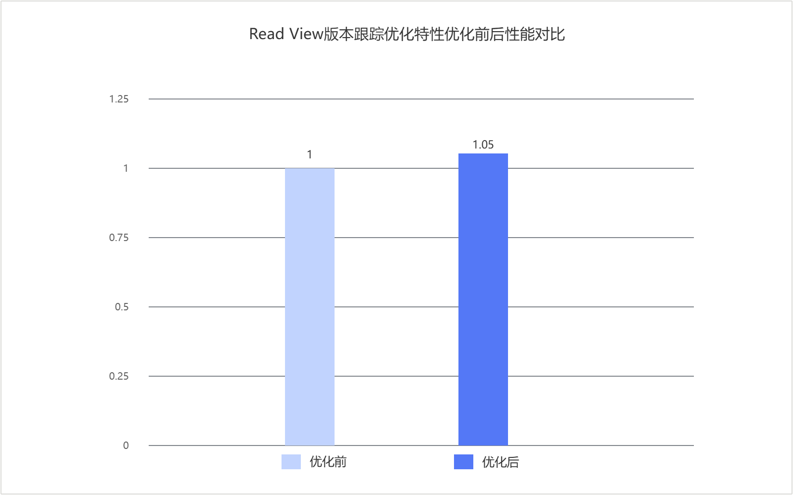
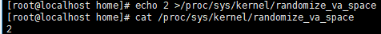

# MySQL Read View版本跟踪优化 特性指南

## 特性描述<a name="ZH-CN_TOPIC_0000002602100002"></a>

### 简介<a name="ZH-CN_TOPIC_0000002602100003"></a>

本文主要介绍如何在鲲鹏服务器上安装和使用MySQL Read View版本跟踪优化特性。

在MySQL OLTP场景中，高并发读写下，InnoDB事务系统中的Read View生命周期管理很容易成为热点，进而引发MVCC视图复用不足的问题。本文以Percona-Server为例介绍如何在鲲鹏服务器上对InnoDB事务系统进行优化，以提升高并发写场景下的性能。

在读写混合场景中，MVCC会频繁创建、关闭和复用Read View。原有实现中，Read View管理与事务系统中的全局状态绑定较紧，视图复用条件也较为保守，因此在高并发下`trx_sys->mutex`路径上的开销较高。

该特性为Read View增加版本跟踪机制，在影响视图内容的事务系统状态发生变化时同步更新版本信息。这样在重新打开Read View时，系统可以先根据版本判断已有视图是否仍然有效；如果视图对应的状态未变化，则直接复用已有视图，无需执行额外的移除、重建和加锁操作。

该优化减少了Read View管理过程中的重复工作，适用于`READ COMMITTED`等隔离级别下频繁创建和关闭视图的读写混合负载。

## 环境要求<a name="ZH-CN_TOPIC_0000002602100005"></a>

本文基于特定环境提供指导，在正式操作前请确保软硬件环境满足要求。

**表1** 硬件要求<a id="hardware_requirements"></a>

|项目|规格|
|--|--|
|CPU|鲲鹏920系列处理器、鲲鹏950处理器|

**表2** 操作系统和软件要求<a id="software_requirements"></a>

|项目|名称|版本|获取地址|
|--|--|--|--|
|操作系统|openEuler|22.03 LTS SP4|[获取链接](https://repo.huaweicloud.com/openeuler/openEuler-22.03-LTS-SP4/ISO/aarch64/openEuler-22.03-LTS-SP4-everything-aarch64-dvd.iso)|
|Percona|Percona-Server|5.7.44-53|请参见《[BoostDB-Percona 安装指南](./boostdb-percona-install.md)》|

## 安装和使用特性<a name="ZH-CN_TOPIC_0000002602100006"></a>

BoostDB-Percona优化版本已默认集成本特性，无需单独获取补丁并重新编译安装。

以Percona-Server 5.7.44-53为例说明如何安装和使用本特性，具体步骤如下。

1. 请参见《[BoostDB-Percona 安装指南](./boostdb-percona-install.md)》安装BoostDB-Percona优化版本。
2. 启动数据库。启动数据库的操作请参见《MySQL移植指南》的[运行MySQL](https://www.hikunpeng.com/document/detail/zh/kunpengdbs/ecosystemEnable/MySQL/kunpengmysql8017_03_0013.html)章节。
3. （可选）通过Sysbench测试可以得到使能优化特性前后的性能提升效果，详细测试步骤请参见《[Sysbench 0.5&1.0测试指导](https://www.hikunpeng.com/document/detail/zh/kunpengdbs/testguide/tstg/kunpengsysbench_02_0001.html)》。本特性可以使Sysbench只写场景性能提升5%，优化前后对比效果如[图1 Read View版本跟踪优化特性优化前后性能对比](#Read_View版本跟踪优化特性优化前后性能对比)所示。

    **图1** Read View版本跟踪优化特性优化前后性能对比<a name="fig937192253919"></a><a id="Read_View版本跟踪优化特性优化前后性能对比"></a><br>

    

## 安全检查与加固<a name="ZH-CN_TOPIC_0000002602100008"></a>

ASLR（Address Space Layout Randomization，地址空间布局随机化）是一种针对缓冲区溢出的安全保护技术，通过对堆、栈、共享库映射等线性区布局的随机化，增加攻击者预测目的地址的难度，防止攻击者直接定位攻击代码位置，达到阻止溢出攻击的目的。

```bash
echo 2 >/proc/sys/kernel/randomize_va_space
```


