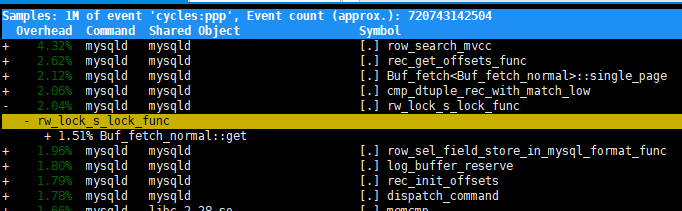
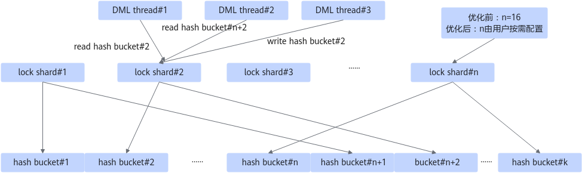
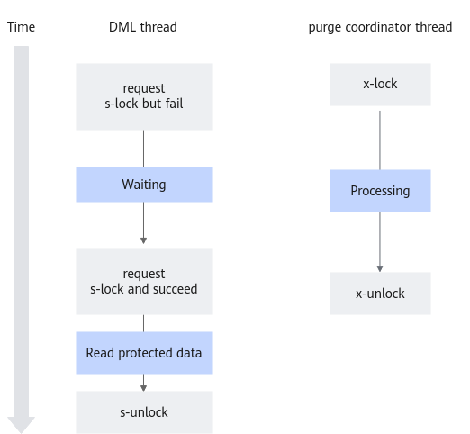
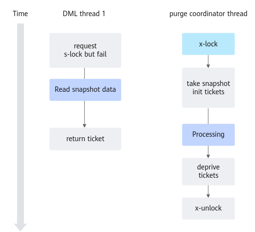
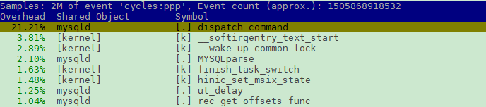
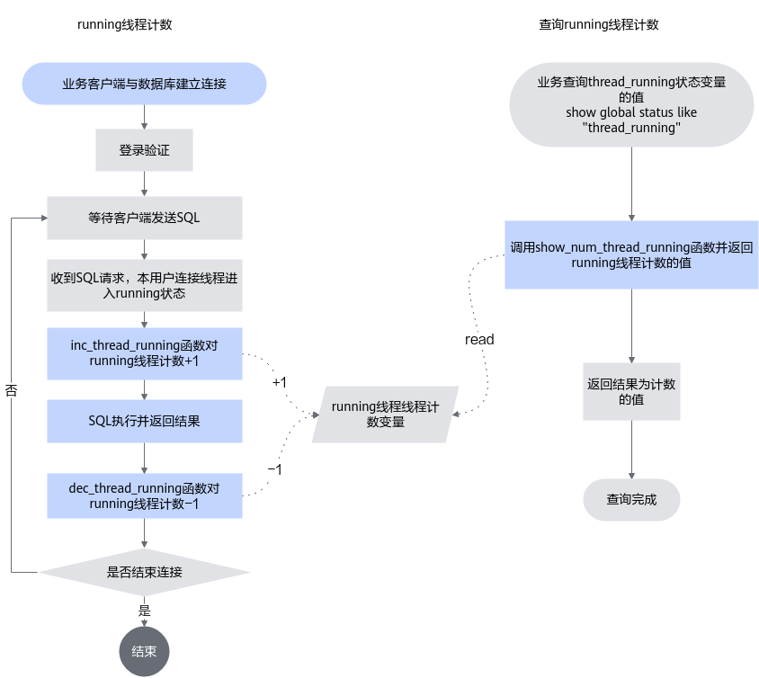
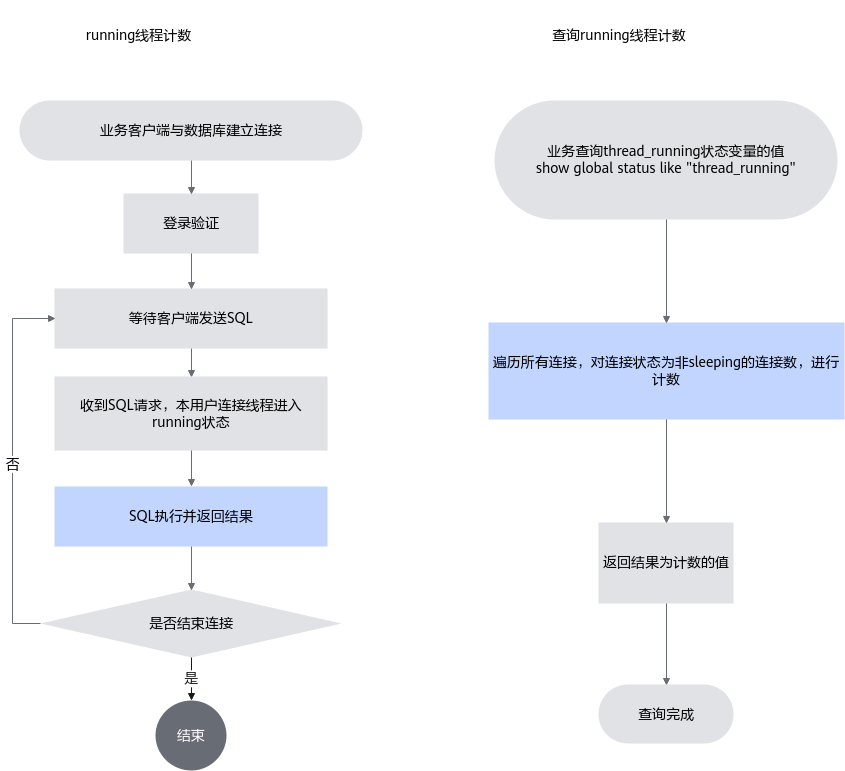

# MySQL其他特性

## hash\_table\_locks优化<a name="ZH-CN_TOPIC_0000002550145295"></a>

### 原理介绍<a name="ZH-CN_TOPIC_0000002518545550"></a>

高吞吐量下，可观察到MySQL中Buf\_fetch\_normal::get引起的rw\_lock\_s\_lock\_func热点，关键调用路径为buf\_page\_get\_gen-\>Buf\_fetch::single\_page-\>Buf\_fetch\_normal::get。Buf\_fetch\_normal::get的功能，是获取目标数据页的位于buffer pool中的数据块指针，即通过（space\_id，page\_no）查询获得buf\_block\_t\*，从而读写页内容。这个映射关系由一个哈希表维护，称为page\_hash，由hash\_table\_locks保护。rw\_lock\_s\_lock\_func热点即来自该hash\_table\_locks的加读锁操作。



将竞争激烈的锁对象进行分片，是常见的优化手段。MySQL源码中，已经通过分片来优化hash\_table\_locks，分片数量由srv\_n\_page\_hash\_locks控制，硬编码为16。


**图 1** hash\_table\_locks优化前后对比<a name="fig7931121184316"></a><a id="hash\_table\_locks优化前后对比"></a><br>


### 使用说明<a name="ZH-CN_TOPIC_0000002550145293"></a>

建议关注官网MySQL 8.0.20版本的CVE漏洞，按照要求及时进行漏洞修复。

**应用场景<a name="section14995152615441"></a>**

OLTP负载中无论读写操作（select/update/insert/delete），都需要访问数据页映射表来快速定位目标数据页，其中涉及MySQL中的hash\_table\_locks。如果通过Performance Schema观测到hash\_table\_locks热点（此时CPU利用率通常较高），可通过本特性缓解该热点，提升吞吐量。

本特性在补丁应用后重新编译MySQL，还需额外配置系统变量才能生效，详见[新增系统变量](#section1982871514452)。

**编译安装方法<a name="section1956113384414"></a>**

MySQL hash\_table\_locks优化特性以Patch补丁文件形式提供，该补丁基于MySQL 8.0.20版本开发，并在Gitee社区开源，使用该特性前，需要先将Patch应用到MySQL源码中，再编译和安装MySQL。具体操作步骤如下：

1. 下载[MySQL 8.0.20源码](https://downloads.mysql.com/archives/get/p/23/file/mysql-boost-8.0.20.tar.gz)，上传源码至服务器“/home”目录下后，解压源码包并进入MySQL源码的根目录。

    ```shell
    cd /home
    tar -zxvf mysql-boost-8.0.20.tar.gz
    cd mysql-8.0.20
    ```

2. 下载[hash\_table\_locks优化补丁文件](https://gitcode.com/boostkit/boostdb/releases/download/MySQL-patch-release/boostdb-patch-release-20260330.zip)，解压后将0001-HASH-TABLE-LOCKS-OPT.patch上传至MySQL源码的根目录。
3. 在源码根目录，使用git初始化命令来建立git管理信息。

    ```shell
    git init
    git add -A
    git commit -m "Initial commit"
    ```

    > **说明：** 
    >- 一般情况下，系统自带git，若需要安装git，请先参见《[MySQL 移植指南](https://www.hikunpeng.com/document/detail/zh/kunpengdbs/ecosystemEnable/MySQL/kunpengmysql8017_02_0001.html)》中配置Yum源相关内容，再执行如下命令安装git。
>
    > ```shell
    > yum install git
    >    ```
>
    >- 若未配置git的提交用户信息，git commit前需要先配置用户邮件及用户名称信息。
>
    > ```shell
    > git config user.email "123@example.com"
    > git config user.name "123"
    >    ```

4. 合入hash\_table\_locks优化补丁。

    ```shell
    git am --quiet --whitespace=nowarn 0001-HASH-TABLE-LOCKS-OPT.patch
    ```

    如果没有回显报错信息，则补丁应用成功。

5. 根据正常的编译安装MySQL源码的操作步骤进行MySQL的编译安装。详细信息请参见《[MySQL 移植指南](https://www.hikunpeng.com/document/detail/zh/kunpengdbs/ecosystemEnable/MySQL/kunpengmysql8017_02_0001.html)》。
6. 在重新编译MySQL之后，还需额外在配置文件、启动参数或运行时配置系统变量才能生效。详细信息请参见[新增系统变量](#section1982871514452)。

**新增系统变量<a name="section1982871514452" id="section1982871514452"></a>**

本特性增加静态系统变量page\_hash\_locks，从而允许用户按需配置hash\_table\_locks分片的数量。page\_hash\_locks的最大值不超过1048576，默认值为16。通过增加page\_hash\_locks的值，可以有效地缓解hash\_table\_locks热点问题，但同时会消耗更多的内存。建议不要超过1024。


## undo\_spaces\_lock优化<a name="ZH-CN_TOPIC_0000002550145291"></a>

### 原理介绍<a name="ZH-CN_TOPIC_0000002550185303"></a>

当MySQL中发生undo tablespace truncation，且目标undo tablespace已较大时，undo\_spaces\_lock这个读写锁会出现显著的竞争，如下所示。


undo\_spaces\_lock保护以下数据的并发访问。

- undo::spaces::m\_spaces
- undo::space\_id\_bank
- undo truncation log

purge coordinator线程持undo\_spaces\_lock写锁期间，DML前台线程阻塞，体现为这段时间的系统吞吐量下降。

分析临界区代码发现，purge coordinator线程池持锁是为了保护undo:: space\_id\_bank和undo truncation log，并不会修改undo:: spaces::m\_spaces；DML前台线程持锁是为了保证查询undo:: spaces::m\_spaces时其不被修改，两类线程逻辑本身并无冲突。

本特性的优化思路是，在purge coordinator获得undo\_spaces\_lock写锁后，undo tablespaces生成快照；后续DML前台线程无需持有undo\_spaces\_lock读锁，直接查询undo tablespaces快照。purge coordinator线程和DML前台线程之间，通过粒度更小的原子操作进行同步。

**图 1** undo\_spaces\_lock优化前<a name="fig1387917546443"></a><a id="undo\_spaces\_lock优化前"></a><br>


**图 2** undo\_spaces\_lock优化后<a name="fig22511022114512"></a><a id="undo\_spaces\_lock优化后"></a><br>


### 使用说明<a name="ZH-CN_TOPIC_0000002518545546"></a>

建议关注官网MySQL 8.0.20版本的CVE漏洞，按照要求及时进行漏洞修复。

**应用场景<a name="section4599204444318"></a>**

当MySQL中发生undo tablespace truncation，且目标undo tablespace已较大时，undo\_spaces\_lock这个读写锁会出现显著的竞争。如果通过Performance Schema和可视化工具（如dimSTAT），观测到Undo tablespace truncation时undo\_spaces\_lock热点（此时通常伴随吞吐量波动），可通过本特性缓解该热点，减少该期间的性能波动。

本特性在补丁应用后重新编译MySQL，还需额外配置系统变量才能生效，详见[新增系统变量](#section164621432154011)。

**编译安装方法<a name="section62084477403"></a>**

MySQL undo\_spaces\_lock优化特性以Patch补丁文件形式提供，该补丁基于MySQL 8.0.20版本开发，并在Gitee社区开源，使用该特性前，需要先将Patch应用到MySQL源码中，再编译和安装MySQL。具体操作步骤如下：

> **说明：** 
>
>- 优化特性以补丁文件形式提供，需在MySQL源码应用补丁后，编译安装MySQL。
>- 补丁针对MySQL 8.0.20版本开发。

1. 下载[MySQL 8.0.20源码](https://downloads.mysql.com/archives/get/p/23/file/mysql-boost-8.0.20.tar.gz)，上传源码至服务器“/home”目录下后，解压源码包并进入MySQL源码的根目录。

    ```shell
    cd /home
    tar -zxvf mysql-boost-8.0.20.tar.gz
    cd mysql-8.0.20
    ```

2. 解压源码包并进入MySQL源码目录。

    ```shell
    tar -zxvf mysql-boost-8.0.20.tar.gz
    cd mysql-8.0.20
    ```

3. 在源码根目录，使用git初始化命令来建立git管理信息。

    ```shell
    git init
    git add -A
    git commit -m "Initial commit"
    ```

    > **说明：** 
    >- 一般情况下，系统自带git，若需要安装git，请先参见《[MySQL 移植指南](https://www.hikunpeng.com/document/detail/zh/kunpengdbs/ecosystemEnable/MySQL/kunpengmysql8017_02_0001.html)》中配置Yum源相关内容，再执行如下命令安装git。
>
    > ```shell
    > yum install git
    >    ```
>
    >- 若未配置git的提交用户信息，git commit前需要先配置用户邮件及用户名称信息。
>
    > ```shell
    > git config user.email "123@example.com"
    > git config user.name "123"
    >    ```

4. 合入补丁。
    - 如果本特性不和[MySQL NUMA调度优化](https://www.hikunpeng.com/document/detail/zh/boostdb/mysql/basic_computation_opt/docs/zh/mysql_numa_schedule_optimization_feature_guide.md)特性共同使用，则下载[undo\_spaces\_lock优化补丁文件](https://gitcode.com/boostkit/boostdb/releases/download/MySQL-patch-release/boostdb-patch-release-20260330.zip)，解压后将0001-UNDO-SPACES-LOCK-OPT.patch补丁文件放到MySQL源码的根目录，执行以下命令生效补丁。

        ```shell
        git am --quiet --whitespace=nowarn 0001-UNDO-SPACES-LOCK-OPT.patch
        ```

        如果没有回显报错信息，则补丁应用成功。

    - 如果本特性要和MySQL NUMA调度优化特性共同使用，则需要先合入MySQL NUMA调度优化特性，再合入本特性：

        下载[NUMA调度特性补丁文件和undo\_spaces\_lock优化补丁文件](https://gitcode.com/boostkit/boostdb/releases/download/MySQL-patch-release/boostdb-patch-release-20260330.zip)，解压后将0001-SCHED-AFFINITY.patch和0002-UNDO-SPACES-LOCK-OPT.AFTER-SCHED-AFFINITY.patch补丁文件放到MySQL源码的根目录，执行以下命令使NUMA调度优化特性补丁和undo\_spaces\_lock优化补丁生效。

        ```shell
        git am --quiet --whitespace=nowarn 0001-SCHED-AFFINITY.patch 0002-UNDO-SPACES-LOCK-OPT.AFTER-SCHED-AFFINITY.patch
        ```

        如果没有回显报错信息，则补丁应用成功。

5. 根据正常的编译安装MySQL源码的操作步骤进行MySQL的编译安装。详细信息请参见《[MySQL 移植指南](https://www.hikunpeng.com/document/detail/zh/kunpengdbs/ecosystemEnable/MySQL/kunpengmysql8017_02_0001.html)》。

**新增系统变量<a name="section164621432154011" id="section164621432154011"></a>**

本特性增加动态系统变量innodb\_undo\_spaces\_snapshot\_tickets，默认值0，相当于未启用innodb\_undo\_spaces\_snapshot\_tickets特性。最大值1048576。

本特性增加3个innodb monitors，用于帮助innodb\_undo\_spaces\_snapshot\_tickets调优。

|innodb monitor名称|描述|
|--|--|
|undo_truncate_snapshot_ticket_grant_count|在undo truncation期间，授予snapshot ticket的次数|
|undo_truncate_snapshot_ticket_try_count|在undo truncation期间，请求snapshot ticket的次数|
|undo_truncate_snapshot_ticket_wait_count|在undo truncation期间，purge coordinator等待所有ticket返回的次数|

**参数设置举例<a name="section93431272006"></a>**

innodb\_undo\_spaces\_snapshot\_tickets用于控制单次undo tablespace truncation过程产生的这个undo tablespaces快照最多被查询的次数。举例一个调优流程，发现undo\_spaces\_lock竞争后，先将innodb\_undo\_spaces\_snapshot\_tickets设置为一个较大值，如100000，然后重新运行负载，并观察上述innodb monitors。

- undo\_truncate\_snapshot\_ticket\_grant\_count表示DML线程累计从快照中收益的次数，这些次数的事务本会被purge coordinator阻塞。
- undo\_truncate\_snapshot\_ticket\_try\_count表示多个DML线程在读快照时的竞争情况。绝大多数情况下undo\_truncate\_snapshot\_ticket\_try\_count等于或略大于undo\_truncate\_snapshot\_ticket\_grant\_count，表示无竞争。
- 若undo\_truncate\_snapshot\_ticket\_wait\_count很小（趋近0），这是绝大多数情况，表示purge coordinator临界区时间没有被影响。此时，若undo\_truncate\_snapshot\_ticket\_grant\_count接近innodb\_undo\_spaces\_snapshot\_tickets，可进一步增大innodb\_undo\_spaces\_snapshot\_tickets。
- 若undo\_truncate\_snapshot\_ticket\_wait\_count较大（本例中，上千），可适当减小innodb\_undo\_spaces\_snapshot\_tickets值，平衡DML线程的收益和purge coordinator的损耗。

## 线程计数器优化<a id="ZH-CN_TOPIC_0000002550185301"></a>

### 原理介绍<a name="ZH-CN_TOPIC_0000002518545548"></a>

**优化问题描述<a name="section22331871216"></a>**

当MySQL进行sysbench select point性能测试时，服务端CPU利用率接近100%，通过perf top工具可以观察到mysqld的dispatch\_command函数是明显的热点函数，占比超过20%，使用工具进一步解析dispatch\_command，观察到两处原子变量加减操作占比极高，占比各超过40%，存在显著的竞争，是明显的瓶颈点，如[**图 1** mysqld的热点函数](#mysqld的热点函数)\~[**图 3** 热点函数dispatch\_command瓶颈点二](#热点函数dispatch_command瓶颈点二)所示。

**图 1** mysqld的热点函数<a name="fig6544941161514"></a><a id="mysqld的热点函数"></a><br>


**图 2** 热点函数dispatch\_command瓶颈点一<a name="fig1858521141619"></a><a id="热点函数dispatch\_command瓶颈点一"></a><br>


**图 3** 热点函数dispatch\_command瓶颈点二<a name="fig12699201251719"></a><a id="热点函数dispatch_command瓶颈点二"></a><br>


**优化原理介绍<a name="section137419344219"></a>**

瓶颈点代码行，第一处是对一个原子变量进行自增操作，第二处是对同一个原子变量进行自减操作，大量对同一个原子变量的操作产生明显的竞争，是这两行代码成为瓶颈点的主要原因。分析相关代码，发现两处代码属于running线程计数统计和查询功能模块的一部分，该功能模块具有执行SQL语句时加减running线程计数，提供查询running线程计数接口的功能，主要流程如[**图 4** 线程计数器主要流程](#线程计数器主要流程)所示。

**图 4** 线程计数器主要流程<a name="fig6980603194"></a><a id="线程计数器主要流程"></a><br>


初始的running线程计数统计和查询流程在执行SQL语句过程中加减running线程计数，查询时直接返回原子变量，业务性能受到了影响。优化通过删除执行SQL语句时加减running线程计数的操作，把统计running线程计数放到查询流程，实现了业务性能的提升，相当于牺牲了查询性能获得了业务性能，优化流程如[**图 5** 线程计数器优化流程](#线程计数器优化流程)所示。

**图 5** 线程计数器优化流程<a name="fig83633022119"></a><a id="线程计数器优化流程"></a><br>


### 使用说明<a name="ZH-CN_TOPIC_0000002518705456"></a>

建议关注官网MySQL 8.0.20版本的CVE漏洞，按照要求及时进行漏洞修复。

**应用场景<a name="section4599204444318"></a>**

MySQL执行SQL语句过程中线程计数器会实时更新线程计数，在高并发场景，线程计数器更新频繁出现显著的竞争。在sysbench select point性能测试时，服务端CPU利用率接近100%，现象极为明显。通过perf top工具可以观察到mysqld的dispatch\_command函数是明显的热点函数，使用工具进一步解析dispatch\_command，观察到两处原子线程计数占比极高，存在显著的竞争，是明显的瓶颈点。通过本特性对线程计数器进行优化，可以减少竞争，缓解热点。

**编译安装方法<a name="section62084477403"></a>**

MySQL线程计数器优化特性以Patch补丁文件形式提供，该补丁基于MySQL 8.0.20版本开发，并在Gitee社区开源，使用该特性前，需要先将Patch应用到MySQL源码中，再编译和安装MySQL。具体操作步骤如下：

1. 下载[MySQL 8.0.20源码](https://downloads.mysql.com/archives/get/p/23/file/mysql-boost-8.0.20.tar.gz)，上传源码至服务器“/home”目录下后，解压源码包并进入MySQL源码的根目录。

    ```shell
    cd /home
    tar -zxvf mysql-boost-8.0.20.tar.gz
    cd mysql-8.0.20
    ```

2. 在源码根目录，使用git初始化命令来建立git管理信息。

    ```shell
    git init
    git add -A
    git commit -m "Initial commit"
    ```

    > **说明：** 
    >- 一般情况下，系统自带git，若需要安装git，请先参见《[MySQL 移植指南](https://www.hikunpeng.com/document/detail/zh/kunpengdbs/ecosystemEnable/MySQL/kunpengmysql8017_02_0001.html)》中配置Yum源相关内容，再执行如下命令安装git。
    >
    > ```shell
    > yum install git
    >    ```
    >
    >- 若未配置git的提交用户信息，git commit前需要先配置用户邮件及用户名称信息。
    >
    > ```shell
    > git config user.email "123@example.com"
    > git config user.name "123"
    >    ```

3. 下载[线程计数器补丁文件](https://gitcode.com/boostkit/boostdb/releases/download/MySQL-patch-release/boostdb-patch-release-20260330.zip)，解压后将0001-THREAD_COUNTER_OPT.patch上传至MySQL源码的根目录。

4. 查看当前本地git状态。

    ```shell
    git status
    ```

    如下所示新增了一个0001-THREAD\_COUNTER\_OPT.patch文件。

    ```text
    On branch master
    Untracked files:
      (use "git add <file>..." to include in what will be committed)
    
            0001-THREAD_COUNTER_OPT.patch
    
    nothing added to commit but untracked files present (use "git add" to track)
    ```

5. 检查补丁文件与MySQL源码是否冲突。

    ```shell
    dos2unix 0001-THREAD_COUNTER_OPT.patch
    git apply --check 0001-THREAD_COUNTER_OPT.patch
    ```

    若无报错即表示匹配可应用补丁。

6. 应用线程计数器补丁文件。

    ```shell
    git apply --whitespace=nowarn 0001-THREAD_COUNTER_OPT.patch
    ```

    如果输出warning信息，可忽略；无error信息即表示补丁应用成功。

7. 根据正常的编译安装MySQL源码的操作步骤进行MySQL的编译安装。详细信息请参见《[MySQL 移植指南](https://www.hikunpeng.com/document/detail/zh/kunpengdbs/ecosystemEnable/MySQL/kunpengmysql8017_02_0001.html)》。

## 修订记录<a name="ZH-CN_TOPIC_0000002518705458"></a>

|发布日期|修订记录|
|--|--|
|2023-07-25|第三次正式发布。优化各特性的“使用说明”章节中的操作步骤表达。|
|2021-12-30|第二次正式发布。新增[线程计数器优化](#ZH-CN_TOPIC_0000002550185301)。|
|2020-07-13|第一次正式发布。|
